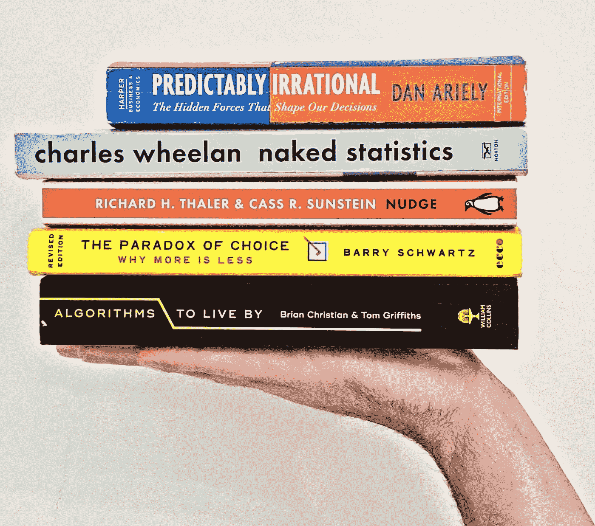
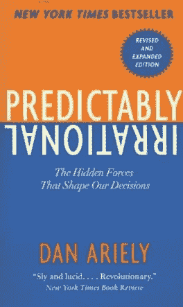
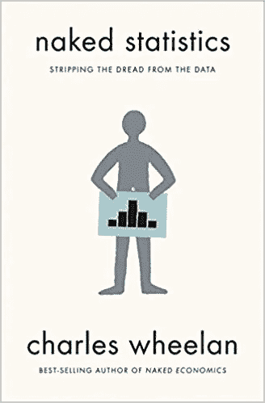
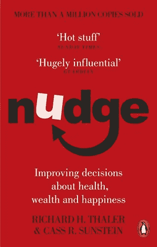
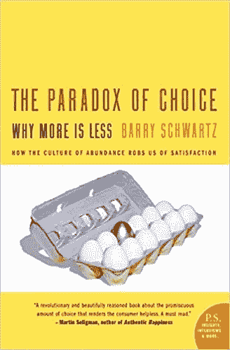
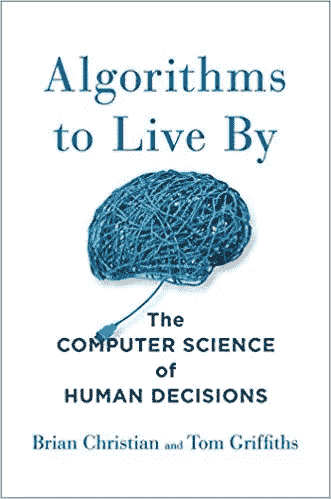

# 提高你快速和慢速思维的 5 本书

> 原文：<https://towardsdatascience.com/5-books-to-improve-your-fast-slow-thinking-96cfb798ecbc?source=collection_archive---------26----------------------->

不要让你的系统 1 来评判这个帖子。

这里有 5 本书可以增强你的决策能力。它们有望让你的两个认知过程系统变得更好，增强你的直觉和深思熟虑。下面你会找到我的理由，告诉你为什么你应该联系每一个人，并附上一句话来鼓励你这样做。我的最佳建议是慢慢阅读，同时将你学到的东西应用到你的日常生活中。

## 可预测的非理性|丹·艾瑞里

读了它，你会更加意识到我们人类是多么的不理性。这本书充满了实地实验，以展示有趣的事实，如你为什么总是在时装店排队时购买 3x2 的袜子。

> “为了眼前的满足而放弃我们的长期目标，我的朋友，是拖延症”

## 赤裸裸的统计|查尔斯·惠兰

阅读它来学习统计学的基本概念，从概率、推断、相关性和回归到有趣的、有时是挑衅性的、易于理解的现实生活中的例子。我一直用蒙蒂·霍尔的问题来取悦我的朋友。

> “统计学就像一把大口径武器:正确使用时很有帮助，但如果用错了，可能会带来灾难。”

## 理查德·h·泰勒和卡斯·r·桑斯坦

阅读它，只是为了成为一个更好的自己。这本书的概念围绕着改善健康、财富和幸福的决策。我把许多例子应用到我的日常生活中，比如把水果放在一个看得见、拿得着的地方，以此来引导我的行为和吃得更健康的决定。

> “你想把人们推进社会所期望的行为，无论如何，不要让他们知道他们目前的行为比社会规范要好”

## 选择的悖论|巴里·施瓦茨

读读它，更好地理解选择是如何影响你的生活的。研究员兼作家巴里·施瓦茨提出了一个简单的理论，认为太多的选择会限制一个人的自由。读完这篇文章后，我正努力成为一个满足者——一个乐于满足于足够好的选择的人——而不是一个最大化者——一个在做决定前检查每一个可行选择的人。

> “不幸的是，我们生活中选择的增多剥夺了我们自己决定任何特定决定有多重要的机会。”

## 《生存的算法》作者|布莱恩·克里斯蒂安&汤姆·格里菲斯

阅读它，应用计算机科学的概念更好地解决常见和日常的决策情况，例如什么时候你应该停止寻找停车位，或者你是否应该继续去你最喜欢的餐馆或探索新的餐馆。

> “尝试和失败至少是学习；不去尝试就会遭受无法估量的损失”

快乐学习！如果你想联系，这是我的 LinkedIn。