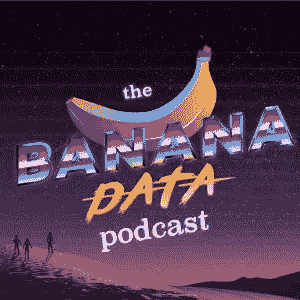
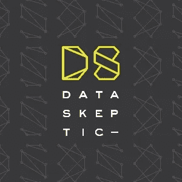

# 你应该听的 5 个数据科学播客

> 原文：<https://towardsdatascience.com/5-data-science-podcasts-you-should-be-listening-to-72d8efd0b9ec?source=collection_archive---------7----------------------->

Image via [Pexels](https://www.pexels.com/photo/greyscale-photography-of-condenser-microphone-765139/)

## 以数据科学、机器学习、人工智能和数据可视化为特色的播客综述。

Image via [Clipartkey](https://www.clipartkey.com/view/imbTRo_relax-clipart-chill-relax-clipart-black-and-white/)

我是播客的超级粉丝！因此，随着我深入了解数据科学，我会寻找播客来做这件事，这是有意义的。我想我会分享一些迄今为止我最喜欢的。你呢？你有什么喜欢的东西建议我添加到列表中吗？如果有，请在评论中分享。

[**香蕉数据播客**](http://banana-data.buzzsprout.com/)

Image via [Banana Data Podcast](https://banana-data.buzzsprout.com/)

这是一个全新的双周播客，专注于数据科学生态系统的新闻和趋势。到目前为止，他们已经讨论了包括道德人工智能和有偏见的数据在内的话题。他们还提供[每周简讯](https://banana-data.com/post/142636176771/want-to-stay-up-to-data-sign-up)，在那里他们分享自己喜欢的关于数据科学、可视化等的文章。

[苹果](https://podcasts.apple.com/us/podcast/the-banana-data-podcast/id1463103655) | [Spotify](https://open.spotify.com/show/3uZK2aPeVwnADRqyYR4nt0) | [了解更多](https://banana-data.com/)

[**数据怀疑论者**](http://dataskeptic.com/)

Image via [Data Skeptic](https://dataskeptic.com/)

作为运行时间最长的数据科学播客之一，data 怀疑论者已经触及了所有的事情。每周节目的特色是以概念为中心的小插曲，以及对研究人员和从业者的更长时间的采访。作为一种令人愉快的享受，一些迷你剧集关注他们的宠物鹦鹉 Yoshi，它是他们的官方吉祥物。这是一堂有趣的课，这是肯定的。

[苹果](https://podcasts.apple.com/us/podcast/data-skeptic/id890348705?mt=2) | [Spotify](https://open.spotify.com/show/1BZN7H3ikovSejhwQTzNm4) | [了解更多](http://dataskeptic.com/)

[**数据框**](https://www.datacamp.com/community/podcast)

Image via [DataFramed](https://www.datacamp.com/community/podcast)

DataFramed 是一个每周一次的播客，主要内容是对从业者的采访，重点是数据科学试图解决的问题。我发现这个播客对于任何对了解什么是数据科学以及如何应用数据科学感兴趣的人来说都非常容易理解。

[苹果](https://podcasts.apple.com/au/podcast/dataframed/id1336150688) | [Spotify](https://open.spotify.com/show/02yJXEJAJiQ0Vm2AO9Xj6X) | [了解更多](https://www.datacamp.com/community/podcast)

[**数据故事**](http://datastori.es/)

Image via [Data Stories](https://datastori.es/)

虽然 Data Stories 不是专门关于数据科学的，但它确实关注了对任何从事数据工作的人都很重要的东西:可视化。我特别喜欢在最近一集里了解数据可视化协会。

[苹果](https://podcasts.apple.com/us/podcast/data-stories/id502854960?mt=2) | [Spotify](https://open.spotify.com/show/0aIvhK1ANin1kSOKRhWG1M) | [了解更多](http://datastori.es/)

[**线性题外话**](http://lineardigressions.com/)

Image via [Linear Digressions](http://lineardigressions.com/)

线性离题是一个播客，它使关于机器学习和数据科学的复杂话题变得容易理解。我真的很喜欢他们最近的一集，谈论机器学习工程师和随着时间的推移，数据科学角色可能会是什么样子。随着行业需求的变化，探索该领域将如何随着时间的推移而调整和发展是一件有趣的事情。

[苹果](https://podcasts.apple.com/us/podcast/linear-digressions/id941219323) | [Spotify](https://open.spotify.com/show/1JdkD0ZoZ52KjwdR0b1WoT) | [了解更多](http://lineardigressions.com/)