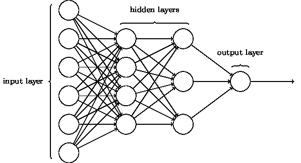

# 启动机器学习冒险的 5 个基本资源

> 原文：<https://towardsdatascience.com/5-essential-resources-to-jump-start-your-machine-learning-adventures-d5ac8fdaf2a5?source=collection_archive---------26----------------------->

## 我作为初学者高调携带的 5 个资源。

Photo by [Hope House Press - Leather Diary Studio](https://unsplash.com/@hope_house_press_leather_diary_studio?utm_source=medium&utm_medium=referral) on [Unsplash](https://unsplash.com?utm_source=medium&utm_medium=referral)

对学习人工智能感兴趣的学生经常问我一个问题:

> “嘿 Ekin，你会推荐什么**资源**来入门 AI 和 ML？”

**这个问题问得好。**通常，人们很容易迷失在书架上和互联网上的资源海洋中。

对于所有那些好奇的初学者，他们只是在寻找一个开始的地方，这里有 **5 个基本资源**，它们在我自己从零到熟练的旅程中发挥了重要作用(还不是英雄，但每天都在努力变得更好)！

# 1.神经网络和深度学习

迈克尔·尼尔森

## 描述

就给初学者的书而言，没有比这更好的了。在这本免费的在线书籍中，尼尔森通过面向原则的方法和动手操作的方法，精心制作了一个概念清晰的神经网络**插图**。

尼尔森以初学者的心态写作，故意排除不必要的行话和低级信息。

虽然这本书传达的思想只是我们称之为机器学习的更广泛领域的子集，但它们无疑是重要的，当被理解时，它们打破了理解 ML 的精神障碍，并打开了理解的大门。

## 推荐

*   阅读概念性章节时记下笔记。它们不必漂亮或冗长。简单地写下信息可以提高长期记忆。
*   **遵循实践教程。**花时间不仅复制尼尔森提供的神经网络代码，还要分析每行代码的用途。仅仅是单独执行这项任务就能增强你对神经网络的理解。

## 环

 [## 神经网络和深度学习

### 神经网络和深度学习是一本免费的在线书籍。这本书将教你:神经网络，一个美丽的…

neuralnetworksanddeeplearning.com](http://neuralnetworksanddeeplearning.com/index.html) 

# 2.Siraj Raval，YouTube 频道

作者 Siraj Raval

Source: YouTube, Siraj Raval Channel

## 描述

“Watch Me Build an AI Startup” by Siraj Raval, Thumbnail

对于任何对人工智能感兴趣的人来说，Siraj 就是你要找的人。Siraj 的视频充满了**相关的幽默**和**高水平的视觉效果**，以一种引人入胜而又说教的方式打破了复杂的人工智能概念。

他的视频几乎涵盖了人工智能的每一个值得关注的话题。他制作了从 5 分钟 TensorFlow 教程到一系列人工智能背后的数学的视频。

## 推荐

*   **订阅获取新内容的通知。**学习 AI 时，沉浸在领域中是必不可少的。一种方法是观看 Siraj 的精彩视频！Siraj 每周都会制作视频，以确保所有显著的进步都能与公众分享。
*   **当学习一个新概念时，先搜索他的频道。** Siraj 的视频讲解是很好的起点。当研究不熟悉的想法时，把它们作为一个跳板。

## 环

 [## 西拉伊·拉瓦尔

### 让数据点亮！这个音乐视频的歌词实际上是有教育意义的，它们作为一个介绍性的讲座…

www.youtube.com](https://www.youtube.com/channel/UCWN3xxRkmTPmbKwht9FuE5A) 

# 3.卡格尔

Kaggle Logo. Source: Kaggle

## 描述

Kaggle 被宣传为“你的数据科学之家”，是作为数据科学家成长的完美资源，因为它允许你**实际应用**机器学习概念。

Kaggle 本身配备了大量的资源:实践教程、入门竞赛、探索性内核(稍后会详细介绍)等等。

此外， **Kaggle 是一个社区**，聚集了非常热情的数据科学家，他们 100%愿意提供帮助。

(A Kaggle 内核是浏览器中的免费开发环境。更多关于 Kaggle 内核的信息，请点击:)

 [## Kaggle 内核简介

### 在《人工智能历险记》的这一集里，你会发现什么是 Kaggle 内核，以及如何开始使用它们。虽然没有…

towardsdatascience.com](/introduction-to-kaggle-kernels-2ad754ebf77) 

## 推荐

*   **从机器学习教程开始。这是适应新环境最简单的方法。**
*   随后，**加入一个介绍性竞赛(即 MNIST 数据集)**并查看他们提供的启动代码。
*   **从简单开始，慢慢来，逐步积累**。在 Kaggle 上看了所有很酷的项目后，感觉被抛在后面是很常见的。不要气馁！耐心点。从简单开始。建立起来。
*   **看看公开的内核**(别人的代码)！通过这样做，您将接触到流行的机器学习库，如 numpy、pandas、scikitlearn、TensorFlow 和 PyTorch，

## 环

 [## 你的数据科学之家

### 编辑描述

www.kaggle.com](https://www.kaggle.com/) 

# 4.走向数据科学

## 描述

如果你正在阅读这篇文章，那么很可能你理解了媒体文章的价值。《面向媒体上的数据科学》是由数据科学爱好者热情撰写的简明、启发性文章的广泛纲要。

如果你不理解一个复杂的概念，在 TDS 上搜索这个概念可能会有所帮助。

## 推荐

*   **每天阅读一篇推荐文章。这将有助于加强你对人工智能概念的理解，同时让你接触到该领域的各种主题。**
*   **每天阅读不同的主题**。像任何好的训练集一样，你输入自己的神经网络的数据必须尽可能广泛，这样你才能在面对未知时进行归纳。
*   **阅读时记下想法。仅仅记下重要的信息片段就能提高记忆力。**

 [## 走向数据科学

### 分享概念、想法和代码。

towardsdatascience.com](https://towardsdatascience.com) 

# 5.深度学习

伊恩·古德菲勒、约舒阿·本吉奥和亚伦·库维尔

## 描述

虽然(非常)数学密集，这本书巩固了我的**基础。**它让我有能力理解该领域更严谨的概念。在某种程度上，它让我为学术文献(即研究论文)的严格性做好了准备。

这本书旨在成为一本深度学习教材。因此，正如我们所料，它具有标准教科书的属性:行话和精确的定义。它在可读性方面的不足，在质量方面得到了弥补。

它在正式解释 ML 和 DL 概念方面做得很好，从而填补了更简单的资源留下的空白。

## 推荐

*   不要让那个叫做“数学”的怪物吓倒你。如果你对学习 ML 感兴趣，数学就像灭霸一样不可避免。所以要泰然处之，打好基础，不要觉得自己被落下了。
*   **用其他资源补充。如果你试图孤立地阅读整本书，你可能会发疯。如果你觉得有些概念被激烈的数学推理弄得模糊不清，那么简单的谷歌搜索通常就足够了！使用本文中的其他资源(TDS、Siraj 等。)作为补充。**

## 环

 [## 深度学习

### 深度学习教材是一个资源，旨在帮助学生和从业人员进入机器领域…

www.deeplearningbook.org](http://www.deeplearningbook.org/) 

# 结论

恭喜你！

> 你刚刚迈出了开始的第一步:弄清楚从哪里开始。

机器学习是一个广泛的领域，上面列出的资源绝不涵盖每个细节。

记得使用这些资源作为**发射台**来逐步加强你在机器学习和流行子集深度学习方面的基础。

现在你知道从哪里开始，释放你的热情，全力以赴！