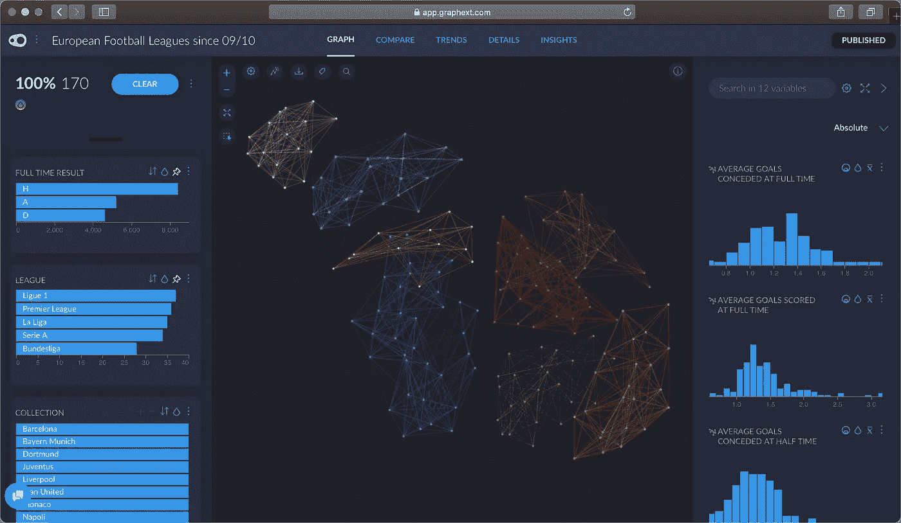
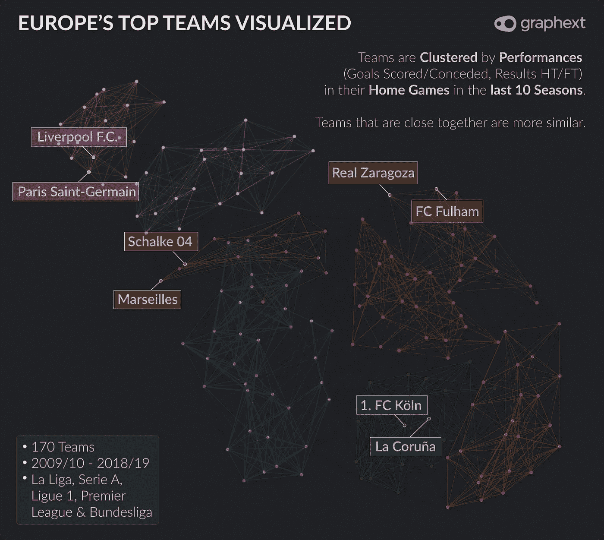
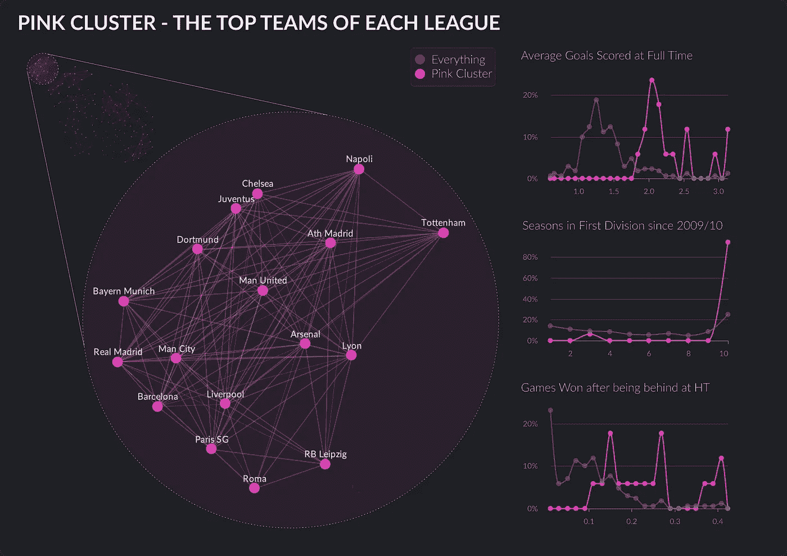
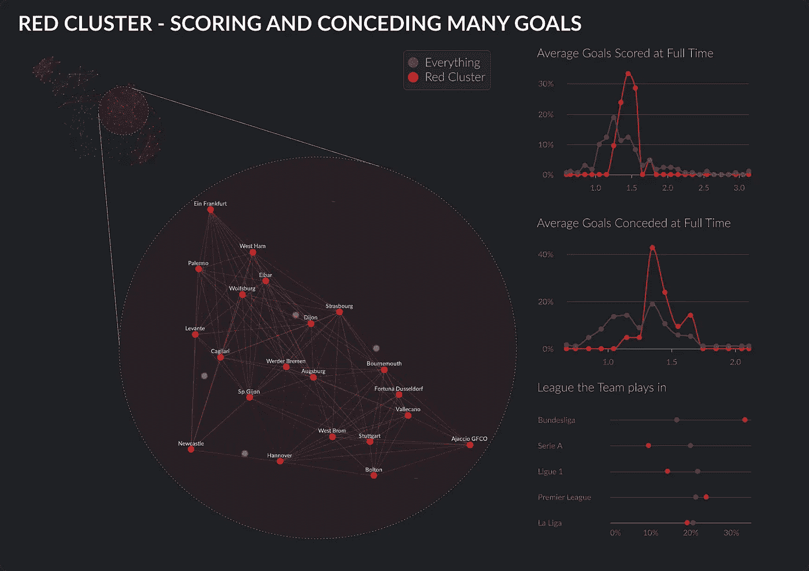
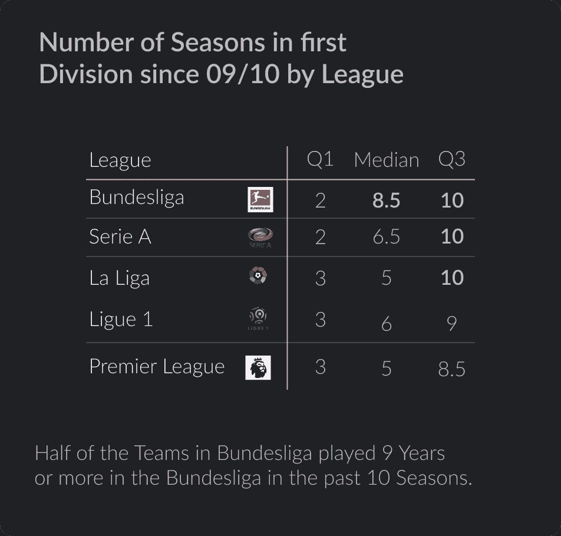
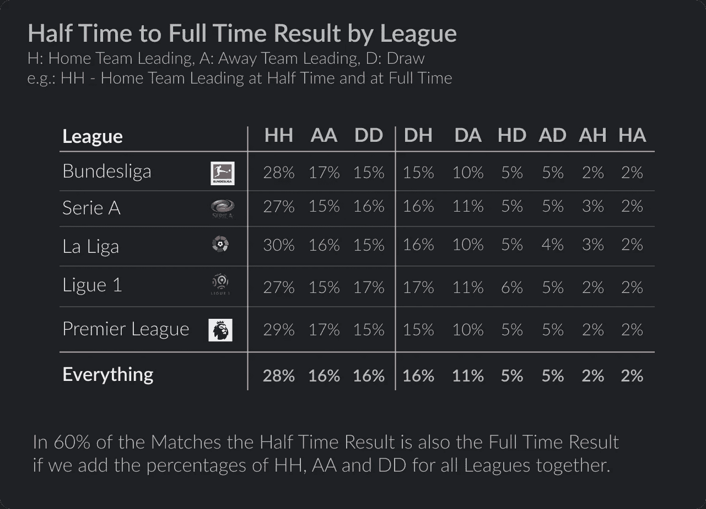
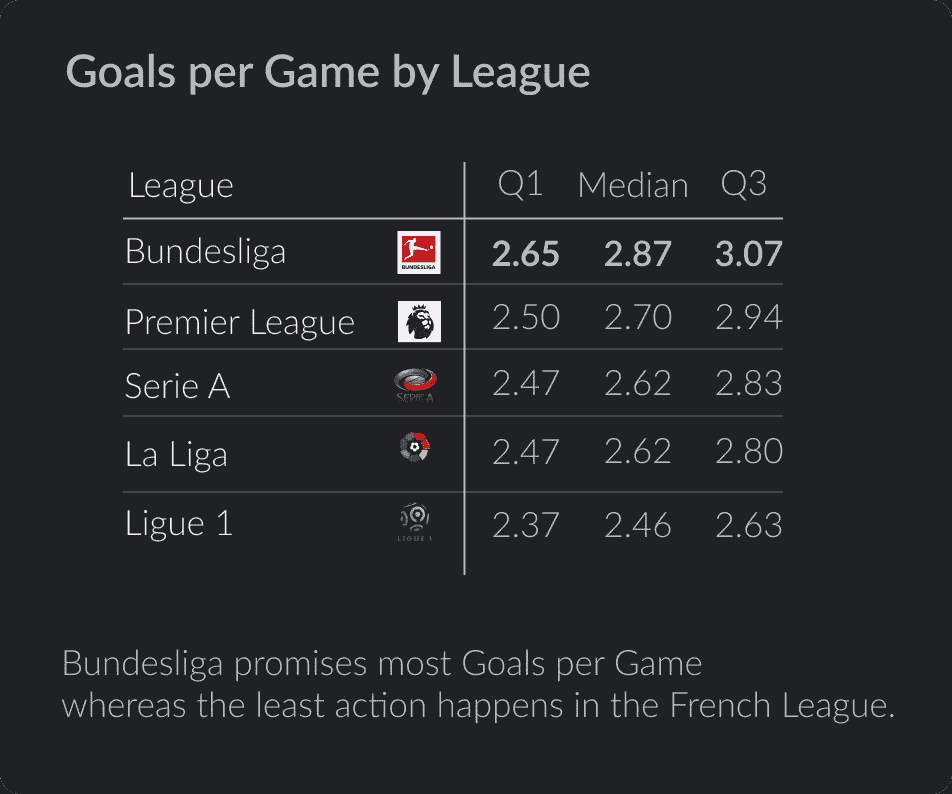
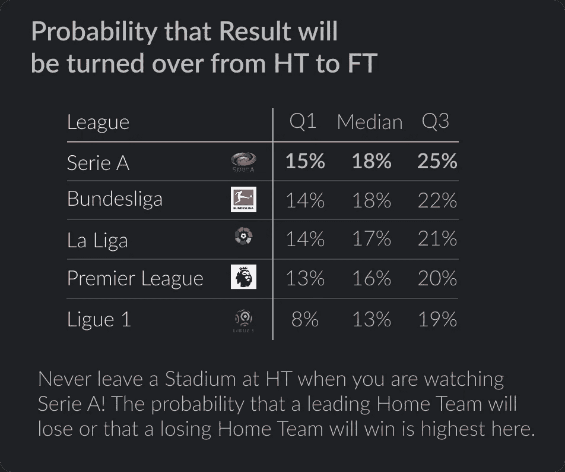
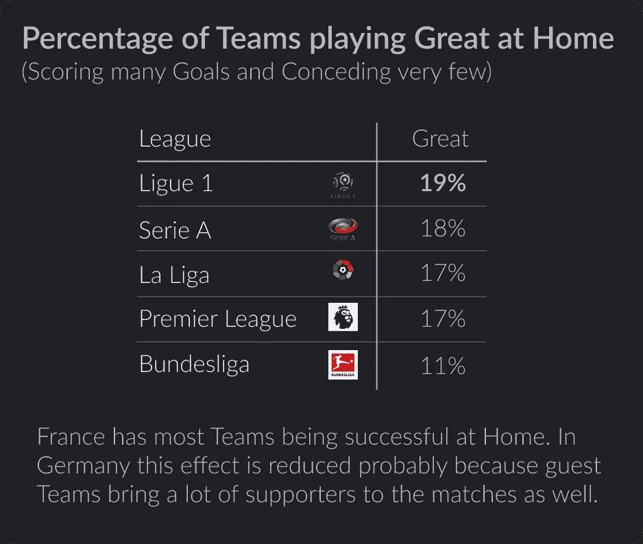

# 关于欧洲最好的足球联赛，你可能不知道的 5 个观点！

> 原文：<https://towardsdatascience.com/5-insights-you-probably-didnt-know-about-the-t-3b28a132eace?source=collection_archive---------19----------------------->

## 分析了过去 10 个赛季 170 支球队的 18257 场比赛

*“法国有农民联盟，除了 PSG 什么都没有。”*

"*德甲比意大利和西班牙差太多了."*

"*最伟大的俱乐部都踢英超联赛."*

每个足球迷一生中至少听过或提出过一次这样的观点。如果你看看每个国家的俱乐部在冠军联赛中的表现，或者如果你比较一下在过去 10 个赛季中有多少不同的球队赢得了国内联赛冠军，有很多理由相信它们是正确的。然而，关于欧洲五大足球联赛**西班牙、意大利、法国、德国**和**英格兰**还有很多要说的。

娱乐并不总是伴随着最好的球队或球员。否则，你为什么会喜欢当地球队的周日联赛？看到**许多进球**，见证**从半场领先变为全半场领先**，或者参观**拥有庞大球迷基础的传统俱乐部**的比赛，都是很有趣的。

出于这个原因，[我们](https://graphext.com)利用来自[football-data.co.uk](https://www.football-data.co.uk/englandm.php)自 2009/10 赛季以来的近 10 个赛季的西甲、意甲、法甲、德甲和英超的比赛数据收集了一个数据集。最终数据集**中的每一行**都代表了在过去 10 年中至少在本国甲级联赛中踢过一个赛季的球队。每支球队都有 13 个属性，包括过去 10 个赛季在主场比赛中的表现。

利用这些属性，我们用 graphext 创建了一个网络来计算相似性和相关团队的聚类(见上图)。现在，图中的每个节点代表原始数据集的一行/一组。有相似表现的团队互相联系。彼此之间有许多联系的团队形成独特颜色的集群。两个团队彼此越接近，他们就越相似。

# 好吧，但是我现在在哪里可以找到我喜欢的球队呢？

粉色集群拥有通常在国内联赛中获胜的球队。与其他球队相比，他们的表现主要表现在他们的进球数，他们在过去 10 年中在甲级联赛中的表现，以及他们在半场结束时输掉比赛到全场获胜的频率。非常有趣的是，德国俱乐部 RB Leipzig 已经是该集团的一部分，只是最近才晋升到德甲联赛。从那以后，他们一直打得很好，赢得了他们在粉红组的位置。

红色集群中的球队有一个共同点，那就是他们在全职时间里进了很多球，也丢了很多球。如果你作为一个中立的足球迷喜欢娱乐，我们可以推荐你观看其中一支球队的主场比赛。你肯定会看到很多目标！有趣的是，德甲拥有该集群中最多的球队(超过 30%)。

现在，介绍已经足够了，让我们从我们在标题中承诺的见解开始。如果你想寻找你最喜欢的团队，以及与谁联系最紧密，你可以自己在这里访问项目[。](https://public.graphext.com/9d67b7bec75160c4/index.html)

# 第一个洞见:德甲拥有大多数已经在联赛中呆了很多年的俱乐部。

在英格兰，竞争更加激烈，因为乙级联赛的小俱乐部有更多的投资者。这些球队增加了英超球队的压力，并引起了更高的波动。

# 第二个观点:在大约 60%的比赛中，半场成绩等同于全职成绩。

在下一次现场下注时，请记住这一点；)

# 第三个观点:德甲联赛进球最多。

在德甲 50%的比赛中，你会看到至少 3 个进球(2.87)。

# 第四个洞见:在意甲，上半场的结果最有可能在比赛结束时被翻盘。

在 50%的意甲比赛中，主队领先或失败，你会在至少 18%的情况下看到一个完整的结果。

# 第五个观点:法国拥有最成功的主场球队。

法国和德国之间的差异也相当显著。

我们希望你喜欢阅读我们对欧洲最佳足球队的分析。如果是这样的话，查看我们的[网站](https://graphext.com)以及任何关于我们如何工作的其他信息，不要犹豫，通过 max@graphext.com*直接联系我。*