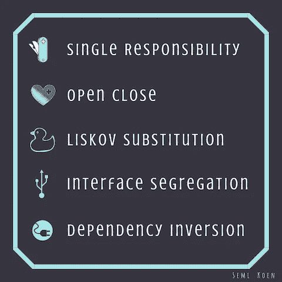
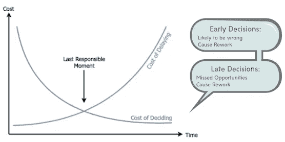
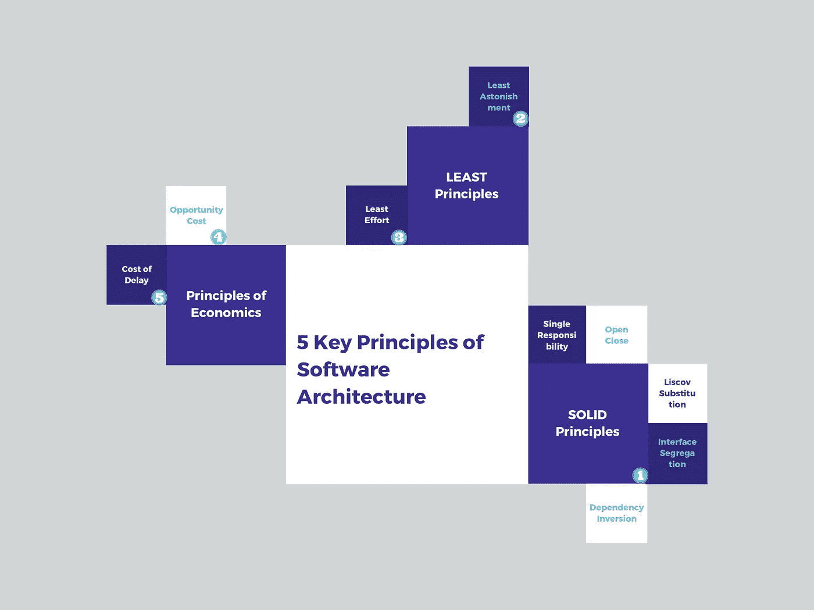

# 软件架构的 5 个关键原则

> 原文：<https://towardsdatascience.com/5-key-principles-of-software-architecture-e5379cb10fd5?source=collection_archive---------2----------------------->

## 有哪些伟大的软件架构师藏在他们的腰带下面

Courtesy: [yourspear.com](https://www.yourspear.com/wp-content/uploads/2019/03/BUSINESS-DEV-1080x675.jpg)

解决方案架构师是负责系统架构以及特定产品的技术标准(包括技术、平台、基础设施)的指定专家。他们设定愿景，他们的分析是产品成功的关键**定义**、**设计**、**交付**和终身支持。因此，他们不仅需要了解业务需求，还需要了解什么是合理的、可扩展的、经济高效的，并且符合组织的总体技术目标。

架构师的一个重要技能是能够从许多不同的角度来看待架构:其中的每一个可能都不完全相关，但是将它们结合在一起会给出产品的直升机视图。这些观点包括*原则*、*标准*、*模式和反模式*、*经验法则*和*经验实践*，它们对于制定特定方向的决策以及评估项目的成功是必不可少的。

在这篇文章中，我们将涵盖那些**建筑原则**，这些建筑原则归因于你作为一名建筑师的角色是“下沉还是游泳”!

> “如果你觉得好的建筑很贵，那就试试坏的建筑吧！”布莱恩·福特约瑟夫·约德

# 𝕊𝕆𝕃𝕀𝔻 𝕡𝕣𝕚𝕟𝕔𝕚𝕡𝕝𝕖𝕤

让我们从我最喜欢的主题开始:**坚实的原则不仅适用于软件开发，也适用于设计系统。我们现在将看到如何…**

## 单一责任原则

每个系统功能(例如服务/模块/api)应该只有一个责任，因此也是一个改变的理由。尽可能缩小责任范围意味着用户知道预期的目的，从而减少错误。

## 开闭原理

这个原则假设最好是扩展一个系统行为，而不是修改它。虽然试图提前预测需求的变化通常不是一个好主意(因为这可能导致过于复杂的设计)，但能够在对现有组件进行最小更改的情况下适应新功能是应用程序长寿的关键。

## 利斯科夫替代原理

在软件开发中，这意味着派生类必须可以替换它们的基类，但这一原则与 Bertrand Meyer 的契约设计的相似之处在于它如何应用于分布式架构:当两个服务之间有一个共同的“契约”时，它们可以有效地重复通信，该契约定义了输入/输出、它们的结构和它们的约束。因此:给定两个具有相同契约的分布式组件，其中一个应该可以被具有相同契约的另一个组件替换，而不改变系统的正确性。

## 界面分离原理

接口/契约必须尽可能地细粒度化和客户端特定化，这样调用客户端就不会依赖于它们不使用的功能。这与单一责任原则密切相关:通过分解接口，我们支持通过角色/责任分离的*组合*，以及通过不耦合不需要的责任的*解耦*。

## 从属倒置原则

高级模块不应该依赖于低级模块；它们都应该依赖于抽象。同样，抽象不应该依赖于细节，但是细节应该依赖于抽象。因此，该原理在较高级和较低级软件组件或层之间引入了接口抽象，以消除它们之间的依赖性。

Courtesy: [Being a Data Scientist does not make you a Software Engineer!](/being-a-data-scientist-does-not-make-you-a-software-engineer-c64081526372)

# 𝕋𝕙𝕖 ‘𝕃𝕖𝕒𝕤𝕥’ 𝕡𝕣𝕚𝕟𝕔𝕚𝕡𝕝𝕖𝕤

我根据它们的命名惯例将它们组合在一起:

## 最小惊讶原则

最小惊讶原则(或*最小惊讶*)表明，一个解决方案或方法在第一次遇到时，不会让一个在该领域知识相当丰富的人感到惊讶(受众可能会有所不同，例如最终用户、程序员、测试人员等)。在更实际的情况下，该原则旨在利用用户的现有知识，以最小化他们在使用模块时的学习曲线，因此任何具有高不可预测性的因素都是重新设计的良好候选。

它适用于架构的每一个方面:从命名服务，到用户界面的可视化，到领域模型的设计。

There are good surprises and then there are bad surprises…

## 最省力原则

这个原则(也称为*齐夫定律*)源于一个基本的人类行为:**每个人都倾向于遵循尽可能不费力的路径。**例如，如果我们的设计遵循特定的模式，下一个开发人员将会一次又一次地遵循相同的模式，除非有更简单的方法来执行任务，在这种情况下，他们将会改变！或者，进一步说，一旦他们找到了任务的可接受结果，就没有立即改进当前解决方案的需要。

> 最少的努力是最少工作的变体

因此，当务之急是通过建立正确的架构来实现一个**强有力的开始**:它设定了很高的期望，并确保每个人都明白质量在项目的生命周期中不会受到损害，并且在未来的变化中会得到坚持。

对我来说，这个原则的伟大之处在于它的好处是可以推断的:一旦我们将一个正确的设计放在适当的位置，我们就可以创建一个架构上的**框架**，这将是我们构建下一个系统的基础。换句话说，我们能够为组织的软件系统建立一个成功的、经得起未来考验的模板。

Path of least resistance

# 𝕋𝕙𝕖 𝕡𝕣𝕚𝕟𝕔𝕚𝕡𝕝𝕖𝕤 𝕠𝕗 ‘𝔼𝕔𝕠𝕟𝕠𝕞𝕚𝕔𝕤’

这两个原则有一个共同的主题:充分利用机会的*成本*和延迟决策的*成本*。

## 机会成本原则

每次我们做出选择时，我们都会赋予这个选择一定的价值。价值有两部分:收益和成本。选择的机会成本是我们为了得到它而放弃的东西。为了做出一个好的经济决策，我们希望选择对我们来说**收益最大**但**成本最低**的选项。
例如，如果我们有两个选择，要么是内部构建的系统，要么是现成的供应商产品，而我们选择了后者，那么我们的机会成本就是我们的开发团队本可以开发但没有开发的全新系统。

这就是架构的全部:权衡各种选择，并试图做出明智的决定，哪一个将为项目增加最大的价值。例如，一个非常常见的二分法是，是创建一个快速上市的战术性解决方案，还是创建一个更具战略性的解决方案，该解决方案现在会更昂贵，以便在未来的项目中利用它，从而使以后的成本最小化。

以下是一些需要考虑的要点:

*   架构分析/评估的可用时间是多少？想出一个解决方案已经够有挑战性了，更别说几个了！
*   未来 1-3 年的产品渠道是什么？还有其他什么项目在排队？你能看到任何协同作用吗？
*   您当前可能解决的技术债务是什么？
*   反过来:如果你追求一个战术性的解决方案，会招致多少新的技术债务？
*   对于您组织中的系统来说，哪些质量属性是最重要的？它们将如何被提议的解决方案所折衷？
*   除了架构团队，还有谁是会影响决策的风险承担者？生意？你的老板？技术设计权威？每个利益相关者的主要目标是什么？你将如何缓解相互冲突的需求？

Courtesy: [What is opportunity cost](https://www.toppr.com/guides/fundamentals-of-economics-and-management/theory-of-cost-cma/what-is-opportunity-cost/)

## 最后责任时刻原则

这一原则(又名*延迟成本*)源自[精益软件开发](https://en.wikipedia.org/wiki/Lean_software_development#Decide_as_late_as_possible)，强调尽可能长时间地坚持采取重要行动和关键决策。这样做是为了不到最后一刻不排除重要的选择，也就是说，等到你有更好的消息时再缩小选择范围。

> 一种策略，即不要过早做出决定，而是推迟承诺，并保持重要且不可逆转的决定开放，直到不做决定的成本大于做决定的成本。

减轻决策过晚风险的一种方法是建立**概念验证** (POCs)来原型化备选方案，并向利益相关者展示他们的要求。

Early in a project we should make as few binding decisions as possible!

# 𝔼𝕡𝕚𝕝𝕠𝕘𝕦𝕖

架构原则帮助我们评估我们在整个项目中做出的决策，并确保我们符合总体目标，不仅仅是项目，还有组织的技术。这是我们阐述的五项原则的融合:

我希望这篇文章是你建筑之旅的灵感和指导来源。如果您想进一步了解我们介绍的一些主题，这里有一些不错的资源:

## 参考资料:

*   Unix 编程的艺术:最小惊奇原则
*   [IT 架构:削减成本和复杂性](https://www.mckinsey.com/business-functions/digital-mckinsey/our-insights/it-architecture-cutting-costs-and-complexity)
*   [延迟成本:一个关键的经济指标](http://www.ontheagilepath.net/2017/03/cost-of-delay-a-key-metric.html)
*   [软件架构师手册](https://www.amazon.co.uk/Software-Architects-Handbook-implementing-architecture/dp/1788624068)

感谢阅读！

*我经常在媒体上写关于技术的&数据——如果你想阅读我未来的帖子，请*[*‘关注’我*](https://medium.com/@semika) *！*