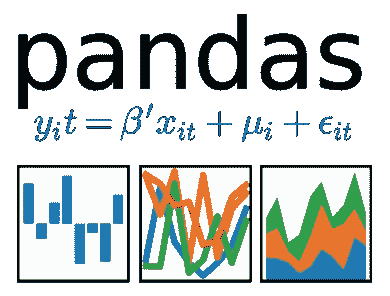
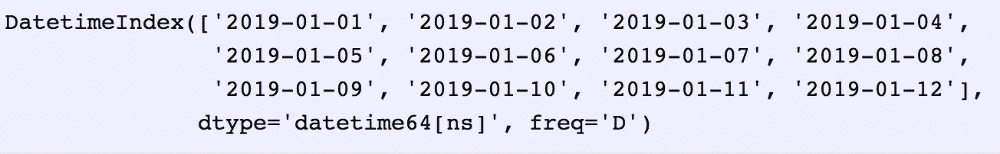
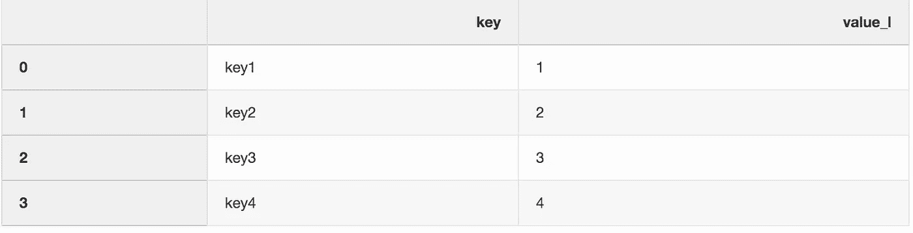
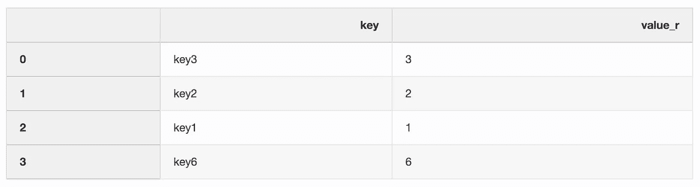
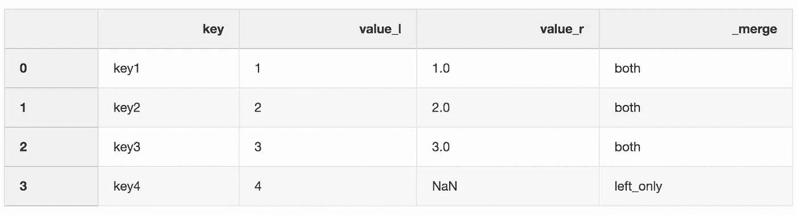
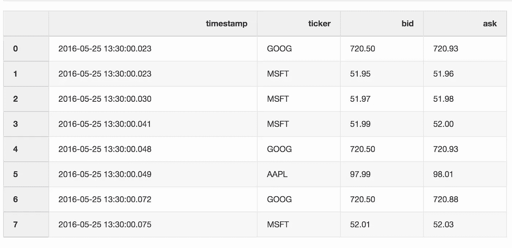
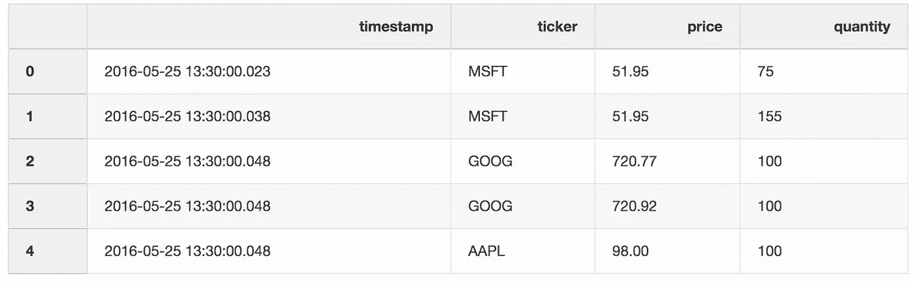
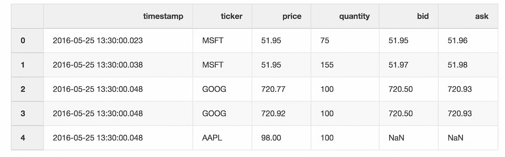
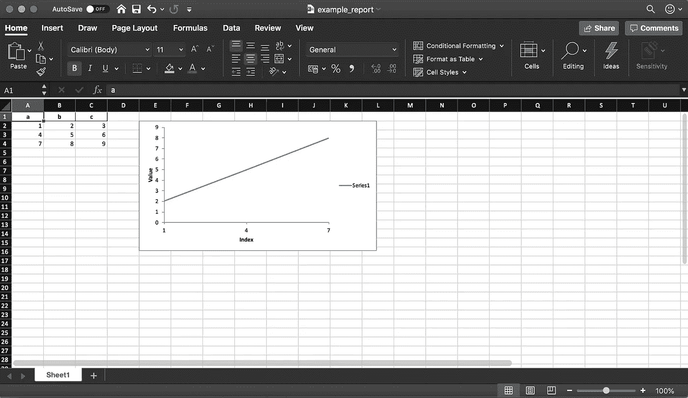
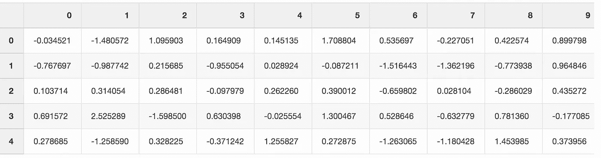

# 5 个鲜为人知的熊猫把戏

> 原文：<https://towardsdatascience.com/5-lesser-known-pandas-tricks-e8ab1dd21431?source=collection_archive---------2----------------------->



Pandas provides high-performance, easy-to-use data structures and data analysis tools for the Python

pandas 无需介绍，因为它已经成为 Python 中事实上的数据分析工具。作为一名数据科学家，我每天都使用熊猫，我总是对它的众多功能感到惊讶。在这篇文章中，我将向你展示我最近学到的 5 个熊猫技巧，用它们来帮助我更有效率。

对于熊猫新手— [熊猫](https://pandas.pydata.org/)为 Python 编程语言提供了高性能、易于使用的数据结构和数据分析工具。这个名字来源于术语“面板数据”，这是一个计量经济学术语，指的是包含同一个人在多个时间段的观察结果的数据集。

要运行示例，请下载这个 [Jupyter 笔记本](https://romanorac.github.io/assets/notebooks/2019-10-29-5-lesser-known-pandas-tricks.ipynb)。

**这里有几个你可能感兴趣的链接:**

```
- [Complete your Python analyses 10x faster with Mito](https://trymito.io/) [Product]- [Free skill tests for Data Scientists & ML Engineers](https://aigents.co/skills) [Test]- [All New Self-Driving Car Engineer Nanodegree](https://imp.i115008.net/c/2402645/1116216/11298)[Course]
```

*你愿意多看一些这样的文章吗？如果是这样，你可以点击上面的任何链接来支持我。其中一些是附属链接，但你不需要购买任何东西。*

# 1.日期范围

当从外部 API 或数据库获取数据时，我们经常需要指定一个日期范围。熊猫保护了我们。有一个 [data_range](https://pandas.pydata.org/pandas-docs/stable/reference/api/pandas.date_range.html) 函数，返回按天、月或年等递增的日期。

假设我们需要一个按天递增的日期范围。

```
date_from **=** "2019-01-01"
date_to **=** "2019-01-12"
date_range **=** pd**.**date_range(date_from, date_to, freq**=**"D")
date_range
```



让我们将生成的 date_range 转换为开始和结束日期，并将其传递给后续函数。

```
**for** i, (date_from, date_to) **in** enumerate(zip(date_range[:**-**1], date_range[1:]), 1):
    date_from **=** date_from**.**date()**.**isoformat()
    date_to **=** date_to**.**date()**.**isoformat()
    **print**("%d. date_from: %s, date_to: %s" **%** (i, date_from, date_to))1\. date_from: 2019-01-01, date_to: 2019-01-02
2\. date_from: 2019-01-02, date_to: 2019-01-03
3\. date_from: 2019-01-03, date_to: 2019-01-04
4\. date_from: 2019-01-04, date_to: 2019-01-05
5\. date_from: 2019-01-05, date_to: 2019-01-06
6\. date_from: 2019-01-06, date_to: 2019-01-07
7\. date_from: 2019-01-07, date_to: 2019-01-08
8\. date_from: 2019-01-08, date_to: 2019-01-09
9\. date_from: 2019-01-09, date_to: 2019-01-10
10\. date_from: 2019-01-10, date_to: 2019-01-11
11\. date_from: 2019-01-11, date_to: 2019-01-12
```

# 2.与指示器合并

合并两个数据集是将两个数据集合并为一个数据集，并根据公共属性或列对齐每个数据集的行的过程。

我错过的合并函数的一个参数是`indicator`参数。Indicator argument 向数据帧添加了一个`_merge`列，它告诉您“该行来自何处”，左侧、右侧或两个数据帧。当处理更大的数据集来检查合并操作的正确性时，`_merge`列非常有用。

```
left **=** pd**.**DataFrame({"key": ["key1", "key2", "key3", "key4"], "value_l": [1, 2, 3, 4]})
```



`right **=** pd**.**DataFrame({"key": ["key3", "key2", "key1", "key6"], "value_r": [3, 2, 1, 6]})`



`df_merge **=** left**.**merge(right, on**=**'key', how**=**'left', indicator**=**True)`



`_merge`列可用于检查是否有预期数量的行具有来自两个数据帧的值。

```
df_merge**.**_merge**.**value_counts()both          3
left_only     1
right_only    0
Name: _merge, dtype: int64
```

# 3.最近合并

当处理股票或加密货币等金融数据时，我们可能需要将报价(价格变化)与实际交易结合起来。假设我们希望将每笔交易与之前几毫秒发生的报价合并。Pandas 有一个 merge_asof 函数，它能够通过最近的键(在我们的例子中是时间戳)合并数据帧。数据集报价和交易取自[熊猫的例子](https://pandas.pydata.org/pandas-docs/stable/reference/api/pandas.DataFrame.merge.html)

报价数据框包含不同股票的价格变化。通常，报价比交易多得多。

```
quotes **=** pd**.**DataFrame(
    [
        ["2016-05-25 13:30:00.023", "GOOG", 720.50, 720.93],
        ["2016-05-25 13:30:00.023", "MSFT", 51.95, 51.96],
        ["2016-05-25 13:30:00.030", "MSFT", 51.97, 51.98],
        ["2016-05-25 13:30:00.041", "MSFT", 51.99, 52.00],
        ["2016-05-25 13:30:00.048", "GOOG", 720.50, 720.93],
        ["2016-05-25 13:30:00.049", "AAPL", 97.99, 98.01],
        ["2016-05-25 13:30:00.072", "GOOG", 720.50, 720.88],
        ["2016-05-25 13:30:00.075", "MSFT", 52.01, 52.03],
    ],
    columns**=**["timestamp", "ticker", "bid", "ask"],
)
quotes['timestamp'] **=** pd**.**to_datetime(quotes['timestamp'])
```



交易数据框包含不同股票的交易。

```
trades **=** pd**.**DataFrame(
    [
        ["2016-05-25 13:30:00.023", "MSFT", 51.95, 75],
        ["2016-05-25 13:30:00.038", "MSFT", 51.95, 155],
        ["2016-05-25 13:30:00.048", "GOOG", 720.77, 100],
        ["2016-05-25 13:30:00.048", "GOOG", 720.92, 100],
        ["2016-05-25 13:30:00.048", "AAPL", 98.00, 100],
    ],
    columns**=**["timestamp", "ticker", "price", "quantity"],
)
trades['timestamp'] **=** pd**.**to_datetime(trades['timestamp'])
```



我们通过报价器合并交易和报价，最新的报价可能比交易晚 10 毫秒。如果报价落后于交易超过 10 毫秒，或者没有任何报价，该报价的买价和卖价将为空(本例中为 AAPL 股票)。

```
pd**.**merge_asof(trades, quotes, on**=**"timestamp", by**=**'ticker', tolerance**=**pd**.**Timedelta('10ms'), direction**=**'backward')
```



# 4.创建 Excel 报表



Pandas(带有 XlsxWriter 库)使我们能够从数据框架创建 Excel 报表。这大大节省了时间——不再需要将数据帧保存为 CSV 格式，然后在 Excel 中格式化。我们还可以添加各种[图表](https://pandas-xlsxwriter-charts.readthedocs.io/)等。

```
df **=** pd**.**DataFrame(pd**.**np**.**array([[1, 2, 3], [4, 5, 6], [7, 8, 9]]), columns**=**["a", "b", "c"])
```

下面的代码片段创建了一个 Excel 报表。要将数据帧保存到 Excel 文件，取消对`writer.save()`行的注释。

```
report_name **=** 'example_report.xlsx'
sheet_name **=** 'Sheet1'writer **=** pd**.**ExcelWriter(report_name, engine**=**'xlsxwriter')
df**.**to_excel(writer, sheet_name**=**sheet_name, index**=**False)
*# writer.save()*
```

如前所述，该库还支持向 Excel 报表添加图表。我们需要定义图表的类型(我们示例中的折线图)和图表的数据系列(数据系列需要在 Excel 电子表格中)。

```
*# define the workbook* workbook **=** writer**.**book
worksheet **=** writer**.**sheets[sheet_name]*# create a chart line object* chart **=** workbook**.**add_chart({'type': 'line'})*# configure the series of the chart from the spreadsheet
# using a list of values instead of category/value formulas:
#     [sheetname, first_row, first_col, last_row, last_col]* chart**.**add_series({
    'categories': [sheet_name, 1, 0, 3, 0],
    'values':     [sheet_name, 1, 1, 3, 1],
})*# configure the chart axes* chart**.**set_x_axis({'name': 'Index', 'position_axis': 'on_tick'})
chart**.**set_y_axis({'name': 'Value', 'major_gridlines': {'visible': False}})*# place the chart on the worksheet* worksheet**.**insert_chart('E2', chart)*# output the excel file* writer**.**save()
```

# 5.节省磁盘空间

当处理多个数据科学项目时，您通常会从不同的实验中获得许多预处理数据集。笔记本电脑上的固态硬盘会很快变得凌乱不堪。Pandas 使您能够在保存数据集时对其进行压缩，然后以压缩格式读回。

让我们用随机数创建一个大熊猫数据框架。

```
df **=** pd**.**DataFrame(pd**.**np**.**random**.**randn(50000,300))
```



当我们将这个文件保存为 CSV 格式时，它会占用硬盘上将近 300 MB 的空间。

```
df**.**to_csv('random_data.csv', index**=**False)
```

使用一个参数`compression='gzip'`，我们可以将文件大小减少到 136 MB。

```
df**.**to_csv('random_data.gz', compression**=**'gzip', index**=**False)
```

将 gzipped 数据读入 DataFrame 也很容易，所以我们不会丢失任何功能。

```
df **=** pd**.**read_csv('random_data.gz')
```

# 结论

这些技巧帮助我每天与熊猫相处时更有效率。希望这篇博文向你展示了熊猫的新功能，这将有助于你提高工作效率。

# 在你走之前

在 [Twitter](https://twitter.com/romanorac) 上关注我，我经常在那里发布关于数据科学和机器学习的微博。