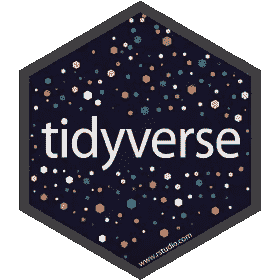
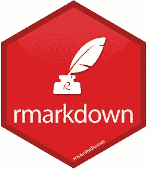
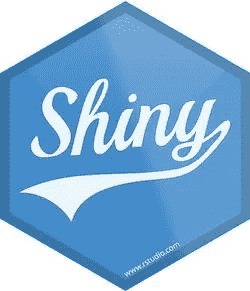
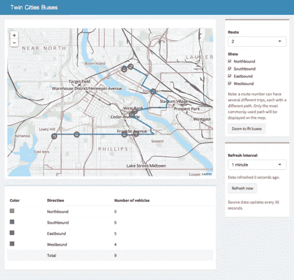

# 5 行代码说服你学习 R

> 原文：<https://towardsdatascience.com/5-lines-of-code-to-convince-you-to-learn-r-81efb2e3c836?source=collection_archive---------12----------------------->

## 为那些持观望态度的人写的一篇简短论文

支持本文的所有代码都可以从这个 Github repo 中派生出来。

给数据科学家(或任何人)的一些好建议。

> 如果多次编写相同的代码；创建一个函数。如果你不止一次地给出同样的建议；写一篇博文。

这就是了。这是我一生中第一千次发现自己在说服某人学习 [R(一种开源统计编程语言)](https://www.r-project.org/)。当某人是每天使用 Excel 的业务分析师时，这种对话会很容易。如果你在一组复杂的电子表格中挣扎，那么写代码是多么的优越是显而易见的。它是可读的，可复制的，可移植的，可扩展的。然而，大多数反对 R 的声音来自开发者和计算机科学团体。我日复一日地在 Python 和 R 之间穿梭，在项目与项目之间穿梭。这两者的价值对我来说都是显而易见的，为什么不是其他人呢？

对 R [有一些奇怪的偏见，不是源自传统的开发圈](https://en.wikipedia.org/wiki/R_(programming_language)#History)(比如 JavaScript 和 Python)。因此，R 的一些语法怪癖不太符合这些社区的期望。但是对怪癖的担心并不是避免使用强大工具的好理由。因此，对于那些对学习 R 犹豫不决的人，不管你是业务分析师还是开发人员，下面是我在接下来的 5 分钟内说服你的最佳尝试。

是的，R 是为数据、数据科学和统计学而设计的，但它也非常灵活和健壮。这里有五行简单的代码(或者更确切地说，是函数)，代表了这种语言有多棒。

## 第一行

```
*install.packages('any_package_on_CRAN')*
```

每一个 R session 里面都有一个入口，可以访问成千上万社区成员的工作。这一行代码(从 R 内部)安装来自 [CRAN(综合 R 存档网络)](https://cran.r-project.org/)的包，这是一个遍布全球的志愿者服务器网络。


[Official R logo used by CRAN](https://cran.r-project.org/)

CRAN 拥有其他 R 用户编写的完全开源和免费的“包”(库)的集合。最重要的是，你直接连接到一个由工程师、统计学家、数据科学家、科学家和开发人员组成的庞大网络。这些包几乎在所有可能的方面扩展了 R 语言。它们在到达 CRAN 之前都经过了仔细的验证(通过一种混合的自动同行评审过程),所以你知道它们可以跨各种平台工作。如果你想对数据做些什么，可能有一个软件包可以满足你。一些有趣的例子包括:

*   网页抓取: [httr](https://cran.r-project.org/web/packages/httr/index.html) ， [rvest](https://cran.r-project.org/web/packages/rvest/rvest.pdf)
*   社交媒体: [twitteR](https://cran.r-project.org/web/packages/twitteR/twitteR.pdf) ， [Rfacebook](https://cran.r-project.org/web/packages/Rfacebook/Rfacebook.pdf) ， [Rlinkedin](https://cran.r-project.org/web/packages/Rlinkedin/Rlinkedin.pdf)
*   业务运营:[销售专员](https://cran.r-project.org/web/packages/salesforcer/index.htmlhttps://cran.r-project.org/web/packages/salesforcer/index.html)， [gmailr](https://cran.r-project.org/web/packages/gmailr/index.html) ，[官员](https://cran.r-project.org/web/packages/officer/index.html)
*   金融: [tidyquant](https://cran.r-project.org/web/packages/tidyquant/index.html) ，[实证金融](https://cran.r-project.org/web/views/Finance.html)
*   云存储: [Dropbox](https://cran.r-project.org/web/packages/rdrop2/rdrop2.pdf) ， [googledrive](https://cran.r-project.org/web/packages/googledrive/googledrive.pdf) ， [Box](https://cran.r-project.org/web/packages/boxr/index.html)
*   地图:[地图](https://www.rdocumentation.org/packages/maps/versions/3.3.0)，[传单](http://rstudio.github.io/leaflet/)
*   深度学习: [keras](https://keras.rstudio.com/) ， [tensorflow](https://tensorflow.rstudio.com/)

我只是对这份清单略知皮毛。随着 R 的流行，可用软件包的数量呈指数级增长。目前，有近 14k 的软件包可用。如果一种编程语言的有用性可以根据支持库来判断，R 超过了最疯狂的期望。

## 第二行

```
*library(tidyverse)*
```

在 R 可用的所有包中，对数据科学和分析的基本任务最有用的是 [tidyverse。](https://www.tidyverse.org/)



[Popular Hex Design for tidyverse R Packages](https://github.com/tidyverse/tidyverse)

tidyverse 部分由 Hadley Wickham 编写，它是一个包的集合，使常见的数据科学任务变得简单、优雅、可重复和快速。这些包的美妙之处在于它们都共享一个共同的语法和设计，所以使用它们是直观的，并能创造显著的效率。核心包可以轻松完成大部分数据科学过程。

*   将数据读入 R: [readr](https://readr.tidyverse.org/) ，[数据库](https://dbplyr.tidyverse.org/articles/dbplyr.html)
*   扯皮扯皮数据: [dplyr](https://dplyr.tidyverse.org/) ，tidyr，[tible](https://tibble.tidyverse.org/)， [stringr](https://stringr.tidyverse.org/)
*   可视化数据: [ggplot2](https://ggplot2.tidyverse.org/)

编程语言的最大问题之一是阅读别人的代码可能相当困难。然而，当使用 tidyverse 和 tidy data 的核心[原则时，这个常见的痛点就消失了。常识动词和基本的代码样式使解释他人的工作变得轻而易举。](https://vita.had.co.nz/papers/tidy-data.pdf)

## 第 3 行

```
*my_linear_model <- lm(formula = dist ~ speed, data = cars)*
```

前两行代码都是关于围绕 R 的巨大生态系统。然而，base R(不需要任何外部包就能得到的东西)本身就很棒。无需导入任何外部库，这一行代码就是一个矢量化(即超快速)的线性回归。您可以在拥有数百万行和数百列的数据集上运行这段代码。只要不耗尽电脑内存，效率就极高。

汇总统计、蒙特卡罗模拟、矩阵运算和广义线性回归模型，只是您从 base R 中获得的现成内容的几个例子。更重要的是，这些模型是严格运行的，并且已经准备好发布，完成了一个可解释的输出。例如:

```
**summary**(my_linear_model)  *# model summary*
*#> Call:*
*#> lm(formula = dist ~ speed, data = cars)*
*#>* 
*#> Residuals:*
*#>     Min      1Q  Median      3Q     Max* 
*#> -29.069  -9.525  -2.272   9.215  43.201* 
*#>* 
*#> Coefficients:*
*#>             Estimate Std. Error t value Pr(>|t|)* 
*#> (Intercept) -17.5791     6.7584  -2.601   0.0123 ** 
*#> speed         3.9324     0.4155   9.464 1.49e-12 ****
*#> ---*
*#> Signif. codes:  0 '***' 0.001 '**' 0.01 '*' 0.05 '.' 0.1 ' ' 1*
*#>* 
*#> Residual standard error: 15.38 on 48 degrees of freedom*
*#> Multiple R-squared:  0.6511, Adjusted R-squared:  0.6438* 
*#> F-statistic: 89.57 on 1 and 48 DF,  p-value: 1.49e-12*
```

结果可用于分析或应用。这里主要的一点是，R 被设计成自下而上地进行数据科学和统计；而其他语言，比如 Python，依赖于外部库(这并没有什么错！).这个用起来真的很出彩。

## 第 4 行

```
*knit()*
```

每个数据科学项目都需要一些文档。在某些时候，您需要将辛苦获得的数据驱动的洞察力呈现给其他人。很少有比使用 [RMarkdown](https://rmarkdown.rstudio.com/index.html) 更好的方法了。



[RMarkdown uses knitr to create a powerful documentation system](https://rmarkdown.rstudio.com/)

RMarkdowns 基本概念是，它将简单 markdown 语法与 R 代码'块'联系在一起这产生了一个强大的文档系统。这个过程很简单；编织 R 块并把 markdown 转换成你想要的任何格式(html，pdf，word 等等)。).这意味着您的代码可以立即以多种格式呈现:

*   [报告/论文](https://rmarkdown.rstudio.com/gallery.html)
*   [幻灯片](https://rmarkdown.rstudio.com/gallery.html)
*   [网站](https://rmarkdown.rstudio.com/gallery.html)
*   [交互式仪表盘](https://rmarkdown.rstudio.com/gallery.html)
*   [书籍](https://rmarkdown.rstudio.com/gallery.html)

没有任何其他语言能从自己的生态系统中获得这种类型的支持。你可以学习 R，然后真正准备好[写作和出书！](https://bookdown.org/)

## 第 5 行

```
*runApp()*
```

许多数据科学项目并不以静态输出结束(就像我们从 RMarkdown 得到的那样)。相反，您希望交付能够集成到客户运营中的产品。[进入 Shiny，web 应用框架为 R.](https://shiny.rstudio.com/)



从分析到分析的飞跃中，没有什么比闪亮更容易接近了。我已经参与了几十个项目，其中最关键的项目涉及到某种类型的自动化。例如，有时业务问题需要持续的解决方案；你可以使用 Shiny 创建一个特定问题的应用程序留给你的客户。更重要的是，你不必从头开始。这里有很多例子。



Example Shiny App

最好的开始方式是用 [shinydashboard](https://rstudio.github.io/shinydashboard/) 构建一个简单漂亮的应用。只需几行 R 代码，只需使用`runApp()`命令，您就拥有了一个全功能的 web 应用程序。然后可以在 [MatrixDS](https://matrixds.com) 或者 [ShinyApp.io](https://www.shinyapps.io/) 这样的地方举办。

## 包扎

拥有从软件包到 web 应用程序的高质量社区驱动资源，R 是数据科学的必备语言。此外，当你学习 R 时，你就加入了一个超级棒又有趣的社区。这里有一些你可以做的事情:

*   [参加会议](https://www.r-project.org/conferences.html)
*   [加入 meetup](https://www.meetup.com/)
*   [在推特上关注哈德利·威克姆](https://twitter.com/hadleywickham)
*   [书签 R 博主](https://www.r-bloggers.com/)
*   [加入 R 女装](https://rladies.org/)

此外，如果我没有提到 R 最流行的开发环境 RStudio 是开源运动的主要贡献者，那我就失职了。对这些包和语言的支持得到了学术界和工业界的一些重量级支持。因此，R 哪儿也不去。

你可能会问如何开始。这里有一些资源可以让你有个好的开始。

**在线课程**

*   [商业科学大学](https://university.business-science.io/)
*   [R 数据营简介](https://www.datacamp.com/courses/free-introduction-to-r?utm_source=adwords_ppc&utm_campaignid=1565610363&utm_adgroupid=67750485748&utm_device=c&utm_keyword=learn%20r&utm_matchtype=e&utm_network=g&utm_adpostion=1t1&utm_creative=295213546478&utm_targetid=kwd-797681373&utm_loc_interest_ms=&utm_loc_physical_ms=9031970&gclid=EAIaIQobChMIjJvr-L7B4AIVBR-tBh2RLQ1aEAAYASAAEgLAqfD_BwE)
*   Udemy

在 LinkedIn 上联系我:[https://www.linkedin.com/in/isaacfaber/](https://www.linkedin.com/in/isaacfaber/)