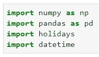
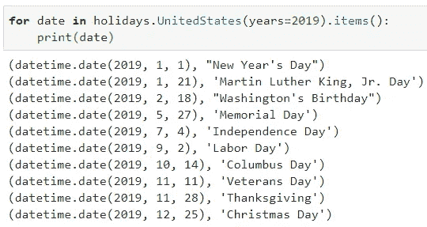
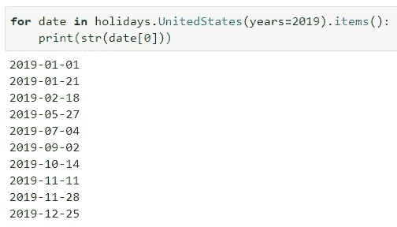
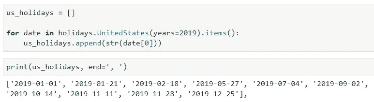
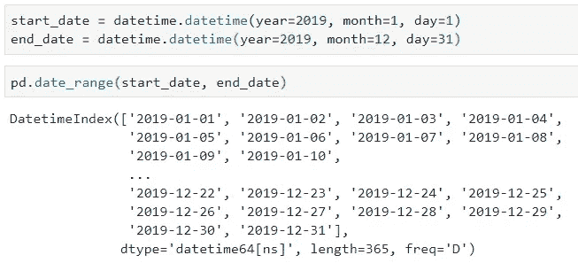
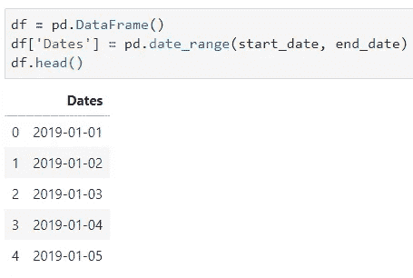
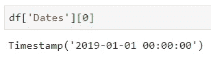
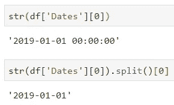
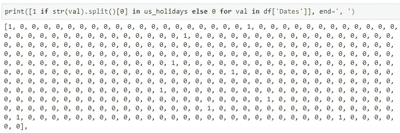
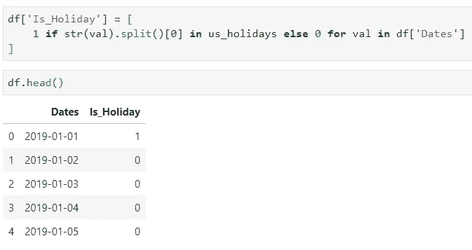

# 用 Python 检测假日的 5 分钟指南

> 原文：<https://towardsdatascience.com/5-minute-guide-to-detecting-holidays-in-python-c270f8479387?source=collection_archive---------3----------------------->

如果您决定深入研究数据分析，例如，想要分析购买趋势，您可能想要在数据集中构造一个新属性，该属性只有两种可能的结果-0 或 1-是假日，不是假日。


Photo by [Artem Sapegin](https://unsplash.com/@sapegin?utm_source=medium&utm_medium=referral) on [Unsplash](https://unsplash.com?utm_source=medium&utm_medium=referral)

花点时间想想为什么这个派生变量可能有用。你可能不会发现假期本身有更大的购买量，但假期前一周的销售情况如何呢？

***一整另一种动物，是不是？***

无论如何，在今天这个相当简短的帖子中，我想讨论一下我前段时间发现的一个 Python 库—*—是的，就是这个名字。它允许你获得特定年份和特定国家的主要节日的日期和名称。你可能想知道它现在支持多少个国家，答案肯定会让你大吃一惊——大约 50 个左右(*能够为一些国家指定个别地区*)。*

*你可以在这里找到完整的列表:*

*[](https://pypi.org/project/holidays/) [## 假日

### 一个快速、高效的 Python 库，用于动态生成国家、省和州特定的假日集。它…

pypi.org](https://pypi.org/project/holidays/) 

本文的目标是对您最常用的库和展示函数进行一些探索。我们将创建 2019 年全年的日期列表，并从那里声明另一个列，如果那天(*或*)是假日，则该列的值为 1，否则为 0。

在进入代码之前，您需要安装库，因此启动**终端**并执行以下命令:

```
pip install holidays
```

**一切都好吗？我的意思是应该的，看在上帝的份上，这只是一个小小的安装。不过，现在让我们做一些真正的事情。*** 

# *进口货*

*屁股总是，你的笔记本应该从进口开始。这里没什么特别的，只有 *Numpy* ，*熊猫*，*日期时间*，还有耶，新安装的*节假日*库:*

**

*你可能不需要 Numpy 跟着来，但是我总是喜欢进口的。*

# *提取假期*

*如果你打开 [Holidays library](https://pypi.org/project/holidays/) 的文档并向下滚动一点，你会看到 50 多个受支持国家的列表。*

*现在提取假期非常容易，您需要循环查找感兴趣国家的假期，并指定感兴趣的年份:*

**

*是啊，就这么简单。然而，获得的日期不是期望的格式。大多数情况下，您只关心日期本身，而不关心它代表什么假日，因为您最喜欢在数据集中有一个二进制属性，如果假日存在，则值为 1，否则为 0。*

*好消息是，提取日期的字符串表示非常容易:*

**

*现在让我们将所有的字符串表示存储在一个单独的列表中——稍后会派上用场:*

**

*太好了。现在，我们可以构建一个**熊猫** DataFrame 对象，并在这些假期中尽情玩耍。*

# *将一切联系在一起*

*对于熊猫，构建日期列表相当简单，比如说 2019 年全年:*

**

*太好了。现在，我们可以从这些日期构建一个 DataFrame 对象—让我们将它们放入日期列:*

**

*现在有一个小问题。日期看起来是以字符串格式存储的，就像我们的 ***us_holidays*** 列表一样，但事实并非如此。这是一个**时间戳**对象。下一个单元格验证了这一说法:*

**

*因此，让我们探索如何只提取日期作为字符串，并丢弃时间信息。您需要将时间戳转换成一个字符串，然后分割该字符串，只保留左边的部分(*日期信息*)。这是一件相当简单的事情:*

**

*现在我们可以使用[列表理解](/a-comprehensive-guide-to-list-comprehensions-f15bae4fd0c3)的能力来构建一个二进制列表，如果日期是假日，则值为 1，否则为 0。我决定将所有内容打包到 ***print()*** 中，并指定一个不同的结束参数，这样整个列表就可以显示在屏幕上:*

**

*现在，最后，根据同样的原则，您可以将该列表作为一列添加到之前创建的 Pandas 数据帧中:*

**

*你差不多完成了。你现在可以继续你的分析了。当然，您拥有的数据集将会有更多的属性，所以这个新的二进制列对于分析可能会很方便。*

*感谢您的阅读，我希望您能在工作流程中利用这些知识。*

**喜欢这篇文章吗？成为* [*中等会员*](https://medium.com/@radecicdario/membership) *继续无限制学习。如果你使用下面的链接，我会收到你的一部分会员费，不需要你额外付费。**

*[](https://medium.com/@radecicdario/membership) [## 通过我的推荐链接加入 Medium-Dario rade ci

### 作为一个媒体会员，你的会员费的一部分会给你阅读的作家，你可以完全接触到每一个故事…

medium.com](https://medium.com/@radecicdario/membership)*