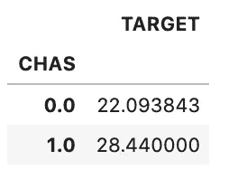

# 熊猫绘图 5 分钟指南

> 原文：<https://towardsdatascience.com/5-minute-guide-to-plotting-with-pandas-e8c0f40a1df4?source=collection_archive---------4----------------------->

## 了解如何使用这个流行的 python 工具快速可视化数据


Pandas 是数据科学领域最流行的 python 库之一。它提供了一系列用于 python 数据处理和分析的工具。Pandas 还有一个可视化功能，它利用了 matplotlib 库及其核心数据结构，即数据框。

虽然观想是相当基本的，并没有产生最美丽的情节。绘图功能，特别是当与其他 pandas 方法(如 groupby 和 pivot tables)结合使用时，允许您轻松地创建可视化以快速分析数据集。我几乎每天都在使用它来快速获得一些关于我正在处理的数据的信息，所以我想创建这个简单的指南来介绍一些我最常用的功能。

## 数据

在本文中，我将使用波士顿房价数据集，它是 scikit-learn 库的一部分。这也可以从互联网上的各种其他来源下载，包括 [Kaggle](https://www.kaggle.com/c/boston-housing) 。在下面的代码中，我正在导入数据集并创建一个数据框，以便它可以用于熊猫的数据分析。

```
from sklearn.datasets import load_boston
import pandas as pdboston = load_boston()
boston_df = pd.DataFrame(boston.data, columns=boston.feature_names)
boston_df['TARGET'] = pd.Series(boston.target)
boston_df.head()
```

我们可以运行`boston.DESCR`来查看每个特性的解释。


## 入门指南

pandas 中的绘图利用了 matplotlib API，因此为了创建可视化，您还需要将这个库与 pandas 一起导入。如果你在 Jupyter 笔记本中工作，那么你还必须添加`%matplotlib inline`命令，以便在笔记本中可视化图形。

```
import matplotlib.pyplot as plt
%matplotlib inline
```

`plot`方法从一个数据帧或数据系列创建一个基本折线图。在下面的代码中，我使用了这个方法来可视化`AGE`列。

```
boston_df['AGE'].plot()
```


这个数据的一个更有用的表示是直方图。简单地将`.hist`添加到这个命令中就会产生这种类型的图形。

```
boston_df['AGE'].plot.hist()
```


您可以通过添加`title`参数为情节添加标题。

```
boston_df['AGE'].plot.hist(title='Proportion of owner-occupied units built prior to 1940')
```

由于 pandas 使用 matplotlib API，您可以使用该库的所有功能来进一步定制可视化。在下面，我定制了`colormap`，并在 x 和 y 轴上添加了定制标签。

```
boston_df['AGE'].plot.hist(title='Proportion of owner-occupied units built prior to 1940', colormap='jet')
plt.xlabel('AGE')
plt.ylabel('FREQUENCY')
```


有关可用图表类型和可选参数的完整列表，请参见此处的`DataFrame.plot()` [文档。](https://pandas.pydata.org/pandas-docs/version/0.22/generated/pandas.DataFrame.plot.html)

## 相关

熊猫`DataFrame.corr` [方法](https://pandas.pydata.org/pandas-docs/stable/reference/api/pandas.DataFrame.corr.html)可用于非常快速地可视化数据帧中变量之间的相关性。默认情况下，pandas 使用 [pearson](https://en.wikipedia.org/wiki/Pearson_correlation_coefficient) 方法，并输出包含变量相关系数的数据帧。

在下面的代码中，我使用这个方法来确定每个特性如何与目标变量相关联。输出显示在代码下方。

```
correlations = boston_df.corr()
correlations = correlations['TARGET']
print(correlations)
```


我们可以看到特征 RM(房间的平均数量)与目标有很强的相关性。让我们用熊猫来进一步形象化这种关联。

```
boston_df.plot.scatter(x='RM', y='TARGET')
```

上面的代码产生了下面的可视化效果。我们可以看到，一般来说，房子的中值价格随着房间数量的增加而增加。


## 分组依据

当您使用 [groupby](https://pandas.pydata.org/pandas-docs/stable/reference/api/pandas.DataFrame.groupby.html) 函数组合图表时，pandas 可视化可以变得非常强大，可以用几行代码快速分析多个数据点。

让我们使用此功能来查看按 CHAS 变量分组的箱线图中所有特征的分布。此要素包含两个值，如果地产区域与河流接壤，则值为 1，否则值为 0。使用下面的代码，我们可以很快看到房子靠近河流时变量之间的任何差异。

以下代码按该列对数据框进行分组，并为每个要素创建一个方框图。我们现在可以很快想象出两组之间的差异。

```
boston_df.groupby('CHAS').boxplot(fontsize=20,rot=90,figsize=(20,10),patch_artist=True)
```


## 数据透视表

熊猫[数据透视表](https://pandas.pydata.org/pandas-docs/stable/reference/api/pandas.pivot_table.html)，非常类似于 excel 等电子表格工具中的数据透视表，对于快速汇总数据非常有用。您可以将数据透视表与 pandas 中的可视化功能结合起来，为这些聚合创建图表。

从上面的方框图中我们可以看出，靠近河边的人和不靠近河边的人在房价上存在差异。在下面的代码中，我们创建了一个数据透视表来计算两组的平均房价。

```
import numpy as nppivot = pd.pivot_table(boston_df, values='TARGET', index=['CHAS'], aggfunc=np.mean)
pivot
```

这将创建以下输出。



为了将它可视化为一个柱状图，我们可以简单地运行`pivot.plot(kind=’bar’)`,产生如下所示的可视化。我们可以很快看到，靠近河边的房子价格普遍较高。


这篇文章旨在快速介绍如何用熊猫绘图。使用可视化以及将它们与数据透视表和 groupby 方法结合起来，有更多的选择。熊猫[用户指南](https://pandas.pydata.org/pandas-docs/stable/user_guide/visualization.html)包含了更广泛的可能性列表。

感谢阅读！