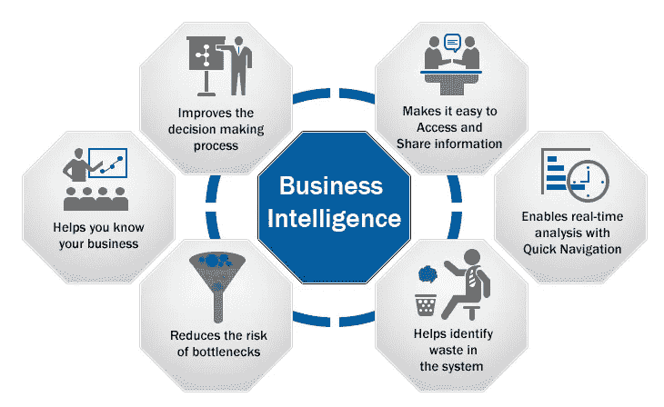
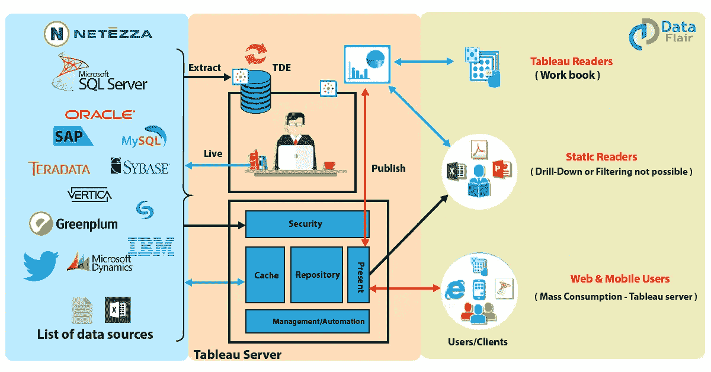
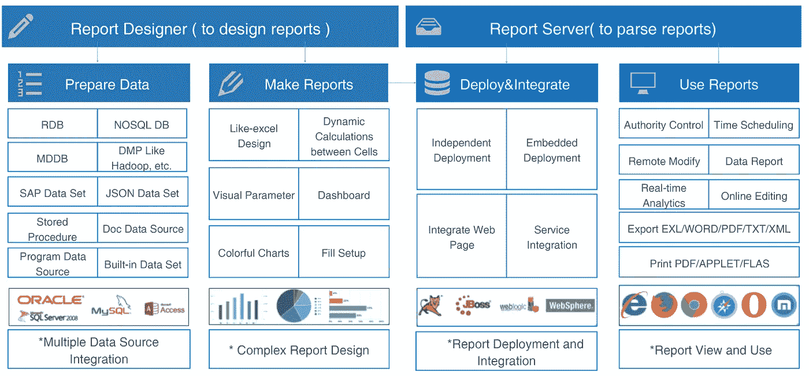
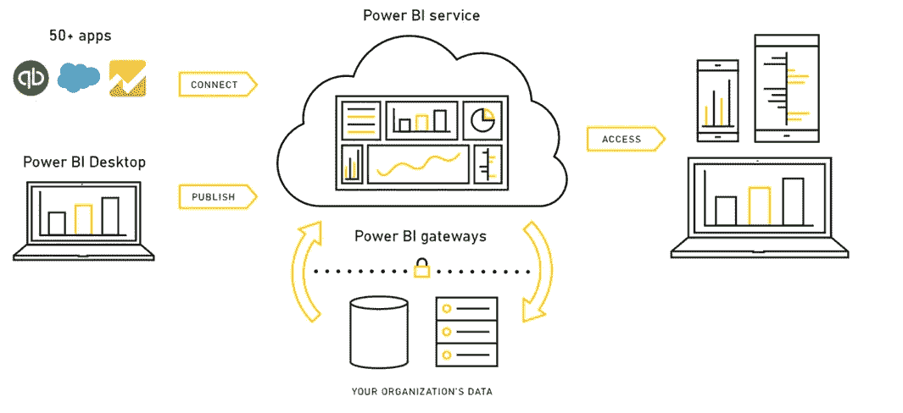
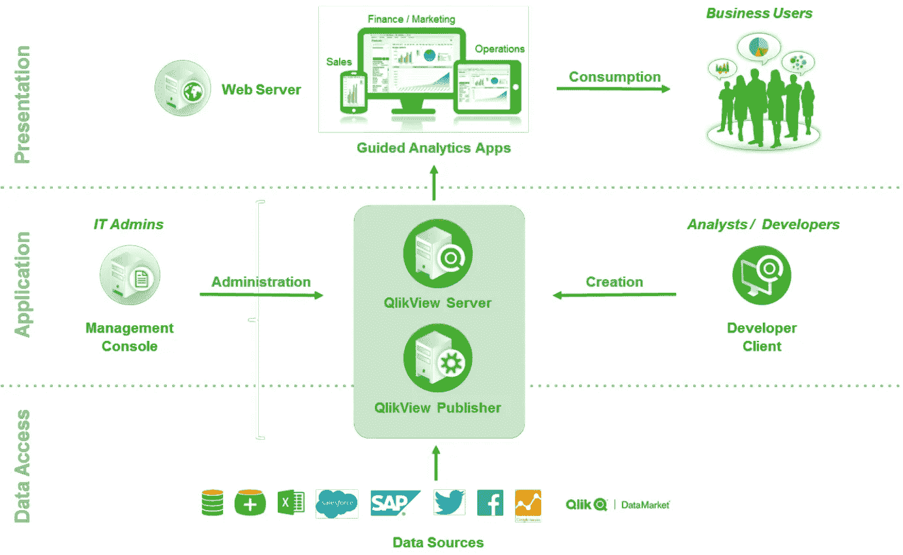
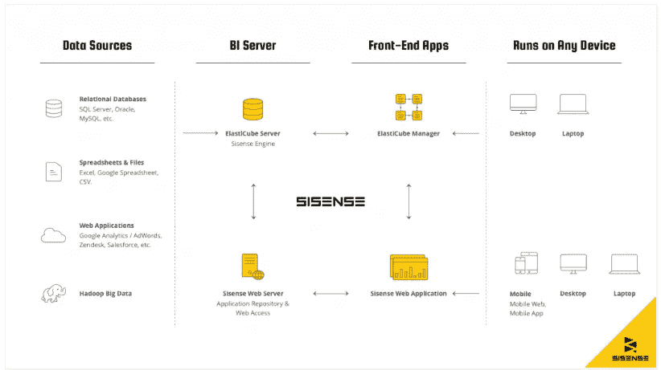

# 2021 年最受欢迎的 5 种商业智能(BI)工具

> 原文：<https://towardsdatascience.com/5-most-popular-business-intelligence-bi-tools-in-2019-4e060b98039a?source=collection_archive---------13----------------------->

随着商业智能(BI)工具在企业中发挥越来越重要的作用，这项技术在未来一年将发挥巨大的作用。BI 软件通过数据显示和分析帮助企业发现形势、市场挑战和机会。因此，it 部门和经理通常会寻找最适合他们需求的 BI 工具。

在这篇文章中，我从用户在 BI 软件中最关心的三个方面比较了 2021 年的 5 大 BI 工具，包括整体易用性、BI 功能和价格。最后，经过比较，你会看到哪个软件最适合你和你公司的需求。

在开始之前，让我们澄清一些商业智能工具的定义。

# 什么是商业智能？

商业智能为企业提供快速的数据分析技术和方法，包括数据收集、管理和分析。它将数据转化为有价值的信息，帮助企业进行数据驱动的决策，减少决策的盲目性。从而使企业的管理和经营更加合理。

From Google

# 什么是商业智能工具？

商业智能工具是指具有数据可视化和分析技术的软件。此外，它还具有独特的数据连接和处理能力。用户可以通过可视化界面快速生成各种类型的数据报告、图形和图表。因此，企业中的不同角色可以在安全的环境中，在不同的终端(如 PC、移动终端、大屏幕)上查询、分析和浏览数据。

# 商业智能工具有哪些类型？

根据功能模型的不同，商业智能工具可以分为三类:报表 BI、传统 BI 和自助 BI。

**汇报 BI:**

汇报 BI 主要面向 IT 部门。适用于各种固定格式的报表设计，通常用于呈现业务指标体系，支持的数据量不高。

报表 BI 主要采用类 Excel 的设计模式。虽然这种类型的 BI 目标是释放它在建立[报告系统](https://www.finereport.com/en/reporting-tools/best-reporting-tools-list.html)的艰苦工作，业务人员也可以快速学习在既定的数据范围内产生基本的报告和仪表板。

**传统匕:**

传统 BI 也面向 IT 人员，但侧重于 OLAP、即席分析和数据可视化分析。IBM 的 Cognos 和 sap 的 BO 是传统 BI 的代表。它的优点是处理大数据时的高性能和稳定性。但它的缺点也很明显——数据分析能力和灵活性差。根据 Forrester 的报告，传统 BI 无法满足企业 83%以上的数据分析需求。这表明许多企业已经建立了几乎无效的 BI 系统。此外，成本高、实施周期长、风险大、对用户的技术要求高也不利于传统 BI 的推广和普及。

**自助商务智能:**

自助 BI 也称为敏捷 BI。自助式 BI 的出现解决了传统 BI 无法满足业务部门分析需求的问题。

自助式 BI 面向业务人员，追求业务部门与 IT 部门的高效合作。通过直观的数据分析界面，业务人员可以基于对业务的理解高效地进行自助分析，发掘数据的价值，开发数据驱动的业务。

希望你从上面对商业智能工具有更深入的了解。如果是，那就言归正传，开始 bi 工具的回顾吧。

# 商业智能工具比较标准

我在[2020 年商业智能工具十大关键特性](/top-10-key-features-of-bi-tools-in-2020-fd02c1dd4c71)中整理了一些商业智能工具的常见特性。基于此，我选择了用户在 BI 软件中最关心的三个方面:

*   **整体易用性**:用户界面设计的如何？直观吗？工具入门有多难？他们有培训、工具提示或视频来帮助你学习你在做什么吗？
*   **BI 特点**:有哪些利弊需要注意？
*   **价格**:多少钱？

# BI 工具列表

## 1.[画面](https://www.tableau.com/)

类别:自助 BI 工具

From Google

## 1.1 整体易用性

该工具创建图形的直观方式和用户友好的界面使外行用户能够充分利用基本应用程序的功能。设计仪表板时，您需要创建一个工作表，然后将其拖动到容器中。对于初次使用的用户来说，需要时间来适应。

然而，一般来说，非技术用户无需深入培训就可以享受 stats 解析功能。要想深入了解该解决方案的功能，Tableau 社区是一个很好的去处，因为 Tableau 的粉丝将他们的专业知识和技能投入到社区中，他们愿意帮助解决任何用户问题并分享他们的经验。

## 1.2 BI 功能:利弊

*   **Pro:支持多数据源**

关系数据库

NoSQL 数据库

多维数据库

大数据平台

文件数据源(Execl、csv、txt、Json、pdf、mdb、Tableau)

*   **亲:惊人的数据可视化**

无与伦比的可视化信息的能力是 Tableau 软件的最大优势。使用独特的可视化技术，我们可以通过使用颜色、形状和大小来表达分析结果，从而快速分析数据。开发团队正在研究用户喜欢什么类型的图表，以便 Tableau 可以显示数据的最佳图形。这部分唯一的缺点是不能制作仪表、3D 图和热图。

*   **弊:BI 能力差**

Tableau 缺乏全面的商业智能工具所需的功能，例如大规模报告、构建数据表和静态布局。而且导出和打印的格式有限，不便于结果共享。

*   **缺点:定制问题**

Tableau 几乎是封闭的，很难定制或嵌入到公司的 it 环境中。

## 1.3 价格

价格是根据用户数量而定的。考虑到大多数中小型公司的许可成本相当高，Tableau 是大型企业的首选。

## 2. [FineReport](http://www.finereport.com/en/?utm_source=medium&utm_medium=media&utm_campaign=blog&utm_term=5%20Most%20Popular%20Business%20Intelligence%20(BI)%20Tools%20in%C2%A02019)

类别:报告 BI 工具

From Google

## 2.1 整体易用性

FineReport 拥有类似 Excel 的界面和拖放元素，新手很容易上手。任何之前使用过 Excel 的人都可以快速学习 FineReport。官网为用户提供了详细的教学文档和视频。

## 2.2 商务智能的特点:利弊

*   **Pro:智能数据输入**

[数据输入](http://www.finereport.com/en/features/data-entry?utm_source=medium&utm_medium=media&utm_campaign=blog&utm_term=5%20Most%20Popular%20Business%20Intelligence%20(BI)%20Tools%20in%C2%A02019)是 FineReport 的一个显著特点。它提供了丰富的控件，可以轻松地通过表单将大量数据直接输入到数据库中，并具有数据验证和临时存储等周到的功能。此外，它还支持在线和批量导入 excel 数据。

*   **亲:轻松制作复杂报表**

处理复杂报告的能力令人印象深刻。将聚合块自由拼接在一起，免去了 Excel 中频繁合并拆分单元格的麻烦。每个聚集块是独立的；您可以拖放并自由地将它们放在一起，以创建不规则的报告。

*   **坏处:不方便多维分析**

您可以为一个单元格数据设置多个向下钻取和向上钻取，但是您需要为每个维度创建一个报表。

*   **缺点:没有推荐的图表功能**

虽然 FineReport 提供了丰富的视觉效果、图表、地图、3D 效果，但并不根据数据推荐图表。你应该自己选择图表。

## 2.3 价格

FineReport 对个人使用是免费的，没有时间和功能限制。对于企业来说，按照功能模块和并发用户来收费。价格在 Tableau 和 PowerBI 的之间。

## 3. [PowerBI](https://powerbi.microsoft.com/en-us/)

类别:自助 BI 工具

From Google

## 3.1 整体易用性

既然是微软开发的 BI 工具，基本上就是把 Excel 的数据透视表和 Excel 的数据可视化工具带到了一个更高的层次。PowerBI 的用户界面类似于 Excel，它允许一个短的学习曲线。它还为进一步学习提供了详细的学习视频和文档。

## 3.2 商务智能特性:利弊

*   **Pro: Excel 集成**

PowerBI 可以无缝连接到任何 Ms office。此外，使用 PowerBI，您可以将数据放在 Excel 中，这样您就可以轻松地看到可视化背后的原始数据。

*   **Pro: R 脚本可视化**

PowerBI 是前 5 大 BI 工具中唯一支持 R 的工具，它使用 R 丰富的分析和可视化功能来呈现高级数据整形和分析，如预测。

*   **反对:权限管理问题**

不是企业级控件，不支持多级权限分配，无法控制用户查看的列级权限粒度，集团权限控制也没有相应的完整控制策略。

*   **缺点:免费版本的数据处理能力差**

免费版本对它能处理的数据量有限制。一旦数据量达到 2GB，你就必须升级到付费版本，以减少处理时间。

## 3.3 价格

如果您的预算不多，并且正在寻找一个实惠的选择，Power BI 将是您最终选择的产品。Pro 版售价 9.99 美元/用户/月，低于小众同类产品。

## 4. [QlikView](https://www.qlik.com/us/products/qlikview)

类别:自助 BI 工具

From Google

## 4.1 整体易用性

QlikView 是一种自助式 BI 工具，使用自己的“关联技术”和内存技术运行。它有一个直观的界面，可以直观地使用，并具有智能搜索功能。它不需要立方体结构，比常规分析更适合于特别分析。

## 4.2 商务智能的特点:利弊

*   **Pro:内存技术**

由于其内存技术，QlikView 在数据从后端传输到前端时计算数据。因为没有预先聚集或预先计算的数据被预先存储，所以可以节省系统的存储器，并且数据传送的速度很快。

*   **亲:直接&间接数据搜索**

在 QlikView 中，您可以搜索直接和间接数据。在直接搜索中，您可以输入数据并获取您的信息。而在间接搜索中，您可以输入与您想要的数据相关的内容，并获得所有相关数据。

*   缺点:对于非技术用户来说不够友好。

数据管理应该更加方便用户。现在，它在脚本编辑器中。熟悉关系数据库的人可以很容易地处理这个问题，但是程序员的知识是必须的。最终用户或非技术人员可能不敢开始使用 QlikView，因为他们会发现很难上手。

*   **缺点:不支持地图图表**

除非购买第三方加载项，否则创建地理制图图表相当复杂。

## 4.3 价格

QlikView 上每个私人用户 1350 美元，并发用户 15000 美元。一个服务器许可证是 35000 美元。其他服务需要额外付费。

## 5. [Sisense](https://www.sisense.com/)

类别:自助 BI 工具

From Google

## 5.1 整体易用性

像商业智能工具的其他市场领导者一样，界面非常直观，用户可以通过拖放操作。Sisense 也有一个在线社区。虽然 Sisense 的社区用户活跃度不如 Tableau，但是那个社区的资源对于深度学习的新手来说已经足够了。

## 5.2 商务智能特性:利弊

*   **Pro:速度快**

借助该软件的片内引擎，您可以提出任何问题并立即获得答案，而无需重新开始新的查询。

*   **Pro:灵活集成**

Sisense

*   ****缺点:限量图表****

**图表有限。此外，与市场领导者相比，开箱即用的可视化和报告功能有点太基础了。**

*   ****缺点:不方便团队合作****

**管理员当前不能编辑彼此的仪表板。只有文件夹和仪表板的所有者可以发布任何更改。**

## **5.3 价格**

**提供免费试用，完整版价格以报价为基础，需要联系供应商。**

# **哪个 BI 软件最符合我的需求？**

**所以你已经了解了好处并检查了缺点。当您查看这 5 大 BI 工具时，哪一个是最好的？你可以看到这个商业智能软件有优点也有缺点。如果你仍然不确定哪种软件更适合你和你公司的需求，这可能会给你的决定提供一些建议。**

# **看看画面，如果你:**

*   **需要能够提供出色数据可视化的软件。**
*   **有足够的预算。**
*   **想用一个拖放界面自己做一些商业分析**

# **如果您有以下情况，请查看 FineReport:**

*   **需要减少批量构建复杂报告的时间**
*   **对 BI 工具的灵活部署和集成有需求**
*   **想在电视屏幕或大屏幕上显示您的仪表盘吗**

# **如果您符合以下条件，请查看 PowerBI:**

*   **正在使用微软办公软件并熟悉 Excel**
*   **预算不多，你正在寻找一个负担得起的选择**
*   **重视团队合作和软件的协作特性**

# **如果您符合以下条件，请查看 QlikView:**

*   **侧重于即席分析。**
*   **处理大量数据，对数据传输速度有很高的要求**
*   **掌握一些关系数据库的基础知识和编程知识**

# **如果您符合以下条件，请查看 Sisense:**

*   **必须处理大而分散的数据集**
*   **对数据处理速度有很高的要求**
*   **正在寻找涵盖所有业务分析的软件**

# **您可能也会对…感兴趣**

**[*2019 年你不能错过的 9 款数据可视化工具*](/9-data-visualization-tools-that-you-cannot-miss-in-2019-3ff23222a927)**

**[*2019 年 6 大数据分析工具*](/top-6-data-analytics-tools-in-2019-4df815ebf82c)**

**[*什么是大屏幕的数据可视化，如何实现？*](/what-is-data-visualization-for-large-screen-and-how-to-implement-it-1d79cf07783)**

**[*数据分析师需要掌握的 6 项关键技能*](/6-key-skills-that-data-analysts-need-to-master-df1d82257b9)**

**[*商业仪表盘入门*](/a-beginners-guide-to-business-dashboards-981a8192a967)**

**[*新手如何设计酷炫的数据可视化？*](/how-can-beginners-design-cool-data-visualizations-d413ee288671)**

**[*数据可视化十大地图类型*](/top-10-map-types-in-data-visualization-b3a80898ea70)**