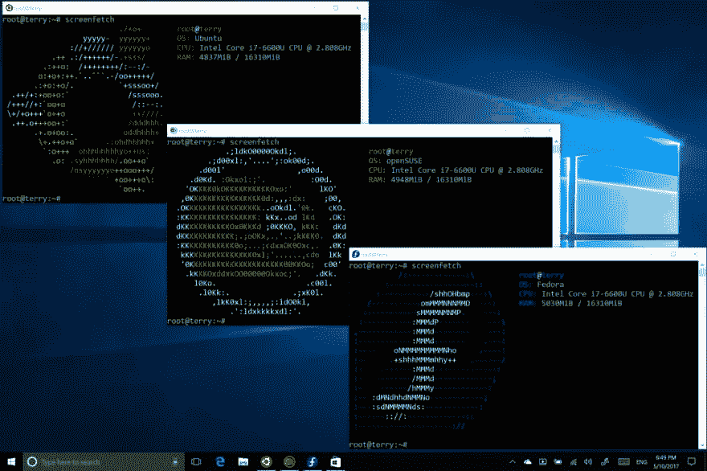

# 数据科学的 5 个必备应用

> 原文：<https://towardsdatascience.com/5-must-have-applications-for-data-science-b8479f06e4a2?source=collection_archive---------10----------------------->

随着数据科学成为软件行业越来越多的话题，机器学习成为技术领域的前沿，每天都有新的应用程序开发出来，让工作变得更简单、更快速。随着这种令人兴奋的增长，我们不断有新的创造者、科学家和分析师加入终生学习的行列。

今天我决定分享我个人最喜欢的五个工具，有些很明显，有些不太明显。不管怎样，希望有人发现这些工具的推荐是有用的。

# 5.WSL

这个列表中的第一个工具是 Windows 用户专用的，也就是说，不是我专用的，但是它是在 Windows 中最大化工作流程的一个好方法。对于那些刚刚接触这个概念的人来说，Windows 没有传统的 bash 终端，因为这个操作系统的编程方式与基于 Unix 的系统完全不同。这对普通开发人员的工作流程是一个严重的损害，对于数据科学家来说也是如此。

然而，WSL 允许您在 Microsoft Windows 中运行一个虚拟的 Linux 终端，通常是 Ubuntu。通常情况下，Windows 上的套件需要不断的应用程序切换，“Git-Bash”，“Anaconda Prompt”等。当然，走这条路没有错，但是 WSL 使整个集成变得更加容易，并允许显著增强的工作流，尤其是在与团队合作时。

# 4.数据库浏览器

很多人可能没有听说过 DB-Browser。DB-Browser 允许您查看数据库的内部结构，并熟悉其模式，而无需发送任何查询。当我有一些神秘的数据库时，或者想要测试一些查询以确保它在推送代码之前正确地做了我想要的事情时，我会大量使用 DB-Browser。DB-Browser 在 Windows、Linux 和 Mac 上也普遍可用，这使得它成为一个任何人都可以使用的免费工具。

# 3.r 工作室

如果您是一名杰出的 R 程序员，或者更喜欢 Python、Scala、MATLAB 或 Julia，但是经常使用 R，R studio 绝对是值得研究的 DS 工具。R studio 唯一显著的缺点是它不便宜，当然也不是免费的。无论价格还是使用，R studio 绝对是一个很酷的工作环境，我非常喜欢。

# 2.码头工人

Docker 是另一个你可能想到过，但没有出现在这个列表中的。由于这是一个更加固执己见的列表，我想我应该提醒你 Docker 并不总是最好的选择。然而，作为一个喜欢开发操作系统和 Linux 的人，Docker 是一个设置虚拟环境来完成工作的好工具。我们不仅拥有像 Python 包索引这样的语言包管理器的优势，我们还拥有 Linux 包管理器的优势。

虽然这些好处肯定是有的，但对大多数人来说，只使用画中画/虚拟环境可能是一个更好的主意。这些工具对于快速设置、跟踪 pip 轮和部署绝对有用。这两种方式各有利弊，但就我而言，我推荐 Docker。

# 1.朱皮特

## 在所有人都看到的结论中，我向你呈现:

> 朱皮特

当然，Jupyter 可能不需要介绍，但它在我的列表中名列前茅，因为没有它没有任何意义。Jupyter 允许你在一个虚拟的执行虚拟内核的单元中使用 Conda 虚拟环境。这对于数据科学来说是必须的，但是当然你可能已经知道了。

还要注意的是，Jupyter 是跨平台的，可以在任何地方使用。Jupyter 还支持允许执行任何语言的扩展，使它成为除 Python 之外还可以与 R、Scala、Julia 和 C 一起使用的工具。我无法告诉你我一天中有多少次跳进 Jupyter 来调试某个东西，或者在尝试使用某个功能之前测试它。快速简单的设置也是一个优势。

# 结论

有许多工具可以让数据科学家的工作变得非常简单。根据我使用每种软件的频率，这是我最喜欢的五种软件，但我很想知道其他数据科学家喜欢使用什么软件，以及他们也喜欢我使用的软件。请随意在下面分享，因为我绝对想知道。

我非常兴奋地看到以 DS 为中心的软件在未来几年甚至更长时间内的发展前景。随着过去一年的显著增长，我想我们将在未来几年看到一些非常酷的东西！