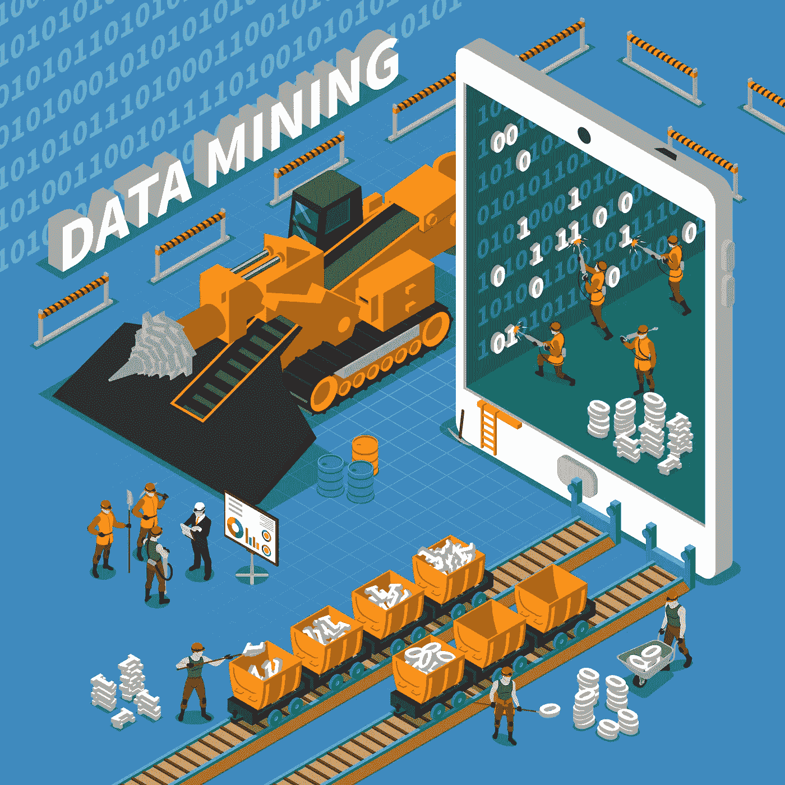

# 数据挖掘的 5 个误区

> 原文：<https://towardsdatascience.com/5-myths-of-data-mining-70d49f0abd18?source=collection_archive---------15----------------------->

[https://www.freepik.com/free-vector/data-mining-isometric-concept_4015382.htm](https://www.freepik.com/free-vector/data-mining-isometric-concept_4015382.htm)

## ***什么是数据挖掘？***

数据挖掘用于分析数据，检测数据中的模式和关系，并将其转换为有用的信息，以便企业做出更好的决策。数据分析已经出现了几个世纪，但最近由于新的专业技术进入市场而变得普遍。但是，随之而来的是关于什么是数据挖掘、它如何工作以及利用它的好处的许多误解和神话。

Photo by [Markus Spiske](https://unsplash.com/@markusspiske?utm_source=medium&utm_medium=referral) on [Unsplash](https://unsplash.com?utm_source=medium&utm_medium=referral)

## ***误区一:数据挖掘是一个极其复杂且难以理解的过程。***

数据挖掘背后的算法可能很复杂，但是使用正确的工具，数据挖掘可以很容易使用，并且可以改变你经营业务的方式。数据挖掘工具使您能够通过简单易懂的图表、查询和可视化来轻松查看和理解您的数据，让您深入了解您的业务是如何运作的。然后，您可以识别问题和潜在问题，并做出基于分析的决策来改善效率低下的情况。

数据挖掘工具并不像人们想象的那样复杂或难以使用。它们被设计成易于理解，以便企业能够解释产生的信息。数据挖掘是非常有利的，不应该让那些考虑使用它的人感到害怕。

Photo by [Donald Giannatti](https://unsplash.com/@wizwow?utm_source=medium&utm_medium=referral) on [Unsplash](https://unsplash.com?utm_source=medium&utm_medium=referral)

## 神话 2:数据挖掘是另一个很快就会消失的趋势，它让我们可以回归标准的商业实践。

定量实践已经被企业采用了相当一段时间。数据挖掘只是 20 世纪初出现的一种更成熟的实践。数据无处不在，一些数据库的大小非常大，使得手动发现变得极其困难。凭借易于使用的功能、降低成本和减少时间的优势，以及在快速部署且易于理解的解决方案中对公司绩效进行分析的能力，很难相信如此有利和有益的东西会逐渐消失。如果说有什么不同的话，数据挖掘将是一个永恒的、不断发展的工具，它将在未来的几年里帮助我们。

Photo by [Austin Distel](https://unsplash.com/@austindistel?utm_source=medium&utm_medium=referral) on [Unsplash](https://unsplash.com?utm_source=medium&utm_medium=referral)

## ***误区三:数据挖掘技术如此先进，可以取代领域知识。***

企业及其市场的专业知识和经验不能被数据挖掘技术取代。关于新出现的分析方法的知识是重要的，但是，如果没有业务和市场的知识，这些方法是没有用的。因此，对两者都有所了解是至关重要的。

如果你正在对一家公司的数据进行分析，有一个该领域的专家来理解产生的信息是很重要的，反之亦然。如果有人了解业务及其市场，请数据挖掘专家使用工具和建模进行分析以帮助提高他们的业务知识是很重要的。没有领域知识，数据挖掘基本上就无法存在。

Photo by [ev](https://unsplash.com/@ev?utm_source=medium&utm_medium=referral) on [Unsplash](https://unsplash.com?utm_source=medium&utm_medium=referral)

## ***误区四:只有大数据库才值得挖掘。***

虽然数据挖掘更常用于分析大数据集，但它可以用于任何规模的数据集。几乎任何数量的数据都可以产生有价值的信息，可用于企业检测问题和潜在问题。即使是这些样本规模的数据集，也能让企业发现效率低下的地方，并主动或计划加以改进。与整个数据库本身相比，从大型数据仓库中提取某些数据来进行分析可能更有益。你只需要知道你想要分析哪些数据来产生有价值的结果和结论。

Photo by [John Schnobrich](https://unsplash.com/@johnschno?utm_source=medium&utm_medium=referral) on [Unsplash](https://unsplash.com?utm_source=medium&utm_medium=referral)

## ***误区五:数据挖掘只在某些行业有用。***

尽管数据挖掘可能最常用于高度关注数据和创新驱动的行业，但它是一种可用于任何行业的工具。总会有数据挖掘不值得投资回报的情况。但是就像数据库的大小不重要一样，行业也不重要。你分析的任何类型的数据都有价值。

## 以下是要点:

数据挖掘对你的企业来说既不太贵也不太复杂。最重要的是，人们在那里提供帮助；技能和知识可能已经存在于您的组织中，但是[您的团队中有数据英雄吗](/do-you-have-a-data-hero-on-your-team-e4ddc318926e)？随着分析和可视化工具变得越来越用户友好，更多的人现在能够从数据挖掘中获得洞察力。你不再需要成为一名计算机科学博士来从你收集的数据中获取价值。是时候我们扔掉“但这是我们一直以来的做法”并开始挖掘数据来为我们的业务提供真正的价值了。

**RYAN M. RAIKER，MBA //** Ryan Raiker 是 [ABBYY](http://www.abbyy.com/) 的高级产品营销经理，ABBYY 是一家业务流程和数字智商解决方案的全球供应商。作为常驻的“流程智商人员”，Ryan 在流程发现、分析、监控和预测/说明性分析、业务战略管理、业务发展方面拥有专业知识，专注于帮助公司了解其业务流程并从中获得价值。他获得了威得恩大学的工商管理硕士学位、商业分析/信息学学士学位和运营管理辅修学位，并继续在该大学担任兼职教授。