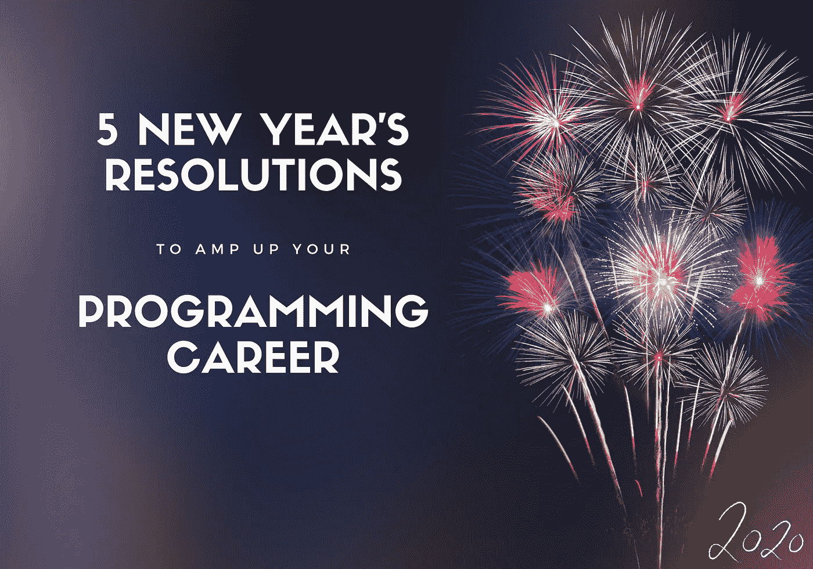
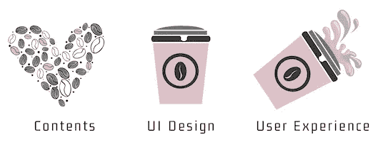
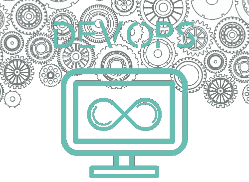
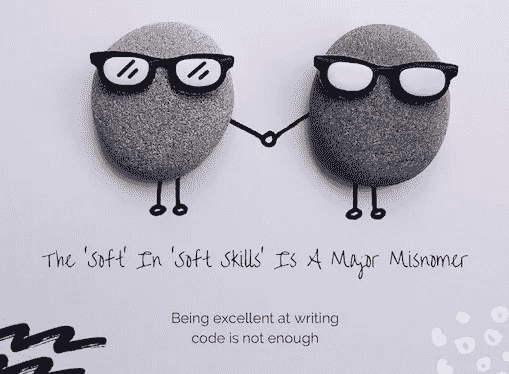

# 提升你的编程生涯的 5 个新年决心

> 原文：<https://towardsdatascience.com/5-new-years-resolutions-to-amp-up-your-programming-career-175c4f9c7068?source=collection_archive---------20----------------------->

## 如何在 2020 年提升你作为开发者的就业能力



1 月 1 日即将到来，伴随着午夜钟声的承诺。有太多的事情需要开始或停止。但有时我们的新年决心中会忽略我们的职业目标。这是非常不明智的，因为工作是我们生活中如此重要的一部分，为了我们的最大利益，我们应该做得更好。

我们应该仔细考虑十年后我们想要达到的目标，并计划🅝🅞🅦如何达到目标。十年的结束是一个很好的时机来反思什么对我们有用或没用，并思考我们可以做什么不同的事情来实现下一个十年的目标。

所以**从编程中休息一下**，在你完全沉浸在同样的旧工作中之前，花一些时间来反思和解决。记住这一点，这里有一些解决办法和一些附带的资源，让你走上新的轨道。

```
**⭐️ Pro Tip:** As you approach this list, do not be vague. Think to yourself: "*What shall I do, by when*". You need to make a plan: [SMART](https://en.wikipedia.org/wiki/SMART_criteria) goals are specific, measurable, achievable, relevant and time bound.
```

让我们一起来看看这个列表:

# — 1:学习软件制作的艺术

让一个程序运行起来并不需要大量的知识和技能。每个人都能做到。让某些东西*工作*并不是一件困难的事情——让它*正确*才是！想象一下你第一次上编程课时写的第一个程序。并与现在进行比较。看看你走了多远？

现在，让我向您介绍设计模式、坚实的原则和软件架构范例的神奇世界，看看您如何将自己定位于编写优雅软件的少数精英，这些软件具有持久性、高内聚和松散耦合，最显著的是易于**理解**、**扩展**和**维护**。

> “建筑是关于重要的东西。不管那是什么。”—拉尔夫·约翰逊

这里有几本你今年应该努力阅读的经典著作:

*   [企业应用架构的模式](https://www.amazon.co.uk/Enterprise-Application-Architecture-Addison-Wesley-Signature/dp/0321127420)
*   [干净的建筑](https://www.amazon.co.uk/Clean-Architecture-Craftsmans-Software-Structure/dp/0134494164)
*   [设计模式:可重用面向对象软件的元素](https://www.amazon.co.uk/Design-patterns-elements-reusable-object-oriented/dp/0201633612)

如果你把心思放在建筑管道上，而不是最新的语言、流行的框架或其他开发时尚上，软件工程会得到更好的服务。我不是说这些不重要；事实上[正好相反](/great-developers-never-stop-learning-77b9ce867eac)！但是如果你想提升你的职业生涯，这是我的第一条建议:把你的精力集中在构建软件上，然后以一种维护成本低的方式开发软件。换句话说:了解软件架构；你的雇主会喜欢你的！

# — 2:关注用户体验

大多数后端开发人员认为 UX(用户体验)设计等同于 UI(用户界面)设计，所以他们认为 UX 是前端开发人员的责任。没有。我将通过“解释”我在“[UX 开发者设计实践](https://www.amazon.co.uk/Hands-Design-Developers-compelling-experiences/dp/1788626699/)”一书中看到的一张图片来解释这种差异。以下是我对此的看法:



UX 设计不仅仅是视觉上的；它关注用户体验的整体感觉，并涉及**整个软件开发生命周期**。软件多久中断一次，你如何向用户提供反馈，界面有多直观，运行一批需要多长时间，响应时间有多短，解决一个问题的上市时间有多长[*是的，这在这里也起作用*。

我和我的团队在与非常难以取悦的银行家和风险经理打交道多年后，艰难地学会了 UX 的五条简单规则:

*   设计软件时让用户参与进来
*   性能和功能一样重要
*   错误消息应该针对用户，而不是开发人员
*   自我导向的用户界面中清晰的导航是最好的
*   质量保证是软件开发不可或缺的一部分

特别是在用户界面设计方面，我推荐你查阅几个资源:101 UX 原则书和 99%不可见播客。

# — 3:做一个有开发意识的开发者

许多程序员认为他们的主要职责是编码，他们认为 DevOps 是一个松散的概念，实际上并不能帮助他们改善现状。这是不正确的，接受 DevOps 可以极大地帮助你的编程生涯。我的建议是从这些基本的 DevOps 技能开始:

## 连续交货

连续交付(CD)是从构建到生产环境中构建、测试、配置和部署软件的过程。为了向您的最终用户交付价值，您必须持续、快速、一致且无误地发布。Atlassian 的 [Bamboo](https://www.atlassian.com/software/bamboo) 是我的首选工具，因为它易于配置，并且开箱即可与吉拉集成。[在这里](https://www.atlassian.com/blog/continuous-delivery/practical-continuous-deployment)你可以找到更多信息。对于一个开源的等价物，试试[詹金斯](https://jenkins.io)。

如果你仍然依赖手工过程来部署你的软件，帮你自己一个忙，停止吧！当你熟悉了[的好处](https://dzone.com/articles/the-benefits-of-continuous-delivery)之后，使用 CD 将是一件轻而易举的事情！

## 测试自动化

软件测试不再仅仅是与项目相关的质量保证(QA)专家的责任。当您持续交付软件时，不可能依赖特别的和手工的测试。我假设你有 TDD(测试驱动开发)的基础知识，所以我鼓励你熟悉几种测试技术和 BDD(行为驱动开发):

*   [软件测试中的经验教训](https://www.amazon.co.uk/Lessons-Learned-Software-Testing-Context-Driven/dp/0471081124)
*   [BDD 在行动](https://www.amazon.co.uk/BDD-Action-Behavior-driven-development-lifecycle/dp/161729165X)

## 应用程序监控

反应式软件补救措施并不理想，因为它们会中断客户服务，所以每个组织都提供了一种 APM(应用程序性能监视器)系统来监控 CPU 使用、磁盘空间、SLA 等。但是作为一名开发人员，您还能引入什么来帮助和补充这项工作呢？监控和分析日志对于跟踪应用程序性能、故障排除、执行根本原因分析、审查系统行为和预测未来中断非常重要。

我建议你关注一下 [Elastic (ELK) stack](https://www.elastic.co) ，因为该公司已经为开源和商业用途整合了可以说是最受欢迎的日志管理平台: *Elasticsearch* 用于深度搜索和数据分析， *Logstash* 用于集中日志记录、日志丰富和解析， *Kibana* 用于强大而漂亮的数据可视化。他们的在线视频是一个很好的切入点。



DevOps 对软件开发产生了重大影响。我们在这里只是触及了表面，但是伴随你的旅程的 DevOps“善良”的伟大资源是 [DZone](https://dzone.com/devops-tutorials-tools-news) 。

# — 4:提高你的人际交往能力

认为开发人员是只独自工作的内向极客的想法已经完全过时了。程序员是团队的一部分，他们每天都与同事、经理和业务用户互动。需要提高的首要能力是**谦逊**。[你可能已经读过我对这个问题的看法了](https://medium.com/free-code-camp/a-first-class-temperament-the-emergence-of-a-star-developer-9321eeb57005):在职业发展方面，技术能力尚可但软技能优秀的程序员比技术大师表现更好！！

这只是成为更好的开发者的一个方面；为了获得更全面的人际交往技巧，我建议你阅读以下两本优秀的书籍:

*   [Peopleware](https://www.amazon.co.uk/Peopleware-Productive-Projects-Teams-3rd/dp/0321934113)
*   [软技能:软件开发人员的生活手册](https://www.amazon.co.uk/Soft-Skills-software-developers-manual/dp/1617292397)



# — 5:了解业务领域

作为一名年轻的工程师，在我曾经工作的环境中，业务分析师(BA)是业务和开发团队之间的联络人，所以我相信如果 BA 能够向我解释需求，我就会编写代码——这在我职业生涯的早期阶段很好。然而，我艰难地意识到，企业并不关心代码！作为软件工程师，我们的工作不是编写代码，而是为公司增加价值(T21)并产生商业影响。

花时间了解企业如何运作是我们工作的一个主要部分，但经常被忽视。没有简单的、放之四海而皆准的答案，因为我们都可能专注于不同的领域，但一个想法是与企业交谈并寻求建议，参加培训课程，甚至寻求商业认证。你的最终目标应该是证明你可以在与企业的讨论中贡献出许多独特而有价值的见解！例如，尝试指出错误的规范，并提出他们接受的替代建议。

> 为了解决一个问题，你必须首先理解这个问题

如果你想从一个程序员进步到开发主管、架构师或项目经理，并获得一席之地，这将对你有极大的帮助！

# 关于下决心

今年你不需要制定太多的计划。你只需要几个对你的编程生涯和心态有积极影响的好例子。我希望这篇文章能激励你以最好的方式开始属于你的一年！

```
📌 **The Statistics behind New Year’s resolutions** The statistics on how many people actually follow through and accomplish their New Year’s resolutions are rather grim. [Research](https://www.forbes.com/sites/kevinkruse/2016/01/03/making-new-years-resolutions-stick/#6a4c4c456903) suggests that approximately half of all Americans make New Year’s resolutions yet only **8%** actually achieve them. Also [according to 'U.S. News'](https://health.usnews.com/health-news/blogs/eat-run/articles/2015-12-29/why-80-percent-of-new-years-resolutions-fail) approximately **80%** of resolutions fail by the second week of February!Ouch! Don’t be part of these statistics!📌 **Make your career resolutions stick**
How can you join this elite few people that pursue their plans and achieve their goals? [Here](https://hbr.org/2014/12/make-your-work-resolutions-stick) is what the Harvard experts say.
```

> 新年快乐——新的十年快乐

🤞祝新年快乐、健康、成功。希望 2020 年，我们所有人都离我们渴望拥有的职业更近一步，成为我们想成为的人。

🙏最后但同样重要的是，让我对今年所有的读者和**[**TDS 团队**](https://medium.com/u/7e12c71dfa81?source=post_page-----175c4f9c7068--------------------------------) 说声**谢谢。这真的是一次很好的聚会，你们都是一个很棒的社区的一部分。****

**感谢阅读！**

***我定期在媒体上撰写关于领导力、技术&的数据——如果您想阅读我未来的帖子，请*[*‘关注’我*](https://medium.com/@semika) *！***