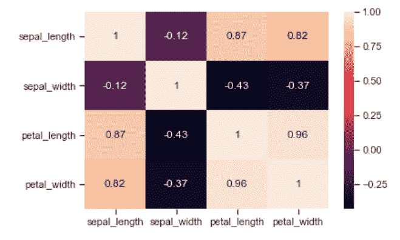

# 数据科学家离不开的 5 个 Python 包

> 原文：<https://towardsdatascience.com/5-python-packages-a-data-scientist-cant-live-without-531566b93c90?source=collection_archive---------21----------------------->


## 介绍性概述

Python 是一种通用语言，因此，它提供了大量的扩展，从科学编程到数据可视化，从统计工具到机器学习。

了解每个可用的扩展几乎是不可能的，但是如果你的任务包括分析数据并在其上建立机器学习模型，那么有几个扩展是至关重要的。

因此，在这篇文章中，我将详述 5 个主要的包，它们将使您的 Python 变得非常通用，它们是:

所以我们开始吧！

# Numpy

Numpy 是一个科学计算包。它允许您执行任何种类的数学和统计操作。特别是(这也是为什么它是机器学习的基础)，它允许你非常快速和容易地执行 N 维计算。任何时候你被要求操作向量和矩阵，你知道你必须使用 Numpy 来达到这个目的。

现在让我们看一些例子。

Numpy 的主要对象是同构多维数组，它可能看起来像向量(如果维度是 n，1)或矩阵(如果维度是 n，m)。让我们创建包含 1，2，3 的第一个数组:

```
import numpy as np
a=np.array([1,2,3])
a

Output: array([1, 2, 3])
```

我们可以用以下方法检查这个数组的一些属性:

```
a.shape
Output: (3,)

a.dtype
Output: dtype('int32')

type(a)
Output: numpy.ndarray
```

我们还可以通过指定组件的数量和形状来初始化数组。也就是说，如果我想创建一个数字从 0 到 11 的 3×4 矩阵，我将写:

```
b=np.arange(12).reshape(3,4)
b

Output: array([[ 0,  1,  2,  3],
       [ 4,  5,  6,  7],
       [ 8,  9, 10, 11]])
```

你也可以把不是数组的对象转换成数组，比如列表。每当你需要计算列表项时，这是非常有用的。假设你想减去这两个列表:

```
list_1=[1,2,3]
list_2=[4,5,6]
list_2-list_1

---------------------------------------------------------------------------
TypeError                                 Traceback (most recent call last)
<ipython-input-11-4c6e19f7626c> in <module>
      1 list_1=[1,2,3]
      2 list_2=[4,5,6]
----> 3 list_2-list_1

TypeError: unsupported operand type(s) for -: 'list' and 'list'
```

如你所见，因为你不能减去两个列表，所以出现了一个错误。但是，如果你使用这个技巧:

```
np.asarray(list_2)-np.asarray(list_1)

Output: array([3, 3, 3])
```

问题绕过了！

# 熊猫

Pandas 提供数据结构和数据分析工具，这些工具对于您的数据进行清理和用于机器学习任务是必不可少的。

pandas 中的主要对象是数据帧，它只是结构化的数据集，可以很容易地修改和访问。您可以创建或导入(从 web、csv 文件、文本文件等)您的数据框架。

让我们从头开始创建一个:

```
import pandas as pd 

data = [['alex', 10], ['tom', 15], ['jim', 14]] 
df = pd.DataFrame(data, columns = ['Name', 'Age']) 

df
```


我们可以访问这个 df 的元素，因为它是一个矩阵:

```
df[:1] #showing only the first row
```


```
df.iloc[:,1] Output: 
0    10
1    15
2    14
Name: Age, dtype: int64
```

熊猫数据框架的所有列都是系列对象:

```
type(df['Age']) 
Output: pandas.core.series.Series
```

我们还可以向数据集追加新列，并设置索引:

```
g=['M','M','M']
df['Gender']=g
df.set_index('Name',inplace=True)
df
```


Pandas 是处理大量数据的基础，因为它还能够总结相关信息(如缺失值、异常值、平均值和频率等)。

```
df.isnull().sum() #for missing values Output: 
Age       0
Gender    0
dtype: int64df.describe()
```


# Matplotlib

Matplotlib 提供了不同的数据可视化工具。它不是 Python 中唯一可用的可视化包，然而它是最直观的，并且能生成非常好的结果。

让我们看看如何绘制不同的图表:

```
import matplotlib.pyplot as plt
import numpy as np

men_means = [20, 34, 30, 35, 27]

x = np.arange(len(labels)) 

fig, ax = plt.subplots()
ax.bar(x - width/2, men_means, width, label='Men')
ax.set_title('Men Means')
```


我们还可以在同一个图表中显示多个条形:

```
import matplotlib
import matplotlib.pyplot as plt
import numpy as np

men_means = [20, 34, 30, 35, 27]
women_means = [25, 32, 34, 20, 25]

x = np.arange(len(labels)) 

fig, ax = plt.subplots()
rects1 = ax.bar(x - width/2, men_means, width, label='Men')
rects2 = ax.bar(x + width/2, women_means, width, label='Women')
ax.set_title('Men and Women Means')
```


现在，让我们用直方图和正态分布图近似来模拟正态随机变量:

```
import matplotlib.pyplot as plt
mu, sigma = 0, 0.1 # mean and standard deviation
s = np.random.normal(mu, sigma, 1000)
count, bins, ignored = plt.hist(s, 30, normed=True)
plt.plot(bins, 1/(sigma * np.sqrt(2 * np.pi)) *np.exp( - (bins - mu)**2 / (2 * sigma**2) ),linewidth=2, color='r')
plt.show()
```


现在想象一下，我们要绘制一个调查结果，让人们说出他们最喜欢的意大利面食。调查的结果是:

```
import matplotlib.pyplot as plt

labels = 'Gnocchi', 'Tortellini', 'Spaghetti', 'Penne'
sizes = [15, 30, 45, 10]
explode=(0,0,0,0)

fig1, ax1 = plt.subplots()
ax1.pie(sizes, explode=explode, labels=labels, autopct='%1.1f%%',
        shadow=True, startangle=90)
ax1.axis('equal')  

plt.show()
```


您也可以使用“爆炸”选项来强调最受欢迎的答案:

```
explode=(0,0,0.1,0)
```


作为一名数据科学家，数据可视化至关重要，因为您总是需要以直观而强大的方式展示您的结果。此外，甚至在开始构建模型之前，相关的图表通常对识别数据中的模式很有用，因此它们可能会建议您应该运行哪种分析。

# sci kit-学习

这可能是机器学习最重要的包，因为它提供了所有的算法，从监督到非监督，从分类到回归。此外，它包括 ROC、MSE R 平方等评估指标，这些指标将在每次算法训练后自动计算。

让我们来看一个非常简单的 ML 任务示例，使用波士顿房价数据集，并尝试仅针对一个变量对价格进行建模，以便我们可以将其可视化。由于这是一项回归任务(目标变量“价格”是连续的)，我们将使用[简单线性回归](/simple-linear-regression-with-python-1b028386e5cd):

```
import pandas as pd 
from sklearn.datasets import load_boston

dataset = load_boston()
df = pd.DataFrame(dataset.data, columns=dataset.feature_names)
df['target'] = dataset.target

df.head()
```


由于我们想要建立一个简单的线性回归(只有一个特征)，我们需要将维数从 13 减少到 1，并且在不丢失相关信息的情况下，我们需要运行一个[主成分分析](/pca-eigenvectors-and-eigenvalues-1f968bc6777a):

```
from sklearn.decomposition import PCA   
pca = PCA(1)    
projected = pca.fit_transform(dataset.data)  
print(dataset.data.shape)  
print(projected.shape) 

Output:
(506, 13)
(506, 1)
```

很好，现在让我们导入并训练我们的模型:

```
from sklearn.model_selection import train_test_split  
X_train, X_test, y_train, y_test = train_test_split(projected, dataset.target, random_state=0)
from sklearn.linear_model import LinearRegression  
lm = LinearRegression()  
lm.fit(X_train,y_train)  
y_pred = lm.predict(X_test)

#let's visualize the results

plt.scatter(X_test, y_test,  color='black')  
plt.plot(X_test, y_pred, color='blue', linewidth=3)  
plt.xticks(())  
plt.yticks(())  
plt.xlabel('First Principal component')  
plt.ylabel('price')   
plt.show()
```


我们还可以要求对我们算法的性能进行“反馈”:

```
from sklearn.metrics import mean_squared_error, r2_score  
print("MSE: {:.2f}".format(mean_squared_error(y_test, y_pred)))  
print("R2: {:.2f}".format(r2_score(y_test, y_pred)))

Output:

MSE: 73.04
R2: 0.11
```

如你所见，用几行代码(不到 2 分钟)我们训练了一个 ML 模型，没有任何手工计算。

# 海生的

和 matplotlib 一样，seaborn 是一个用于数据可视化的 Python 包。然而，它对于统计表示特别有用，并且它返回关于您的数据的更多相关信息。

特别是，它非常方便地显示数据之间可能的相关性:通过 *pairplot()* 和 *heatmap()* 您可以初步了解所有特性(和目标)之间的关系:

```
import seaborn as sns sns.set(style="ticks") 
df = sns.load_dataset("iris") 
sns.pairplot(df, hue="species")
```


```
sns.heatmap(df.corr(),annot=True)
```



我们还可以可视化数据的联合分布(比如，sepal_length 和 sepal_width 这两个特征):

```
sns.jointplot(x='sepal_length',y='sepal_width',data=df,size=5)
```


最后，让我们看看每个物种的萼片长度值的分布:

```
ax=sns.boxplot(x='species',y='sepal_length',data=df) ax=sns.stripplot(x='species',y='sepal_length',data=df,jitter=True,edgecolor='gray')
```


Seaborn 显示相关信息的速度非常快，功能非常强大，如果您正在执行探索性分析，它可能会节省您的大量时间，并为您提供关于最佳算法的线索。

不用说，涵盖这些方案的所有潜力几乎是不可能的。然而，了解哪些是您需要的工具以及如何在您的分析过程中部署它们是很重要的。作为一种良好的实践，请记住，无论您的分析需要何种计算，python 都提供了一种最快、最智能的方法:边做边发现是探索这些工具的一种非常好的策略。

如果您有兴趣了解这些软件包的更多信息，这里有官方文档:

*   [https://numpy.org/](https://numpy.org/)
*   【https://pandas.pydata.org/ 号
*   【https://matplotlib.org/ 
*   [https://scikit-learn.org/stable/index.html](https://scikit-learn.org/stable/index.html)
*   [https://seaborn.pydata.org/index.html](https://seaborn.pydata.org/index.html)

*原载于 2019 年 9 月 4 日*[*http://datasciencechalktalk.com*](https://datasciencechalktalk.com/2019/09/04/5-python-packages-a-data-scientist-cant-live-without/)*。*