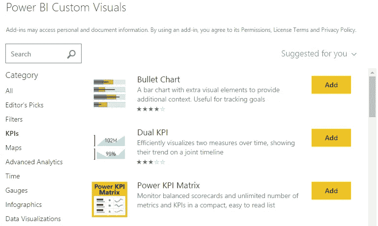
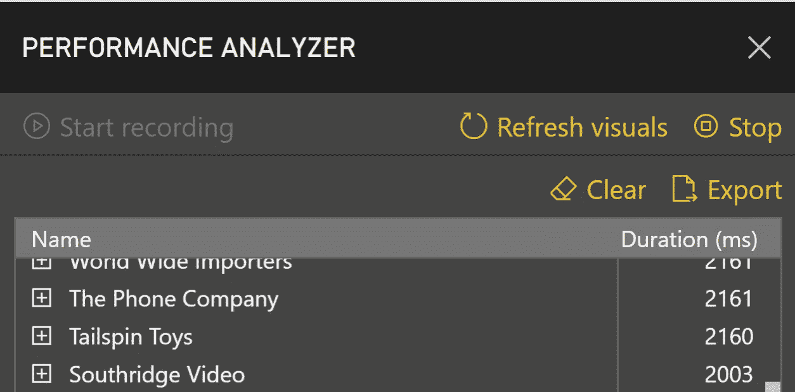

# 加快您的 Power BI 仪表板速度的 5 种快速方法

> 原文：<https://towardsdatascience.com/5-quick-ways-to-speed-up-your-power-bi-dashboard-41af7b46ea25?source=collection_archive---------5----------------------->

Power BI 是一个流行的(免费的)工具，可以根据您的数据创建仪表板。拖放界面使得从头开始构建一个简单的仪表板变得快速而简单。然而，一旦事情变得更加复杂，并且您不断添加小部件，您的仪表板的速度可能会降低到爬行的速度。

尽管有很多方法可以提高你的仪表板的速度，我在这篇文章中列出了 5 个快速修复方法，你可以立即应用来快速提高性能，而无需任何剧烈的改变。

## 1.尽可能使用整数

搜索数字行比搜索字符串要快得多。因此，只要有可能，就使用整数。比如用 0 / 1 值代替“*是/否*”会更好。或者 1/2/3 而不是“*低/中/高*”。而且要注意，因为一个数字不一定是整数。您可以将 1/2/3 作为值，但它们仍然可以被视为字符串。因此，请始终在查询编辑器中检查数据格式。

## 2.移除任何不用的东西

Don’t make your tables look like this, if there is no need to. (image source: [http://sqlserverbi.blog](http://sqlserverbi.blog))

无论是表格、列还是行，如果您没有使用它，它就不应该出现在您的仪表板中。因此，在数据(预处理)过程中，坚持你的仪表板所需要的，其他一切只会降低性能。

## 3.坚持使用默认的 Power Bi 小部件

The Power BI market place.

Power BI marketplace 是一个很好的资源，可以找到令人惊叹的小部件来展示您的见解。即使有时候你别无选择，只能使用它们，如果你有选择的话，我还是建议你坚持使用默认的小部件。如果那个花哨的第三方小部件看起来稍微好一点，但是降低了你的仪表板的速度，你应该问自己这样一个问题:是否值得实现它。我并不是说所有的 marketplace 插件都很慢，但是我做的一些最大的速度提升是通过切换回默认的切片器。

## 4.使用标签

使用选项卡不仅会提高性能，还可能会减少仪表板的拥挤。如果你发现自己被仪表盘上的切片器、图表和卡片弄得不知所措，明智的做法是将它们分成主题/副主题等。并将它们放在不同的选项卡中。通过连接不同选项卡上的过滤器，您可以保留切片器，使选项卡 A 成为过滤器选项卡 B，反之亦然。仪表盘会更快更好看。

## 5.在表格中使用前 N 行

一张大桌子可以让仪表盘爬得最快。每次使用切片器时，表都必须生成并显示数据集中的所有数据。为此，微软增加了方便的“前 n 行”功能。激活后，该表将自己限制为 N 行，而不是显示整个数据集。同样，一个非常简单的干预将产生巨大的改善。

## 衡量就是了解

Power BI’s new feature: The performance analyzer.

微软在其最新(2019 年 5 月)的 Power BI 更新中增加了一项新功能:**性能分析器。**这个新工具可以让您分析仪表板的速度，并指出瓶颈。它的工作原理是记录你使用仪表板时的动作，并为每个小工具的加载时间计时。一旦你停止记录，你会得到一个很好的概览(你可以导出),显示每个小部件的加载持续时间。

同样，除了这 5 种提高速度的快速方法，你还可以在这里找到许多其他的选择。但是在你开始实施更激烈的措施之前，我建议你先试试下面 5 个建议中的一个。

**关于作者** *:我叫 Bruno，是总部位于荷兰的人工智能技术纵向扩展公司*[*dash mote*](http://www.dashmote.com)*的数据科学家。我们的目标是借助基于人工智能的解决方案，弥合图像和数据之间的鸿沟。
查看我在* [上的其他作品 https://www.zhongtron.me](https://www.zhongtron.me) 。