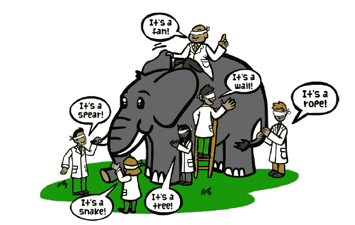
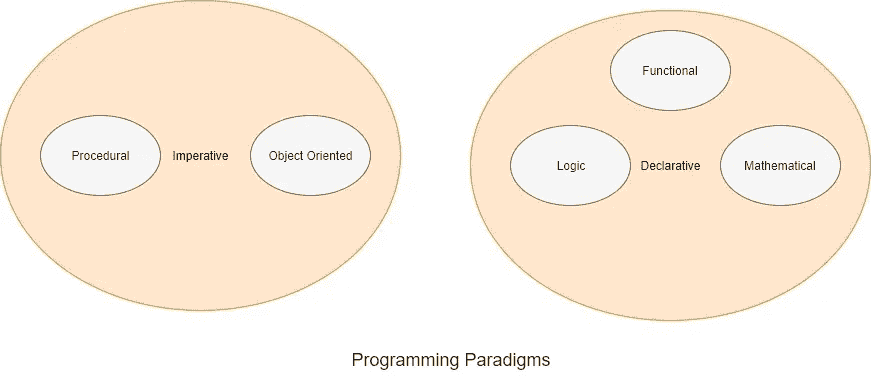

# 2020 年学习新编程语言的 5 个理由

> 原文：<https://towardsdatascience.com/5-reasons-to-learn-a-new-programming-language-in-2020-bfc9a4b9a763?source=collection_archive---------8----------------------->

## 学习一门新的编程语言，在新的一年里提升你的职业和技能

Photo by [Clément H](https://unsplash.com/@clemhlrdt?utm_source=unsplash&utm_medium=referral&utm_content=creditCopyText) on [Unsplash](https://unsplash.com/s/photos/programming?utm_source=unsplash&utm_medium=referral&utm_content=creditCopyText)

李小龙曾有一句名言:“我不怕练过一万次踢腿的人，但我怕练过一万次踢腿的人”。在 2020 年，你是需要学习一门新的编程语言，还是需要像李小龙所说的那样，继续学习你已经掌握的语言？像许多其他问题一样，答案是:**看情况**。

如果你刚刚开始学习你的第一门编程语言，那么我建议你先正确地学习这门语言。但是如果你已经很好地掌握了一门语言，或者你是一个经验丰富的软件开发人员，已经掌握了不止一门编程语言，那么我建议你明年学习一门新的语言。

学习一门新的编程语言是有代价的。它需要你大量的时间、精力和大脑循环。仍然学习一门新的语言可以直接或间接地给你带来显著的好处。

在这里，我列出了如果你学习一门新的编程语言，你可以拥有的五个主要优势:

# 更大的画面

Source: [The Blind Elephant](http://www.theblindelephant.com/the_blind_elephant_fable.html)

在现代，编程语言领域是巨大的、多样的和复杂的。通常，一种编程语言只涵盖编程语言领域的一小部分。有一个著名的故事，盲人只触摸大象的一部分，并以他们的方式解释大象，例如，有人触摸大象的尾巴，并解释大象像一根绳子。编程语言也是如此。

以下是主流编程语言范例:

在一个范例中，还有许多子范例。通常，一种编程语言专注于一种范式(例如， **C 是过程式的，Haskell 是函数式的**)。也有许多语言触及了多范例，尽管不是 100%(例如 Java 是面向对象的，部分是函数式的)。

学习一门新的编程语言会让你对编程语言有更全面的了解。像任何其他领域一样，有一个更大的画面通常是有帮助的，并给你一个额外的优势。

# 适合的

Photo by [**Egor Kamelev**](https://www.pexels.com/@ekamelev?utm_content=attributionCopyText&utm_medium=referral&utm_source=pexels) from [**Pexels**](https://www.pexels.com/photo/macro-shot-photography-of-chameleon-751689/?utm_content=attributionCopyText&utm_medium=referral&utm_source=pexels)

在过去快乐的日子里(例如上个世纪)，开发人员的生活很简单。在那个年代，你可以学一门主流编程语言，然后工作一辈子。

但是在现代，软件开发人员的生活更加充满活力。**随着微服务的兴起，多语言编程是一种常态**现在反而是例外。

你可能需要在工作或项目中学习一门新的语言。人脑在**迁移学习**方面表现出色。如果你已经了解 Haskell/Scala，你可以快速学习其他函数式编程语言。如果你学习了现代语言中的一种，例如 Kotlin，那么你可以快速学习其他类似的现代语言(例如 TypeScript)。

如今，甚至前端 web 框架也使用不同的编程范例。因此，如果你已经了解 Scala/Haskell，那么你可以学习前端框架 React 比其他框架更快，因为 React 大量使用函数式编程的概念。

通常，公司希望用新的软件栈来探索新的软件开发。如果你已经知道编程语言，你可以很容易地抓住机会，加入更新，更酷的项目。

# 更大的工具箱

Photo by [Todd Quackenbush](https://unsplash.com/@toddquackenbush?utm_source=unsplash&utm_medium=referral&utm_content=creditCopyText) on [Unsplash](https://unsplash.com/s/photos/tool?utm_source=unsplash&utm_medium=referral&utm_content=creditCopyText)

如果你只知道如何操作一种工具，例如锤子，那么你会在每一种不是合适工具的情况下都尝试使用锤子。软件开发人员也是如此。

作为人类，我们都想呆在自己的舒适区内。因此，我们希望坚持我们已经知道的编程语言，并希望在每个地方使用它们。我见过许多只懂一种编程语言(例如 Java 或 JavaScript)的开发人员，他们试图在所有用例中使用它们。

学习一门新的编程语言将增强你的工具集，让你成为一名更好的开发者。

# 全栈软件开发之路

Source: [dev.to](https://res.cloudinary.com/practicaldev/image/fetch/s--Agre4wRc--/c_limit%2Cf_auto%2Cfl_progressive%2Cq_auto%2Cw_880/https://www.peerbits.com/wp-content/uploads/2018/11/hiring-full-stack-developers-make-main.jpg)

随着微服务架构的兴起，对全栈开发者的需求只会越来越大。我写过一篇关于微服务架构最佳实践的博文:

 [## 有效的微服务:10 个最佳实践

### 正确实施微服务架构的 10 个技巧

towardsdatascience.com](/effective-microservices-10-best-practices-c6e4ba0c6ee2) 

在那篇文章中，我提到过微服务架构需要跨职能团队。如果一个团队有两个只能编写前端代码的开发人员和两个只能编写后端代码的开发人员，那么这个团队就不够灵活。由于前端和后端开发人员并行工作，团队的进展将受到阻碍，例如，当前端或后端开发人员都无法工作时。团队将处于一个更好的位置，因为很少有全栈开发人员可以在栈之间切换。

此外，该公司将愿意支付额外的工资给一个完整的堆栈开发人员。

现在，学习另一种编程语言不会使你成为一个全栈开发人员。但它将对您成为全栈开发人员有很大帮助。

# 职业发展

Photo by [Jamie Saw](https://unsplash.com/@jsclick?utm_source=unsplash&utm_medium=referral&utm_content=creditCopyText) on [Unsplash](https://unsplash.com/s/photos/stair?utm_source=unsplash&utm_medium=referral&utm_content=creditCopyText)

如果你想爬上职业阶梯，也就是说，如果你想成为一名**软件架构师或解决方案架构师**，那么你不仅要有更深的专业知识，还要有更广的专业知识。在软件架构师的角色中，您应该对整个堆栈做出设计决策，而不仅仅是后端或前端。

从前，有一些“象牙塔”架构师，他们可以在不知道动手编码的情况下为一个项目设计软件架构。但是公司越来越多地寻找会编码的软件架构师。

如果你是一个软件架构师，可以用多种编程语言编码，可以和开发者交流，那么开发者会对你更加尊重。

同样，通往软件架构师或解决方案架构师的道路需要许多其他技能。但是如果你想成为一名软件架构师/解决方案架构师，学习新的编程会对你有所帮助。

如果你觉得这很有帮助，请分享到你最喜欢的论坛( **Twitter，LinkedIn，脸书**)。

如果你对编程语言感兴趣，也可以看看我下面的文章:

 [## 2020 年最受欢迎的 10 种编程语言

### 针对求职者和新开发人员的顶级编程语言的深入分析和排名

towardsdatascience.com](/top-10-in-demand-programming-languages-to-learn-in-2020-4462eb7d8d3e)  [## 现在要学习的 7 种现代编程语言

### Rust、Go、Kotlin、TypeScript、Swift、Dart、Julia 如何促进您的职业发展并提高您的软件开发技能

towardsdatascience.com](/top-7-modern-programming-language-to-learn-now-156863bd1eec)  [## 回归金属:2019 年开发大数据框架的 3 大编程语言

### C++，Rust，用 Java 做数据密集型框架

towardsdatascience.com](/back-to-the-metal-top-3-programming-language-to-develop-big-data-frameworks-in-2019-69a44a36a842)