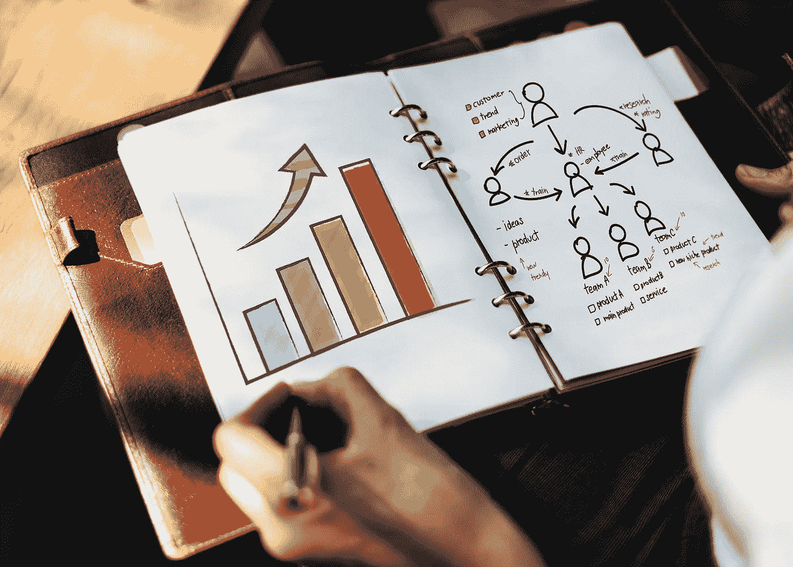

# 开始学习数据科学

> 原文：<https://towardsdatascience.com/5-reasons-why-everybody-can-and-should-learn-data-science-c22e3bc96299?source=collection_archive---------34----------------------->

## 为什么每个人都可以并且应该学习数据科学的 5 个理由。

数据科学家正式成为 21 世纪最性感的工作。数据科学家收入丰厚，工作生活平衡良好，他们解决的问题足够有趣，足以让任何人坚持下去。如果这还不足以让人们对这个领域感兴趣，那么还有更进一步的原因。

1.  数据科学将帮助你完成当前工作中的日常任务。

即使你不是正式的数据科学家，但拥有一些数据科学技能，你在办公室的生活也会变得容易得多。当你的老板给你带来一份去年的销售清单，而不是逐行滚动时，你写几行代码，带来一份 2018 年发生的 100，00 0，00 0 笔销售的摘要。更好的是，在快速午餐和分析你告诉老板的数据后，你实际上可以预测下一年最大的销售额将在什么时候发生。此外，凭借您新获得的数据科学技能，您可以自动化您在办公室中做的大多数日常工作。这样，你将有更多的时间学习最新的机器学习算法及其应用，而不是做无聊的重复工作。

**2。数据科学是多学科的，无处不在。**

不管你现在在做什么，我可以向你保证，你可以将数据科学应用于其中。目前，人工智能被用于预测股票价格，发现罕见疾病，分析图像，预测评论的情绪或总结在线评论。我们创造自动语音识别系统、自动驾驶汽车和对话代理。当谈到数据科学时，天空是无限的，它可以应用于工作或生活的任何领域。

**3。数据科学可能很艰难，但却很有价值。**

天空是无限的，但旅程的起点是学习基础数据科学，它没有你想象的那么难。大多数人没有开始这个旅程，因为他们认为他们没有足够的数学背景，他们没有做过统计，或者他们不会写一行代码。尽管这是数据科学家的基本技能，但这些都是可以学习的，基本上不需要任何先验知识。你需要的是学习的意愿和决心。好消息是，一旦你开始了你的旅程，你会马上运用你的技能。只需几行代码，你就能分析数据集，做出令人印象深刻的图表和可视化。一旦你发现你可以用这么少的努力做什么，你就会有动力去学习更复杂的算法，这将帮助你解决更复杂的问题。这会让你保持动力，一旦你开始这个旅程就很难停止。数据科学会让人上瘾，学习永远不会停止。

**4。如今的数据科学很容易学习。**

此外，如果你看看关于该主题的在线课程、教程和视频的数量，就没有理由不学习数据科学。有了这些信息，你甚至不需要传统的书籍和正规的教育。还有一些训练营可以帮助你在短时间内成为一名数据科学家。他们选择所有材料，并设计您作为初学数据科学家将采取的学习路径。如果你选择其中一个或者以自学的方式进行，你就不会抱怨缺乏资源或帮助。

**5。数据科学会让你成为一个更好的全面发展的人。**

如果你正在考虑过渡到数据科学，你会注意到，利用你学到的技能，你将从不同的角度看待同样的问题。运用数学、统计和算法的观点将帮助你看到问题的另一面，提出解决方案并测试它。数据科学家解决的问题的复杂性不仅会在专业层面上锻炼你的大脑，改变你的思维，还会让你成为一个更全面的人。

*PS:你正在阅读这篇文章，所以你的数据科学之旅已经开始或即将开始。我祝你一切顺利，如果你喜欢这篇文章，不要不好意思留下评论。我的数据科学博客之旅现在就要开始了，我希望我们能一起走这条路……*

*原载于 aboutdatablog.com:* [每个人都可以而且应该学习数据科学的 5 个理由](https://www.aboutdatablog.com/post/start-learning-data-science)，*2019 年 10 月 10 日。*

*PS:我正在 Medium 和*[***aboutdatablog.com***](https://www.aboutdatablog.com/)*上撰写深入浅出地解释基本数据科学概念的文章。你可以订阅我的* [***邮件列表***](https://medium.com/subscribe/@konkiewicz.m) *以便在我每次写新文章时得到通知。如果你还不是中等会员，你可以在这里加入***。**

*下面还有一些你可能喜欢的帖子*

* [## python 中的 lambda 函数是什么，为什么你现在就应该开始使用它们

### 初学者在 python 和 pandas 中开始使用 lambda 函数的快速指南。

towardsdatascience.com](/what-are-lambda-functions-in-python-and-why-you-should-start-using-them-right-now-75ab85655dc6)  [## Jupyter 笔记本自动完成

### 数据科学家的最佳生产力工具，如果您还没有使用它，您应该使用它…

towardsdatascience.com](/jupyter-notebook-autocompletion-f291008c66c)  [## 当你开始与图书馆合作时，7 个实用的熊猫提示

### 解释一些乍一看不那么明显的东西…

towardsdatascience.com](/7-practical-pandas-tips-when-you-start-working-with-the-library-e4a9205eb443)*