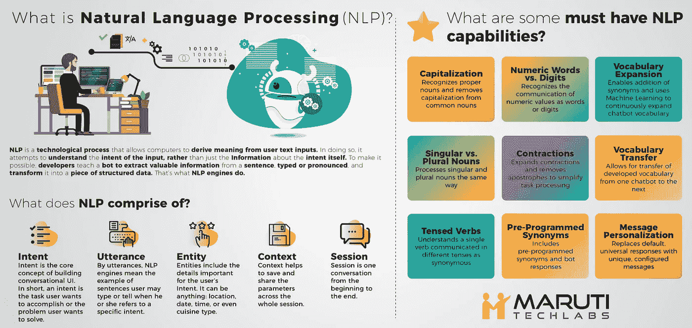
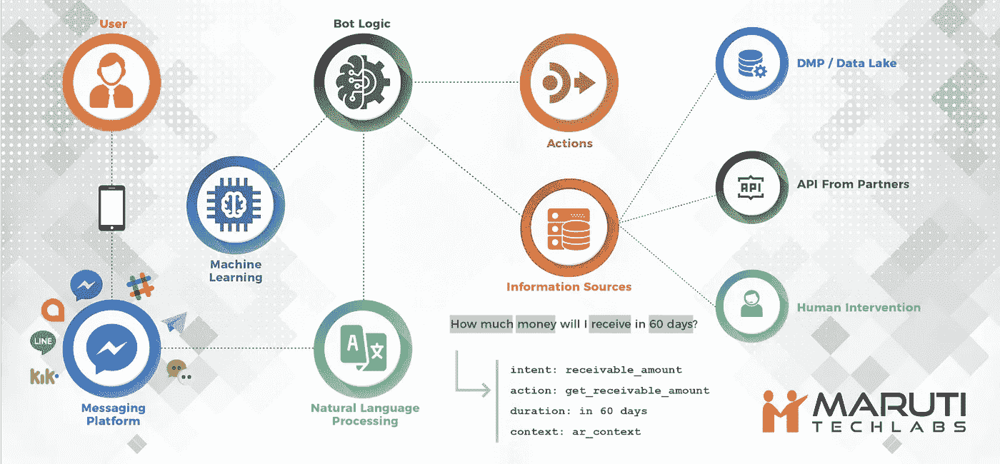
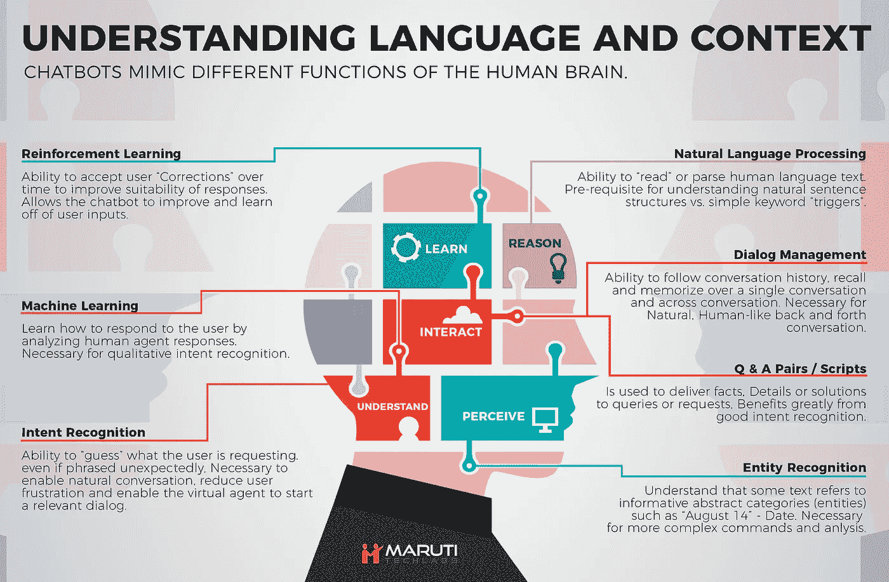

# 你的聊天机器人需要自然语言处理的 5 个原因

> 原文：<https://towardsdatascience.com/5-reasons-why-your-chatbot-needs-natural-language-processing-ed20fb0a3655?source=collection_archive---------6----------------------->

随着聊天机器人的出现和崛起，我们开始看到它们利用人工智能——特别是机器学习——来大规模完成实习生或退伍军人团队无法完成的任务。更好的是，企业现在能够通过用冷数学分析对话来获得洞察力。

> 然而，仍然有相当多的人每次与机器人交谈时都会有一种共同的情绪— ***“它不明白我在说什么。”***

**这就是自然语言处理发挥作用的地方。**在合适的应用环境中，NLP 可以为更易于使用的功能和服务界面铺平道路。但更重要的是，基于 NLP 的聊天机器人可以让屏幕另一边的终端用户知道他们正在进行对话，而不是通过有限的选项和菜单来达到他们的最终目标。

# 什么是自然语言处理(NLP)？

自然语言处理基于深度学习，使计算机能够从用户的输入中获取意义。在机器人的情况下，它评估用户输入的意图，然后根据类似于人类的上下文分析做出响应。

假设你有一个[聊天机器人用于客户支持](https://wotnot.io/)，很有可能用户会试图问一些超出机器人范围的问题，然后扔掉它。这可以通过设置默认响应来解决，但是，要预测用户可能会问什么样的问题或者会以什么样的方式提问是不可能的。

当谈到自然语言处理时，开发人员可以训练机器人进行多种交互和对话，并提供它将接触到的内容的多个示例，因为这往往会给它提供一个更广泛的基础，使它可以更有效地进一步评估和解释查询。

因此，虽然训练机器人听起来是一个非常乏味的过程，但结果是非常值得的。[苏格兰皇家银行在其聊天机器人中使用 NLP](https://www.finextra.com/newsarticle/30513/rbs-gives-ai-a-helping-hand-with-hybrid-bots)通过文本分析来增强客户体验，以多种形式解读客户反馈的趋势，如调查、呼叫中心讨论、投诉或电子邮件。这有助于他们确定客户不满意的根本原因，并据此帮助他们改进服务。

# 实现 NLP 的最佳方法是什么？

实现 NLP 的最佳方法是混合机器学习和最大化结果的基本含义。机器学习只是许多 NLP 平台的核心，然而，基本含义和机器学习的融合有助于制造高效的[基于 NLP 的聊天机器人](https://www.marutitech.com/nlp-based-chatbot/)。

机器语言用于训练机器人，这导致它不断学习自然语言处理(NLP)和自然语言生成(NLG)。ML 和 FM 都有自己的优点和缺点。这两种方法的最佳特性对于解决现实世界的业务问题都是理想的。

***基于自然语言处理的机器人需要做的是:***

***1。通过准确的解释减少假阳性结果。***

***2。使用统计建模识别用户输入失败并解决冲突。***

***3。使用全面的沟通来获得用户响应。***

***4。更快地学习以解决发展差距。***

***5。通过较少的训练数据输入实现自然语言能力。***

***6。能够将输入的培训数据重新用于未来的学习。***

***7。为误报提供简单的纠正措施。***

# NLP 引擎能做什么？

NLP 引擎广泛使用机器学习来解析用户输入，以便提取必要的实体并理解用户意图。具有自然语言处理功能的聊天机器人可以分析多种用户意图，从而最大限度地减少失败。

## **一、意图识别**

通过聊天机器人的用户输入被分解，并通过几个词编译成用户意图。例如，“搜索西雅图提供深盘玛格丽塔的比萨饼角落”。

NLP 通过理解单词的含义、位置、变化、复数以及人类语音可能具有的许多其他因素来分析完整的句子。因此，它将完整的句子或段落分解为更简单的句子，如搜索 pizza，然后是语音中的其他搜索因素，以更好地理解用户的意图。

## **二。处理实体**

实体可以是与日期、时间、地点、位置、描述、单词的同义词、人、项目、数字或指定对象的任何东西相关的字段、数据或单词。聊天机器人能够识别用户的单词，匹配可用的实体或收集完成任务所需的额外实体。

## **三世。名词的大写**

NLP 使聊天机器人能够从普通名词中删除大写，并从语音/用户输入中识别专有名词。

## **四世。扩展&词汇的迁移**

NLP 使机器人能够不断添加新的同义词，并使用机器学习来扩展聊天机器人的词汇，同时还可以将词汇从一个机器人转移到下一个机器人。

## **动词的时态**

人工智能聊天机器人通过时态来理解动词的不同时态和变化。

## **六。收缩**

具有 NLP 的机器人可以扩展缩写，并简化删除单词间撇号的任务。

除此之外，支持 NLP 的机器人还拥有许多功能，如文档分析、机器翻译、区分内容等等。

**NLP 引擎依赖以下元素来处理查询—**

**意图** —构建对话式用户界面的核心概念，它被确定为用户想要实现的任务或用户希望解决的问题陈述。

**话语** —用户可以作为聊天机器人的输入给出的各种不同的句子实例，就像他们提到一个意图一样。

**实体** —它们包括与用户意图相关的所有特征和细节。这可以包括位置、日期、时间等。

**上下文** —这有助于在整个用户会话中保存和共享不同的参数。

**会话** —这基本上涵盖了用户对话的起点和终点。

市场上有许多 NLP 引擎，从[谷歌的](https://dialogflow.com/)对话流(以前称为 API . ai)[wit . ai](https://wit.ai/)、[沃森对话服务](https://www.ibm.com/watson/services/conversation/)、 [Lex](https://aws.amazon.com/lex/) 等等。有些服务提供一体化解决方案，而有些则专注于解决单一问题。

其核心，自然语言处理的关键在于理解输入，并将其翻译成计算机之间可以理解的语言。从话语中提取意图、参数和主要上下文，并将其转换为结构化数据，同时调用 API 是 NLP 引擎的工作。

# 为什么你的聊天机器人需要自然语言处理？

有许多不同类型的聊天机器人，用于各种目的，如常见问题解答、客户服务、虚拟帮助等等。没有 NLP 的聊天机器人主要依赖于预先输入的静态信息&自然不太能处理人类语言，这些语言在表达每个特定查询时会有情感、意图和情绪的变化。

让我们来看看你的聊天机器人应该有 NLP 的 5 个理由:

# **1。跨语言的自然对话**

预输入静态内容方法的问题是，语言在表达特定语句时有无限多的变化。用户可以用无数种方式来表达一种情绪。研究人员花了很长时间努力让系统解释人类的语言。

通过 NLP，可以在人类输入的文本和系统生成的响应之间建立联系。这种响应可以是任何事情，从对查询的简单回答、基于客户请求的动作或者将来自客户的任何信息存储到系统数据库。

> NLP 可以区分人类生成的不同类型的请求，从而大大增强客户体验。

**(a)** 基于自然语言处理的聊天机器人能够智能地理解语言语义、文本结构和语音短语。因此，它使您能够分析大量的非结构化数据，并使之有意义。

**(b)** NLP 能够理解跨语言的语素，这使得机器人更有能力理解不同的细微差别。

NLP 赋予聊天机器人理解和解释俚语的能力，并像人类一样不断学习缩写，同时通过情感分析理解各种情绪。

# **2。关注关键任务**

通常，为了使一个组织发挥作用，需要部署许多不同的角色和资源，但是，这需要在不同的垂直领域重复手动任务，如客户服务、人力资源、目录管理或发票处理。[基于 NLP 的聊天机器人大大减少了客户服务](https://www.marutitech.com/artificial-intelligence-for-customer-service-2/)或发票处理等操作中的人力，因此这些操作需要的资源更少，员工效率更高。

现在，员工可以以更具创造性的方式专注于任务关键型任务和对业务产生积极影响的任务，而不是每天在单调重复的任务上浪费时间。您可以使用基于 NLP 的聊天机器人进行内部使用，尤其是人力资源和 IT 服务台。

# **3。降低成本**

成本核算是任何企业发展和提高盈利能力的一个重要方面。基于 NLP 的聊天机器人可以极大地帮助降低与重复性任务中的人力和其他资源相关的成本以及客户保留成本，同时提高效率和简化工作流程。

# **4。更高的客户满意度**

今天的千禧一代希望他们的问题能够得到即时响应和即时解决方案。NLP 帮助聊天机器人理解、分析问题，并根据问题的复杂性对其进行优先排序&这使得机器人能够比人类更快地响应客户的查询。更快的响应有助于建立客户信任，进而带来更多业务。

使用聊天机器人后，您将体验到客户保持率的提高。它通过增加现有客户的忠诚度来减少每次获得新客户的努力和成本。聊天机器人给予顾客他们想要的时间和注意力，让他们感到重要和快乐。

# **5。市场调查与分析**

仅仅从社交媒体上，你就可以获得或生成大量多样的、非结构化的内容。NLP 有助于结构化非结构化内容并从中提取意义。您可以轻松理解客户评论、意见、评论或疑问背后的含义或想法。你可以一瞥用户对你的服务或品牌的感受。

# 结论

基于 NLP 的聊天机器人可以帮助增强您的业务流程，将客户体验提升到新的水平，同时还可以提高整体增长和盈利能力。它提供了保持市场竞争力的技术优势——节省时间、精力和成本，从而进一步提高客户满意度和业务参与度。

尽管自然语言处理，NLU 和 NLG 并不完全等同于人类的语言理解，考虑到它的微妙之处和对上下文的依赖；[一个智能聊天机器人](https://www.marutitech.com/make-intelligent-chatbot/)可以很好地模仿这种理解和分析水平。在半受限的环境中，当评估用户的目标&时，机器人可以很好地执行，以自助交互的形式完成所需的任务。

虽然 NLP 本身是关键，不能创造奇迹或确保聊天机器人有效地响应每一条消息，但它对聊天机器人的成功用户体验至关重要。

当在人工智能和基于规则的机器人之间做出决定时，有许多因素需要考虑。在[马鲁蒂科技实验室](https://www.marutitech.com)，我们为不同行业的不同用例，大规模地开发了这两种聊天机器人。如果你想了解更多或有任何问题，请在 hello@marutitech.com[给我们留言——我们很乐意聊天。](mailto:hello@marutitech.com)