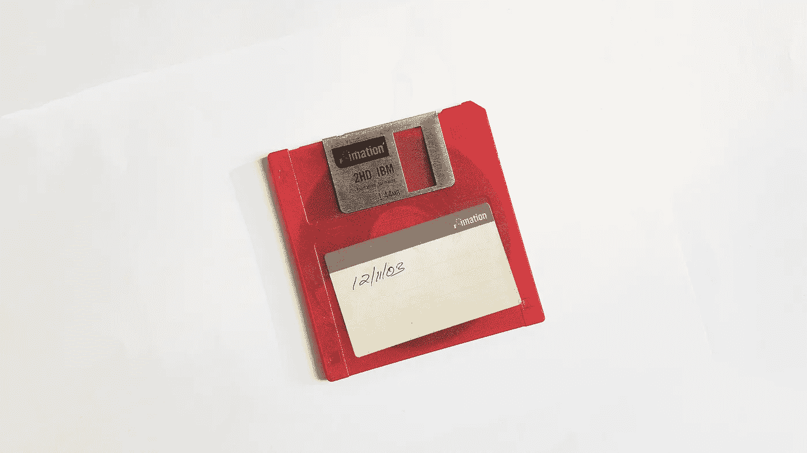

# 您需要更好的数据管理解决方案的 5 个理由

> 原文：<https://towardsdatascience.com/5-reasons-you-need-a-better-data-management-solution-df3ad74a1a2b?source=collection_archive---------22----------------------->

祝贺你。这需要时间，但你是数据驱动型的。你有数据科学家来处理数据，有一个储存充足的数据湖，还有分析师来澄清这一切。但是，即使基础设施到位，从数据中获益也不像按动开关那么容易。如今，企业还没有正确管理他们的数据。

因此，他们问自己一个新问题:

## ***如何将海量数据转化为真知灼见？***

# 成为“数据第一”的公司

2018 年 8 月 29 日，[*ThinkData Works*](https://www.thinkdataworks.com)CEO[Bryan Smith](https://www.linkedin.com/in/bryan-smith-68282122/?originalSubdomain=ca)在滑铁卢**Communitech 做了一场关于“数据优先”公司的演讲。首先投资于数据并正在改变业务格局的组织。众所周知，苹果在 2018 年 8 月 2 日达到了[万亿美元的估值](https://www.cnbc.com/2018/08/02/apple-hits-1-trillion-in-market-value.html)，史密斯预测亚马逊也不远了。一万亿英里的竞赛类似于 4 分钟一英里:一旦一个人打破了它，我们将看到许多其他公司开始打破它。**

**六天后，亚马逊 [**击中了那个标志**](https://money.cnn.com/2018/09/04/technology/amazon-1-trillion/index.html) 。**

***但受益于数据优先的不仅仅是大型企业*；数据有无数的机会为企业和客户增加价值。**

**无论您是刚刚开始开发数据能力，还是多年来一直关注数据能力，成为数据第一公司都不仅仅是基础设施。**

**这是关于制定最好的游戏计划。**

**在 Communitech，Smith 概括了五种方法，每个组织都可以最大限度地提高其使用的数据的数量、质量和价值。**

# ****以下是您需要更好的主数据管理策略的五个原因。****

## **1.共享数据必须既安全又简单。**

****

**大多数公司内部共享数据的方式存在许多问题。安全问题是重中之重。用电子邮件发送电子表格是不负责任的，尤其是当它们包含敏感信息时，但这仍然是许多公司共享数据的方式。如果下周电子表格中的数据发生变化，你必须重新做一遍。**

**在发布信息的多种方式中，无论你是使用拇指驱动器还是 Dropbox，都存在问题。管理权限，保持数据更新，这样的例子不胜枚举。**

***那么，成功且负责任的数据管理的关键是什么呢？***

**它正在寻找一种安全共享数据的方法，维护最新版本，并为用户设置特定的访问和控制权限。轻松完成这一切是高效数据团队的关键。**

## **2.外部数据是一个不容错过的好机会。**

**我们不需要解释外部数据的价值。在组织之外创建的数据有助于提供独特的见解，让您获得竞争优势。问题是，在您的组织之外创建的数据也是在您的组织之外创建的。查找、连接和规范化来自外部来源的数据对您的团队来说是一种压力，随着您连接到每个新的来源，这种压力会呈指数级增长。**

**数据的价值和可用性意味着每个人都应该连接更多而不是更少的数据。组织和个人应该能够访问一个数据市场，该市场以他们想要的格式提供所有外部数据源。数据 [**市场**](https://app.namara.io/) 是一个数据管理解决方案，在拥有数据和利用数据之间架起了一座桥梁。**

## **3.你的数据科学家被铐上了。**

****

**与顶尖的数据科学家一起工作，却不明白为什么他们没有创造出令人惊叹的东西？不是他们，是你的数据。数据科学家 80%的时间都被他们工作中最琐碎的事情占据了——获取数据并使其可用。他们大约有五分之一的时间花在查找数据上，而 60%的时间花在清理、组织、格式化和整理数据上。**

**这不是他们进入数据科学的原因。**

**如果没有数据管理解决方案，他们的时间就会被“脏活累活”所占据，而不是利用数据来帮助您发展业务。**

****数据科学家只有 20%的时间是数据科学家。****

****

*****And we have to imagine that screaming into a pillow is at least 1% from the ‘Other’ segment. Data from*** [***Forbes***](https://www.forbes.com/sites/gilpress/2016/03/23/data-preparation-most-time-consuming-least-enjoyable-data-science-task-survey-says/#1446fc286f63)***.*****

## **4.只有 0.5%的数据被使用。**

**麻省理工科技评论 发表了这个统计数据，它真的让我们大吃一惊。但事实是，在每天创建的 2.5 数据中，只有很小一部分得到了利用。**

**将数据转换成有意义的东西很难。尽管有大量的数据和对其洞察力的渴望，有效使用内部和外部数据的障碍使得使用大量数据变得非常困难。**

*****实际上，这意味着对于大多数公司来说，他们连接的唯一数据是:*****

1.  ***最低挂的水果，或***
2.  **对他们的成功至关重要的东西。**

***这意味着利用数据进行创新，或者开发模型并进行试验超出了*的范围。**

****为了获得数据的优势，我们不能吝啬。****

*****为什么？*****

## **5.1.8 万亿美元。**

****

**这就是原因。**

**据 Forrester 称:“到 2021 年，洞察驱动的业务将从非洞察驱动的竞争对手那里每年窃取 1.8 万亿美元**

**当心“偷”这个词为了竞争，企业将不得不大幅增加他们使用的数据量。**

**把你的数据放在湖里真是太好了。*现在该拿出来了。***

***我最近的一些帖子，希望你能看看:***

**[你的数据准备好 AI 了吗？](/is-your-data-ready-for-ai-dfa3e318fc09)**

**[开放数据和公开数据有区别吗？](http://Is There a Difference Between Open Data and Public Data?)**

***原载于*[*https://blog.thinkdataworks.com*](https://blog.thinkdataworks.com/better-data-management-solution)*。***

*****连接***[***ThinkData 作品***](https://www.thinkdataworks.com/) ***上***[***Namara***](https://app.namara.io/)***app，或者*** [***这里联系我们***](https://www.thinkdataworks.com/contact) ******