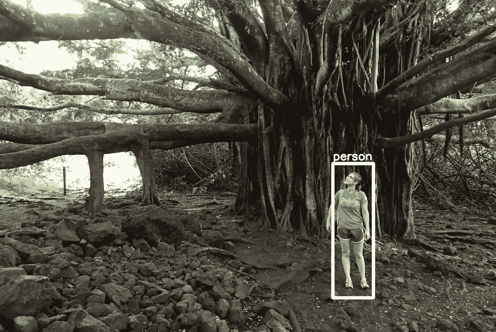
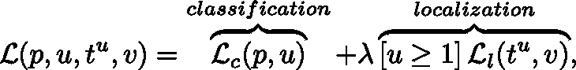
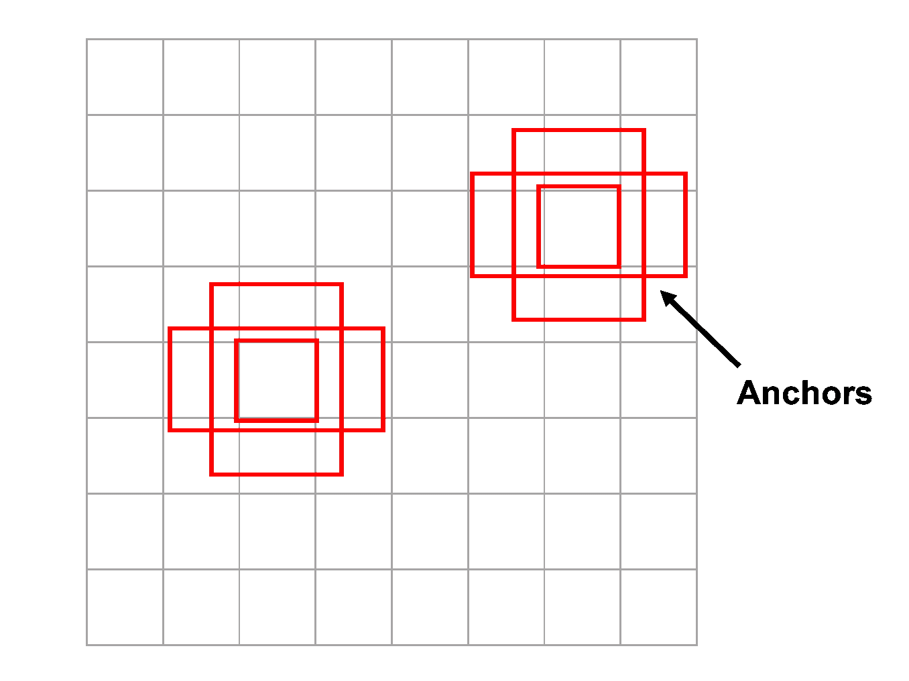
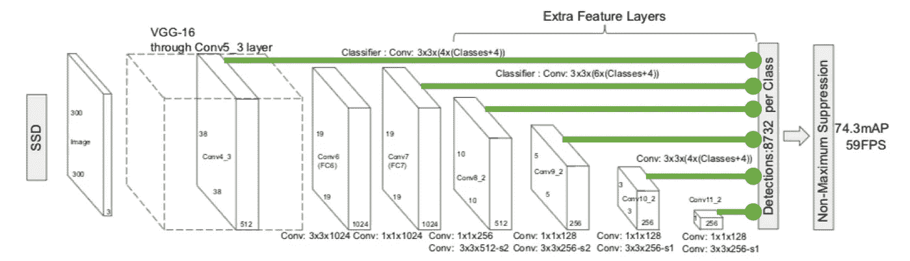
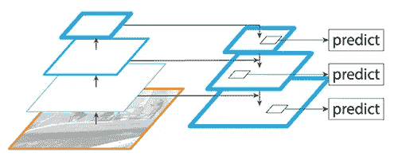
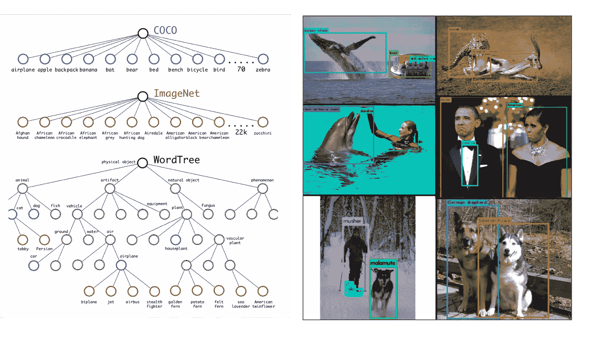
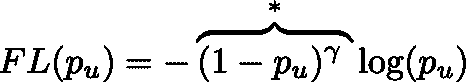

# 5 大物体检测挑战和解决方案

> 原文：<https://towardsdatascience.com/5-significant-object-detection-challenges-and-solutions-924cb09de9dd?source=collection_archive---------1----------------------->

## 回顾对象检测问题提出的独特挑战和研究人员克服这些障碍的努力

Personal photo processed with YOLOv2\. Author at Haleakalā National Park.

计算机视觉领域最近经历了实质性的进展，这主要归功于深度学习，特别是卷积神经网络(CNN)的进步。在图像分类中，计算机根据图像的内容对图像进行分类或分配标签，只需利用预先训练的神经网络并微调最后几个吞吐量层，通常就可以看到很好的结果。

分类*和*然而，就在几年前，在一幅图像中找到未知数量的单个物体还被认为是一个极其困难的问题。这项被称为物体检测的任务现在已经可行，甚至已经被像**和 [**IBM**](https://www.ibm.com/watson/services/visual-recognition/) 这样的公司产品化。但是所有这些进步都来之不易！物体检测提出了许多超出图像分类所需的相当大的挑战。在简单介绍了这个主题之后，让我们深入探讨这些问题带来的几个有趣的障碍以及各种新兴的解决方案。**

# **介绍**

**物体检测的最终目的是定位重要的物品，在其周围绘制矩形包围盒，并确定所发现的每个物品的类别。物体检测的应用出现在 [**许多不同的领域**](https://www.quora.com/What-are-some-interesting-applications-of-object-detection) 包括为自动驾驶汽车检测行人，监控农作物，甚至为体育运动实时跟踪球。多年来，研究人员为此目标投入了大量工作:从 2001 年发表的 [**Viola 和 Jones**](https://en.wikipedia.org/wiki/Viola%E2%80%93Jones_object_detection_framework) 的面部检测算法到 2017 年发布的 [**RetinaNet**](https://arxiv.org/abs/1708.02002) 快速、高度精确的单状态检测框架。CNN 的引入标志着物体探测历史上的一个关键时刻，因为几乎所有现代系统都以某种形式使用 CNN。也就是说，这篇文章的剩余部分将专注于对象检测的深度学习解决方案，尽管其他方法也面临类似的挑战。要了解更多关于物体检测的基础知识，请查看我在 Metis 博客上的帖子:“ [**物体检测初学者指南**](https://www.thisismetis.com/blog/a-beginners-guide-to-object-detection) ”**

# **挑战**

# **1.双重优先级:对象分类和定位**

**对象检测的第一个主要复杂性是它的附加目标:我们不仅要对图像对象进行分类，还要确定对象的位置，通常称为*对象定位*任务。为了解决这个问题，研究人员通常使用多任务损失函数来惩罚错误分类和定位错误。**

**基于区域的 CNN 代表了一类流行的对象检测框架。这些方法包括生成物体可能位于的区域建议，然后进行 CNN 处理以分类和进一步细化物体位置。Ross Girshick 等人开发了 [**快速 R-CNN**](https://arxiv.org/pdf/1504.08083.pdf) 以改进他们最初的结果与 [**R-CNN**](https://arxiv.org/pdf/1311.2524.pdf) 。顾名思义，快速 R-CNN 提供了显著的加速，但准确性也提高了，因为分类和定位任务是使用一个统一的多任务损失函数来优化的。将可能包含对象的每个候选区域与图像的真实对象进行比较。然后，候选区域招致错误分类和边界框错位的惩罚。因此，损失函数由两种项组成:**

****

**其中分类项对真实对象类别 *u* 的预测概率施加对数损失，定位项是定义矩形的四个位置分量的平滑 *L₁* 损失。注意，当不存在对象时，本地化惩罚不适用于背景类， *u=0* 。还要注意，可以调整参数 *λ* 以更强地优先考虑分类或定位。**

# **2.实时检测的速度**

**目标检测算法不仅需要准确地分类和定位重要的目标，还需要在预测时非常快，以满足视频处理的实时要求。几年来的几项关键改进提高了这些算法的速度，将测试时间从 R-CNN 的每秒 0.02 帧(fps)提高到令人印象深刻的快速 YOLO 的每秒 155 帧。**

**[**快速 R-CNN**](https://arxiv.org/pdf/1504.08083.pdf) 和 [**快速 R-CNN**](https://arxiv.org/pdf/1506.01497.pdf) 旨在加快原有 R-CNN 的接近速度。R-CNN 使用 [**选择性搜索**](https://koen.me/research/pub/uijlings-ijcv2013-draft.pdf) 来生成 2000 个感兴趣的候选区域(RoI ),并将每个 RoI 单独通过 CNN 库，这导致了巨大的瓶颈，因为 CNN 处理相当慢。相反，快速 R-CNN 将整个图像通过 CNN base 发送一次，然后将通过选择性搜索创建的 ROI 与 CNN 特征图进行匹配，从而将处理时间减少了 20 倍。虽然快速 R-CNN 比 R-CNN 快得多，但另一个速度障碍仍然存在。快速 R-CNN 在单幅图像上执行对象检测大约需要 2.3 秒，而选择性搜索占用了整整 2 秒的时间！更快的 R-CNN 用一个单独的子神经网络取代了选择性搜索来生成 ROI，从而又提高了 10 倍，因此测试速度约为 7-18 fps。**

**尽管有这些令人印象深刻的改进，视频通常至少以 24 fps 拍摄，这意味着更快的 R-CNN 可能无法跟上。基于区域的方法包括两个独立的阶段:提出区域和处理区域。这种任务分离被证明有些低效。另一种主要类型的对象检测系统依赖于统一的单状态方法。这些所谓的单次检测器在单次通过图像时完全定位和分类物体，这大大减少了测试时间。一个这样的单次检测器 [**YOLO**](https://www.cv-foundation.org/openaccess/content_cvpr_2016/papers/Redmon_You_Only_Look_CVPR_2016_paper.pdf) 从在图像上布置网格开始，并允许每个网格单元检测固定数量的不同尺寸的物体。对于图像中出现的每个真实对象，与对象中心相关联的网格单元负责预测该对象。然后，一个复杂的多项损失函数确保所有的定位和分类发生在一个过程中。这种方法的一个版本，快速 YOLO，甚至达到了 155 fps 的速率；然而，在这种高速度下，分类和定位精度急剧下降。**

**最终，今天的对象检测算法试图在速度和准确性之间取得平衡。检测框架之外的几个设计选择会影响这些结果。例如， [**YOLOv3**](https://arxiv.org/pdf/1804.02767.pdf) 允许不同分辨率的图像:高分辨率图像通常具有更好的准确性，但处理时间较慢，低分辨率图像则相反。CNN 基底的选择也影响速度-精度的权衡。像《盗梦空间-雷斯网-V2》中使用的 164 层这样的非常深的网络产生了令人印象深刻的准确性，但在速度方面与 VGG-16 的框架相比就相形见绌了。物体检测设计的选择必须根据速度和精度孰先孰后来决定。**

# **3.多种空间比例和纵横比**

**对于对象检测的许多应用，感兴趣的项目可能以各种尺寸和纵横比出现。从业者利用几种技术来确保检测算法能够以多种尺度和视角捕捉对象。**

## **锚箱**

**更快的 R-CNN 的更新区域建议网络不是选择性搜索，而是在图像的卷积特征图上使用一个小的滑动窗口来生成候选 ROI。可以在每个位置预测多个 ROI，并相对于参考*锚盒*进行描述。这些锚箱的形状和尺寸经过精心选择，以适应不同的比例和长宽比。这允许检测各种类型的对象，希望在定位任务期间边界框坐标不需要调整太多。其他框架，包括单次检测器，也采用锚盒来初始化感兴趣的区域。**

****

***Carefully chosen anchor boxes of varying sizes and aspect ratios help create diverse regions of interest.***

## **多重特征地图**

**单次发射探测器必须特别强调多尺度问题，因为它们只需通过 CNN 框架一次就能探测到物体。如果仅从最终的 CNN 层中检测到对象，则只会发现较大的项目，因为较小的项目可能会在池层中的下采样期间丢失太多信号。为了解决这个问题，单触发探测器通常在多个 CNN 层中寻找物体，包括保持较高分辨率的早期层。尽管使用多特征地图是一种预防措施，但众所周知，单次检测器很难检测到小物体，尤其是那些紧密聚集的物体，如一群鸟。**

****

***Feature maps from multiple CNN layers help predict objects at multiple scales. (Figure* [*source*](https://arxiv.org/pdf/1512.02325.pdf)*, modified.)***

## **特征金字塔网络**

**[**特征金字塔网络(FPN)**](https://arxiv.org/pdf/1612.03144.pdf) 将多特征地图的概念更进了一步。图像首先通过典型的 CNN 路径，产生语义丰富的最终层。然后，为了重新获得更好的分辨率，FPN 通过对该特征图进行上采样来创建自上而下的路径。虽然自上而下的路径有助于检测不同大小的对象，但空间位置可能会有偏差。在原始特征图和相应的重建层之间添加横向连接，以改善对象定位。FPN 目前提供了一种探测多尺度物体的领先方法，YOLO 在第三版 的 [**中增加了这项技术。**](https://arxiv.org/pdf/1804.02767.pdf)**

****

***The feature pyramid network detects objects of varying sizes by reconstructing high-resolution layers from layers with greater semantic strength. (Figure* [*source*](https://arxiv.org/pdf/1612.03144.pdf)*, modified.)***

# **4.有限的数据**

**目前可用于对象检测的有限数量的注释数据被证明是另一个重大障碍。对象检测数据集通常包含大约十几个到一百个对象类别的基本事实示例，而图像分类数据集可以包括超过 100，000 个类别。此外，众包经常免费产生图像分类标签(例如，通过解析用户提供的照片说明的文本)。然而，收集地面真实标签*以及*用于物体检测的精确边界框仍然是令人难以置信的乏味工作。**

**由微软提供的 COCO 数据集目前领先于一些可用的最佳对象检测数据。COCO 包含 300，000 个分段图像，其中 80 个不同类别的**对象具有非常精确的位置标签。每幅图像平均包含大约 7 个物体，并且这些物体以非常大的比例出现。尽管这个数据集很有帮助，但是如果只在 COCO 上训练，这 80 个选择类之外的对象类型将不会被识别。****

****缓解数据稀缺的一个非常有趣的方法来自 YOLO9000，即 YOLOT3 的第二个版本 [**。YOLO9000 将许多重要的更新纳入了 YOLO，但它也旨在缩小对象检测和图像分类之间的数据集差距。YOLO9000 同时在 COCO 和**](https://arxiv.org/pdf/1612.08242.pdf) **[**ImageNet**](http://www.image-net.org/) 上进行训练，这是一个拥有数万个对象类的图像分类数据集。COCO 信息有助于精确定位物体，而 ImageNet 增加了 YOLO 的分类“词汇”分层单词树允许 YOLO9000 首先检测对象的概念(如“动物/狗”)，然后深入到细节(如“西伯利亚哈士奇”)。这种方法似乎对 COCO 已知的概念(如动物)很有效，但对不太流行的概念表现不佳，因为 RoI 建议仅来自 COCO 的训练。******

****

***YOLO9000 trains on both COCO and ImageNet to increase classification “vocabulary.” (Figure* [*source*](https://arxiv.org/pdf/1612.08242.pdf)*, modified.)***

# **5.阶级不平衡**

**类别不平衡被证明是大多数分类问题的一个问题，对象检测也不例外。考虑一张典型的照片。更有可能的是，照片包含几个主要对象，图像的其余部分被背景填充。回想一下，R-CNN 中的选择性搜索为每幅图像生成了 2000 个候选感兴趣区域——想象一下，这些区域中有多少不包含物体并被视为阴性！**

**最近在 [**RetinaNet**](https://arxiv.org/abs/1708.02002) 中实现了一种称为焦点损失的方法，有助于减少等级不平衡的影响。在优化损失函数中，当惩罚错误分类时，焦点损失代替了传统的对数损失:**

****

**其中 *pᵤ* 是真实类别的预测类别概率，γ >为 0。附加因子(*)减少了高概率的良好分类示例的损失，总体效果是不强调模型熟知的许多示例的类，如背景类。因此，占据少数类的感兴趣对象会获得更多的重要性，并提高精确度。**

# **结论**

**目标检测通常被认为比图像分类困难得多，特别是因为这五个挑战:双优先级、速度、多尺度、有限数据和类别不平衡。研究人员致力于克服这些困难，经常产生惊人的结果；然而，重大挑战依然存在。**

**基本上，所有的对象检测框架都继续与小对象作斗争，尤其是那些聚集在一起的部分遮挡的对象。具有顶级分类和定位精度的实时检测仍然具有挑战性，从业者在做出设计决策时必须经常优先考虑这两者。如果假设帧之间存在某种连续性，而不是单独处理每一帧，视频跟踪在未来可能会有所改进。此外，一个有趣的增强可能会看到更多的探索，将当前的二维边界框扩展到三维边界立方体。尽管许多物体检测障碍已经有了创造性的解决方案，但这些额外的考虑——以及更多——表明物体检测研究肯定还没有完成！**

## **参考**

**[1] T.-Y. Lin，P. Goyal，R. Girshick，K. He 和 P. Dollar，[密集物体探测的焦点损失](https://arxiv.org/abs/1708.02002) (2017)，arXiv 预印本 arXiv:1708.02002。**

**[2] R. Girshick，J. Donahue，T. Darrell 和 J. Malik，[用于精确对象检测和语义分割的丰富特征层次](https://arxiv.org/pdf/1311.2524.pdf) (2014)，IEEE 计算机视觉和模式识别会议(CVPR)。**

**[3] R. Girshick， [Fast R-CNN](https://arxiv.org/pdf/1504.08083.pdf) (2015)，IEEE 计算机视觉国际会议(ICCV)。**

**[4] S. Ren、K. He、R. Girshick 和 J. Sun。更快的 r-cnn:用区域提议网络实现实时目标检测。 (2015)神经信息处理系统(NIPS)。**

**[5] J. Redmon，S. Divvala，R. Girshick，a .法尔哈迪，[你只看一次:统一的实时物体检测](https://arxiv.org/abs/1506.02640) (2015)，arXiv 预印本 arXiv:1506.02640。**

**[6] J .雷德蒙和 a .法尔哈迪， [Yolo9000:更好、更快、更强](https://arxiv.org/abs/1612.08242) (2017)，计算机视觉和模式识别(CVPR)。**

**[7] J .雷德蒙和 a .法尔哈迪，[约洛夫 3:一种增量改进](https://arxiv.org/pdf/1804.02767.pdf) (2018)，arXiv。**

**[8] W. Liu，D. Anguelov，D. Erhan，C. Szegedy 和 S. E. Reed， [SSD:单次多盒探测器](https://arxiv.org/pdf/1512.02325.pdf) (2015)，CoRR**

**[9] T.-Y. Lin，P. Dollar，R. Girshick，K. He，B. Hariharan 和 S. Belongie，[用于对象检测的特征金字塔网络](https://arxiv.org/abs/1612.03144) (2017)，IEEE 计算机视觉和模式识别会议论文集。**

**[10] T.-Y. Lin、M. Maire、S. Belongie、J. Hays、p .佩罗娜、D. Ramanan、P. Dollar 和 C. L. Zitnick，[微软 coco:上下文中的通用对象](https://arxiv.org/pdf/1405.0312.pdf) (2014)，欧洲计算机视觉会议。**