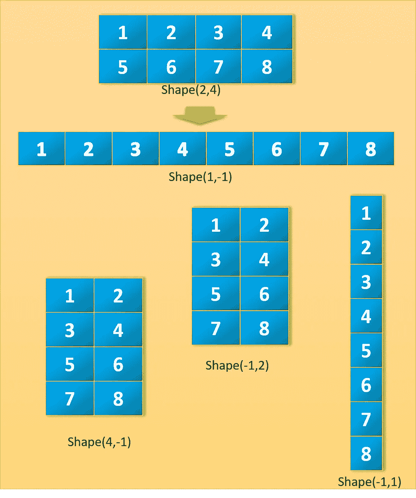
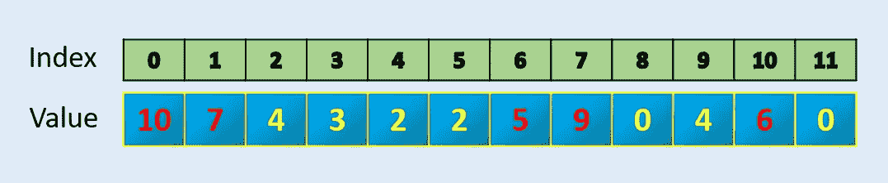
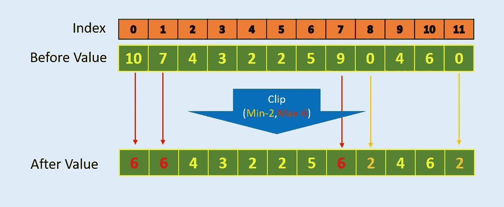
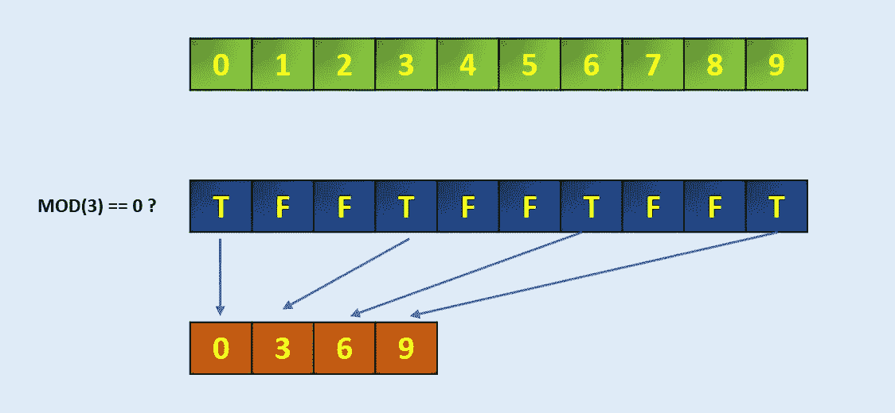
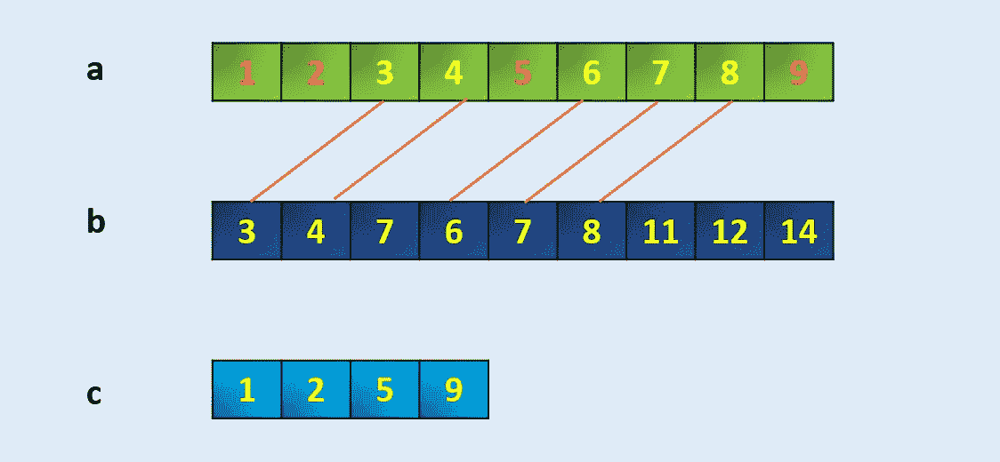

# 5 个智能 Python NumPy 函数

> 原文：<https://towardsdatascience.com/5-smart-python-numpy-functions-dfd1072d2cb4?source=collection_archive---------10----------------------->


## 简洁编程的优雅 NumPy 函数

在机器学习和数据科学项目的日常数据处理中，我们会遇到独特的情况，这些情况需要样板代码来解决问题。随着时间的推移，其中一些被转换成由核心语言或软件包本身根据社区的需要和使用提供的基本特性。在这里，我分享 5 个优雅的 python Numpy 函数，它们可以用于高效简洁的数据操作。

# 1)在整形中使用-1

Numpy 允许我们重塑一个矩阵，只要新的形状与原来的形状兼容。这个新形状的一个有趣的方面是，我们可以给出一个形状参数作为 **-1** 。这仅仅意味着它是一个未知的维度，我们希望 Numpy 能够解决它。Numpy 将通过查看***‘数组的长度和剩余维度’***并确保它满足上述标准来确定这一点。现在让我们看一个例子。



Pictorial representation of different reshape with one dimension as -1

```
a = np.array([[1, 2, 3, 4],
              [5, 6, 7, 8]])
a.shape
(2, 4)
```

假设我们给行 1，给列-1，那么 Numpy 将能够找到列 8。

```
a.reshape(1,-1)
array([[1, 2, 3, 4, 5, 6, 7, 8]])
```

假设我们给行-1，给列 1，那么 Numpy 将能够找到行 8。

```
a.reshape(-1,1)
array([[1],
       [2],
       [3],
       [4],
       [5],
       [6],
       [7],
       [8]])
```

类似地，下面是可能的。

```
a.reshape(-1,4)
array([[1, 2, 3, 4],
       [5, 6, 7, 8]])a.reshape(-1,2)
array([[1, 2],
       [3, 4],
       [5, 6],
       [7, 8]])a.reshape(2,-1)
array([[1, 2, 3, 4],
       [5, 6, 7, 8]])a.reshape(4,-1)
array([[1, 2],
       [3, 4],
       [5, 6],
       [7, 8]])
```

这也适用于任何更高级张量整形，但是只能给出一个维度-1。

```
a.reshape(2,2,-1)
array([[[1, 2],
        [3, 4]],[[5, 6],
        [7, 8]]])a.reshape(2,-1,1)
array([[[1],
        [2],
        [3],
        [4]],[[5],
        [6],
        [7],
        [8]]])
```

如果我们试图重塑一个不兼容的形状或一个以上的未知形状，将会出现一个错误信息。

```
a.reshape(-1,-1)
**ValueError**: can only specify one unknown dimensiona.reshape(3,-1)
**ValueError**: cannot reshape array of size 8 into shape (3,newaxis)
```

总而言之，当重塑数组时，新形状必须包含与旧形状相同数量的元素，这意味着两个形状的尺寸的**乘积必须等于**。当使用-1 时，对应于-1 的维数将是原始数组的维数的乘积除以赋予`reshape`的维数的乘积，以保持相同的元素数量。

# 2) AArgpartition:在数组中找到 N 个最大值



Numpy 有一个名为 **argpartition** 的函数，它可以高效地找到最大的 N 值索引并依次找到 N 个值。它给出索引，然后你可以排序，如果你需要排序的值。

```
a = np.array([10, 7, 4, 3, 2, 2, 5, 9, 0, 4, 6, 0])index = **np.argpartition**(a, -5)[-5:]
index
array([ 6,  1, 10,  7,  0], dtype=int64)np.sort(a[index])
array([ 5,  6,  7,  9, 10])
```

# 3) Clip:如何将数组中的值保持在一个区间内

在许多数据问题或算法中(如强化学习中的 PPO ),我们需要将所有值保持在一个上限和下限内。Numpy 有一个名为 Clip 的内置函数可以用于此目的。Numpy **clip** () **函数**用于 **Clip** (限制)数组中的值。给定一个区间，区间外的值被剪切到区间边缘。例如，如果指定了[-1，1]的间隔，则小于-1 的值变为-1，大于 1 的值变为 1。



Clip example with min value 2 and maximum value 6

```
**#Example-1**
a = np.array([10, 7, 4, 3, 2, 2, 5, 9, 0, 4, 6, 0])
print (**np.clip**(a,2,6))[6 6 4 3 2 2 5 6 2 4 6 2]**#Example-2**
a = np.array([10, -1, 4, -3, 2, 2, 5, 9, 0, 4, 6, 0])
print (**np.clip**(a,2,5))[5 2 4 2 2 2 5 5 2 4 5 2]
```

# 4)提取:根据条件从数组中提取特定元素

我们可以使用 Numpy **extract()** 函数从符合条件的数组中提取特定的元素。



```
arr **=** np.arange(10)
arrarray([0, 1, 2, 3, 4, 5, 6, 7, 8, 9])# Define the codition, here we take MOD 3 if zero
condition **=** np.mod(arr, 3)**==**0
conditionarray([ True, False, False,  True, False, False,  True, False, False,True])**np.extract**(condition, arr)
array([0, 3, 6, 9])
```

类似地，如果需要，我们可以使用 AND 和 OR 组合的直接条件

```
**np.extract**((**(arr > 2) & (arr < 8)**), arr)array([3, 4, 5, 6, 7])
```

# 5) setdiff1d:如何在一个数组中找到与另一个数组相比较的唯一值

返回一个数组中不存在于另一个数组中的唯一值。这相当于两个数组的差异。



```
a = np.array([1, 2, 3, 4, 5, 6, 7, 8, 9])
b = np.array([3,4,7,6,7,8,11,12,14])
c = **np.setdiff1d**(a,b)
carray([1, 2, 5, 9])
```

# 最后注意:

这是 5 个 Numpy 函数，社区并不经常使用，但是它们非常简洁优雅。在我看来，只要有类似的情况，我们就应该使用它们，因为它们不仅提供了更少的代码，而且是实现复杂问题解决方案的一种聪明方式。

## 感谢阅读。可以联系我@ [LinkedIn](http://www.linkedin.com/in/baijayantaroy) 。

*每月只需 5 美元，就可以无限制地获取最鼓舞人心的内容……点击下面的链接，成为媒体会员，支持我的写作。谢谢大家！* [](https://baijayanta.medium.com/membership)