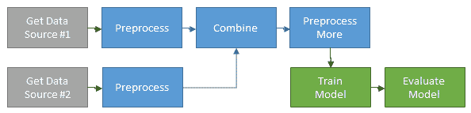

# d6tflow 可扩展深度学习管道 5 步指南

> 原文：<https://towardsdatascience.com/5-step-guide-to-scalable-deep-learning-pipelines-with-d6tflow-94d21cb40d22?source=collection_archive---------30----------------------->

## *如何将典型的 Pytorch 脚本转换为可扩展的 d6tflow DAG 以加快研究&开发*

Photo by [Sean Lim](https://unsplash.com/@seanlimm?utm_source=medium&utm_medium=referral) on [Unsplash](https://unsplash.com?utm_source=medium&utm_medium=referral)

# 引言:何苦呢？

构建深度学习模型通常涉及复杂的数据管道以及大量的反复试验，调整模型架构和需要比较其性能的参数。经常很难跟踪所有的实验，往好里说会导致混乱，往坏里说会导致错误的结论。

在[你的 ML 代码不好的 4 个原因](/4-reasons-why-your-machine-learning-code-is-probably-bad-c291752e4953)中，我们探讨了如何将 ML 代码组织成 DAG 工作流来解决这个问题。在本指南中，我们将通过一个实际的案例研究，利用 [d6tflow](https://github.com/d6t/d6tflow) 将现有的 pytorch 脚本转变为可扩展的深度学习管道。起点是[脸书的 pytorch 深度推荐器模型](https://github.com/facebookresearch/dlrm)，我们将通过 5 个步骤将代码迁移到可扩展的深度学习管道中。下面的步骤是用部分伪代码编写的，以说明概念，完整的代码也是可用的，请参见文章末尾的说明。

我们开始吧！

# 第一步:计划你的 DAG

要计划您的工作并帮助他人了解您的管道是如何组合在一起的，您需要从考虑数据流、任务之间的依赖关系和任务参数开始。这有助于您将工作流程组织成逻辑组件。你可能想画一个这样的图

下面是脸书深度学习推荐器模型(DLRM)的 Pytorch 模型训练 DAG。它显示了训练任务`TaskModelTrain`及其所有的依赖项，以及这些依赖项是如何相互关联的。如果你写功能代码，很难看出你的工作流程是如何像这样组合在一起的。

# 第二步:写任务而不是函数

数据科学代码通常组织在函数中，这会导致很多问题，如[4ML 代码不好的原因](/4-reasons-why-your-machine-learning-code-is-probably-bad-c291752e4953)中所述。相反，您希望编写 d6tflow 任务。好处是您可以:

*   将任务链接到 DAG 中，以便自动运行所需的依赖关系
*   从依赖关系轻松加载任务输入数据
*   轻松保存任务输出，如预处理数据和训练模型。这样你就不会意外地重新运行长时间运行的训练任务
*   将任务参数化，以便智能管理它们(参见下一步)
*   将输出保存到 [d6tpipe](https://github.com/d6t/d6tpipe) 为了将数据从代码中分离出来并轻松共享数据，请参见[数据科学家犯下的 10 大编码错误](/top-10-coding-mistakes-made-by-data-scientists-bb5bc82faaee)

下面是将功能代码转换成 d6t 流程任务后，脸书·DLRM 代码的“之前/之后”的样子。

伸缩性不好的典型 Pytorch 功能代码:

使用可伸缩 d6tflow 任务编写的相同逻辑:

# 步骤 3:参数化任务

为了提高模型性能，您将尝试不同的模型、参数和预处理设置。为了跟踪所有这些，您可以向任务添加参数。这样，您可以:

*   跟踪哪些模型已经用哪些参数进行了训练
*   随着参数的变化，智能地重新运行任务
*   帮助其他人了解工作流中引入参数的位置

下面用参数设置脸书 DLRM 模型训练任务。请注意，您不再需要手动指定保存训练模型和数据的位置。

# 比较训练模型

现在，您可以使用该参数轻松地比较不同模型的输出。确保在加载任务输出之前使用该参数运行工作流(参见步骤 4)。

# 继承参数

通常，您需要在工作流程的下游设置一个参数级联。如果你写函数代码，你必须在每个函数中重复这个参数。使用 d6tflow，您可以继承参数，以便终端任务可以根据需要将参数传递给上游任务。

在脸书 DLRM 工作流中，`TaskModelTrain`从`TaskGetTrainDataset`继承参数。这样你可以运行`TaskModelTrain(mini_batch_size=2)`，它会将参数传递给上游任务，即`TaskGetTrainDataset`和所有依赖于它的其他任务。在实际代码中，注意`self.clone(TaskName)`和`@d6tflow.clone_parent`的使用。

# 步骤 4:运行 DAG 来处理数据和训练模型

要开始数据处理和模型训练，您需要运行 DAG。您只需要运行自动运行所有依赖项的终端任务。在实际运行 DAG 之前，您可以预览将要运行的内容。如果您对代码或数据进行了任何更改，这尤其有用，因为它将只运行已更改的任务，而不是整个工作流。

# 步骤 5:评估模型性能

现在工作流已经运行并且所有任务都已完成，您可以加载预测和其他模型输出来比较和可视化输出。因为任务知道每个输出保存在哪里，所以您可以直接从任务加载输出，而不必记住文件路径或变量名。这也使得你的代码可读性更好。

# 比较模型

您可以很容易地比较具有不同参数的不同模型的输出。

# 继续迭代

当您迭代、更改参数、代码和数据时，您会想要重新运行任务。d6tflow 智能地指出哪些任务需要重新运行，这使得迭代非常高效。如果你改变了参数，你不需要做任何事情，它会知道自动运行什么。如果您更改了代码或数据，您必须使用`.invalidate()`将任务标记为未完成，d6tflow 将会解决剩下的问题。

在脸书 DLRM 工作流中，比如说您更改了培训数据或对培训预处理进行了更改。

# 完整源代码

所有代码都在 https://github.com/d6tdev/dlrm 提供。与[https://github.com/facebook/dlrm](https://github.com/facebook/dlrm)相同，增加了 d6tflow 文件；

*   flow_run.py:运行流= >运行该文件
*   flow_task.py:任务代码
*   flow_viz.py:显示模型输出
*   flow_cfg.py:默认参数
*   dlrm _ d6t _ py torch . py:dlrm _ data _ py torch . py 用于 d6tflow

自己试试！

# 你的下一个项目

在本指南中，我们展示了如何构建可扩展的深度学习工作流。我们使用了现有的代码库，并展示了如何将线性深度学习代码转换为 d6tflow DAGs 以及这样做的好处。

对于新项目，你可以从 https://github.com/d6t/d6tflow-template[的可扩展项目模板开始。结构非常相似:](https://github.com/d6t/d6tflow-template)

*   运行. py:运行工作流
*   task.py:任务代码
*   cfg.py:管理参数