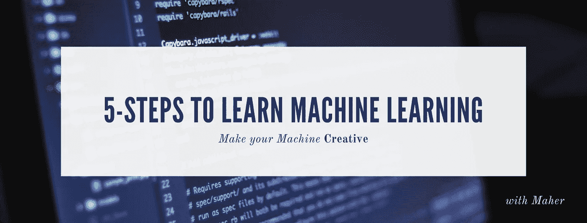
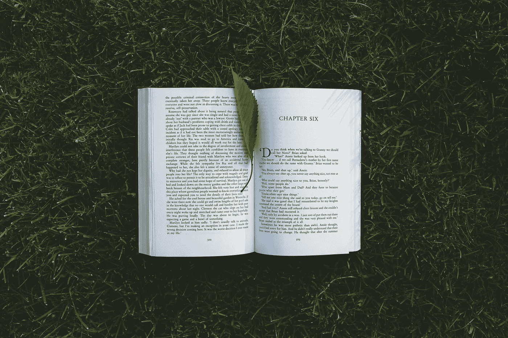

# 5 步和 10 步，来学习机器学习。

> 原文：<https://towardsdatascience.com/5-steps-and-10-steps-to-learn-machine-learning-c4b61f78c712?source=collection_archive---------14----------------------->

有一个 5 步捷径，你可以马上解决机器学习问题，作为一个初学者，如果你想用机器学习做点什么，你可以先走这条路。

然后，你可以通过 10 步走成为一名数据科学家或更高级的机器学习工程师。

请记住这一点，

> —改善你的心态和思维方式，这比学习如何使用工具重要得多。
> 
> —实现您的目标并成为数据科学家没有固定的轨道，因此您可以自由改变任何步骤或做您认为适合您的事情。

Read The Catalog

# 途径 1:阅读目录途径(5 步计划)

这条道路就像阅读你刚买的新设备的目录，你将学会如何有效地使用它，它将把你从一个*初学者*变成一个能够完成工作的*初学者！*你将能够以有限的准确度解决有限的问题。我建议在某些时候走这条路，以便能够快速解决不太重要的问题。

当我开始解决任何机器学习问题时，我会经常使用这些工具，这给了我一个尝试提高的基线准确性，它帮助我更加熟悉我拥有的数据集，并给了我一些见解。

1.  精通 **python** 或者任何其他语言，比如 R，但是我建议你从 python 开始，网上有很多免费的资源，我建议你通过试错法和一些阅读来学习。
2.  学习如何使用 **Numpy** 和 **Scipy** 进行数学运算， **Pandas** 和 **Matplotlib** 和 **seaborn。
    *Numpy*** *和* ***Scipy、*** *都是数学库。* ***熊猫*** *是一个用于数据操作和分析的 python 库。* ***Matplotlib****和****Seaborn****是帮助你可视化数据的库。*
3.  阅读文章 [**机器学习简介:自上而下的方法**](/introduction-to-machine-learning-top-down-approach-8f40d3afa6d7) **，**它会给你一个关于机器学习世界的流畅介绍。
4.  阅读关于 **Scikit-learn，**这一步是实际的目录阅读，Scikit-learn 是您将用来解决问题的工具集，您不必学习库中的所有内容，只需学习实现一两个模型并阅读其他模型。 **Scikit-learn** 是一个 python 库，它有很多已经实现的模型，这些模型是黑盒，你可以用它们来直接训练和预测，你甚至可以调整模型的参数以适应你的问题并获得更高的准确性。
5.  阅读**一书中的第 2 章** [**用 Scikit 动手机器学习-学习& TensorFlow**](https://amzn.to/2H4dJmN)

如果你对数据科学不感兴趣，那么你不应该继续瞄准数据科学，但如果你感兴趣，我建议你走第二条路。

Now, Let’s be Professional

# 途径 2:建立职业道路(10 步计划)

这条道路实际上会把你从一个初学者变成一个数据科学家，它会给你工具集和知识来解决相对复杂的问题。

决定你作为一名数据科学家有多优秀的最重要的一点是，你应该始终了解该领域的最新发现。

我建议你阅读大量的论文，关注大量的出版物和作家，并与他们接触，有任何问题都可以联系我！我们可以互惠互利，建立一个充满爱心的社区。

> 另一件真正重要的事情是**练习。**

1.  当然，选择一门**编程语言**来掌握并在你的旅途中使用。
2.  复习你的**线性代数**知识[https://OCW . MIT . edu/courses/mathematics/18-06-Linear-Algebra-spring-2010/](https://ocw.mit.edu/courses/mathematics/18-06-linear-algebra-spring-2010/)
3.  从小抄上修改你的统计和概率知识，或者你可以在 https://www.khanacademy.org/math/statistics-probability 的 T21 网站上从头学起
4.  复习你的微积分知识或者从这门课程中学习微积分[https://www.youtube.com/playlist?list = plzhqobowt qdmsr 9k-rj 53 dwvrmyo 3t 5 yr](https://www.youtube.com/playlist?list=PLZHQObOWTQDMsr9K-rj53DwVRMYO3t5Yr)
5.  当然，最受欢迎的免费课程是 Coursera 上的**吴恩达课程*****理论知识*** 。
6.  推荐阅读 aurélien géRon**的**书** [**用 Scikit 动手机器学习-Learn&tensor flow**](https://amzn.to/2H4dJmN)***，这是一本信息量很大的好书，是技术知识的 ***。********
7.  ****在 Kaggle 上大量练习，现在你可以用你目前所理解的机器学习技术来解决问题。****
8.  ****本课程数据可视化[https://www . EDX . org/course/data-visualization-a-practical-approach-for-absolute-初学者-0](https://www.edx.org/course/data-visualization-a-practical-approach-for-absolute-beginners-0)****
9.  ****了解如何使用数据库(SQL 和非 SQL)****
10.  ****学习 Hadoop & Spark，我推荐这个课程[https://www.udemy.com/share/1000lU](https://www.udemy.com/share/1000lU/)，那里有很多免费的课程和书籍，去看看吧。****
11.  ****我相信，如果你已经达到了这一点，你将能够引导自己前进。****

****要有奉献精神，要有信心你能做到。****

****祝你玩得开心，让你的机器 ***充满创意。*******