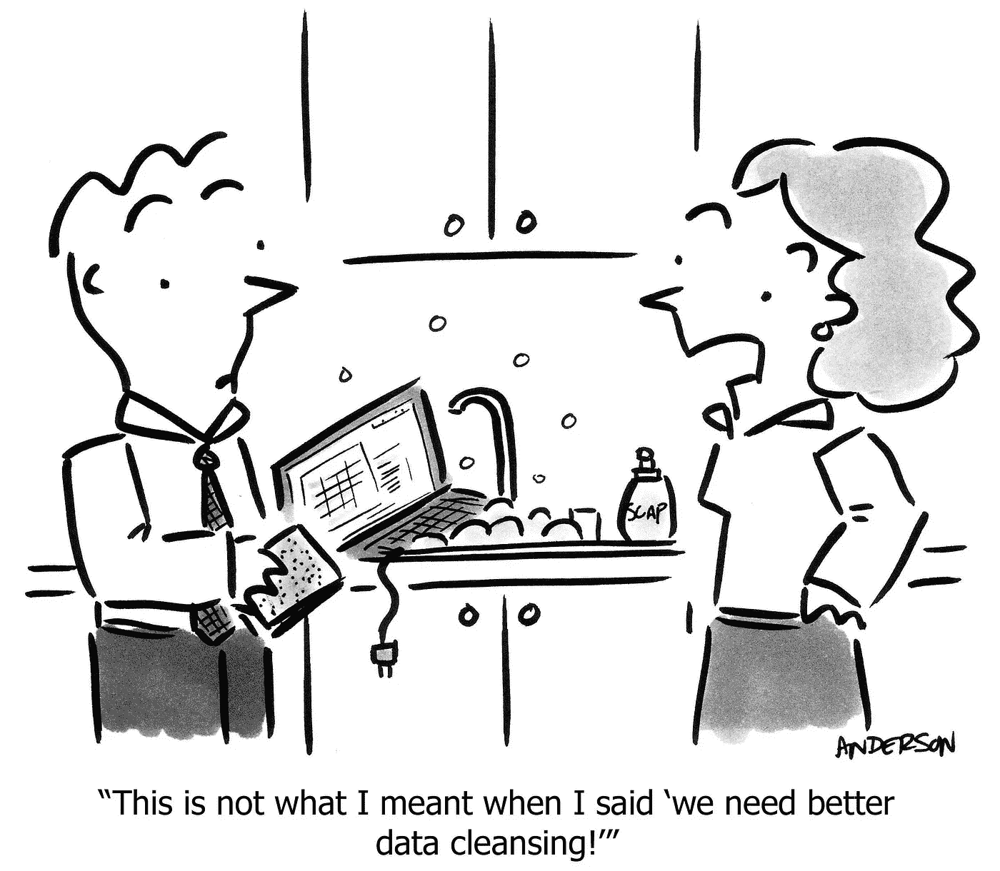

# 数据科学项目生命周期的 5 个步骤

> 原文：<https://towardsdatascience.com/5-steps-of-a-data-science-project-lifecycle-26c50372b492?source=collection_archive---------1----------------------->

通常，当我们谈论数据科学项目时，似乎没有人能够给出整个过程如何进行的可靠解释。从收集数据，一直到分析和展示结果

在这篇文章中，我将分解数据科学框架，带您经历项目生命周期的每个步骤，同时讨论关键技能和需求。

# OSEMN 框架

*Data Science Process (a.k.a the O.S.E.M.N. framework)*

我将使用 OSEMN 框架带您完成这一过程，它从头到尾涵盖了数据科学项目生命周期的每一步。

# 1.获取数据

数据科学项目的第一步非常简单。我们从可用的数据源中获取我们需要的数据。

在这一步中，您需要查询数据库，使用像 [MySQL](https://www.mysql.com/) 这样的技术技能来处理数据。您还可以接收 Microsoft Excel 等文件格式的数据。如果你使用的是 [Python](https://www.python.org/) 或 [R](https://www.r-project.org/) ，他们有特定的包可以从这些数据源直接读取数据到你的数据科学程序中。

您可能会遇到不同类型的数据库，如 [PostgreSQL](https://www.postgresql.org/) 、 [Oracle](https://www.oracle.com/database/) ，甚至非关系数据库(NoSQL)，如 [MongoDB](https://www.mongodb.com/) 。另一种获取数据的方法是使用网络抓取工具从网站上抓取，例如[美汤](https://www.pythonforbeginners.com/python-on-the-web/web-scraping-with-beautifulsoup)。

收集数据的另一个流行选项是连接到 Web APIs。脸书和 Twitter 等网站允许用户连接到他们的网络服务器，访问他们的数据。你需要做的就是使用他们的 Web API 来抓取他们的数据。

当然，最传统的获取数据的方式是直接从文件中获取，比如从 [Kaggle](https://www.kaggle.com/) 下载，或者从以 CSV(逗号分隔值)或 TSV(制表符分隔值)格式存储的现有公司数据中下载。这些文件是平面文本文件。您将需要使用特殊的解析器格式，因为像 Python 这样的常规编程语言本身并不理解它。

***所需技能***

要完成上述任务，你需要一定的技能。例如，对于数据库管理，你需要知道如何使用 [MySQL](https://www.mysql.com/) 、 [PostgreSQL](https://www.postgresql.org/) 或 [MongoDB](https://www.mongodb.com/) (如果你使用的是非结构化数据集)。

如果你希望在更大的数据集或大数据上工作，那么你需要学习如何使用分布式存储来访问，如 [Apache Hadoop](https://hadoop.apache.org/) 、 [Spark](https://spark.apache.org/) 或 [Flink](https://flink.apache.org/) 。

# 2.擦除数据

获得数据后，接下来要做的事情是清理数据。这个过程是为了我们“清理”和过滤数据。记住“*垃圾进，垃圾出*”的哲学，如果数据未经过滤，不相关，分析的结果就没有任何意义。

在这个过程中，您需要将数据从一种格式转换成另一种格式，并将所有数据整合成一种标准化的格式。例如，如果您的数据存储在多个 CSV 文件中，那么您将把这些 CSV 数据合并到一个存储库中，以便您可以处理和分析它。

在某些情况下，如果您正在处理锁定的文件，我们还需要过滤这些行。锁定文件是指网页锁定文件，你可以从中了解到用户的人口统计数据，进入你的网站的时间等。

除此之外，清理数据还包括提取和替换值的任务。如果你意识到有缺失的数据集，或者它们可能看起来没有价值，这就是相应替换它们的时候了。

最后，您还需要拆分、合并和提取列。例如，对于产地，您可能同时拥有“城市”和“州”。根据您的需求，您可能需要合并或拆分这些数据。

把这个过程想象成组织和整理数据，删除不再需要的，替换丢失的，以及标准化所有收集数据的格式。

***所需技能***

您将需要像 Python 或 R 这样的脚本工具来帮助您清理数据。否则，你可以使用像 [OpenRefine](http://openrefine.org/) 这样的开源工具或者购买像 [SAS Enterprise Miner](https://www.sas.com/en_my/software/enterprise-miner.html) 这样的企业软件来帮助你轻松完成这个过程。

为了处理更大的数据集，你需要掌握 Hadoop、 [Map Reduce](https://hadoop.apache.org/docs/current/hadoop-mapreduce-client/hadoop-mapreduce-client-core/MapReduceTutorial.html) 或 Spark 方面的技能。这些工具可以通过编写脚本来帮助您清理数据。

# 3.浏览数据

一旦你的数据准备好被使用，就在你跳入人工智能和机器学习之前，你将不得不检查这些数据。

通常，在一个公司或商业环境中，你的老板只会扔给你一组数据，而如何理解这些数据取决于你。因此，将由您来帮助他们解决业务问题，并将其转化为数据科学问题。

为了实现这一点，我们需要探索数据。首先，您需要检查数据及其属性。不同的数据类型，如数字数据、分类数据、序数和名义数据等。需要不同的治疗方法。

然后，下一步是计算描述性统计，以提取特征和测试显著变量。检验重要变量通常是通过相关性来完成的。例如，探索某人患高血压的风险与其身高和体重的关系。请注意，有些变量是相关的，但它们并不总是意味着因果关系。

机器学习或建模中使用的术语“*特征*，是帮助我们识别代表数据的特征的数据特征。例如，“*姓名*”、“*年龄*”、“*性别*”是成员或员工数据集的典型特征。

最后，我们将利用数据可视化来帮助我们识别数据中的重要模式和趋势。我们可以通过简单的图表，如折线图或条形图，获得更好的图片，以帮助我们理解数据的重要性。

***所需技能***
如果你正在使用 Python，你将需要知道如何使用 Numpy、Matplotlib、Pandas 或 Scipy 如果您使用 R，您将需要使用 GGplot2 或 data exploration 瑞士刀 Dplyr。除此之外，你还需要掌握推断统计学和数据可视化方面的知识和技能。

就像你不需要硕士或博士来做数据科学一样，这些技术技能对于进行实验设计是至关重要的，因此你能够重现结果。

**附加提示:**

*   好奇。这可以帮助你发展你的蜘蛛感官来发现奇怪的模式和趋势。
*   关注你的听众，理解他们的背景和行话。以便您能够以对他们有意义的方式呈现数据。

# 4.模型数据

这是大多数人认为有趣的阶段。正如许多人称之为“神奇发生的地方”。

再一次，在到达这个阶段之前，记住擦洗和探索阶段对于构建有用的模型同样重要。所以，在这些阶段上花点时间，而不是直接跳到这个过程。

在对数据建模时，首先要做的事情之一是减少数据集的维数。并非所有的特征或值对于预测模型都是必不可少的。你需要做的是选择有助于结果预测的相关。

我们可以在建模中执行一些任务。我们还可以训练模型来执行分类，以使用逻辑回归来区分您收到的电子邮件是“*收件箱*还是“*垃圾邮件*”。我们也可以使用线性回归来预测数值。我们还可以使用建模对数据进行分组，以了解这些聚类背后的逻辑。例如，我们对电子商务客户进行分组，以了解他们在您网站上的行为。这需要我们使用聚类算法(如 k-means 或层次聚类)来识别数据点组。

简而言之，我们使用回归和预测来预测未来值，使用分类来识别，使用聚类来分组值。

***所需技能***

在机器学习中，你需要的技能是监督和非监督算法。对于库，如果你正在使用 Python，你将需要知道如何使用[Sci-kit Learn](https://scikit-learn.org/)；而如果你用的是 R，就需要用[脱字符号](https://topepo.github.io/caret/)。

在建模过程之后，您将需要能够计算评估分数，例如分类的精确度、召回率和 F1 分数。对于回归，您需要熟悉用于测量拟合优度的 R，以及使用 MAE(平均误差)或 RMSE(均方根误差)等误差分数来测量预测数据点和观察数据点之间的距离。

# 5.解释数据

我们正处于数据科学项目的最后也是最关键的一步，解释模型和数据。模型的预测能力在于它的概括能力。我们如何解释一个模型取决于它概括未知未来数据的能力。

解释数据指的是将你的数据呈现给一个非技术门外汉。我们提供结果来回答我们在项目开始时提出的业务问题，以及我们在数据科学过程中发现的可行见解。

可操作的洞察力是我们展示数据科学如何带来预测性分析以及随后的规定性分析的关键成果。在其中，我们学习如何重复一个积极的结果，或防止一个消极的结果。

最重要的是，你需要相应地想象你的发现，让它由你的业务问题驱动。以对组织有用的方式展示你的发现是很重要的，否则对你的利益相关者来说毫无意义。

在这个过程中，仅有技术技能是不够的。你需要的一项基本技能是能够讲述一个清晰可行的故事。如果你的演讲没有引起听众的反应，那就意味着你的交流没有效率。请记住，你将面对一个没有技术背景的观众，所以你传达信息的方式是关键。

***所需技能***

在这个过程中，要具备的关键技能是技术技能之外的。你需要很强的业务领域知识，以能够回答你要回答的业务问题的方式展示你的发现，并将其转化为可操作的步骤。

除了 Matplotlib，ggplot， [Seaborn](https://seaborn.pydata.org/) ， [Tableau](https://www.tableau.com/) ， [d3js](https://d3js.org/) 等数据可视化所需的工具之外。，你将需要软技能，如演示和沟通技能，再加上报告和写作技能，这肯定会在项目生命周期的这一阶段对你有所帮助。

# 概述

我在这里展示的是数据科学家在典型的数据科学项目中按时间顺序遵循的步骤。如果是一个全新的项目，我们通常会花费 60-70%的时间来收集和清理数据。因为它是一个框架，你可以用它作为你喜欢的工具的指南。

真正的北方总是我们定义的商业问题，甚至在开始数据科学项目之前。永远记住，扎实的业务问题、干净且分布良好的数据总是胜过花哨的模型。

我希望你今天学到了一些东西。如果您有任何反馈，请随时留言，并与任何可能觉得有用的人分享。