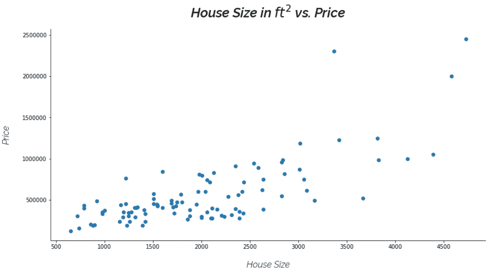
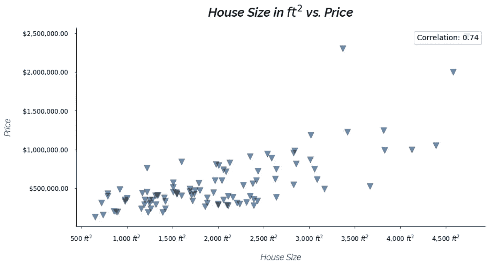

# 使用 Matplotlib 实现惊人可视化的 5 个步骤

> 原文：<https://towardsdatascience.com/5-steps-to-amazing-visualizations-with-matplotlib-ca61f0ec5fec?source=collection_archive---------18----------------------->

## ***Matplotlib*** 烂透了。默认情况下。

但是你可以调整它。


Photo by [Isaac Smith](https://unsplash.com/@isaacmsmith?utm_source=medium&utm_medium=referral) on [Unsplash](https://unsplash.com?utm_source=medium&utm_medium=referral)

我们都经历过。 ***Matplotlib*** 被导入，你的数据集准备好了，你准备好做一些惊人的可视化。很快，看起来像土豆一样的默认 ***Matplotlib*** 图表的残酷现实就摆在你面前。

该死的。

几周前，我写了一篇文章，通过使用 ***Flask*** 和 ***Bokeh*** 开发交互式仪表板应用程序，将您的可视化提升到一个新的水平:

[](/https-medium-com-radecicdario-next-level-data-visualization-dashboard-app-with-bokeh-flask-c588c9398f98) [## 下一级数据可视化—带有散景和烧瓶的仪表板应用程序

### 视觉化很重要。也许对作为数据分析师/科学家的你来说并非如此，但你可能会对表格数据充满信心…

towardsdatascience.com](/https-medium-com-radecicdario-next-level-data-visualization-dashboard-app-with-bokeh-flask-c588c9398f98) 

那篇文章比这篇文章要复杂得多，但是如果你需要更灵活的东西，我还是想指出来。

今天，我将向你展示我在***【Matplotlib】***中使用大多数可视化工具所做的 5 件事，希望你能意识到，直接跳到 ***Seaborn*** 或 ***Bokeh*** 并没有真正的好处——在大多数情况下 ***Matplotlib*** 已经涵盖了。

# 数据集介绍

对于本指南，我使用了 [Kaggle](https://www.kaggle.com/) 上的[**KC _ house _ data**](https://www.kaggle.com/shivachandel/kc-house-data)数据集。从其他的海洋中选择这个的主要原因是它包含了大量的观察结果，但更重要的是，它包含了两个应该高度相关的属性:

*   居住面积
*   价格

由于潜在的相关性，可以绘制一个很好的散点图。

如果您不想下载数据集并跟随，以下是数据集头部的样子:


Head of kc_house_data.csv

但是在开始可视化之前，这里是**导入和基本设置**的代码:

Imports and Setup — [https://gist.github.com/dradecic/43729ca53567fa44e433130faebeeb6d](https://gist.github.com/dradecic/43729ca53567fa44e433130faebeeb6d)

我选择从数据集中抽取 100 个点，因为一般来说，当数据点太多时，散点图看起来不太好。
然后，我设置 **x** 代表居住面积， **y** 代表房价。

最初的绘图现在非常简单:

Default Matplotlib scatter plot — [https://gist.github.com/dradecic/bfa07c255be6d7eafba74f001d6a9eb5](https://gist.github.com/dradecic/bfa07c255be6d7eafba74f001d6a9eb5)

执行该单元格将产生一个不令人满意、乏味且难看的图表:


Default Matplotlib scatter plot

幸运的是，你可以做很多事情。以下是本文将基于的 5 个要点:

1.  移除脊椎
2.  向标题和轴标签添加自定义字体
3.  向轴标签添加单位
4.  更改标记、颜色、大小和不透明度
5.  添加注释

事不宜迟，让我们直入第一点。

# 1.移除脊椎

***Matplotlib*** 中的图表显示在一个“盒子”中，至少可以说，这个盒子看起来非常严格。默认情况下，其他可视化库更加开放，这种效果在这里很容易实现。

这里的目标是删除顶部的水平栏和右侧的垂直栏。
这是通过将以下内容添加到您的图表代码单元格中实现的:

Removing Spines — [https://gist.github.com/dradecic/a96645c8798e556d1379bad2216bf895](https://gist.github.com/dradecic/a96645c8798e556d1379bad2216bf895)


Removing spines

瞧啊。图表现在更加开放，因此更有吸引力。

# 2.向标题和坐标轴标签添加自定义字体

现在，这个过程将比第一个过程更加繁琐。我选择使用 [Raleway](https://www.fontsquirrel.com/fonts/raleway) 字体，你需要下载压缩的 ***。ttf*** 如果你还没有的话。

下载完成后，将 TTF-s 解压到 Matplolib 的文件夹中。如果你像我一样使用[***Anaconda***](https://www.anaconda.com/)，Windows 上的路径会如下:

```
C:\Users\**<YOUR-USER-NAME>**\AppData\Local\Continuum\anaconda3\Lib\site-packages\matplotlib\mpl-data\fonts\ttf
```

您现在可以通过 ***Jupyter*** 和 ***Matplotlib*** 直接访问任何下载的字体。在新的单元格中，粘贴以下代码(我选择了半粗斜体作为标题，浅斜体作为轴标签):

Fonts Setup — [https://gist.github.com/dradecic/a8b85ca866e7ac1543a362247feac80d](https://gist.github.com/dradecic/a8b85ca866e7ac1543a362247feac80d)

现在，您可以在调用 ***之前，将以下代码添加到您的图表单元格中。*散点()**。

注意在设置标题和/或轴标签时如何使用 [LaTeX](https://www.latex-project.org/) 。如果图表上的文字应该代表某种单位，例如平方英尺，这样做可以避免图表看起来怪异。

Title and Axis Labels — [https://gist.github.com/dradecic/aa873a492a17b46da590370379853f24](https://gist.github.com/dradecic/aa873a492a17b46da590370379853f24)

这就是你的图表现在的样子:



Title and axis labels with custom font

对于几行代码来说还不错。但是你可以做得更好。

# 3.向轴标签添加单位

真的没有必要进一步解释这一点是关于什么的。

您希望轴标签更有吸引力。句号。

实现这一点的过程不像其他可视化库中那样简单，但它是可管理的。总之，代码如下:

Axis Units — [https://gist.github.com/dradecic/71d0408606239e4ce7d9ddc37e646c79](https://gist.github.com/dradecic/71d0408606239e4ce7d9ddc37e646c79)

上面的代码将为两个轴标签添加一个千位分隔符。
此外，在 x 轴上，单位是平方英尺，所以这就是将要添加的内容。
在 y 轴上，单位是美元。分笔成交点被格式化为货币，用逗号作为千位分隔符，用点号作为美分分隔符。


Added units to tick labels

# 4.更改标记、颜色、大小和不透明度

你不会真的认为我会跳过这个吧——是吗？

可能最明显的是，在大多数情况下，您要做的第一件事是改变标记的大小、形状和颜色。这里我使用了一个倒三角形作为标记，一些深蓝色作为标记颜色。

由于大量数据点集中在几乎相同的位置，**不透明度应该降低**，这样你可以更清楚地看到这些点。

总之，下面是实现这一点的代码:

Marker, Size, Color, and Opacity — [https://gist.github.com/dradecic/14d62e2cddda2e0cc34e6d90e2174977](https://gist.github.com/dradecic/14d62e2cddda2e0cc34e6d90e2174977)


Changing markers

快好了。但还不是时候。

# 5.添加注释

最后，如果有意义的话(如果变量相关)，在散点图上打印**相关系数**是个好主意。如果这样做，默认情况下，图例文本的左侧会有一个标记。

这不是我们想要的，我们想要一个简单、清晰、可见的相关系数的纯文本表示。

首先，你需要计算它。使用 ***Numpy*** 非常简单，在这种情况下，我会将结果四舍五入到小数点后两位。然后您需要将标签传递给 ***。scatter()*** 调用并隐藏存在的每一个图例句柄。

这样做需要一点代码，但并不复杂。

Annotation — [https://gist.github.com/dradecic/100f022267b4dbbb50bbf693955d99ce](https://gist.github.com/dradecic/100f022267b4dbbb50bbf693955d99ce)



Adding annotations

这就是你最终图表的样子。对于几分钟的工作来说相当不错！

如果您在这个过程中迷路了，不要担心，下面是完整的代码片段:

Final — [https://gist.github.com/dradecic/a578a62eed97653db4e64ba945fdf1ff](https://gist.github.com/dradecic/a578a62eed97653db4e64ba945fdf1ff)

# 结论

这不是 Matplotlib 的权威指南。它是在考虑普通人的情况下编写的——不是完全的初学者，但也不是专家。

我希望你现在可以看到 Python 最流行的可视化库的威力，并且下次你不会立即跳入 ***Seaborn*** 或 ***Bokeh*** 中。

感谢阅读。

直到下一次…

*喜欢这篇文章吗？成为* [*中等会员*](https://medium.com/@radecicdario/membership) *继续无限制学习。如果你使用下面的链接，我会收到你的一部分会员费，不需要你额外付费。*

[](https://medium.com/@radecicdario/membership) [## 通过我的推荐链接加入 Medium-Dario rade ci

### 作为一个媒体会员，你的会员费的一部分会给你阅读的作家，你可以完全接触到每一个故事…

medium.com](https://medium.com/@radecicdario/membership)