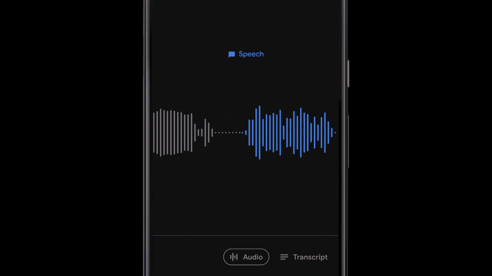
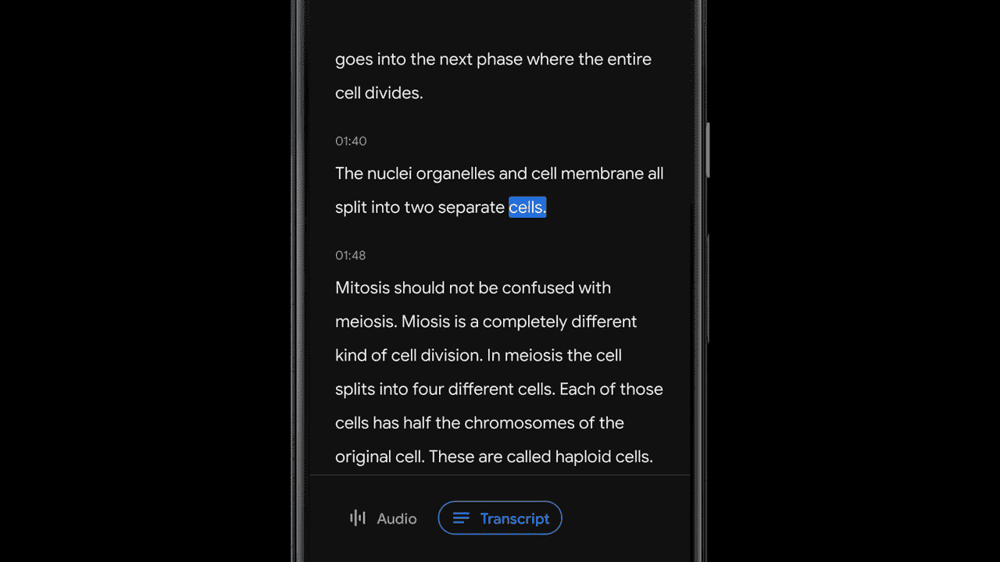
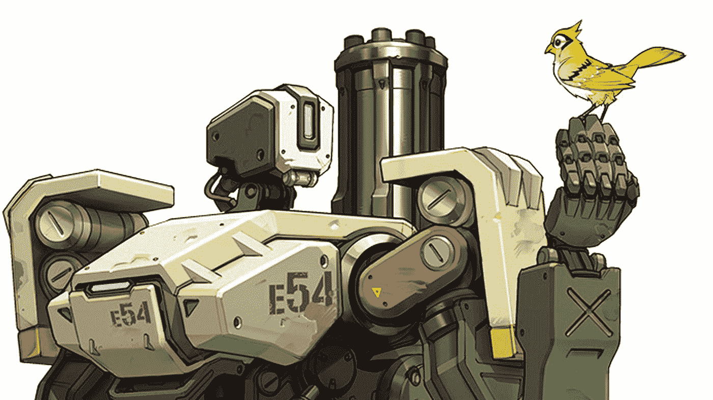

# 我从谷歌新的 ML-Powered Recorder 应用程序中学到的 5 件事

> 原文：<https://towardsdatascience.com/5-things-i-learned-from-googles-new-ml-powered-recorder-app-6c9616a05b78?source=collection_archive---------13----------------------->

## 以及未来支持 ML 的应用应该是什么样子

app store 中有大量的录音应用，但是你知道如果谷歌开发出一个全新的应用，事情会有所不同。谷歌最近发布了一款新的“[录音机](https://play.google.com/store/apps/details?id=com.google.android.apps.recorder)”应用，该应用由最先进的机器学习算法驱动，可以以令人印象深刻的精度实时转录听到的内容。这不是谷歌第一次试图用一些人工智能“超级能力”来保佑其产品。他们之前的一些尝试失败了(我在跟你说话[谷歌剪辑](https://www.engadget.com/2019/10/16/google-discontinues-clips-camera/)！)有些取得了巨大的成功，比如谷歌的 Pixel 手机摄像头应用。由于相机硬件规格略低于行业主流，谷歌的 Pixel 旗舰手机凭借其图像后处理的机器学习算法成功成为市场上最好的智能手机相机之一。“录音机”应用是谷歌利用人工智能增加竞争的又一次尝试，这次是在音频方面。

在深入研究应用程序可以做什么以及人工智能如何在其中发挥核心作用之后，我发现了一些关于谷歌如何处理应用程序、人工智能和用户体验的非常有趣的见解，这些见解可能会为人工智能时代的未来应用程序开发带来一些启示。

# 谷歌记录仪是什么？

你可以参考下面的 YouTube 视频短片，看看 Recorder 是做什么的。简而言之，你可以用它来做实时转录，通过关键字搜索录制的音频，自动生成标签或将音频分成不同的类别，如音乐，语音等。

我已经用了一个多星期了，发现它很有用，很光滑，用起来很愉快。录制音频并不是一项复杂的任务，但人工智能部分使它变得更加简单。我可以看到这个小应用程序为学生和定期参加会议的人带来了很大的变化。

# #1 采用边缘优先的模型设计

Image from [WishDesk](https://www.google.com/url?sa=i&source=images&cd=&cad=rja&uact=8&ved=2ahUKEwi8qsaS4c7mAhVFXawKHXf6BSsQjB16BAgBEAM&url=https%3A%2F%2Fwishdesk.com%2Fblog%2Fwhat-mobile-first-design&psig=AOvVaw1Z2T4KkHv8kJl4UFvKoWF-&ust=1577293156997339)

我们都听说过“移动优先设计”这个术语。当公司开发他们的应用程序时，他们将首先基于移动体验来设计和优化他们的应用程序，然后再到桌面或 web 等其他平台。我认为同样的想法也可以应用于人工智能驱动的应用程序设计，因此是“边缘优先设计”。

通常，基于机器学习的应用程序运行在云上，这是由于大多数最新 ML 模型的繁重计算需求。对于企业应用程序，这种方法很好，因为硬件几乎不是真正的问题。但如果一家公司想为消费者打造有影响力的基于人工智能的应用，那么基于云的系统通常不会满足它。从云中运行基于人工智能的应用程序不仅速度慢，而且存在严重的隐私问题。对于普通消费者来说，他们也习惯了现代移动应用程序提供的快捷性。如果你的应用无法达到他们习惯的高标准(多年来现代智能手机硬件/软件的发展推动了这种高标准)，他们就不会在乎你的应用是否基于某些 SOTA 模式。因此，将人工智能放在“边缘”，例如用户的手机、平板电脑、智能家居设备，将是一种更好的成功方式。

Image from Lann

谷歌记录器应用程序在这方面做得很好。它使用了一种叫做“[**【RNN-T】**](https://arxiv.org/pdf/1211.3711.pdf)的新型号，这种型号足够紧凑，可以放在手机上，同时又足够强大，可以进行实时转录。RNN-T 模型使用的不是传统的“流水线”方法，而是一种[单一神经网络，端到端方法](https://www.youtube.com/watch?v=ImUoubi_t7s)，这种方法在解决复杂问题时越来越受欢迎。直到最近，我们已经看到了许多通过使用越来越大的模型来提高预测性能的研究进展，然而相反的方向同样重要:使用尽可能紧凑的模型来实现类似的性能，以便模型可以被置于边缘。我预计，当机器学习在未来几年成熟时，这一领域会有更多的研究。

# #2 使用不同的技术堆栈来提高性能

另一个有趣的发展是为 TensorFlow 引入了 [Swift。由 Swift 编程语言的创造者](https://www.tensorflow.org/swift)[克里斯·拉特纳](https://en.wikipedia.org/wiki/Chris_Lattner)创造。它通过 TensorFlow 使用开源的 Swift 语言，并承诺像 Python 一样的快速开发时间和像 C++一样的高级性能。 [Fast.ai](http://fast.ai) 上面有很棒的[入门课程](https://blog.tensorflow.org/2019/06/fastais-deep-learning-from-foundations_28.html)。随着 ML 越来越多地从研究实验室转向商业应用，ML 模型的性能将发挥更大的作用，而 Swift for TensorFlow 在这方面有着巨大的潜力。据 [fast.ai](http://fast.ai) 创始人杰瑞米·霍华德介绍:

 [## 机器学习的新功能- WWDC 2019 -视频-苹果开发者

### Core ML 3 已经得到了极大的扩展，可以在您的应用程序中实现更加惊人的设备上机器学习功能…

developer.apple.com](https://developer.apple.com/videos/play/wwdc2019/209/) 

> *“Swift 可以与数字库供应商手动调整的汇编代码的性能相媲美。Swift for TensorFlow 是我所见过的第一次将可区分编程深入到一种广泛使用的语言的核心的认真努力，这种语言完全是为了性能而设计的"*

# #3 隐私问题

Photo by [Matthew Henry](https://unsplash.com/@matthewhenry?utm_source=medium&utm_medium=referral) on [Unsplash](https://unsplash.com?utm_source=medium&utm_medium=referral)

人工智能应用最大的担忧之一是隐私。要让人工智能真正展现价值，它必须了解用户的很多信息，通常是人们不愿意分享的个人生活细节。以音频录制为例，您可能希望录制讨论下一个圣诞节计划的家庭会议，但不希望它被传输到云上，让 10 家圣诞旅行社打电话给你推销他们的产品。这给了“离线”ML 应用一个优势。由于该模型部署在本地边缘，不需要将数据传输到云中，因此用户可以放心，他们的隐私可以得到保护。Recorder 应用程序在设备上运行所有模型，让人们不那么不愿意采用它。

# #4 用户体验设计仍是关键

录音机应用程序有一个非常光滑优雅的用户界面。这是一个简单的应用程序，杂波最少。您可以轻松地开始/暂停录制，在“音频”或“文字记录”模式之间切换以检查您录制的内容，并从录制的内容中获取标签建议。所有的工作都没有摩擦。

在录制过程中，该应用程序会自动将音频分类为“语音”、“音乐”、“口哨声”等。并相应地对它们进行颜色编码。

当回放您录制的音频时，您可以看到每个单词在转录模式下被高亮显示，并且您可以使用您想要的关键字搜索转录。非常直观。

我想说的是:用户体验设计将成就或打破一个伟大的 AI 模型。只有当与应用程序的其他部分无缝合作时，人工智能功能才能向最终用户提供其价值。一个能够高性能解决用户痛点的模型只是一个开始，而不是结束。艾应该在幕后默默服务，而不是走上舞台中央。

# #5 响应是有代价的

在移动世界中，公司努力提供更快的响应速度。现在的消费者非常不耐烦，他们最不希望的就是等待。爽快的体验意味着用户可以专注于他们想要的内容或手头的任务。但是在移动设备上实现响应并不容易。与桌面或云相比，计算能力、屏幕尺寸、系统资源都非常有限。为了实现最佳响应，需要在应用程序的设计和开发中投入更多的思考和研究。这包括更好地利用 CPU/GPU、内存优化、为实施选择快速编程语言以及减少对后端服务器的依赖。过去几年，机器学习行业在研究方面取得了很大进展，但要对人们的日常生活产生更多影响，还需要在工程方面进行更多投资和工作。从研究转向工程是新技术成熟的标志。

# 开发 AI 应用的正确方法？

Image from Overwatch

多年来，人们一直幻想可怕的人工智能会接管人类。电影，小说，电视节目都为人类描绘了一个非常戏剧性的人工智能未来。来反击这种大众(有偏见？)对 AI 的印象，需要特别谨慎。采取“人工智能作为帮助人类的工具而存在”的心态，而不是“人工智能对抗人类”的心态，是有益的。人工智能可以做很多事情，但与其开发可以“取代”人类的人工智能应用，不如让人工智能帮助人类更容易、更快地完成任务。比如帮助记笔记的 Recorder 应用程序，帮助医生更好地诊断的图像识别系统，帮助人们更好地在附近导航的增强现实应用程序等。

> *与科幻电影中的机器人杀人机器相比，一个安静、友好、强大的人工智能在幕后勤奋地工作，帮助人们做他们做得更好的任何事情，这对人们来说都更加舒适和平易近人。*

觉得这篇文章有用？在 Medium 上关注我([李立伟](https://medium.com/u/72c98619a048?source=post_page-----dbe7106145f5----------------------))或者你可以在 Twitter [@lymenlee](https://twitter.com/lymenlee) 或者我的博客网站【wayofnumbers.com】T4 上找到我。你也可以看看我下面最受欢迎的文章！

 [## “这是 CS50”:开始数据科学教育的愉快方式

### 为什么 CS50 特别适合巩固你的软件工程基础

towardsdatascience.com](/this-is-cs50-a-pleasant-way-to-kick-off-your-data-science-education-d6075a6e761a)  [## 一枚硬币的两面:杰瑞米·霍华德的 fast.ai vs 吴恩达的 deeplearning.ai

### 如何不通过同时参加 fast.ai 和 deeplearning.ai 课程来“过度适应”你的人工智能学习

towardsdatascience.com](/two-sides-of-the-same-coin-fast-ai-vs-deeplearning-ai-b67e9ec32133)  [## 你需要了解网飞的“朱庇特黑仔”:冰穴📖

### 是时候让 Jupyter 笔记本有个有价值的竞争对手了

towardsdatascience.com](/what-you-need-to-know-about-netflixs-jupyter-killer-polynote-dbe7106145f5)