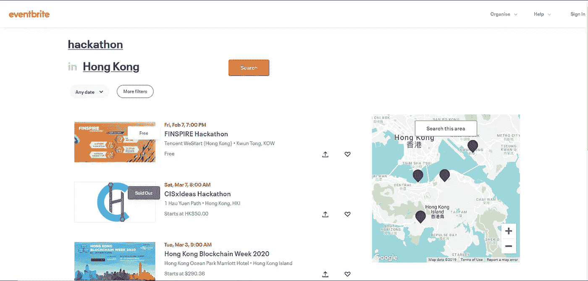
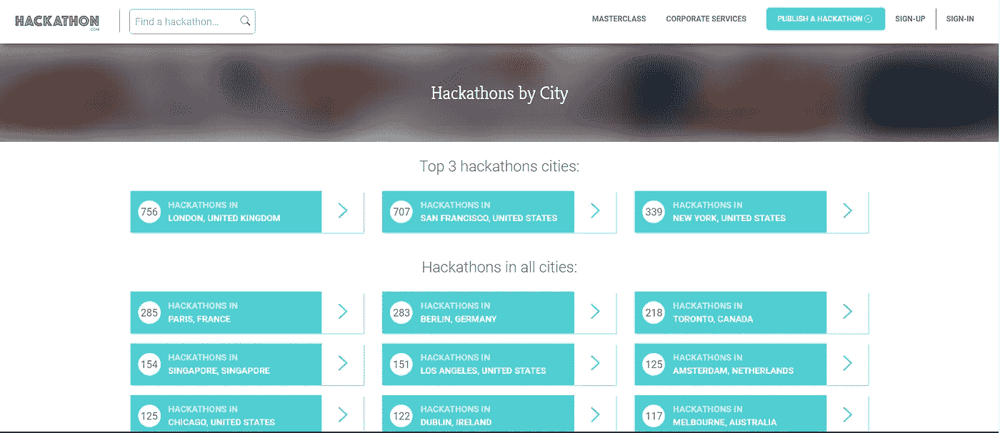
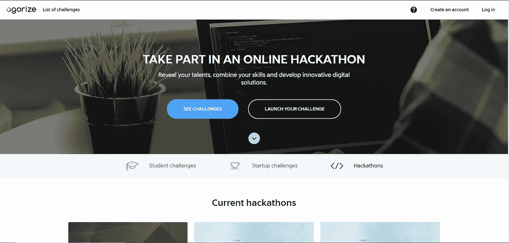
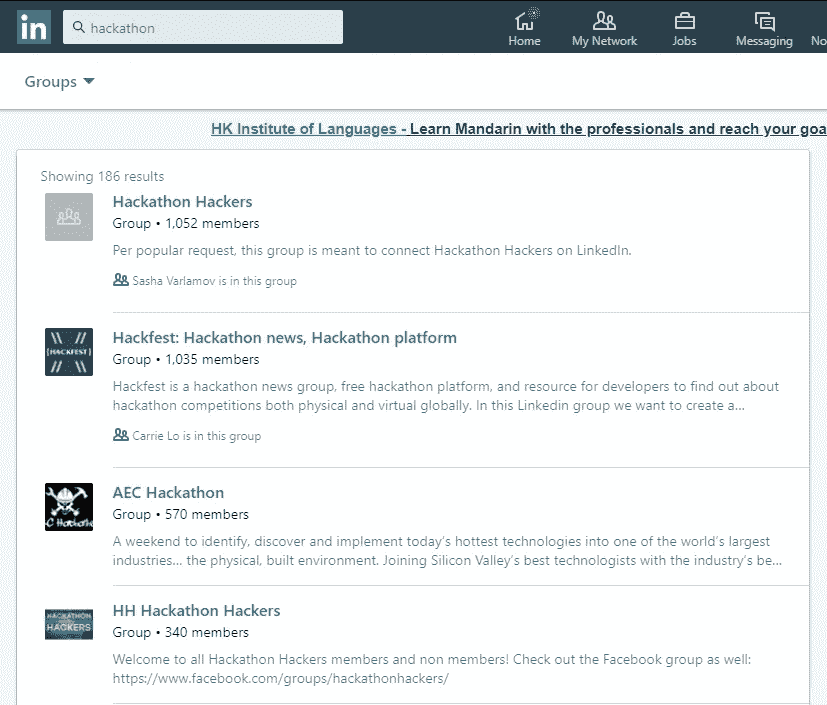

# 寻找黑客马拉松的 5 个有用渠道

> 原文：<https://towardsdatascience.com/5-useful-channels-to-find-hackathons-1a0aa9928e91?source=collection_archive---------42----------------------->

## 帮助你找到黑客马拉松的快速指南

在我开始分享我的黑客马拉松经历后，我收到了很多来自我的同伴的关于如何找到黑客马拉松的问题。他们想知道我怎么能参加这么多黑客马拉松。在这篇文章中，我将列出一些我搜索黑客马拉松的常见站点。

Photo by [cyda](https://cydalytics.blogspot.com/)

如果你是黑客马拉松的新手，请随意查看我的黑客马拉松系列，先了解更多关于黑客马拉松的信息。

 [## 欢迎来到黑客马拉松的世界

### 学生应该加入黑客马拉松的 5 个理由

medium.com](https://medium.com/series/welcome-to-the-world-of-hackathon-81d194abbec4) 

**1。eventbrite**

许多组织在 eventbrite 上发布他们的活动，因为它有一个开发良好的内置售票系统。你可以在这个网站上找到包括黑客马拉松在内的许多活动。你也可以根据地点和日期进行搜索。这是一个非常方便用户的网站。一旦您创建了您的帐户，系统将存储基本信息，这将有助于您在将来完成注册表的一些空白。如果某项活动的名额有限，此功能可以为您节省一些时间来获得该活动的座位。

## 【https://www.eventbrite.com/ 号

**2。HACKATHON.COM**

这个站点，通过查看域名，你可以知道这是一个特定的站点，供你搜索 hackathon。hackathon 类似于 eventbrite，但它不要求组织者在其网站上发布活动信息，相反，后端管理员将从互联网上抓取数据，并在网站上以有组织的方式显示所有黑客马拉松活动信息。同样，这个网站允许你按城市搜索黑客马拉松。在每个显示的黑客马拉松中，该网站都包括一个到官方活动页面的直接链接，供您注册该活动。

## [https://www.hackathon.com/](https://www.hackathon.com/)

**3。广场化**

这是一个在我的同学中非常受欢迎的搜索商业案例比赛的网站。除了案例竞赛，这个网站上还有一个特殊的类别是“在线黑客马拉松”。agorize 会不时与不同的公司合作举办黑客马拉松。所有的说明和问题陈述都将发布在 agorize 上，感兴趣的参与者需要组队并通过 agorize 提交他们的解决方案。除了合作伙伴的黑客马拉松，一些公司会把 agorize 作为发布黑客马拉松信息的分销渠道。因此，你也可以在网站上看到离线的黑客马拉松。如果你不确定线上和线下黑客马拉松的区别，请随意查看我的另一篇关于[主要类型的黑客马拉松](/4-common-types-of-hackathons-7daba7296ae1?source=friends_link&sk=ab48ee069d1914d3acbf666a1f538ba8)的文章。

## [https://www.agorize.com/en/online-hackathons](https://www.agorize.com/en/online-hackathons)

**4。社交媒体网站:facebook / Twitter / LinkedIn**

除了上述网站，黑客马拉松组织者还将通过社交媒体网站推广活动。类似于举办营销活动，组织者不希望他们的活动参与率低，所以他们也会设计许多推广材料发布在社交媒体网站上。如果你不想错过任何黑客马拉松的新闻，你可以关注#黑客马拉松或者加入一些为黑客马拉松爱好者设立的团体。

**5。学校邮箱**

这个频道只对那些还是学生的人开放。通常，在学校里，有一个单位负责课外活动。他们定期给学生发电子邮件，告知即将到来的内部和外部活动。这些活动通常针对学生参与者。如果你是一名学生，想体验一下什么是黑客马拉松，电子邮件列表上的那些黑客马拉松可能是你的一个很好的起点。由于所有的参赛者都是学生，与公共黑客马拉松相比，所选主题或问题的难度可能更适合学生。

提到的渠道是我搜索黑客马拉松的一些常用方法，我知道可能还有更多。如果你知道一些其他有用的网站来寻找黑客马拉松，请在下面随意评论。

如果你想了解更多关于黑客马拉松的信息，请继续关注我的黑客马拉松系列

如果你觉得我的文章有用，请在[我的 linkedIn 页面](https://www.linkedin.com/in/carrielsc/)上为我的技能背书，鼓励我写更多的文章。

最初发表于[cydalytics.blogspot.com](https://cydalytics.blogspot.com)