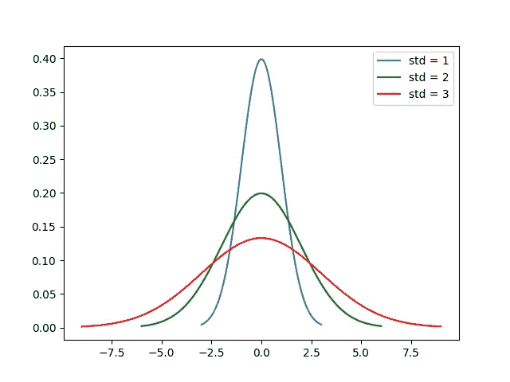
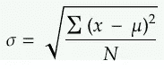
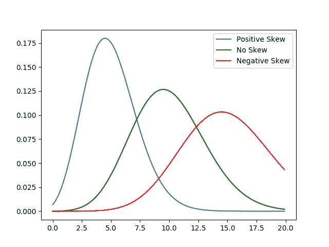
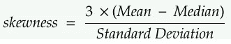
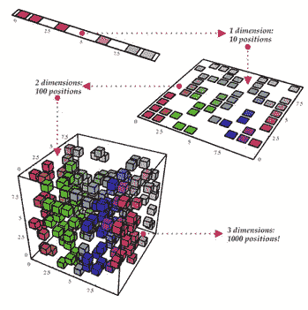

# 科学家需要知道的 5 个有用的统计数据

> 原文：<https://towardsdatascience.com/5-useful-statistics-data-scientists-need-to-know-5b4ac29a7da9?source=collection_archive---------9----------------------->


> 想获得灵感？快来加入我的 [**超级行情快讯**](https://www.superquotes.co/?utm_source=mediumtech&utm_medium=web&utm_campaign=sharing) 。😎

数据科学实际上可以定义为我们从数据中获取额外信息的过程。在做数据科学时，我们真正想做的是解释所有数据在真实世界中的实际意义*而不是数字。*

为了提取复杂数据集中的信息，数据科学家采用了许多工具和技术，包括数据探索、可视化和建模。在数据探索中经常使用的一类非常重要的数学技术是**统计学**。

从实际意义上来说，统计学允许我们对数据进行具体的数学概括。我们可以用统计学来描述它的一些属性，而不是试图描述每一个数据点。这通常足以让我们提取一些关于数据结构和组成的信息。

有时候，当人们听到“统计”这个词时，他们会想到一些过于复杂的东西。是的，这可能有点抽象，但是我们并不总是需要求助于复杂的理论来从统计技术中获得某种价值。

统计学中最基本的部分通常在数据科学中最有实际用途。

今天，我们将看看数据科学的 5 个有用的统计数据。这些将不会是疯狂的抽象概念，而是简单的，适用的技术，走了很长的路。

我们开始吧！

# (1)集中趋势

数据集或特征变量的中心趋势是集合的*中心*或*典型值*。这个想法是，可能有一个单一的值可以最好地描述(在一定程度上)我们的数据集。

例如，假设您有一个以(100，100)的 x-y 位置为中心的正态分布。则点(100，100)是中心趋势，因为在所有可供选择的点中，它是提供数据的最佳汇总的点。

对于数据科学，我们可以使用集中趋势度量来快速简单地了解我们的数据集作为一个整体的样子。我们数据的“中心”可能是一条非常有价值的信息，它告诉我们数据集到底有多偏向*，因为数据围绕的任何值本质上都是一种偏向。*

*有两种常用的方法来数学选择一个中心趋势。*

## *平均*

*数据集的平均值是*平均值*，即整个数据围绕其展开的数字。定义平均值时，计算平均值时使用的所有值的权重相等。*

*例如，让我们计算以下 5 个数字的平均值:*

*(3 + 64 + 187 + 12 + 52) / 5 = 63.6*

*平均值对于计算实际的数学平均值非常有用。使用像 Numpy 这样的 Python 库进行计算也非常快*

## *中位数*

*中位数是数据集的中间值，即如果我们从最小到最大(或从最大到最小)对数据进行排序，然后取集合中间的值:这就是中位数。*

*让我们再次计算同一组 5 个数字的中值:*

*[3，12， **52** ，64，187] → **52***

*中值与平均值 63.6 大相径庭。这两个都没有对错，但是我们可以根据自己的情况和目标选择一个。*

*计算中位数需要对数据进行排序，如果数据集很大，这是不切实际的。*

*另一方面，对于异常值，中值将比平均值更加稳健，因为如果存在一些非常高的异常值，平均值将会被拉向某个方向。*

*平均值和中值可以用简单的 numpy 一行程序计算:*

```
*numpy.mean(array)
numpy.median(array)*
```

# *(2)传播*

*在统计学的保护伞下，数据的**分布**是数据被*压缩*到一个单一值或更大范围的程度。*

*看看下面的高斯概率分布图，假设这些是描述真实数据集的概率分布*

*蓝色曲线具有最小的扩散值，因为它的大多数数据点都落在一个相当窄的范围内。红色曲线具有最大的扩散值，因为大多数数据点占据了更宽的范围。*

*图例显示了这些曲线的标准偏差值，将在下一节中解释。*

**

## *标准偏差*

***标准差**是量化数据分布的最常见方式。计算它包括 5 个步骤:*

*1.求平均值。*

*2.对于每个数据点，求其到平均值的距离的平方。*

*3.对步骤 2 中的值求和。*

*4.除以数据点的数量。*

*5.求平方根。*

**

*Made with [https://www.mathcha.io/editor](https://www.mathcha.io/editor)*

*较大的值意味着我们的数据更加“分散”于平均值。较小的值意味着我们的数据更集中在平均值附近。*

*轻松计算 Numpy 中的标准差，如下所示:*

```
*numpy.std(array)*
```

# *(3)百分位数*

*我们可以使用**百分位**进一步描述整个范围内每个数据点的*位置*。*

*百分位描述了数据点在数值范围中的准确位置，即它的位置是高还是低。*

*更正式地说，第 pth 百分位是数据集中可以分成两部分的值。下部包含数据的百分比，即 pth 百分位数。*

*例如，考虑下面的 11 个数字:*

```
*1, 3, 5, 7, 9, 11, 13, 15, 17, 19, 21*
```

*数字 15 是第 70 个百分位数，因为当我们在数字 15 处将数据集分成两部分时，剩余数据的 70%小于 15。*

*百分位数结合平均值和标准偏差可以让我们很好地了解特定点在数据分布/范围内的位置。如果它是一个异常值，那么它的百分位将接近末端——小于 5%或大于 95%。另一方面，如果百分位数被计算为接近 50，那么我们知道它接近我们的中心趋势。*

*数组的第 50 个百分位数可以用 Numpy 来计算，如下所示:*

```
*numpy.percentile(array, 50)*
```

# *(4)偏斜度*

*数据的偏斜度衡量其不对称性。*

*偏斜度的正值意味着值集中在数据点中心的左侧；负偏度意味着值集中在数据点中心的右侧。*

*下图提供了一个很好的例子。*

**

*我们可以用下面的等式计算偏斜度:*

**

*Made with [https://www.mathcha.io/editor](https://www.mathcha.io/editor)*

*偏斜度将让我们了解我们的数据分布有多接近高斯分布。偏斜度越大，我们的数据集离高斯分布越远。*

*这很重要，因为如果我们对数据的分布有一个粗略的想法，我们就可以为特定的分布定制我们要训练的任何 ML 模型。此外，并不是所有的最大似然建模技术对非高斯数据都有效。*

*再一次，在我们开始建模之前，stats 给了我们深刻的信息！*

*下面是我们如何计算 Scipy 代码中的偏斜度:*

```
*scipy.stats.skew(array)*
```

# *(5)协方差和相关性*

## *协方差*

*两个特征变量的协方差衡量它们的“相关”程度。如果两个变量有正的协方差，那么当一个变量增加时，另一个也增加；对于负协方差，特征变量的值将在相反的方向上变化。*

## *相互关系*

*相关性是简单的标准化(缩放)协方差，其中我们除以被分析的两个变量的标准偏差的乘积。这有效地迫使相关性的范围总是在-1.0 和 1.0 之间。*

*如果两个特征变量的相关性为 1.0，则变量具有完美的正相关性。这意味着，如果一个变量发生一定的变化，第二个变量也会按比例向相同的方向移动。*

**

*Illustration of PCA used for Dimensionality Reduction*

*小于 1 的正相关系数表示不完全正相关，相关强度随着数字接近 1 而增加。同样的想法适用于负的相关值，只是特征变量的值以相反的方向变化，而不是以相同的方向变化。*

*了解相关性对于像用于降维的[主成分分析](/principal-component-analysis-your-tutorial-and-code-9719d3d3f376) (PCA)这样的技术非常有用。我们从计算相关矩阵开始——如果有两个或更多高度相关的变量，那么它们在解释我们的数据时实际上是多余的，其中一些可以被删除以降低复杂性。*

# *喜欢学习？*

*在[推特](https://twitter.com/GeorgeSeif94)上关注我，我会在那里发布所有最新最棒的人工智能、技术和科学！也在 [LinkedIn](https://www.linkedin.com/in/georgeseif/) 上和我联系吧！*