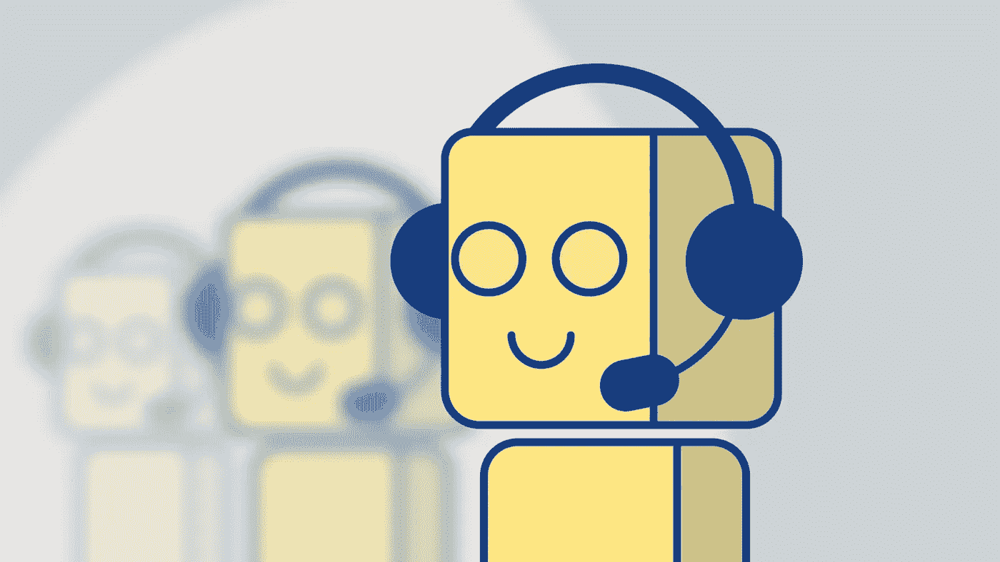

# 人工智能和聊天机器人改变教育的 5 种方式

> 原文：<https://towardsdatascience.com/5-ways-artificial-intelligence-and-chatbots-are-changing-education-9e7d9425421d?source=collection_archive---------19----------------------->

人工智能(AI)和聊天机器人正在以我们想象不到的更多方式改变世界。完成多样化的任务，人工智能和聊天机器人已经成为我们日常生活中的一个正常元素。该技术在包括教育和在线辅导在内的各种领域的发展中发挥了重要作用。

通过人工智能，教育工作者和教育机构已经能够为学生提供个性化的学习环境。人工智能驱动的工具不仅改善了学生的互动和协作，还在创新的教育技术世界中扮演了游戏改变者的角色。以下是人工智能和聊天机器人影响和改变教育的 5 种方式。

# **个性化学习**

人工智能有助于根据每个学习者的兴趣优化学习的速度和教学方法。适应个人的学习速度，人工智能不断解决更复杂的任务，以加快学习过程。因此，两种学生/学习者——慢的和快的，都可以按照自己的节奏继续学习。

通过 AI，学生还可以在课堂外获得个性化的[在线辅导](https://chemistryguru.com.sg/)。在任务开始时，当学生需要加强技能或掌握思想时，AI 会通过为学生提供获得成功所需的额外工具来拯救他们。

# **自动评分&绩效考核**

有了人工智能，老师们在评分方面就有了他们需要的所有帮助。事实上，有了这项技术，分级员的角色就被传递了。目前的人工智能技术能够对多选题进行自动评分。然而，随着人工智能的进一步发展，预计该技术将能够比标准化评估更好地评分。

# **监考**

人工智能变得重要的一个领域是在线监考空间。监考是通过防止考生通过监考人作弊来确保考试真实性的方法。人工智能技术目前正被用来加强这一虚拟领域。

随着远程学习而来的是远程考试。在这种考试中，降低学生作弊的风险变得至关重要。这就是人工智能驱动的保护系统来救援的时候了。

# **反馈会议**

反馈在改善学生和教师的学习过程中起着重要的作用。学生的反馈让教师有机会发现教学工作中的差距并加以改进。另一方面，老师的反馈让学生知道他们需要在哪些方面付出额外的努力。教师可以通过作业、评估和测试轻松地与学生分享反馈。而教育机构使用在线和印刷表格向学生提供反馈。

这种分享反馈的过程变得非常真实，并与人工智能和聊天机器人互动。随着市场上各种人工智能驱动的聊天机器人的出现，学生自由表达自己变得更加容易。根据提出的问题和分享的反馈，机器人汇编了大多数学生提到的重点，并进一步发送给教师。

事实上，有一些人工智能驱动的平台在教室内提供反馈会议，以快速跟踪学习过程和面向学生的课程活动。

# **对学生和教师的实例援助**

在当今时代，学生在技术的帮助下，可以即时获取所有信息。从张贴图片到发送电子邮件，任何任务都只需点击几下鼠标。在这个快节奏的环境中，对于教育者、在线导师和教育机构来说，加强他们的学生沟通过程变得非常重要，尤其是在入学季。

人工智能和聊天机器人为访问大学网站或办公室的学生提供实例帮助，以获得更多关于录取过程和相关细节的信息。这项技术将耗时的亲自回复每个查询的任务转化为自动化的任务，而且是即时的。这不仅节省了学生的时间，也减轻了机构手动答题的负担。

澳大利亚维多利亚州迪肯大学的[精灵聊天机器人就是这样一个例子。聊天机器人回答了学生需要了解的关于校园生活的所有问题。迪金斯大学的首席信息官威廉·孔法罗尼埃内是该项目的幕后策划者。](http://www.deakin.edu.au/about-deakin/media-releases/articles/deakin-genie-digital-student-assistant-wins-major-global-business-award)

引用孔法罗尼埃内的话说，“*使用这项技术最有希望的机会是支持更加个性化的校园服务方式，这种方式仍然吸引着大量的人群。该系统还将有助于减轻压力过大的教师的负担，因为他们不再需要一遍又一遍地向不同的学生解释同样的事情。*

人工智能以多种方式为教师提供帮助。除了帮助他们评分，人工智能还可以帮助教师轻松管理日常任务。