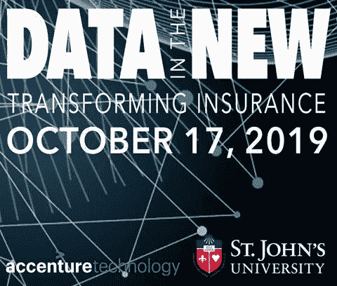

# 数据改变保险业的 5 种方式

> 原文：<https://towardsdatascience.com/5-ways-data-is-transforming-the-insurance-industry-2800eec14ec5?source=collection_archive---------9----------------------->

St. John’s Tobin School of Risk Conference on Transforming Insurance

我最近在纽约市圣约翰风险学院举行的一次关于保险行业中数据使用的会议上发表了讲话，以下是我学到的 5 件关键事情:

1.  **所有保险公司都渴望使用更多的数据，但很少有公司能够将数据的使用付诸实施**

Operationalizing Data Is a Challenge

由于人工智能和机器学习，保险行业对数据的价值有了新的认识。预测模型在保险行业中有无数的应用，包括优化客户获取、提供个性化服务、高效处理索赔、智能承保保单以及更有效地检测欺诈。构建和训练预测模型的常见因素是运营和业务数据。幸运的是，该行业可以从内部和外部来源获得大量数据。会议上坐在我旁边的一个人在一家再保险公司工作，有“数据猎人”的头衔。她唯一的工作就是寻找新的数据源来帮助公司。然而，对于现有的保险公司来说，实施人工智能可能具有挑战性，因为它们的传统 IT 基础架构无法扩展以利用新的数据源，并且它们的内部数据被锁定在彼此不兼容的孤岛中。

行业现有企业面临的最大机遇之一是打破企业数据孤岛。(参见我的博客[关于数据仓库的文章](/how-data-science-silos-undermine-application-modernization-14cee5ff3047)。)设想一个数据平台，将客户、保单和索赔数据全部存储在一个地方，以便新保单核保可以考虑以前的索赔，并利用来自核保流程(如保单修改)的数据。

**2。先行者正在以非常有趣的方式使用外部数据:**

Sensors in Homes Transform P&C Insurance Via Prevention

如果说有一个共同的线索有可能改变保险业的所有细分市场和业务线，那就是外部数据的使用。新的数据源对保险行业来说是变革性的，因为它们可以使客户交互无缝化，从而提高品牌忠诚度，使索赔管理等关键业务流程变得高效，甚至有助于实施预防性做法，从而提高行业的整体盈利能力。让我们探索一些新的数据源。

*   装有传感器(远程信息处理)和移动应用程序的汽车将使索赔管理过程自动化。有了来自传感器的数据，保险公司将不再依赖事故中涉及的各方来确定责任。此外，将人工智能和机器学习(ML)应用于这些数据将使保险公司能够在几天内解决索赔并支付损失，而不是几周或几个月。传感器数据和 ML 还将在识别欺诈索赔和防止索赔方面发挥重要作用，以提高保险公司的盈利能力。我喜欢这个广告，其中怀孕的母亲坚持她的丈夫不要超速去医院，这样她就可以在她的手机应用程序上保留她的安全驾驶评级。不使用移动应用程序加速的财务激励。
*   传感器不仅与汽车保险相关，还与财产和意外伤害(P&C)业务相关。恒温器、烟雾探测器和安全系统等智能设备只是预防不利事件的第一步。一旦我们在家里和办公室安装了传感器，可以在火灾和泄漏等事件发生前检测到它们，并通知相关机构或房主，保险公司每年必须支付的潜在损失将大大减少。
*   根据 eMarketer 的数据，大约 22%的美国人拥有可穿戴设备。这些跟踪身体活动和生命体征的设备使保险公司能够根据投保人的生活方式将这些数据纳入人寿保险政策的定价中。知道如何利用这些数据作为其承保和定价流程的一部分的保险公司，也将在瞄准最健康和最赚钱的人群方面享有先发优势。

**寓意**

保险公司需要一个具有三个定义属性的数据平台。它不仅必须能够存储来自不同数据源的数据，包括上面提到的数据源。它还必须能够通过简单地添加商用服务器，从 TB 扩展到 Pb，从几个节点扩展到数百个节点。因此，横向扩展能力非常重要。

第二，平台本身必须能够支持任务关键型应用，并促进数据分析。洞察不应该与应用分离，而应该紧密联系在一起。

第三，该平台必须提供使用机器学习来构建、训练和操作预测模型的功能。它应该能够在一个系统中存储内部和外部生成的数据，加速模型训练，跟踪工作流，并将这些模型投入生产。

**3。现有企业将需要基于技术的解决方案来应对保险技术和行业颠覆**

InsurTech Upstarts Are Hard To Catch

InsurTechs 指的是利用技术颠覆传统保险行业的公司。InsurTechs 往往是较小的创业公司，扎根于数据、人工智能和移动应用程序开发。例如，DataCubes 和 Friss 等公司正在利用数据科学来转变和加速核心保险功能，如商业承保和欺诈检测。其他公司，如 Metromile 和 Root Insurance，正在根据客户的驾驶距离和习惯重新设计核心保险产品，如基于使用的汽车保险。

保险技术不仅通过技术应用颠覆了这个行业，还重塑了消费者的期望和需求。根据麦肯锡的研究，自 2012 年以来，已有超过 100 亿美元投资于保险科技行业。

**寓意**

为了有效地与 InsurTechs 竞争，现有公司必须重新发明和更新作为其竞争优势来源的应用程序。这些都是 InsurTechs 使用人工智能和机器学习瞄准的相同应用程序。现任者拥有丰富的数据源和受过 SQL 等技术培训的经验丰富的人员。保险公司需要考虑一个能够使用 SQL 有效管理运营和分析数据的统一平台，而不是试图将传统 IT 基础架构的各种组件捆绑在一起并获得难以找到的技能。统一的平台使市场领导者能够在数据库级别构建预测算法。数据库中的机器学习可以大大加快决策速度，并帮助在职者抵御讨厌的保险技术。

**4。数据湖仍然困扰着保险公司**

Drowning in Data Lakes

为了有效管理大数据并推动实时分析和决策，保险行业在数据湖上投入了大量资金。这些数据湖是使用商业 Hadoop 发行版构建的——灵活数量的独立开源计算引擎加入到一个公共平台中以实现规模。然而，数据湖的读取模式功能导致保险公司绕过定义哪些表包含哪些数据以及它们如何相互连接的过程，导致随意构建存储库。

数据湖项目已经开始失败，因为保险公司和其他行业的公司一样，优先考虑将所有企业数据存储在一个中心位置，目标是让所有开发人员都可以使用这些数据——如果你愿意，这是一个优步数据仓库，而不是考虑数据将如何推动应用程序。因此，Hadoop 集群已经发展成为企业数据管道的网关，用于过滤、处理和转换数据，然后将数据导出到其他数据库和数据集市，以便向下游报告。数据湖中的数据几乎永远不会出现在真正的业务应用程序中。因此，数据湖最终成为一组庞大的不同计算引擎，在不同的工作负载上运行，全部共享同一存储，非常难以管理。(参见我关于数据湖和 Hadoop 的博客。)

**寓意**

正如我在上面提到的博客文章中所讨论的，保险公司面临着越来越大的压力来证明他们的数据湖的价值。我建议他们首先关注操作应用程序，然后再研究所需的数据。

通过专注于利用数据和智能实现应用的现代化，保险公司将能够开发能够利用数据预测未来可能发生的事情的应用。然后，保险公司可以在没有人工干预的情况下主动做出决策，从而带来卓越的业务成果。

**5。监管机构将数据治理和 ML 透明度放在首位**

Machine Learning Needs To Be Transparent And Traceable

鉴于巨大的数据量和多样化的数据源，如果应用程序能够在没有人工干预的情况下大规模地做出智能决策，那么人工智能和 ML 的真正价值就能得到最好的实现。然而，这种能力一旦实现，就会产生“黑盒”的感觉，其中大多数业务人员不完全理解预测模型为什么或如何采取某个动作。这种能力不仅很好，而且对于保险公司必须能够记录和维护其决策(如拒绝索赔或保险单)的用例来说非常重要。监管机构将越来越多地向保险公司施压，要求它们解释预测模型的内部运作方式，特别是在模型用于承保和定价以确定保费的情况下，以确保不存在任何歧视性做法。

**含义**

数据治理提供了一个框架，有助于定义在任何生态系统中如何获取、管理和使用数据。该框架用于增强企业对其数据以及基于分析该数据而采取的行动的信心。在保险行业经历重大转型之际，公司需要一个强大的框架来提供对数据谱系、对数据执行的转换以及如何使用数据的可见性。这个框架还必须涵盖预测和机器学习模型。保险公司必须能够向监管机构展示他们的数据科学家进行的所有实验，以及哪个模型投入生产，以及它是如何随着时间的推移而修改的。因此，数据治理必须成为数据科学家用来构建、培训和操作模型的平台的一个组成部分。

为了实现这一目标，考虑一个为数据科学家提供自由实验能力的平台。构建预测模型是一个迭代过程，需要数据科学家不断调整他们的模型，并评估这些变化对模型准确性的影响。为了跟踪他们的实验，数据科学家需要一个像 [MLFlow](https://mlflow.org/) 这样的平台。MLFlow 拥有一个内置的功能来跟踪和记录每次迭代的变量。通过这种方式，数据科学家可以向内部利益相关者和外部监管者等客观地展示将特定模型投入生产的理由。他们还可以证明不存在任何歧视性做法。

_________

如果您想了解保险行业应用程序现代化的更多信息，Splice Machine(我是该公司的首席执行官和联合创始人)的团队已经创建了一份[白皮书](https://info.splicemachine.com/insurance-application-modernization.html?utm_source=blog&utm_medium=medium&utm_campaign=insurance-data)，反映了我们与一些世界领先的保险公司所做的工作。