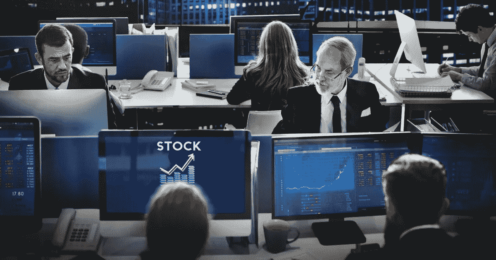

# 数据科学改变金融交易的 5 种方式

> 原文：<https://towardsdatascience.com/5-ways-data-science-is-changing-financial-trading-b7404d62ed6d?source=collection_archive---------16----------------------->

大数据正在改变一切。从广告和技术到医疗保健和我们的日常生活，信息正在产生影响。

我们终于有了从生活的各个方面收集无限量数据的技术和手段。此外，我们可以将所有这些放在一起，以便于理解和实施。这些信息带来的变化可以让几乎任何事情变得更有效率，包括交易。

金融交易是一项精密的工作，在崩溃之前不能犯太多的错误。这就是为什么人们开始实施数据和人工智能来帮助解决问题。这样，每件事都可以做得更快更好，而不会偷工减料。

以下是数据科学如何给金融交易行业带来巨大变化的几个例子。

# 1.大数据分析

关于金融交易的数据不仅仅包括价格和波动。它还试图理解成本波动的原因。利率通常是供求关系的反映。社会和政治趋势也会影响销售。然而，供求背后的原因是可以评估的，也可能是可以解决的。

这个数据收集过程为创建预测模型铺平了道路。数据可以开始观察趋势，而机器学习可以发现人类容易忽略的早期模式。对某种东西将会上涨或下跌的预测可以在未来导致安全、明智的决策。

# 2.股票评估

海量数据让金融交易世界变得更加可预测。因此，股票交易发生了一些重大变化。人工智能现在可以充当个人股票顾问。

该软件可以观察金钱方面的模式、趋势和可能的结果。由于基础股票之间的[相关性](https://optionmetrics.com/data-products/)以及以前的模式如何与当前趋势相结合，人工智能可以做出这些假设。

然而，人工智能对股市的影响并不仅限于预测股市走向。数据可以告诉你一个合理的交易价格，不管你是买还是卖。利用这些信息，你可能会承担更少的风险，获得更高的回报。如果你喜欢安全地玩股票交易，人工智能顾问可能是一个好主意。

# 3.实时信息

通过将世界各地的每个人联系在一起，技术极大地推动了现代社会的发展。

与 40 年前不同，地球上不同地方的两个人之间的对话可以立即进行。不断的分享带来了快速的进步，包括金融交易领域。

金融交易向来节奏极快，尤其是讨论股市的时候。现在，你也可以立即获得信息。实时数据可以让你做出更好、更快的决策。由于人工智能只提供基本和相关的信息，错误会自动减少。

# 4.机器学习

我们还没有真正理解机器学习是如何改变金融交易的。

首先要理解的是，这项技术不是人工智能，而是一个子集。机器学习是识别模式并根据积累的数据做出预测的部分。

我们已经在机器学习方面取得了飞跃。然而，现实是，我们仍然处于这项技术全部潜力的尖端。大公司现在正跳上人工智能列车。2019 年末，摩根大通实施了第一个机器人来完成其全球股票算法业务的交易。

# 5.有些公司从人工智能开始

摩根大通是一家大公司，但它不是金融贸易领域人工智能的先驱。许多公司与人工智能合作，尽可能做出最好的金融交易决策。他们中的一些人继续在[尝试新的想法](https://builtin.com/artificial-intelligence/ai-trading-stock-market-tech)，这是世界其他地方正在慢慢开始采取的开创性步骤。

总部位于芝加哥的 Greenkey Technologies 已经开始使用语音识别和语言处理技术，目的是尽可能地节省在交易大厅的时间。

与此同时，伦敦的 Auquan 拥有一个数据科学平台，任何人都可以展示他们的算法并获得灵感。同样位于伦敦的 AITrading 利用人工智能来增加交易利润并最大限度地利用机会。不用说，金融交易领域已经出现了大量的机器学习。

# 未来的金融交易

随着我们对人工智能和机器学习的了解越来越多，我们在工作中变得更加高效。

金融交易已经存在了很长时间，而且不会很快消失。如果你想保持可持续发展，优化流程是唯一可能实现的飞跃。

当涉及到贸易领域的这么多钱时，你不能在最后一刻犯错误或发现问题。

利用手头最好的信息——以及能够检测隐藏模式的软件——永远是正确的选择。

*图像通过* [*Rawpixel*](https://www.rawpixel.com/image/1075842/free-image-rawpixelcom)