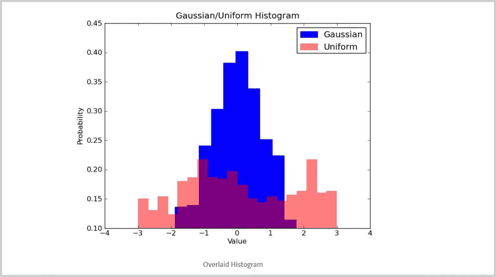

# 获得真实世界数据科学经验的 5 种方法

> 原文：<https://towardsdatascience.com/5-ways-to-gain-real-world-data-science-experience-674f0c80e836?source=collection_archive---------4----------------------->

[在没有数据科学工作的情况下获得数据科学经验](https://www.dataoptimal.com/data-science-experience/)似乎令人望而生畏。

我从试图进入数据科学的人们那里得到的最大问题之一是**“如果我没有数据科学的工作，我如何获得数据科学的经验？”**。

为了回答这个问题，我总结了以下 5 种获得有用的真实数据科学经验的方法:

*   构建小项目
*   志愿成为一名数据科学家
*   加入聚会
*   创建教程
*   为开源项目做贡献

我将详细讨论每一个问题，并给出具体的行动。

在你开始申请数据科学工作之前，你当然不需要做清单上的所有事情。

我的建议是集中精力做清单上的一两件事，不要试图一次做完所有的事。

# 构建小项目

我获得现实世界数据科学经验的第一个方法，也可能是最喜欢的方法是[构建小项目](https://www.dataoptimal.com/data-science-projects-2018/)。

我说“小”是因为它不是一个完整的端到端项目。

如果你试图一次完成太多事情，你将一事无成。

你最好选择一项特定的技能，做一个小项目，并在你的 GitHub 页面文件夹中展示它。

[GitHub Pages](https://pages.github.com/)

这里有一些你可以做的快速项目的例子。

# 1.收集和清理杂乱的数据集

收集和清理杂乱的数据集是展示以下现实世界技能的好方法:

*   如何确定项目范围和收集数据的计划
*   使用不同的数据格式(CSV、JSON、XML)
*   不同的数据收集方法(SQL、API、网络搜集)
*   思考不同的数据清理任务

创建数据清理项目的最佳方式是找到一个杂乱的数据集，选择一种工具，并专注于一项技能。

[Data Cleaning with R](https://www.dataoptimal.com/data-cleaning-with-r/)

以下是一些杂乱数据集的来源:

*   [Data.gov](https://www.data.gov/)
*   [UCI 机器学习知识库:电视商业数据集](http://archive.ics.uci.edu/ml/datasets/tv+news+channel+commercial+detection+dataset)
*   [Kaggle:处理缺失值](https://www.kaggle.com/rtatman/data-cleaning-challenge-handling-missing-values)

# 2.浏览数据集

探索数据集，也称为探索性数据分析(EDA ),是展示您执行以下操作的能力的好方法:

*   形成相关问题
*   调查这些问题
*   利用不同类型的地块
*   展示你的发现

以下是执行探索性分析的一些来源:

*   [IBM 分析社区](https://developer.ibm.com/exchanges/data/)
*   [Kaggle 数据集](https://www.kaggle.com/datasets)
*   [UCI 机器学习知识库:个人家庭用电量](https://archive.ics.uci.edu/ml/datasets/individual+household+electric+power+consumption)

# 3.做预测

我建议在机器学习项目之前创建一个数据清理或探索性项目。

到目前为止，机器学习更受欢迎，但在现实世界的数据科学工作中，你可能会花更多的时间来清理和探索数据。

话虽如此，了解机器学习的基础知识仍然很重要。我建议将逻辑回归或线性回归模型放在一起。

[Logistic Regression](https://scikit-learn.org/stable/modules/generated/sklearn.linear_model.LogisticRegression.html)

这些都是很好的模型，因为它们比随机森林之类的东西更容易解释。在试图把事情变得过于复杂之前，了解基本情况是至关重要的。

这里有几个数据集可以帮你入门:

*   逻辑回归— [贷款违约预测](https://www.kaggle.com/c/loan-default-prediction/data)
*   线性回归— [预测房屋销售价格](https://www.kaggle.com/c/house-prices-advanced-regression-techniques/overview)

确保记录下你所有的工作，并且整洁地写下来。

一个很好的工具是 Jupyter 笔记本。这将允许您编写和执行您的代码，同时还能够使用 Markdown 记录您的工作。

[Jupyter Notebooks](https://jupyter.org/)

一旦你写好了你的项目，一定要在你的 [github](https://github.com/) 个人资料和 [github 作品集页面](https://pages.github.com/)上记录你的工作。

这里有一些关于[构建数据科学项目](https://www.dataoptimal.com/data-science-projects-2018/)的额外资源。

# 志愿成为一名数据科学家

志愿作为一名数据科学家是获得一些经验的另一个好方法。

另一个好处是你为更好的利益贡献了你的时间。

开始数据科学志愿服务的一个选项是使用 [DataKind](https://www.datakind.org/) 。

[DataKind](https://www.datakind.org/)

你可以自愿加入一个项目，也可以提交自己的项目。

以下是 DataKind 解决关键人道主义问题的一些领域:

*   教育
*   贫困
*   健康
*   人权
*   环境
*   城市

DataKind 有一大堆很棒的项目要参与。这里有几个例子:

*   [创建更安全的街道](https://www.datakind.org/projects/creating-safer-streets-through-data-science)
*   [预测加州需水量](https://www.datakind.org/projects/forecasting-water-demand-in-california-when-every-drop-counts)
*   [机器学习帮助农村家庭用上电](https://www.datakind.org/projects/machine-learning-to-help-rural-households-access-electricity)

[Forecasting Water Demand](https://www.datakind.org/projects/forecasting-water-demand-in-california-when-every-drop-counts)

另一个很好的选择是[驱动数据](https://www.drivendata.org/)。

这家公司主办在线[竞赛](https://www.drivendata.org/competitions/)关注社会影响。

它类似于 Kaggle，但不是专注于商业影响，而是为了社会公益。

[DrivenData](https://www.drivendata.org/)

DrivenData 举办比赛的领域包括:

*   国际发展
*   健康
*   教育
*   研究和保护
*   公共服务

DrivenData 有一些非常有趣的比赛。以下是一些现在和过去的比赛示例:

*   [数据挖掘水面表](https://www.drivendata.org/competitions/7/pump-it-up-data-mining-the-water-table/)
*   [模拟地震破坏](https://www.drivendata.org/competitions/57/nepal-earthquake/)
*   [预测能源消耗](https://www.drivendata.org/competitions/51/electricity-prediction-machine-learning/)

[Predicting Heart Disease](https://www.drivendata.org/competitions/54/machine-learning-with-a-heart/)

志愿参与数据科学项目对社会有益，也有助于培养你的团队合作技能。

数据科学的很大一部分是能够与其他人交流和合作。作为志愿者加入数据科学团队是发展这些技能和成长的好方法。

# 加入聚会

[聚会](https://www.meetup.com/topics/data-science/)是另一种获得数据科学实际经验的好方法。

这些活动都是在你所在的城市亲自举办的。

它们的范围可以从教育演示到基于团队的编码项目。

[Meetup](https://www.meetup.com/)

聚会很棒，因为它们也提供了很好的社交机会。

您可以接触到来自不同规模和背景的公司的真实数据科学家。

要找到你当地的聚会，只需在互联网上快速搜索“你的城市”+“数据科学聚会”。

我在纽约做了一个快速搜索，下面是我找到的内容:

*   [Scala + Python + Spark +数据科学](https://www.meetup.com/python-plus-data-science/)
*   [全民数据科学:纽约州](https://www.meetup.com/DataScience4All/)
*   [数据驱动的纽约市](https://www.meetup.com/DataDrivenNYC/)

[Data Science groups in New York](https://www.meetup.com/topics/data-science/us/ny/new_york/)

这些聚会从教育性的到知识性的都有。

例如，[“全民数据科学:纽约”](https://www.meetup.com/DataScience4All/) meetup 的目标是“…让与会者做好数据科学的准备，并扩展实践数据科学家的技能。”

他们过去的一些聚会包括:

*   广义线性模型导论
*   数据科学项目之夜
*   详细线性回归

在[数据科学项目之夜](https://www.meetup.com/DataScience4All/events/257191357/)上，你可以获得项目方面的建议和工作。如果你没有项目，你可以和其他人一起做他们的项目。

[Data Science Project Night](https://www.meetup.com/DataScience4All/events/257191357/)

像这样的活动是向他人学习的好方法。既有关于编码和机器学习等技术技能，也有关于如何成为更好的沟通者和团队成员。

[“Scala+Python+Spark+数据科学”](https://www.meetup.com/python-plus-data-science/) meetup 提供了编程实践的机会。他们最近的聚会包括:

*   基本的 Python 游戏-通过构建简单的控制台游戏来提高您的 Python 技能
*   Python 中的自然语言处理简介
*   数据科学应用统计学简介

聚会真的是获得一些实践经验和向他人学习的好方法。

# 创建教程

教授一项技能并在博客中展示是另一种获得经验的好方法。

你将向他人展示你能够发挥你在简历中宣传的技能。

这也展示了你的沟通技巧。在工作场所，你需要成为一个好的倾听者和好的老师。

以下是针对不同类型的辅导型项目的一些想法:

*   传授一项有用的技能——如何清理杂乱的数据集
*   知识技能——如何解释逻辑回归模型的系数
*   高级技能—从头开始编写算法(反向传播是如何工作的？)

我会从做一个有用技能或知识技能的教程开始。

一个很有用的技巧是类似于[“如何用 R 检测缺失值”](https://www.dataoptimal.com/data-cleaning-with-r/)。

[Data Cleaning with R](https://www.dataoptimal.com/data-cleaning-with-r/)

您可以找到一个混乱的数据集，然后逐步完成检测混乱值的过程。

一定要一路展示你的代码，并解释你正在使用的函数，以及它们到底在做什么。

我关于用 R 清理数据的博文是这类项目的一个很好的例子。

知识技能是另一种很好的项目类型，尤其是当你正在学习的时候。也许类似于[“解释逻辑回归模型的系数”](https://rpubs.com/OmaymaS/182726)。

[Interpreting Odds Ratios in Logistic Regression](https://rpubs.com/OmaymaS/182726)

我最喜欢的快速学习方法是尝试和教授。

你有没有想过你理解了一些事情，然后你试图向某人解释，却发现你不能？

试着选择一个话题，写一篇博文。真正解释细节，但尽量不要用很多技术术语。

能够理解一个主题，并简单详细地解释它，是雇主希望看到的真正有价值的技能。

# 为开源项目做贡献

获得数据科学经验的最后一种方式是参与[开源](https://en.wikipedia.org/wiki/Open-source_software)项目。

这是熟悉流行的数据科学库的好方法。以下是数据科学领域的一些开源项目的示例:

*   [熊猫](https://pandas.pydata.org/)
*   [Scikit-learn](https://scikit-learn.org/stable/)
*   [潮汐](https://www.tidyverse.org/)

[Contributing to Pandas](https://pandas.pydata.org/pandas-docs/stable/development/contributing.html)

为开源做贡献会让你熟悉[版本控制](https://git-scm.com/book/en/v1/Getting-Started-About-Version-Control)和 [git](https://git-scm.com/book/en/v2/Getting-Started-What-is-Git%3F) 。

如果你对 git 没有任何经验，没什么大不了的，这里有一些很好的资源可以帮助你入门:

*   [Git 视频](https://git-scm.com/videos)
*   [Git 教程:免费学习 Git 基础知识| Codecademy](https://www.codecademy.com/learn/learn-git)
*   针对初学者的 GitHub 速成班

[Codecademy Learn Git](https://www.codecademy.com/learn/learn-git)

为开源项目做贡献可能看起来令人生畏，但是请记住，您不一定需要贡献代码。

开源项目总是在寻找对其文档的贡献。

例如，freeCodeCamp 一直在寻找对他们的[编程指南](https://guide.freecodecamp.org/)的贡献。

如果你想开始投稿，请查看 freeCodeCamp 的[投稿指南](https://github.com/freeCodeCamp/freeCodeCamp/blob/master/CONTRIBUTING.md)。

[freeCodeCamp Contribution Guidelines](https://github.com/freeCodeCamp/freeCodeCamp/blob/master/CONTRIBUTING.md)

开源项目通常会有一些贡献指南，所以通读这些指南是有好处的。

下面是我之前提到的开源项目的贡献指南:

*   [为熊猫做贡献](https://pandas.pydata.org/pandas-docs/stable/development/contributing.html)
*   [供稿— scikit-learn](https://scikit-learn.org/stable/developers/contributing.html)
*   [促成潮流](https://www.tidyverse.org/contribute/)

如果您仍然感到不知所措，不要担心，查看这些初学者指南，开始使用开源项目:

*   [如何为开源做出贡献](https://opensource.guide/how-to-contribute/)
*   [首次投稿](https://github.com/firstcontributions/first-contributions)
*   [如何开始使用开源软件](https://www.hackerearth.com/getstarted-opensource/)

为开源做贡献不仅会增加你的编码和软件技能，还会教会你如何与他人合作。

您将不断地与运行项目的人以及开源社区中的其他人交流。

这是一个向他人学习的好方法，同时也有助于你为真正令人惊叹的开源项目做出贡献。

# 结论

[在没有数据科学工作的情况下获得数据科学家的经验](https://www.dataoptimal.com/data-science-experience/)可能会令人生畏。

最好的方法是一头扎进去，开始应用数据科学技能。

在本文中，我们回顾了以下 5 种获得有用的真实数据科学经验的方法:

1.  构建小项目
2.  志愿成为一名数据科学家
3.  加入聚会
4.  创建教程
5.  为开源项目做贡献

从专注于一个开始，确保在你的 LinkedIn 个人资料和 GitHub 作品集页面上记录你的工作。