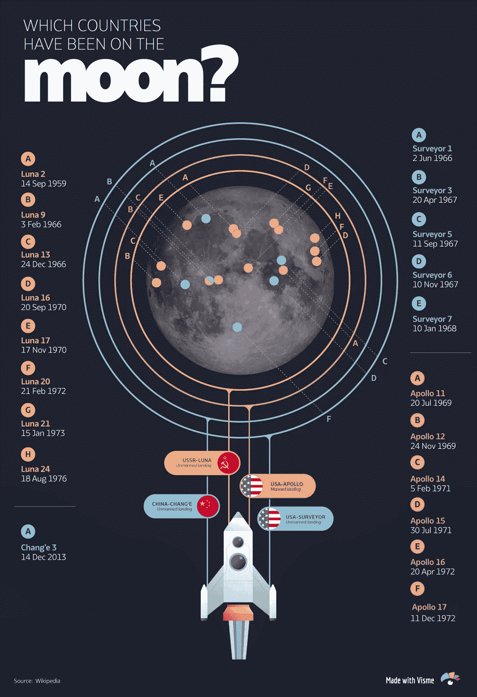
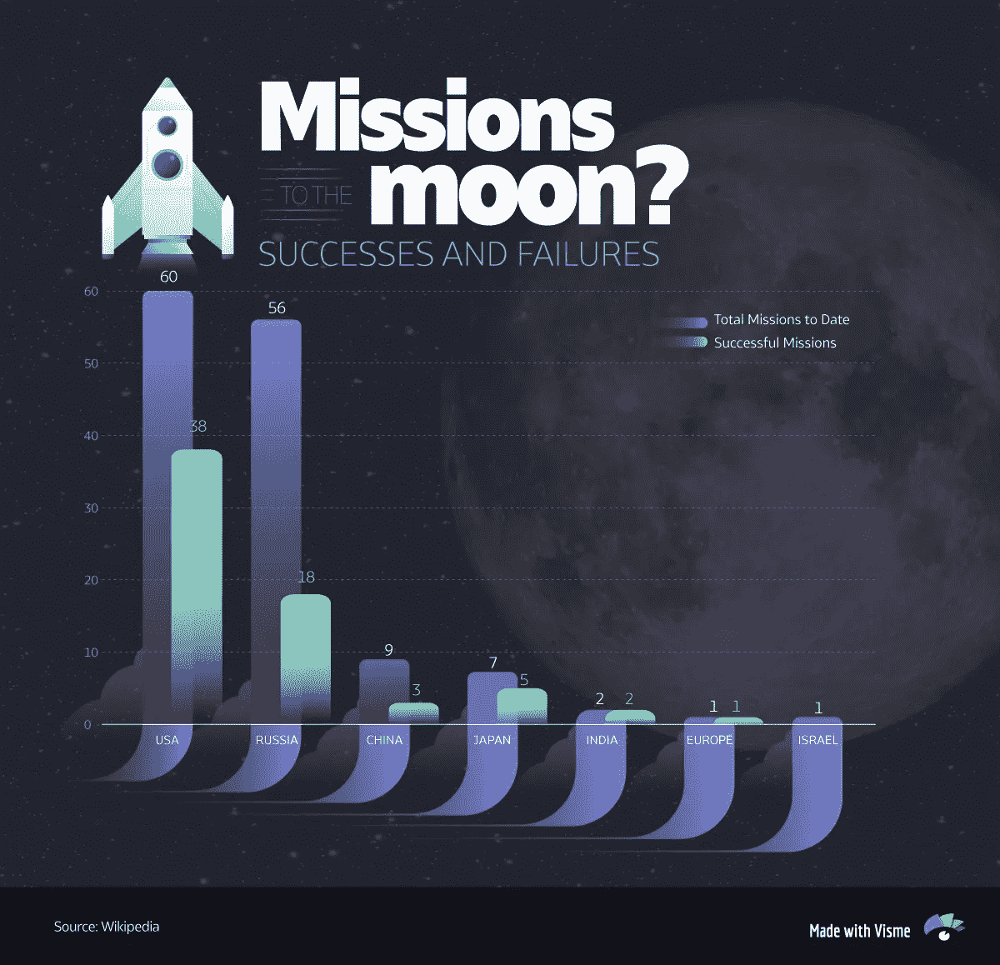
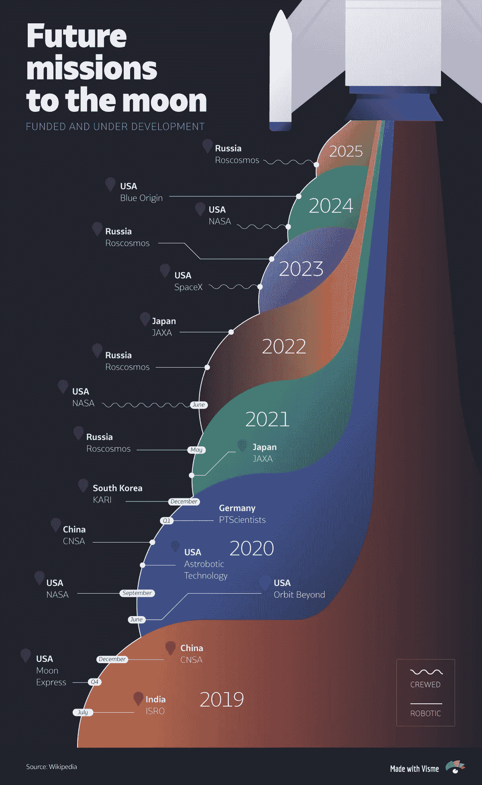
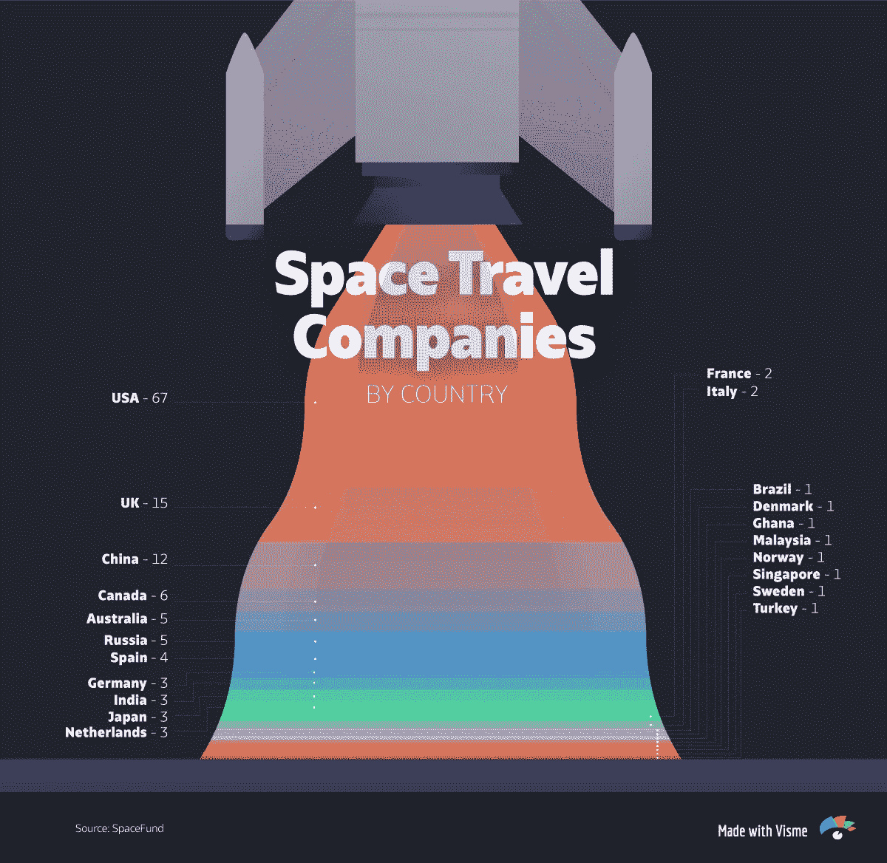
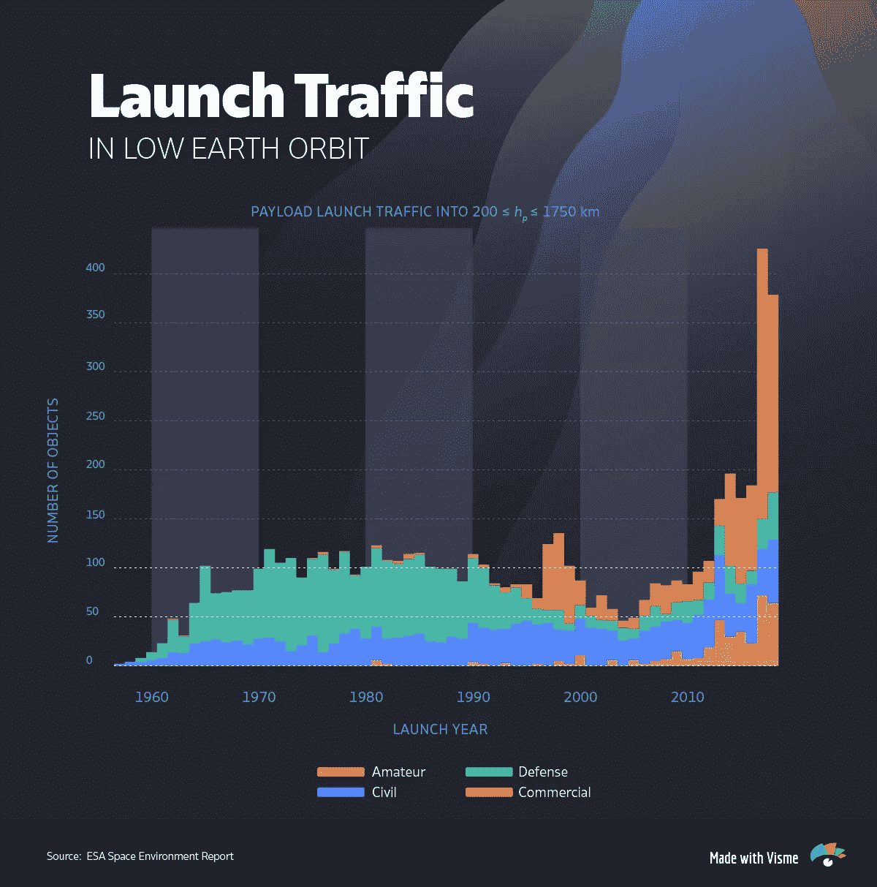

# 登月 50 年后，太空探索的前景如何？[信息图]

> 原文：<https://towardsdatascience.com/50-years-after-the-moon-landing-what-is-the-future-of-space-exploration-infographic-ae54c030d5cb?source=collection_archive---------29----------------------->

50 年前的这个月，当尼尔·阿姆斯特朗走下登月舱阶梯，在月球表面留下他标志性的足迹时，最疯狂的科幻幻想变成了现实。

他那句臭名昭著的话，“一个人的一小步，人类的一大步”，回荡在全球，听众超过 5 . 3 亿。

几周后，在持续了半个世纪的空间探索和发展之后，世界将重温这一历史性事件。

为了纪念这一突破性的成就，我们回顾了登月的历史，太空探索的未来以及私营公司在蓬勃发展的太空经济中的作用。

# 哪些国家登上过月球？

尽管阿波罗 11 号的登月任务最为人所知，但在 1969 年之前还有其他成功的无人登月任务。

苏联的[月球 2 号是 1959 年第一艘到达月球表面的宇宙飞船](https://en.wikipedia.org/wiki/List_of_missions_to_the_Moon)，而月球 9 号是 1966 年第一艘在月球软着陆的宇宙飞船。

四个月后，美国宇航局的勘测者 1 号成功软着陆月球，随后又有四次成功的无人驾驶任务。

在苏联和美国之间充满紧张气氛的太空竞赛进行了 14 年之后，阿波罗 11 号成功地登上月球并返回——为未来几代人开创了一个先例。

在此之后，美国宇航局又向月球发射了六次任务，其中五次成功。2013 年，中国也在 2013 年 12 月成功软着陆月球，比月球 24 晚了 37 年。

总的来说，美国发射了最多的登月任务，其中 38 次成功，紧随其后的是前苏联，56 次。

# 未来的登月任务

现任美国政府雄心勃勃地计划在 2024 年让人类[重返月球，比最初的时间表提前了四年。这个名为 Artemis 的项目包括八次发射和一个到 2024 年在月球轨道上的小型空间站。](https://www.vox.com/science-and-health/2019/6/7/18656865/trump-moon-mars-tweet-artemis-whaaa)

与此同时，俄罗斯计划从 2025 年开始向月球发射载人飞船，最终目标是在 2040 年建立一个月球殖民地。

印度希望成为今年第四个成功软着陆月球的国家，计划在本月发射一艘宇宙飞船，并在 9 月着陆。

太空竞赛不会只由世界各国主导。SpaceX 等私营公司也将目光投向了月球，尽管去火星旅行是他们的主要目标之一。埃隆·马斯克(Elon Musk)的 SpaceX 计划在 2023 年派遣一组艺术家进行绕月旅行，而杰夫·贝索斯的蓝色起源(Blue Origin)则希望在 2024 年之前将宇航员送上月球表面。

# 私有化太空旅行是未来吗？

随着雄心勃勃的太空探索计划(如火星之旅)成本的上升，美国宇航局越来越多地转向私人公司的雄厚资金来资助这些努力。

像埃隆·马斯克、杰夫·贝索斯和保罗·艾伦这样的亿万富翁正在向商业航天领域大举投资。

根据 [SpaceFund 的发射数据库](https://spacefund.com/launch-database/)显示，目前全球有超过 100 家太空运输公司。正如你在下面看到的，大部分在美国，其次是英国和中国。

许多人认为【NASA 和 SpaceX、蓝色起源和维珍银河等公司之间的公私合作关系是太空旅行的未来。

事实上，进入低地球轨道的商业发射流量在过去十年中急剧上升:

# 轮到你了

你认为太空旅行的前景如何？从长远来看，增加太空探索会有好处吗？或者它仅仅会转移人们对地球上更紧迫问题的注意力？让我们知道你的想法…

*本帖* [*原版*](https://visme.co/blog/moon-landing-infographic/) *最早出现在 Visme 的* [*视觉学习中心*](http://blog.visme.co/?source=post_page---------------------------) *。*