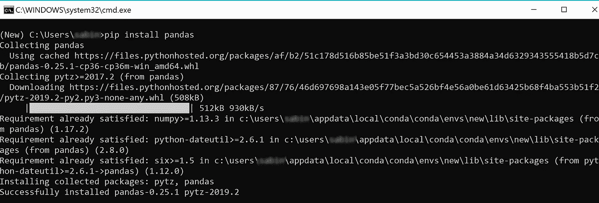
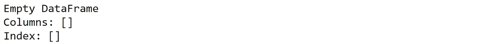
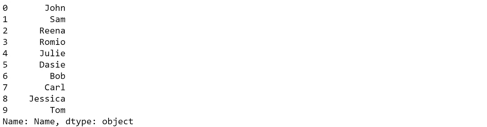

# 熊猫基础知识——6 个有用的技巧

> 原文：<https://towardsdatascience.com/6-basic-pandas-techniques-you-need-to-know-2c5725746938?source=collection_archive---------22----------------------->

## 这里有 6 个你需要知道的用 python 处理数据的基本技巧


Panda (Image by [skeeze](https://pixabay.com/users/skeeze-272447/?utm_source=link-attribution&utm_medium=referral&utm_campaign=image&utm_content=1594138) from [Pixabay](https://pixabay.com/?utm_source=link-attribution&utm_medium=referral&utm_campaign=image&utm_content=1594138))

熊猫数据科学 python 库，用于数据操作和数据分析。它是数据科学中最常用的 python 库之一。在这篇文章中，我将指导你使用熊猫图书馆阅读、查看和保存 CSV 文件所需的六个基本技巧。

# 熊猫装置

如果您还没有安装它，您可以通过在终端中输入以下命令来安装。

```
pip install pandas
```



有关熊猫图书馆安装的更多信息，请参考以下链接。

 [## 安装- pandas 0.25.1 文档

### 对于没有经验的用户来说，安装 pandas 以及 NumPy 和 SciPy 堆栈的其余部分可能有点困难。的…

pandas.pydata.org](https://pandas.pydata.org/pandas-docs/stable/install.html) 

# 进口熊猫

在 python 程序中导入熊猫很简单。您可以使用下面的代码行来实现这一点。

```
import pandas as pd
```

# 1.创建数据框架

Pandas DataFrame 是具有行和列的二维数据结构。它类似于 SQL 中的表。

## 创建空数据帧

```
df = pd.DataFrame()
print(df)
```

*输出:*



## 从 python 列表创建数据帧

```
num_list = [1,2,3,4,5]
df = pd.DataFrame(num_list)
print(df)
```

*输出:*


## 将 CSV 作为熊猫数据框架导入

```
df= pd.read_csv('person.csv')
print(df)
```

*输出:*


# 2.快速查看数据帧

导入数据后，您可能希望在深入研究之前先查看一下。您可以使用 *head()* 方法先睹为快。默认情况下，此方法显示前五行。

```
df.head()
```

通过将 *n* 的值传递给方法 *head()* ，可以显示 *n* 行数据。

```
df.head(10)
```

或者，您可以使用方法 *tail()* 来查看数据帧的最后几行。

```
df.tail()
```

# 3.从数据框架访问列

您可以使用两种方法之一来访问数据帧的列

*方法一:*data frame _ instance . column _ name。请注意，如果列名中有空格，此方法将不起作用。

```
df.Name
```

*方法 2:*data frame _ instance[' column _ name ']

```
df['Name']
```



# 4.将列添加到数据框架

在要素工程中，您通常最终会向数据中添加一些要素。Pandas 允许您轻松地向数据框架添加新列。

让我们为 person 数据框的所有行添加一个新列 *HasBike* 和一个 *False* 。

```
df['HasBike'] = False
df.head()
```


# 5.从数据框架中删除列

有时，您不想处理所有的数据列。在这种情况下，您可以使用 *drop()* 方法从 DataFrame 中删除任何列。

让我们从 DataFrame 中删除新创建的列。

```
df.drop('HasBike', inplace=True, axis=1)
df.head()
```


# 6.将数据帧保存为 CSV 文件

这是另一件你应该知道如何使用熊猫的重要事情。要么你已经花了几个小时做特征工程或数据清理，你不想失去你所有的努力。相反，您可以将流程数据帧保存为 CSV 文件，然后在以后需要时导入。

您可以使用 to_csv()方法将数据帧保存到 csv 文件中。

```
df.to_csv('filename.csv')
```

这些是使用 Pandas python 库应该知道的一些基本技术:创建数据帧、加载 CSV 文件、向数据帧添加列、从数据帧中删除列以及将数据帧保存到 CSV 文件。

你最喜欢的熊猫技术是什么，你想分享一下吗？请在下面留下你的想法。

[**点击这里**](https://medium.com/@sabinaa.pokhrel) 阅读我其他关于 AI/机器学习的帖子。

**来源:**

 [## 熊猫。数据框架-熊猫 0.25.1 文件

### 二维大小可变、潜在异构的表格数据结构，带有标记轴(行和列)…

pandas.pydata.org](https://pandas.pydata.org/pandas-docs/stable/reference/api/pandas.DataFrame.html) [](https://www.geeksforgeeks.org/python-pandas-dataframe/) [## Python |熊猫数据框架-极客论坛

### Pandas DataFrame 是二维大小可变的、潜在异构的表格数据结构，带有标记轴…

www.geeksforgeeks.org](https://www.geeksforgeeks.org/python-pandas-dataframe/)