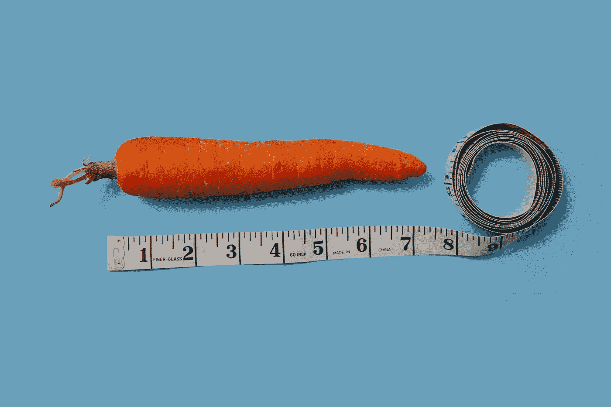
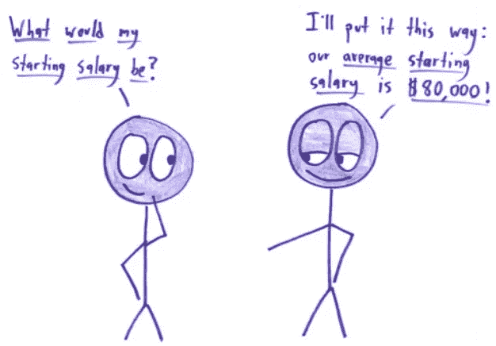
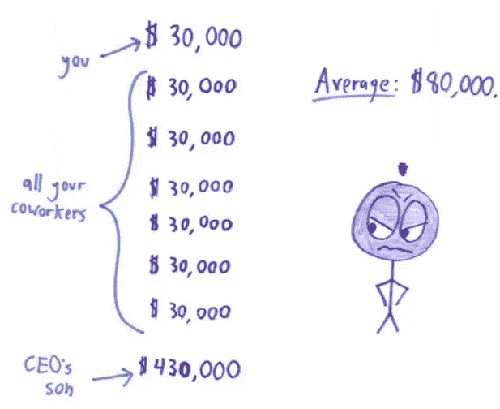
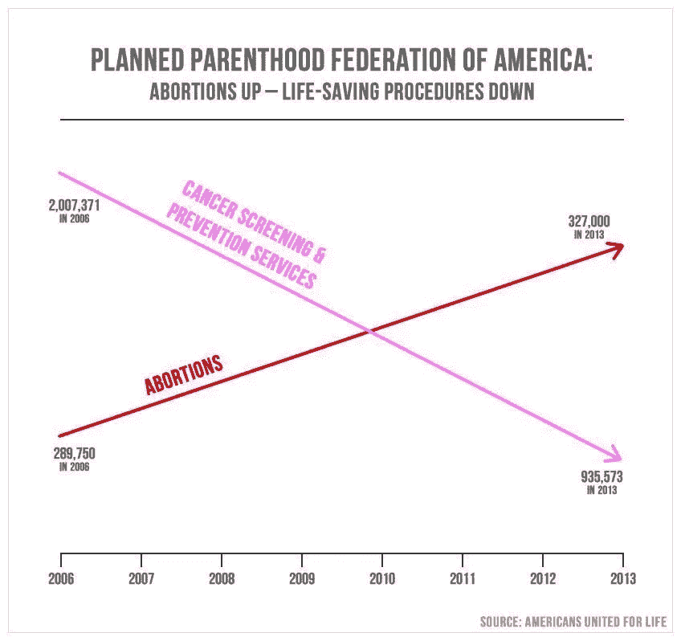
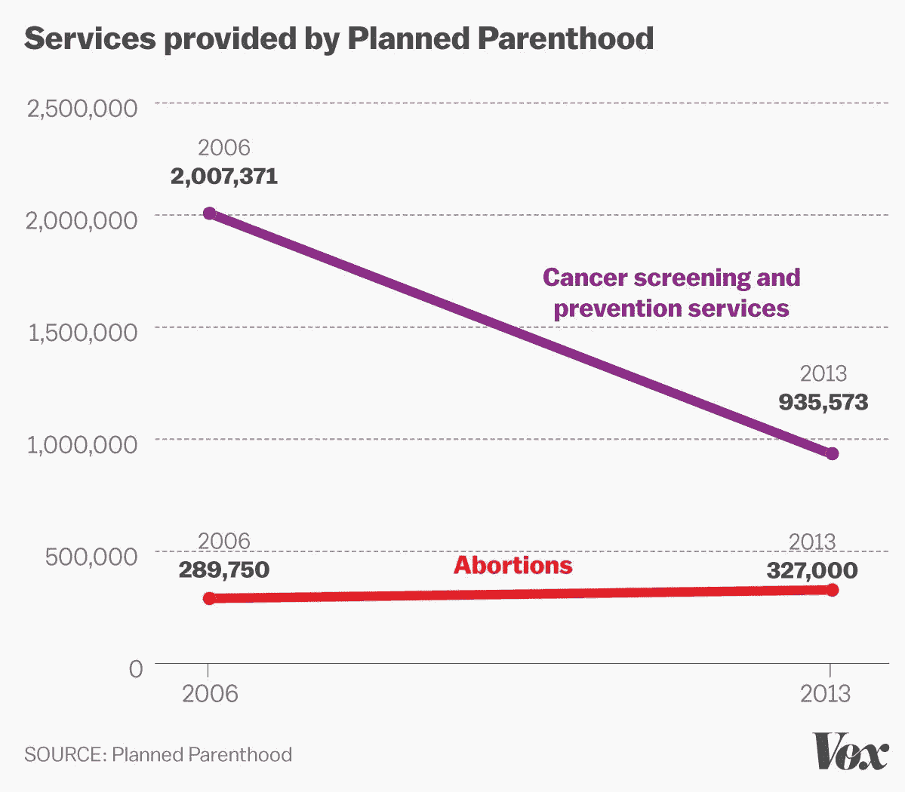
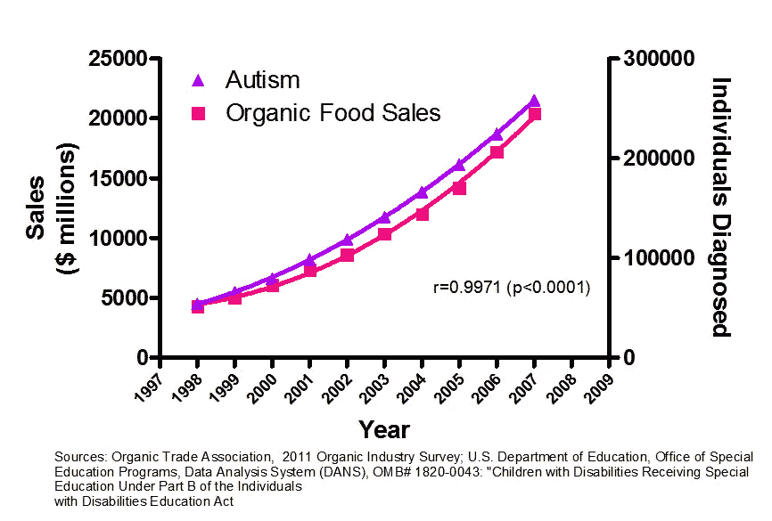

# 给数据科学家的 6 点建议

> 原文：<https://towardsdatascience.com/6-bits-of-advice-for-data-scientists-6e5758c52fb2?source=collection_archive---------6----------------------->

## 综合征、假设、谬误、谎言、意识和概率

Ask Questions!!!

犯错是人之常情。

用这个标准来衡量，谁比我们这些数据科学家更有人情味。

重要的是正视我们的错误。并从中吸取教训。

一个数据科学家需要有[的批判性](https://amzn.to/2XXYgOL)，并且总是留意别人忽略的东西。

但是有时在我们的日常工作和编码中，我们会迷失在我们的思路中，而不能看到全局。

最终，我们的商业伙伴雇佣我们只是为了创造价值，除非我们发展商业批判性思维，否则我们无法创造价值。

***因此，这里有一些建议，人们可以将它们纳入日常的数据科学工作中，以便更加勤奋，同时更有影响力。***

# 1.当心干净数据综合症

有多少次我们开始直接处理我们得到的数据。开始创建模型？或者甚至向我们的业务对手展示自动生成的描述性分析？

但是，你有没有问过— **这个数据有意义吗？**

> 错误地假设数据是干净的会让你走向错误的假设。

通过观察数据中的差异，你实际上可以辨别出许多重要的模式。

例如，如果您注意到某个特定的列丢失了 50%以上的值，您可能会考虑删除该列。

***但是如果某些数据采集仪器出现了一些误差怎么办？你本可以帮助企业改进流程。***

或者说，在女性化妆品行业，男性和女性的比例是 90:10。

人们可以假设数据是干净的，并如实显示结果，或者他们可以运用常识，询问他们的商业伙伴标签是否被调换了。

# 2.意识到

我们都知道 fab.com。对于那些不知道的人来说，这是一个销售“策划健康、健身和健康产品”的网站。

但情况并不总是如此。

Fab.com 以 fabulis.com 的名字起家， ***一个帮助男同性恋者认识人的网站。***

该网站最受欢迎的特色之一是“当日同性恋交易”。

一天，交易是汉堡包——一半的购买者是女性。为什么网站上有女性？

***以上事实让数据团队意识到，向女性推销商品是有市场的。因此，Fabulis.com 将其商业模式转变为 fab.com，作为设计师产品的销售点。***

> 留意一些不明显的东西。准备好提问。如果你发现了什么，你可能已经找到了金子。

***数据可以帮助企业优化收入，但有时数据也有改变公司方向的力量。***

另一个例子， [Flickr 开始是一个多人游戏](https://www.fastcompany.com/1783127/flickr-founders-glitch-can-game-wants-you-play-nice-be-blockbuster)。只有当创始人注意到人们将它用作照片上传服务时，他们才转向照片分享应用。

这样的例子数不胜数。

试着在你公司的业务中树立一个好榜样。

# 3.开始关注正确的指标

***我们要优化什么？***

大多数企业都没有回答这个简单的问题。

***每一个业务问题都有一点不同，要有不同的优化。***

例如，网站所有者可能会要求您为活跃用户进行优化。 ***但难道是*** [***右度量***](https://amzn.to/2XQPORc) ***？*** 只是一个虚荣心的度量，总会增加的。

相反，我会努力优化主动了解我的产品性能的用户的百分比。

再比如，我们都创建了分类模型。很多时候，我们试图提高模型的准确性。但是我们真的想要精确度作为模型性能的衡量标准吗？

***如果我们在预测将要撞击地球的小行星数量会怎么样。***

一直说零就行了。你会有 99%的准确率。我的模型可能相当准确，但一点价值都没有。一个更好的衡量标准是 F 分数。

> 设计数据科学项目比建模本身重要得多。

# 4.统计数据有时会说谎，也许很多次

[Source](https://medium.com/@david.a.ortiz/lying-with-stats-everything-you-thought-you-knew-about-statistics-1caaed95dcc6)

对引用给你的每一件事都要持批评态度。过去，统计数据已经被用于在广告、工作场所和许多其他营销场合撒谎。人们会不择手段来获得销售或促销。

比如: [***你还记得高露洁声称 80%的牙医推荐他们的品牌吗？***](http://marketinglaw.osborneclarke.com/retailing/colgates-80-of-dentists-recommend-claim-under-fire/)

这个统计数字初看起来相当不错。所有牙医都使用高露洁产品；我也应该。对吗？

原来，在调查牙医的时候，他们可以选择几个品牌——而不仅仅是一个。所以其他品牌也可能像高露洁一样受欢迎。

市场部只是一个创造神话的机器。我能理解。

> 市场部只是一个创造神话的机器。

但当你在研究中看到这种情况时，你会感到痛苦。例如，[小型武器调查](https://en.wikipedia.org/wiki/Small_Arms_Survey)显示，每 100 名美国人拥有 120 支枪。

假设每个美国人都携带热量是合理的。另一项研究显示，只有 47%的家庭拥有枪支。

你困惑了吗？

有些家庭携带大量枪支。因此，说每个美国人都有武器是不合理的。

***也不要相信没有标注 Y 轴的图表。***

下图是众议员 Jason Chaffetz(R-UT)在国会听证会上向计划生育主席展示的，展示了堕胎率是如何上升的，拯救生命的程序是如何下降的。

标有坐标轴的真实图片，你可以看到被告知的谎言…

此外，美国预防服务工作组改变了建议，每两年进行一次癌症筛查，而不是每年，这一事实甚至可以解释癌症筛查的下降。

> 看到政客们展示的图表时要客观。

# 5.概率的长串规则

事情发生在 1913 年夏天，在摩纳哥的一个赌场里。

赌徒们惊讶地看着赌场的轮盘连续 26 次落在黑色上。

由于红色对黑色的[概率](https://amzn.to/2O6NkJX)正好是一半， ***他们确信红色是“应该的”。*** 对于赌场来说，这是一个热闹的日子——一个赌徒谬误的完美例子，也被称为蒙特卡洛谬误。

这在现实生活中也会发生。 [***人们倾向于避免长串相同的答案***](https://papers.ssrn.com/sol3/papers.cfm?abstract_id=2538147) ***。有时为了得到一个看起来更公平或可能的决策模式而牺牲判断的准确性。***

例如， ***如果招生官已经连续批准了三份申请，他可能会拒绝下一份申请，*** 即使该申请本应根据成绩被接受。

***不要屈服于这样的谬误。***

这个世界以概率为基础。我们是 70 亿人，每秒钟都在做一件事。

> 罕见的事件必然会发生。但是不要把你的钱押在他们身上。

# 6.相关性并不意味着因果关系

你能相信吗——自闭症是由有机食品引起的。很好。或者事实正好相反。自闭症会增加有机食品的销量吗？不完全是。或者也许。

仅仅因为两个变量一前一后一起移动并不一定意味着一个导致另一个。

> 相关性并不意味着因果关系。

这是数据科学家工具箱中的圣杯。

过去也有过类似的搞笑例子。我最喜欢的一些是:

*   查看消防队的数据，你可以推断出派往火灾现场的消防员越多，造成的损失就越大。
*   一位学者在调查 80 年代纽约市的犯罪原因时，发现严重犯罪的数量和街头小贩卖冰淇淋的数量之间有一种 ***的强烈关联！*** 显然，有一个不可观测的变量导致了这两者。夏天是犯罪最严重的时候，也是冰淇淋卖得最多的时候。所以卖冰淇淋不会导致犯罪。这两种犯罪都没有增加冰淇淋的销量。

跟我重复:相关并不意味着因果关系。

如果你想了解更多关于数据科学和机器学习的知识，我想调出吴恩达的这个 [***精品课程***](https://coursera.pxf.io/NKERRq) 。这是我开始的原因。一定要去看看。

谢谢你的阅读。将来我也会写更多初学者友好的帖子。

在 [**媒体**](https://medium.com/@rahul_agarwal) 关注我或者订阅我的 [**博客**](http://eepurl.com/dbQnuX) 了解他们。

一如既往，我欢迎反馈和建设性的批评，可以通过 Twitter [@mlwhiz](https://twitter.com/MLWhiz) 联系到我。