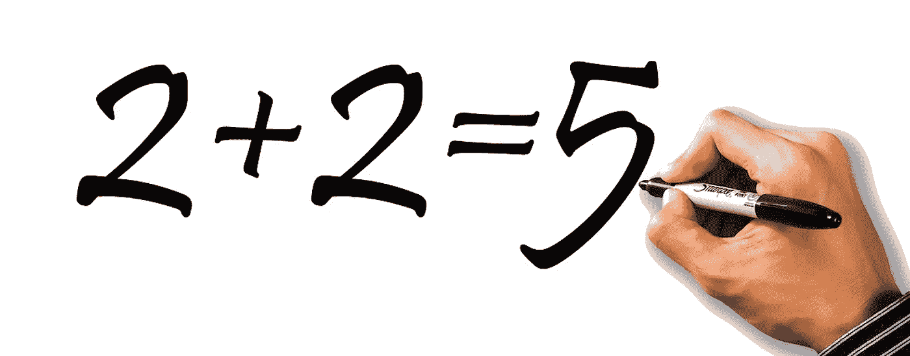

# Andrew NG 书中的 6 个概念:“机器学习的向往”

> 原文：<https://towardsdatascience.com/6-concepts-of-andrew-ngs-book-machine-learning-yearning-abaf510579d4?source=collection_archive---------4----------------------->

## *《深度学习时代 AI 工程师的技术策略》*

**机器学习向往的是关于结构化开发机器学习项目。这本书包含在其他地方很难找到的实用见解，以一种易于与队友和合作者分享的格式。大多数技术人工智能课程会向你解释不同的 ML 算法是如何工作的，但这本书会教你如何实际使用它们。如果你渴望成为人工智能领域的技术领袖，这本书将帮助你。从历史上看，学习如何对人工智能项目做出战略决策的唯一方法是参加研究生课程或在公司工作获得经验。机器学习的渴望有助于你快速获得这项技能，使你能够更好地建立复杂的人工智能系统。**

# 目录

*   关于作者
*   介绍
*   概念 1:迭代，迭代，迭代…
*   概念 2:使用单一评估指标
*   概念 3:错误分析至关重要
*   概念 4:定义最佳错误率
*   概念 5:致力于人类能做好的问题
*   概念 6:如何分割数据集
*   摘要

# **关于作者**

Andrew NG 是一名计算机科学家、高管、投资者、企业家，也是人工智能领域的领先专家之一。他是百度的前副总裁兼首席科学家，斯坦福大学的兼职教授，最受欢迎的机器学习在线课程之一的创始人，Coursera.com 的联合创始人和谷歌大脑的前负责人。在百度，他积极参与将他们的人工智能团队扩大到几千人。

# **简介**

这本书以一个小故事开始。想象一下，你想作为一个公司来建立领先的 cat 探测器系统。您已经构建了一个原型，但不幸的是，您的系统性能并不是很好。您的团队就如何改进系统提出了几个想法，但是您不知道应该遵循哪个方向。你可以建造世界领先的 cat 探测器平台，或者浪费几个月的时间沿着错误的方向前进。

这本书告诉你如何在这种情况下做出决定并分清轻重缓急。根据 Andrew NG 的说法，大多数机器学习问题都会留下关于最有希望的下一步以及你应该避免做什么的线索。他继续解释说，学习“阅读”这些线索是我们领域的一项关键技能。

**简单来说，ML 向往就是让你深刻理解设定机器学习项目的技术方向。**

因为当你提出新的想法时，你的团队成员可能会持怀疑态度，所以他把章节写得很短(1-2 页)，这样你的团队成员就可以在几分钟内阅读，理解概念背后的想法。如果你有兴趣阅读这本书，请注意，它不适合完全的初学者，因为它需要对监督学习和深度学习有基本的熟悉。

在这篇文章中，我将出于我的理解，用我自己的语言分享这本书的六个概念。

# **概念 1:迭代，迭代，迭代…**

NG 在整本书中强调，快速迭代至关重要，因为机器学习是一个迭代过程。与其考虑如何为你的问题构建完美的 ML 系统，不如尽快构建一个简单的原型。如果你不是问题领域的专家，这一点尤其正确，因为很难正确猜测最有希望的方向。

你应该在几天内构建第一个原型，然后会弹出一些线索，向你展示改进原型性能的最有希望的方向。在下一次迭代中，您将基于这些线索中的一个来改进系统，并构建它的下一个版本。你会一次又一次地这样做。

他继续解释说，你迭代得越快，你取得的进步就越大。本书的其他概念都是建立在这个原则之上的。请注意，这是为那些只想建立一个基于人工智能的应用程序，而不是在该领域做研究的人准备的。

# **概念 2:使用单一评价指标**

这个概念建立在前一个概念的基础上，关于为什么你应该选择一个单一数字评估指标的解释非常简单:它使你能够快速评估你的算法，因此你能够更快地迭代。使用多种评估指标只会使比较算法变得更加困难。

假设你有两个算法。第一个的准确率为 94%，召回率为 89%。第二种准确率为 88%，召回率为 95%。

在这里，如果你不选择一个单一的评价指标，没有一个分类器是明显优越的，所以你可能需要花一些时间来弄清楚。问题是，在每次迭代中，你都为这个任务损失了很多时间，而且从长远来看，这种情况会越积越多。你会尝试很多关于架构、参数、特性等的想法。如果您使用单一数字评估指标(如 precision 或 f1 分数)，它使您能够根据性能对所有模型进行排序，并快速决定哪一个工作得最好。改进评估过程的另一种方法是将几个度量组合成一个度量，例如，对多个误差度量进行平均。

然而，会有需要满足多个度量的 ML 问题，例如:考虑运行时间。NG 解释说，您应该定义一个“可接受的”运行时间，这使您能够快速挑选出太慢的算法，并根据您的单个数字评估指标将满意的算法相互比较。

**简而言之，单一数字评估指标使您能够快速评估算法，从而更快地迭代。**

# **概念 3:错误分析至关重要**

错误分析是查看算法输出不正确的例子的过程。例如，假设你的猫探测器把鸟误认为猫，而你已经有了几个解决这个问题的方法。

通过适当的错误分析，您可以估计一个改进的想法实际上会提高系统的性能多少，而不必花费几个月的时间来实现这个想法，也不会意识到它对您的系统并不重要。这使你能够决定哪一个想法是最好的花费你的资源。如果你发现只有 9%的误分类图像是鸟类，那么无论你如何改进你的算法在鸟类图像上的性能都没有关系，因为它不会改进超过 9%的错误。

此外，它使您能够快速判断几个并行改进的想法。您只需要创建一个电子表格，并在检查时填写它，例如，检查 100 个错误分类的 dev 集图像。在电子表格中，你为每一张错误分类的图片创建一行，为每一个你想改进的想法创建几列。然后你仔细检查每一张分类错误的图片，并用哪个想法标记这张图片会被正确分类。

之后，你确切地知道，例如，对于 idea-1，系统将正确分类 40 %的误分类图像，idea-2 为 12%，idea-3 仅为 9%。那么你就知道在想法 1 上工作是你的团队应该努力的最有希望的改进。

此外，一旦你开始浏览这些例子，你可能会发现如何改进你的算法的新想法。

# **概念 4:定义最佳差错率**

最佳错误率有助于指导您的后续步骤。在统计学中，它也经常被称为贝叶斯错误率。

想象一下，你正在建立一个语音到文本的系统，你发现 19%的音频文件，你希望用户提交，有这么大的背景噪音，甚至人类都不能识别在那里说了什么。如果是这样的话，你知道即使是最好的系统也可能有 19%左右的误差。相比之下，如果你处理一个最优错误率接近 0%的问题，你可以希望你的系统也能做得一样好。

它还帮助您检测您的算法是否存在高偏差或方差，这有助于您定义改进算法的后续步骤。

但是我们怎么知道最优的错误率是多少呢？对于人类擅长的任务，您可以将您的系统性能与人类的性能进行比较，这将为您提供最佳错误率的估计值。在其他情况下，通常很难定义一个最佳速率，这就是为什么你应该致力于人类可以做得很好的问题，我们将在下一个概念中讨论。

# **概念 5:解决人类擅长的问题**

在整本书中，他几次解释了为什么建议研究人类自己也能做好的机器学习问题。例子有语音识别、图像分类、物体检测等等。这有几个原因。

首先，更容易获得或创建带标签的数据集，因为如果人们能够自己解决问题，他们可以直接为您的学习算法提供高精度标签。

第二，你可以使用人的表现作为你的算法想要达到的最佳错误率。NG 解释说，定义一个合理且可实现的最佳误差有助于加速团队的进展。它还可以帮助您检测您的算法是否存在高偏差或方差。

第三，它使你能够基于你的人类直觉进行错误分析。例如，如果您正在构建一个语音识别系统，而您的模型对其输入进行了错误分类，您可以尝试理解人类将使用哪些信息来获得正确的转录，并使用这些信息来相应地修改学习算法。尽管算法在越来越多人类自己做不好的任务上超越了人类，但你应该尽量避免这些问题。

总而言之，您应该避免这些任务，因为这使得获取数据标签变得更加困难，您不能再依靠人类的直觉，并且很难知道最佳的错误率是多少。

# **概念 6:如何分割数据集**

NG 还提出了一种分割数据集的方法。他建议如下:

**训练集:**有了它，你就训练了你的算法，仅此而已。

**开发集:**该集用于进行超参数调整，选择和创建适当的特征，并进行错误分析。它基本上是为你的算法做决定。

**测试集:**测试集是用来评估你的系统的性能，而不是用来做决策的。只是为了评价，没别的。

开发集和测试集允许您的团队快速评估您的算法执行得有多好。它们的目的是引导你对你的系统进行最重要的改变。

他建议选择开发和测试集，这样一旦你的系统被部署，它们就能反映你希望在未来做得更好的数据。如果您预期数据将与您现在训练的数据不同，这一点尤其正确。例如，您正在训练正常的相机图像，但随后您的系统将只接收手机拍摄的照片，因为它是移动应用程序的一部分。如果您没有足够的手机照片来训练您的系统，就会出现这种情况。因此，您应该选择反映您希望以后在现实中表现良好的测试集示例，而不是您用于训练的数据。

**此外，您应该选择来自同一个发行版的开发和测试集。**否则，您的团队可能会构建出在开发环境中表现良好的东西，却发现它在您最关心的测试数据上表现极差。

# 摘要

在这篇文章中，你已经了解了机器学习渴望的 6 个概念。现在你知道了，为什么快速迭代是重要的，为什么你应该使用一个单一的评估指标，错误分析是什么，为什么它是至关重要的。此外，您还了解了最佳错误率，为什么您应该研究人类可以做得很好的问题，以及您应该如何分割您的数据。此外，您还了解到您应该挑选开发和测试集数据，以便它们反映您希望在未来做得更好的数据，并且开发和测试集应该来自同一个发行版。我希望这篇文章给你介绍了这本书的一些概念，我可以肯定地说，这本书值得一读。

【https://machinelearning-blog.com】这个帖子最初发表在我的博客上(**【T10”)。**

# **来源**

1.  **机器学习的向往[https://www.mlyearning.org/](https://www.mlyearning.org/)**
2.  **Img: "Andrew NG": T *由 NVIDIA Corporation 根据" CC BY-NC-ND 2.0 "许可证获得。未进行任何更改。链接:*https://www.flickr.com/photos/nvidia/16841620756**
3.  **img:" Metric ":[https://pix abay . com/de/antri EB-auto-verk EHR-stra % C3 % 9Fe-44276/](https://pixabay.com/de/antrieb-auto-verkehr-stra%C3%9Fe-44276/)**
4.  **Img:“数学错误”:[https://pixabay.com/de/fehler-mathematik-1966460/](https://pixabay.com/de/fehler-mathematik-1966460/)**