# 帮助您编制出色财务报表的 6 种数据分析方法

> 原文：<https://towardsdatascience.com/6-data-analysis-methods-to-help-you-make-great-financial-statements-2bd573a19b17?source=collection_archive---------5----------------------->

这一年就要结束了，如果你们中的任何一个人在公司的财务会计相关部门工作，你们必须忙于准备各种年度财务报表。特别是对于刚进入这一领域的初学者来说，如何设计报表以清晰地显示财务分析和业务运营状况是一个挑战。

在财务报表中，与传统的密集表格相比，图表可以将数据可视化，更直观地显示数据，使数据的比较、趋势和结构一目了然。本文从汇总数据分析、发展趋势分析、数据对比分析、构成分析、进度分析、地图分析等方面分析了财务报表中的[类图表](https://www.finereport.com/en/data-visualization/top-16-types-of-chart-in-data-visualization.html?utm_source=medium&utm_medium=media&utm_campaign=blog&utm_term=6%20Data%20Analysis%20Methods%20to%20Help%20You%20Make%20Great%20Financial%20Statements)。我希望我们所有人都能在年底提交非常好的财务报表。

(注意:本文中的所有图表和仪表盘均采用 BI 报告工具 [FineReport](https://www.finereport.com/en/?utm_source=medium&utm_medium=media&utm_campaign=blog&utm_term=6%20Data%20Analysis%20Methods%20to%20Help%20You%20Make%20Great%20Financial%20Statements) 。)

# 1.汇总数据分析

汇总数据分析通常用于计算关键的核心指标，如公司的年经营收入、年消费成本和年净利润，这些往往是决策者最关心的数据。

如下图所示，我们使用 [FineReport](https://www.finereport.com/en/?utm_source=medium&utm_medium=media&utm_campaign=blog&utm_term=6%20Data%20Analysis%20Methods%20to%20Help%20You%20Make%20Great%20Financial%20Statements) 的[仪表盘](/how-can-beginners-create-a-great-dashboard-cf48c0f68cd5)组件来计算三个核心指标:公司的年总收入、年成本和净利润。我们将仪表板的最大范围设置为总收入 2.78 亿英镑，并启用了显示百分比的功能。这样，消费成本比率和利润率这两个指标会自动显示出来。

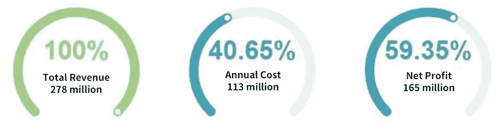

下面是另一个汇总数据分析示例。

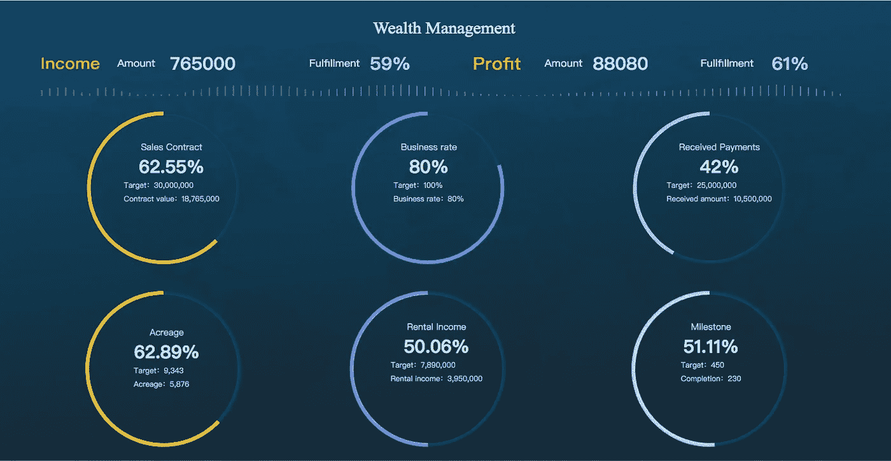

From FineReport

# 2.发展趋势分析

发展趋势分析通常用于直观地比较企业某一连续区间的财务经营数据或财务比率趋势，了解企业财务状况随时间变化的趋势。一方面可以分析数据增减是否存在异常，发现企业可能存在的问题。另一方面，也可以帮助企业预测未来的财务状况，判断发展前景。

我们一般用折线图来表示公司的发展趋势。横轴表示时间(年、月、日)，纵轴表示运营收入、成本和盈利能力等指标。

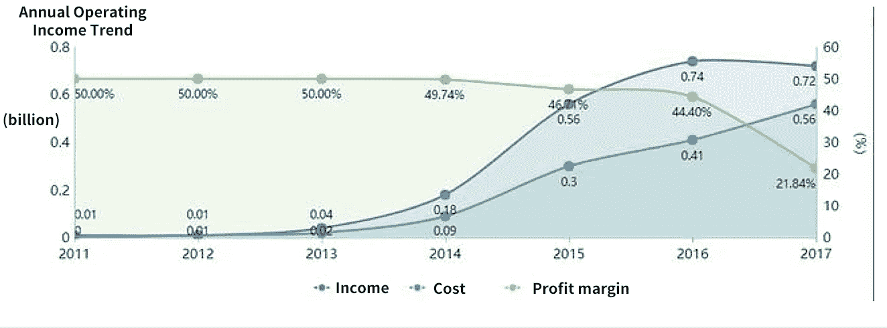

以下仪表板报告是一个结合了汇总数据分析和发展趋势分析的示例。

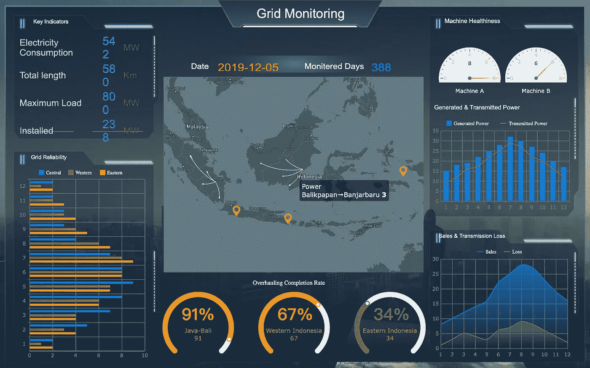

From FineReport

# 3.数据比较分析

数据没有对比就没有价值，企业财务分析也是如此。通过各项指标的比较，揭示公司的财务状况、经营状况和现金流量。一般来说，比较分析的参考标准如下。

*   时间对比:与前期和去年同期的实际数据进行对比。
*   实体对比:与同行业先进公司的数据进行对比。
*   结果比较:与计划或预算数据进行比较。
*   结构比较:在成分分析的基础上，比较两个数据的结构，分析财务指标的变化。

条形图和直方图经常被推荐用于数据比较分析。此外，可以根据具体情况使用其他图表，如折线图展示几家公司的存货对比情况，可以使用雷达图(适合快速对比和定位弱点)进行财务指标分类统计对比。

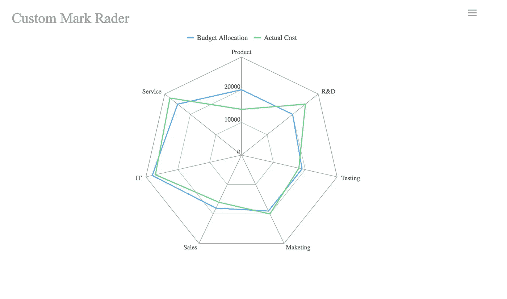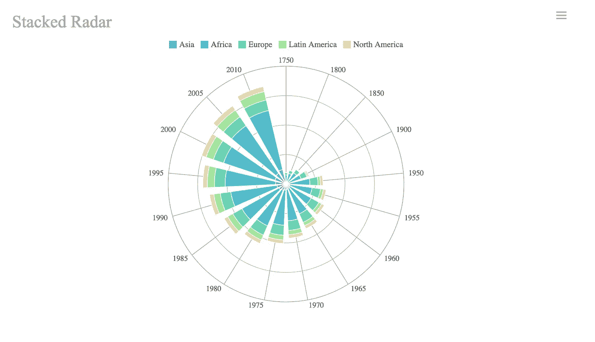

以下仪表板使用条形图、直方图和雷达图。我们在做财务报表分析的时候也可以参考这样一个[仪表盘报表](/a-beginners-guide-to-business-dashboards-981a8192a967)。

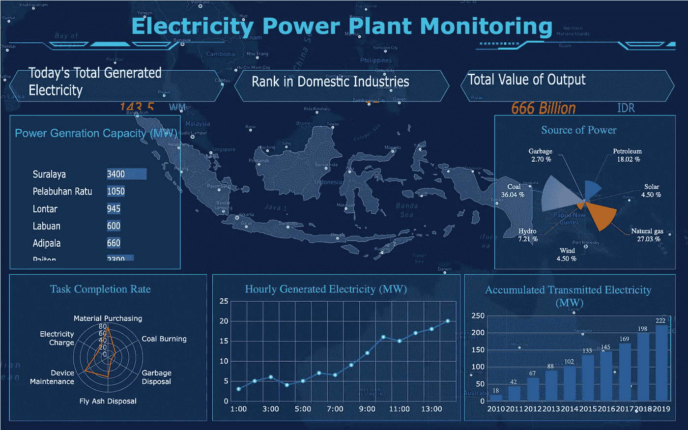

From FineReport

这是一个结合了圆环图、柱状图和雷达图的财务仪表板。

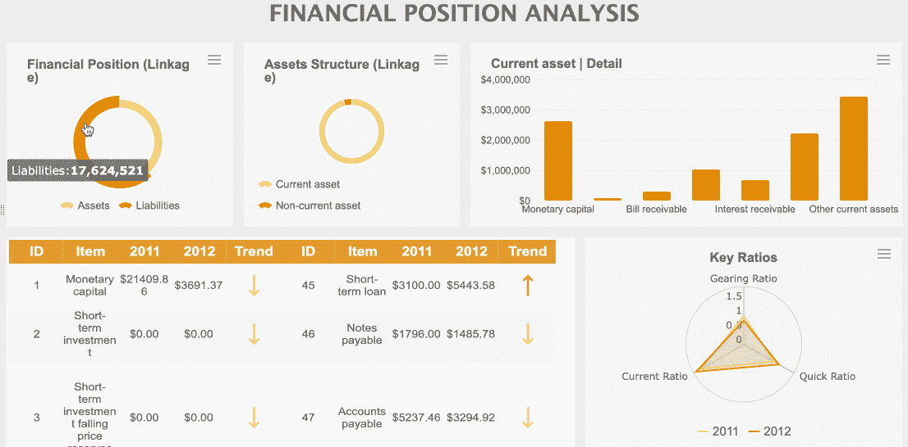

From FineReport

# 4.组成分析

构成分析通常可以用来分析每个项目的构成要素的数据，如每个产品的销售构成分析、流动资产构成分析、各部门的管理费用构成分析等。它代表了数据结构的组成。就图表而言，饼图、圆环图、百分比堆积条形图和百分比堆积直方图对于成分分析是常见的。

另外，当你既需要分析数据的组成结构，又需要分析数据的层次结构时，多级饼图无疑是最佳选择。如下图，多级饼图便于计算各省市的销售占比。

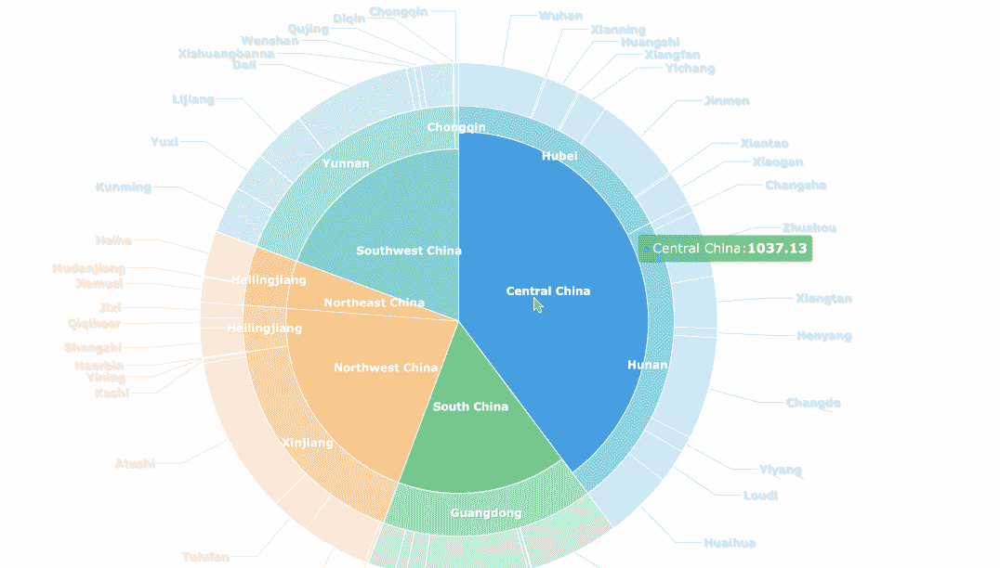

这是一份现金流报告，其中使用了饼状图和柱状图。

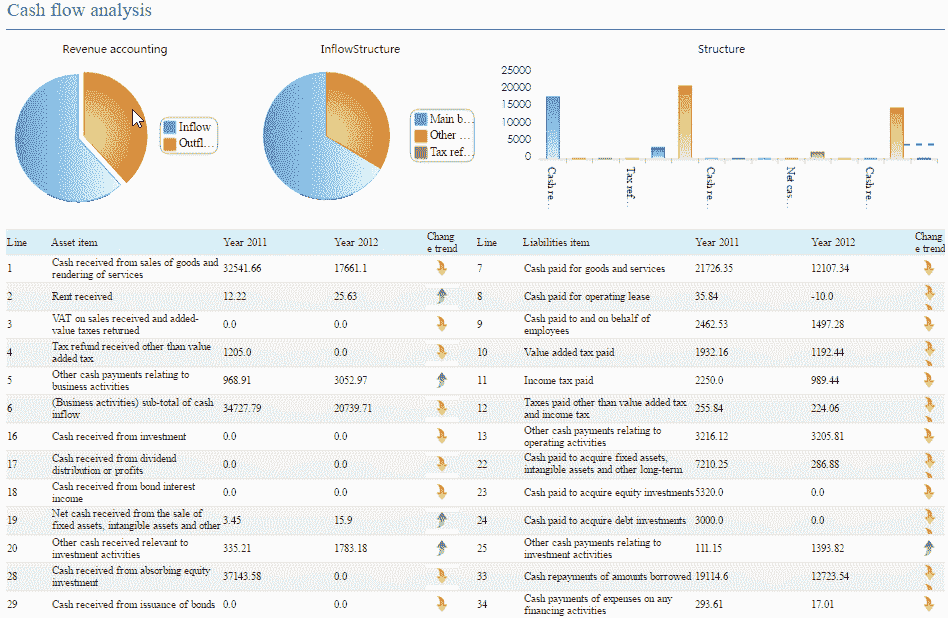

From FineReport

# 5.进度分析

在财务报表中，往往需要显示实现某项指标或某项任务的进展情况，如部门的业绩和报告费用的进展情况。在这种情况下，我们可以使用堆积柱形图、堆积条形图和甘特图来显示数据。

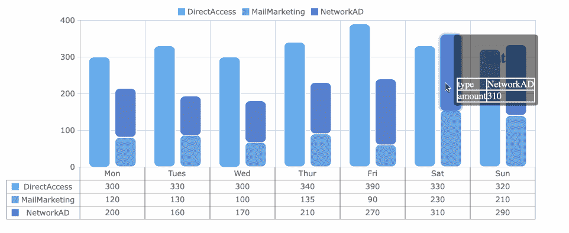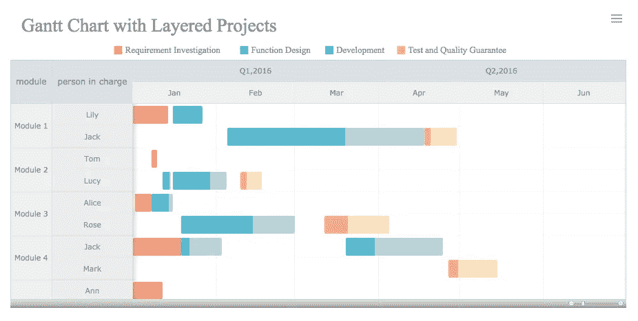

# 6.地图分析

最后，我将介绍与地图相关的数据分析方法。对于大企业来说，除了总部，还有遍布全国甚至全球的分公司。在这种情况下，使用地图来分析基于地理位置的数据更合适。

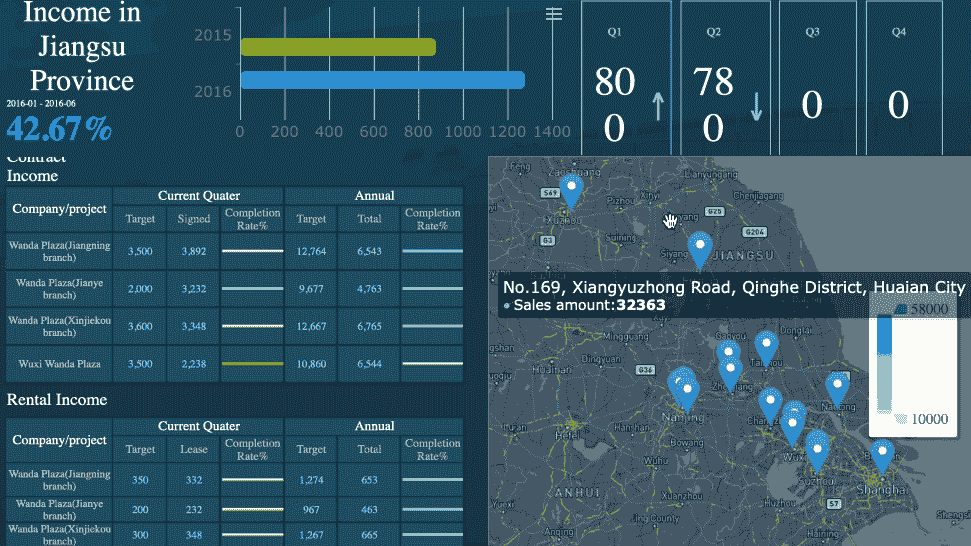

From FineReport

*   **流程图**

流图显示流出区域和流入区域之间的交互数据。通常用连接空间元素几何重心的线来表示。线条的宽度或颜色表示流量值。

流量图多用于区域贸易、交通流量、人口迁移、购物消费行为、通讯信息流、航空航线等。

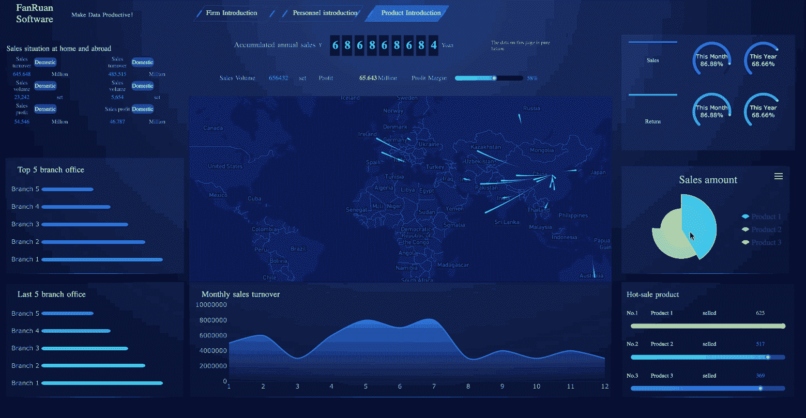

From FineReport

*   **热图**

热图用于指示地理区域中每个点的权重。除了地图作为背景层，你也可以使用其他图像。热图中的颜色通常是指密度。

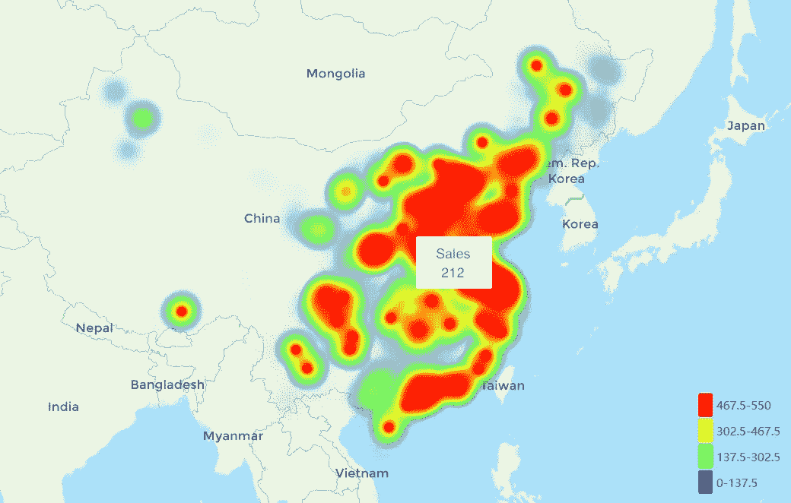

# 最后

以上是我们在做财务报表时常用的六种数据分析方法及对应的图表，可以作为你做数据分析统计时的参考。另外，本文中的图表是用 BI 报表工具 [**FineReport**](https://www.finereport.com/en/?utm_source=medium&utm_medium=media&utm_campaign=blog&utm_term=6%20Data%20Analysis%20Methods%20to%20Help%20You%20Make%20Great%20Financial%20Statements) 制作的。它的个人版是免费下载使用的，并且提供了很多模板供新手学习。你可以自己试试。

# 您可能也会对…感兴趣

[*让你的数据报告脱颖而出的指南*](/a-guide-to-making-your-data-reporting-stand-out-cccd3b99e293)

[*2019 年 6 大数据分析工具*](/top-6-data-analytics-tools-in-2019-4df815ebf82c)

[*初学者财务报表分析指南*](/guide-to-financial-statement-analysis-for-beginners-835d551b8e29)

[*2019 年你不能错过的 9 个数据可视化工具*](/9-data-visualization-tools-that-you-cannot-miss-in-2019-3ff23222a927)

[*新手如何打造一个很棒的仪表盘？*](/how-can-beginners-create-a-great-dashboard-cf48c0f68cd5)