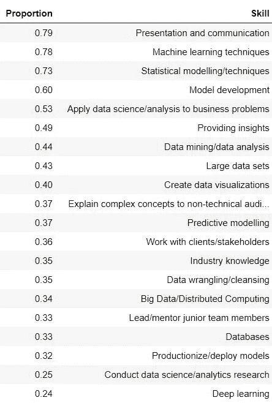
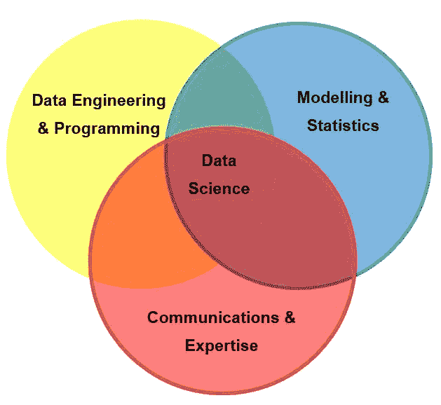
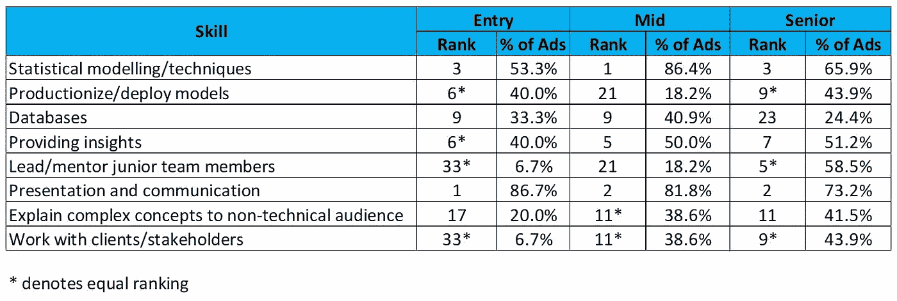

# 6 项数据科学技能，让您的职业生涯更上一层楼

> 原文：<https://towardsdatascience.com/6-data-science-skills-to-take-your-career-to-the-next-level-c100610b4014?source=collection_archive---------12----------------------->

## 超越机器学习和编程

曾经有一段时间，想要在数据科学领域找到一份工作，你需要的只是基本的 R 或 Python 技能，以及相当于普通 MOOC 内容的机器学习知识。

我听说是这样。我没有足够的运气那么早进入数据科学领域。

我第一次听说数据科学是在 2015 年，在托马斯·h·达文波特(Thomas H. Davenport)和 D.J .帕蒂尔(D.J. Patil)将数据科学家命名为“21 世纪最性感的工作”近三年后，到那时，数据科学职位的竞争已经开始变得激烈。

随着对数据科学的兴趣逐年增长，许多大学现在都在提供数据科学和分析的硕士学位，我认为可以肯定地说，竞争从那时起变得更加激烈。

也可以肯定地说，完成 Coursera 数据科学专业不再足以让你的简历脱颖而出。

因此，如果你已经可以像老板一样编程，并且你已经完成了如此多的机器学习课程，以至于随机森林和神经网络经常出现在你的梦里，那么你接下来应该专注于哪些技能，以便为你的第一份数据科学工作铺平道路，并在到达那里后进一步提升？

我们为什么不问问雇主呢？

# **数据科学家最重要的技能**

为了了解雇主在数据科学家中寻找什么，我检查了 2019 年 4 月 22 日至 2019 年 5 月 5 日期间在 [LinkedIn](https://www.linkedin.com/jobs/) 上发现的四个英语国家(澳大利亚、加拿大、英国和美国)的 100 份数据科学招聘广告。

招聘广告的选择代表了雇主类型、规模、行业和工作级别的广泛代表性，不考虑纯粹的管理角色。

从这些招聘广告中，我手动提取了作为选择标准或角色日常职责列出的技能的详细信息，并根据它们出现在招聘广告中的比例，确定了最受欢迎的 20 项数据科学技能(不包括编程语言和技术)。

他们在这里:

这些技能可以大致分为三类:

*   **建模和统计:**包括机器学习、统计建模和模型部署；
*   **数据工程(和编程)**:包括数据争论、使用数据库和分布式计算(如果我们在分析中包括了编程语言，我也会把它们放在这里)；和
*   **沟通和专业知识:**包括提供见解、行业知识以及领导和指导初级员工。

在此基础上，您可以确定六项可以培养的技能，从而在这三个类别中培养您的数据科学能力，显著改善您的就业前景:

**建模和统计**

*   统计建模
*   模型部署

**数据工程**

*   使用数据库

**通信与工程**

*   从数据中获得洞察力
*   领导和指导初级团队成员
*   沟通

(如果你想了解为什么这些技能很重要以及你可以做些什么来发展它们，请查看这篇文章:[如何成为数据科学的三重威胁](/how-to-become-a-data-science-triple-threat-bb41e0664ca5))。

# **应该先重点学习哪些技能？**

在我提取的 100 个数据科学招聘广告中，有 15 个是入门级角色(定义为标题中带有“初级”、“研究生”、“实习生”或类似名称的角色)；44 人担任中级职务；41 个是高级职位(定义为头衔中有“高级”、“主要”、“领导”或类似的职位)。

下表显示了招聘广告中提及之前确定的六种技能的比例，以及每种技能的排名。

在所有工作级别中，“演示和沟通”一直是数据科学雇主寻求的两大技能之一。此外，随着工作资历的增加，与沟通相关的技能“向非技术受众解释技术概念”和“与客户/利益相关者合作”都变得越来越重要。

因此，显而易见的是，如果你必须选择一项技能来首先专注于学习，那么沟通将是一条出路。

但是为什么只停留在一个呢？

“统计建模/技术”也是所有工作级别的前三大技能之一，是技能发展活动的良好候选，尤其是对处于职业生涯早期阶段的数据科学家而言。

从初级职位到中级职位，提及“统计建模/技术”作为理想技能的招聘广告比例从 53.3%增加到 86.4%。

然而，对于那些希望进入高级职位的人来说，发展领导和指导初级团队成员所需的技能可能是一个更好的选择，特别是对于那些已经发展了统计技能的人来说。

虽然只有 6.7%的入门级数据科学职位需要领导/指导技能，但 58.5%的高级职位需要这些技能(增加了 873%)，这使它们成为该级别第五大技能。

# **结论**

掌握上面提到的所有技能可能需要一些时间，但没关系。如果您可以在一个周末内掌握关于数据科学的所有知识，您真的愿意花费数年时间从事数据科学家的工作吗？

然而，通过一次只专注于一两项技能，每周只花几个小时来发展它们，最终你会建立起一套受欢迎的技能，这将帮助你脱颖而出，增加你获得下一个数据科学职位或晋升的机会。

你打算首先关注哪项技能？

*Genevieve Hayes 博士是数据科学家、教育家和人工智能及分析专家，拥有*[*Genevieve Hayes Consulting*](https://www.genevievehayes.com/)*。你可以在*[*LinkedIn*](https://www.linkedin.com/in/gkhayes/)*或者*[*Twitter*](https://twitter.com/genevievekhayes)*上关注她。她还是* [*价值驱动数据科学*](https://www.genevievehayes.com/episodes/) *的主持人，这是一个每月两次的播客，面向希望最大化其数据和数据团队价值的企业。*

*想要发掘企业数据的价值，但不知道从哪里开始？**[***下载免费的数据科学项目发现指南。***](https://www.genevievehayes.com/discovery-guide/)*