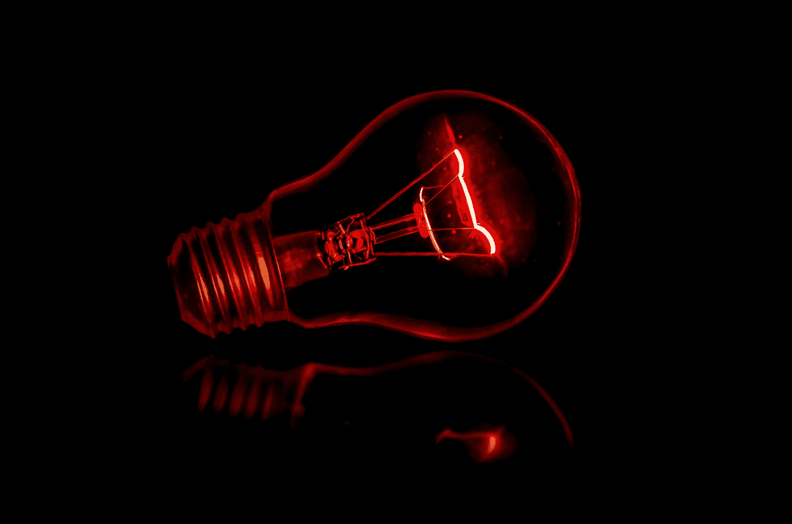
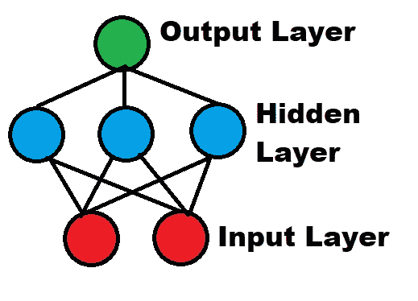
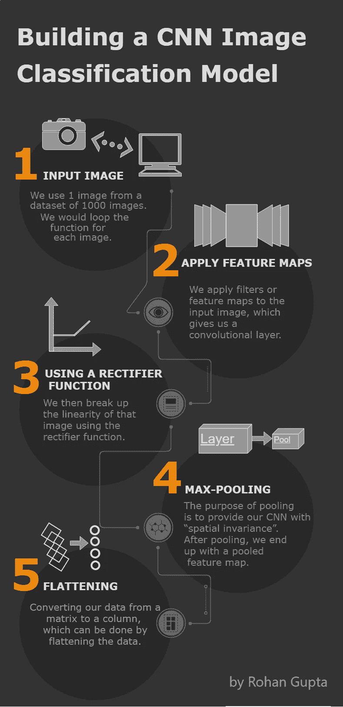
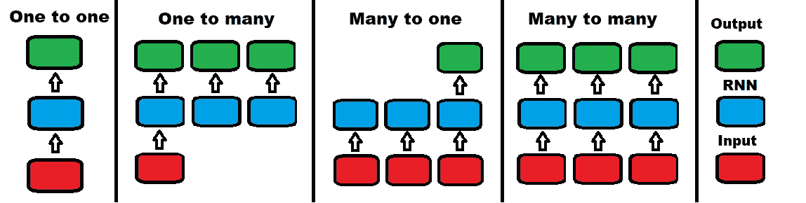
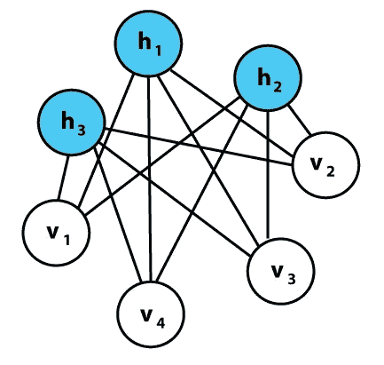

# 6 种深度学习模型——什么时候应该使用它们？

> 原文：<https://towardsdatascience.com/6-deep-learning-models-10d20afec175?source=collection_archive---------2----------------------->

Photo by [Terry Vlisidis](https://unsplash.com/@vlisidis?utm_source=medium&utm_medium=referral) on [Unsplash](https://unsplash.com?utm_source=medium&utm_medium=referral)

## 如何以及何时使用不同的深度学习模型。

## 从人工神经网络到自动编码器

# 介绍

深度学习是一个不断发展的领域，其应用跨越了许多用例。对于这个领域的任何新手来说，了解和理解深度学习中使用的不同类型的模型是很重要的。在本文中，我将解释以下每个模型:

## 监督模型

*   经典神经网络(多层感知器)
*   卷积神经网络
*   递归神经网络

## 无监督模型

*   自组织映射(SOMs)
*   玻尔兹曼机器
*   自动编码器

# 监督与非监督模型

有许多特征可以区分这两者，但最重要的区别在于这些模型是如何训练的。虽然监督模型是通过特定数据集的示例来训练的，但非监督模型只给定了输入数据，没有可以学习的结果集。所以我们一直试图预测的 y 柱，在无监督的模型中是不存在的。监督模型具有回归和分类等任务，并将生成公式，而非监督模型具有聚类和关联规则学习。

# 经典神经网络(多层感知器)

经典的神经网络也可以被称为多层感知器。感知器模型是美国心理学家弗兰克·罗森布拉特在 1958 年创造的。它的独特性质允许它通过一系列输入来适应基本的二进制模式，模拟人脑的学习模式。多层感知器是由两层以上组成的经典神经网络模型。

## **何时使用**

*   行和列格式的表格数据集(CSV 文件)
*   给定一组实值作为输入的分类和回归问题。
*   您的模型需要更高的灵活性。人工神经网络可以应用于不同类型的数据。

[点击这里学习如何用 Python 从头开始构建 ANN。](https://medium.com/swlh/building-an-artificial-neural-network-in-less-than-10-minutes-cbe59dbb903c)

# 卷积神经网络

卷积神经网络(CNN)是经典人工神经网络的一种更强大、更高级的变体，旨在处理大量复杂的预处理和数据计算。

CNN 是为图像数据设计的，可能是图像分类问题中最有效和最灵活的模型。尽管 CNN 并不是专门为处理非图像数据而构建的，但它们也可以用非图像数据获得令人惊叹的结果。

将输入数据导入模型后，构建 CNN 有 4 个部分:
1 .**卷积**:从我们的输入数据中创建特征图的过程。然后应用一个函数来过滤地图。
2。 **Max-Pooling** :使我们的 CNN 能够检测到修改后的图像。
3。**展平**:将数据展平成一个数组，这样 CNN 就可以读取了。
4。**全连接**:隐藏层，也为我们的模型计算损失函数。

## 何时使用

*   图像数据集(包括 OCR 文档分析)。
*   输入数据是一个二维字段，但可以在内部转换为一维，以便更快地处理。
*   当模型在计算输出时可能需要很大的复杂性时。

[点击这里学习如何用 Python 从头开始构建 CNN。](https://medium.com/swlh/deep-learning-predicting-skin-cancer-379084c33573)

# 递归神经网络

递归神经网络(RNNs)是为预测序列而发明的。LSTM(长短期记忆)是一种流行的 RNN 算法，有许多可能的用例:

## 何时使用:

1.  **一对一:**单个输入映射到单个输出。
    例如—图像分类
2.  **一对多:**单个输入映射到一系列输出。
    例如——图像字幕(单幅图像中的多个单词)
3.  多对一:一系列的输入产生单一的输出。
    例如——情感分析(多个单词的二进制输出)
4.  **多对多:**一个输入序列产生一个输出序列。
    例如，视频分类(将视频分割成帧，并分别标记每一帧)

# 自组织地图

自组织映射或 som 处理无监督的数据，通常有助于降维(减少模型中的随机变量)。对于自组织地图，输出维度始终是二维的。因此，如果我们有两个以上的输入特征，输出减少到二维。每个连接输入和输出节点的突触都有一个权重。然后，每个数据点竞争模型中的表示。最近的节点称为 BMU(最佳匹配单元)，SOM 更新其权重以更接近 BMU。随着模型的进展，BMU 的邻居不断减少。节点越靠近 BMU，其权重变化越大。
**注**:权重是节点本身的一个特性，它代表节点在输入空间中的位置。这里没有激活函数(权重不同于人工神经网络中的权重)。

## 何时使用:

*   当提供的数据不包含输出或 Y 列时。
*   探索项目，了解数据集背后的框架。
*   创意项目(AI 制作的音乐/文字/视频)。
*   用于特征检测的降维方法。

[点击此处查看自组织地图的示例](http://www.ai-junkie.com/ann/som/som1.html)

# 玻尔兹曼机器

在上面的 4 个模型中，有一个共同点。这些模型在某个方向起作用。即使 som 是无监督的，它们仍然像有监督的模型一样在特定的方向上工作。我说的方向是指:
输入→隐藏层→输出。

玻尔兹曼机器并不遵循某个方向。所有的节点在一个圆形的超空间中相互连接，就像图中一样。
玻尔兹曼机器也可以生成模型的所有参数，而不是用固定的输入参数工作。
这种模型被称为随机模型，不同于上述所有确定性模型。受限玻尔兹曼机更实用。

## **何时使用:**

*   监控系统时(因为 BM 将学会调节)
*   构建二元推荐系统
*   当处理一组非常具体的数据时

# 自动编码器

自动编码器的工作原理是基于输入值自动编码数据，然后执行激活功能，最后解码数据以输出。对输入要素施加了某种瓶颈，将它们压缩成更少的类别。因此，如果数据中存在某种固有结构，自动编码器模型将识别并利用它来获得输出。

## **自动编码器的类型/变化:**

- **稀疏自动编码器**:隐藏层大于输入层，但应用了正则化技术来减少过拟合。对损失函数添加约束，防止自动编码器一次使用其所有节点。
- **去噪自动编码器:**另一种正则化技术，其中我们采用我们的输入值的修改版本，其中我们的一些输入值随机变为 0。
- **收缩自动编码器:**当隐藏层大于输入层时，为损失函数增加一个惩罚，以防止值的过度拟合和复制。
- **堆叠自动编码器:**当你添加另一个隐藏层时，你得到一个堆叠自动编码器。它有两个编码阶段和一个解码阶段。

## **何时使用:**

*   维度缩减/特征检测
*   构建强大的推荐系统(比 BM 更强大)
*   对海量数据集中的要素进行编码

# 链接

感谢阅读！希望你学到了新的有用的东西。

 [## 我如何在一对一、一对多、多对一、多对一和多对多之间选择…

### 答:这取决于应用。引用 Andrej(来自循环神经的不合理有效性…

www.quora.com](https://www.quora.com/How-can-I-choose-between-one-to-one-one-to-many-many-to-one-many-to-one-and-many-to-many-in-long-short-term-memory-LSTM)  [## SOM 教程第 1 部分

### Kohonen 的自组织特征图“我无法清楚地表达我对那些认为……

www.ai-junkie.com](http://www.ai-junkie.com/ann/som/som1.html)  [## 何时使用 MLP、CNN 和 RNN 神经网络

### 什么样的神经网络适合你的预测建模问题？对初学者来说……可能很难

machinelearningmastery.com](https://machinelearningmastery.com/when-to-use-mlp-cnn-and-rnn-neural-networks/)  [## 自动编码器介绍。

### 自动编码器是一种无监督的学习技术，其中我们利用神经网络来完成表示的任务…

www.jeremyjordan.me](https://www.jeremyjordan.me/autoencoders/) 

> 关注更多机器学习/AI 相关内容
> [罗汉·古普塔](https://medium.com/u/f463f1bf80e2?source=post_page-----cbe59dbb903c----------------------)