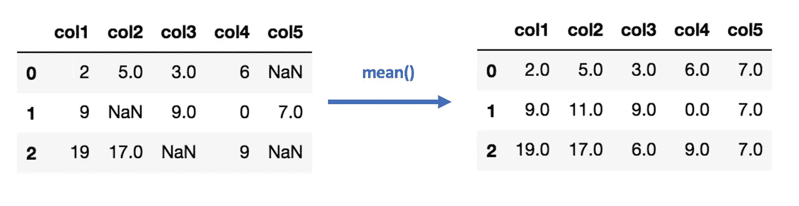
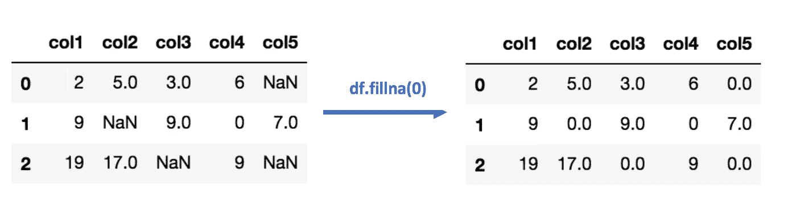
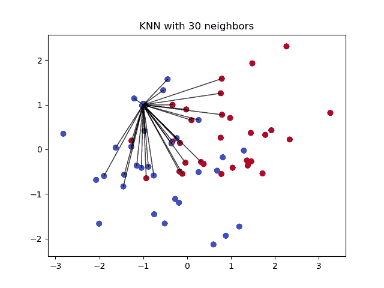
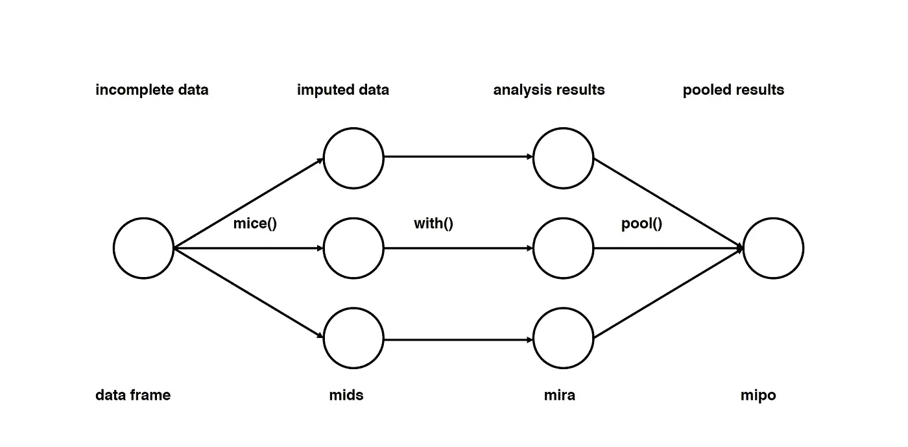
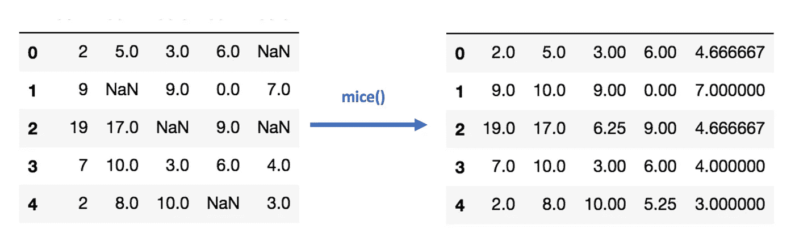

# 补偿数据集中缺失值的 6 种不同方法(数据插补，附示例)

> 原文：<https://towardsdatascience.com/6-different-ways-to-compensate-for-missing-values-data-imputation-with-examples-6022d9ca0779?source=collection_archive---------0----------------------->

Photo by [Vilmos Heim](https://unsplash.com/@vilmosheim?utm_source=medium&utm_medium=referral) on [Unsplash](https://unsplash.com?utm_source=medium&utm_medium=referral)

## 统计估算数据集中缺失值的常用策略。

由于各种原因，许多现实世界的数据集可能包含缺失值。它们通常被编码为名词、空格或任何其他占位符。使用具有大量缺失值的数据集来训练模型会极大地影响机器学习模型的质量。一些算法如 *scikit-learn 估计器*假设所有的值都是数字的，并且拥有有意义的值。

处理这个问题的一个方法是去掉有缺失数据的观测值。但是，您可能会丢失包含有价值信息的数据点。更好的策略是估算缺失值。换句话说，我们需要从数据的现有部分推断出那些缺失的值。缺失数据主要有三种类型:

*   完全随机失踪(MCAR)
*   随机失踪(三月)
*   不是随意失踪(NMAR)

然而，在这篇文章中，我将重点介绍 6 种流行的横截面数据集的数据插补方法(时间序列数据集是一个不同的故事)。

# 1-什么都不做:

这很简单。你只是让算法处理丢失的数据。一些算法可以考虑缺失值，并基于训练损失减少(即 XGBoost)。有些人可以选择忽略它们(即。light GBM—*use _ missing = false*。然而，其他算法会惊慌失措，并抛出一个报错值(即。Scikit learn —线性回归)。在这种情况下，您需要处理丢失的数据，并在将它提供给算法之前对其进行清理。

让我们看看在训练前估算缺失值的其他方法:

> **注意:下面所有的例子都使用了 Scikit-learn 的** [**加州住房数据集**](https://scikit-learn.org/stable/modules/generated/sklearn.datasets.fetch_california_housing.html) **。**

# 2-使用(平均值/中值)的插补:

其工作原理是计算一列中非缺失值的平均值/中值，然后独立地替换每列中缺失的值。它只能用于数值数据。

Mean Imputation

**优点:**

*   简单快捷。
*   适用于小型数值数据集。

**缺点**:

*   不考虑特征之间的相关性。它只在列级别有效。
*   将对编码的分类特征给出较差的结果(不要对分类特征使用它)。
*   不太准确。
*   没有考虑插补的不确定性。

Mean/Median Imputation

# 3-使用(最频繁)或(零/常数)值的插补:

**最常见的**是另一种估算缺失值的统计策略，没错！！它通过用每列中最频繁的值替换缺失数据来处理分类特征(字符串或数字表示)。

**优点:**

*   适用于分类特征。

**缺点:**

*   它也没有考虑特征之间的相关性。
*   它会在数据中引入偏差。

Most Frequent Imputation

**零或常数**插补——顾名思义——用零或您指定的任何常数值替换缺失值

# 4-使用 k-NN 的插补:

*k* 最近邻是一种用于简单分类的算法。该算法使用“**特征相似度**来预测任何新数据点的值。这意味着根据新点与训练集中的点的相似程度为其赋值。这对于预测缺失值非常有用，方法是找到与缺失数据的观测值最接近的 *k 的*邻域，然后基于邻域中的非缺失值对其进行输入。让我们看一些使用`[Impyute](https://impyute.readthedocs.io/en/master/#)`库的示例代码，该库提供了一种使用 KNN 进行插补的简单易行的方法:

KNN Imputation for California Housing Dataset

## 它是如何工作的？

它创建一个基本的均值估算，然后使用生成的完整列表来构建一个 KDTree。然后，它使用生成的 KDTree 来计算最近邻(NN)。在找到 k-nn 之后，它对它们进行加权平均。

**优点:**

*   可能比平均值、中间值或最常见的插补方法更准确(取决于数据集)。

**缺点:**

*   计算开销很大。KNN 的工作原理是将整个训练数据集存储在内存中。
*   K-NN 对数据中的异常值非常敏感(**不同于 SVM** )

# 5-使用链式方程多元插补的插补(小鼠)

Main steps used in multiple imputations [1]

这种类型的插补通过多次填充缺失数据来实现。多重插补(MIs)比单一插补好得多，因为它以更好的方式衡量缺失值的不确定性。链式方程方法也非常灵活，可以处理不同数据类型的不同变量(即连续或二进制)以及诸如边界或勘测跳跃模式的复杂性。关于算法机制的更多信息，你可以参考 R [研究论文](https://www.jstatsoft.org/article/view/v045i03/v45i03.pdf)

MICE imputation using impyute

# 6-使用深度学习的插补([数据偏移](https://github.com/awslabs/datawig)):

这种方法非常适用于分类和非数字特征。它是一个库，使用深度神经网络学习机器学习模型，以估算数据帧中的缺失值。它还支持 CPU 和 GPU 进行训练。

Imputation using Datawig

**优点**:

*   与其他方法相比相当准确。
*   它有一些可以处理分类数据的函数(特征编码器)。
*   它支持 CPU 和 GPU。

**缺点:**

*   单列插补。
*   对于大型数据集可能会非常慢。
*   您必须指定包含要估算的目标列信息的列。

# 其他插补方法:

## 随机回归插补:

它与回归插补法非常相似，回归插补法试图通过从同一数据集中的其他相关变量加上一些随机残差值进行回归来预测缺失值。

## 外推和内插法:

它试图从一组离散的已知数据点范围内的其他观察值中估计值。

## 热卡插补:

工作原理是从一组相关和相似的变量中随机选择缺失值。

总之，没有完美的方法来补偿数据集中缺失的值。对于某些数据集和缺失数据类型，每种策略的性能都较好，但对于其他类型的数据集，性能可能会差得多。有一些固定的规则来决定对特定类型的缺失值使用哪种策略，但除此之外，您应该试验并检查哪种模型最适合您的数据集。

## **参考文献:**

*   [1] Buuren，S. V .，& Groothuis-oudshorn，K. (2011 年)。Mice:用链式方程进行多变量插补
*   [https://impyute.readthedocs.io/en/master/index.html](https://impyute.readthedocs.io/en/master/index.html)