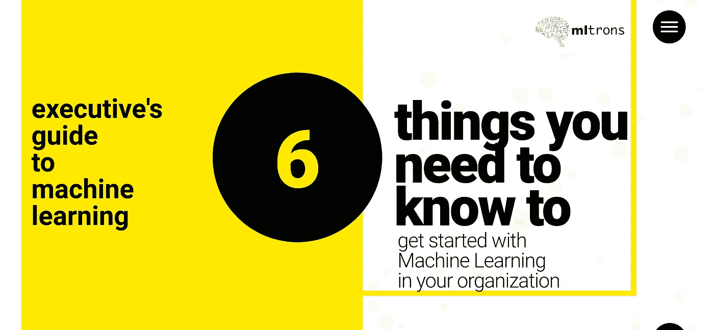
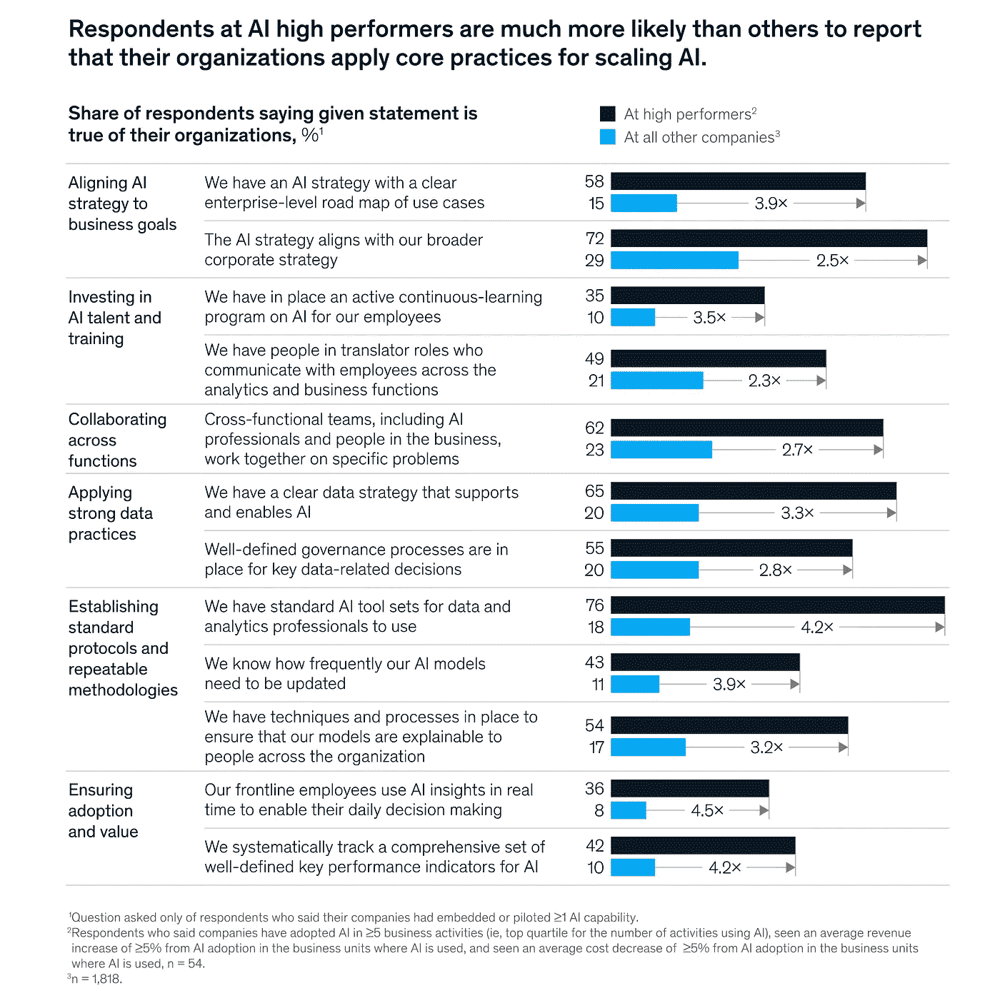

# 6-在您的组织中成功实施机器学习解决方案的基本实践。

> 原文：<https://towardsdatascience.com/6-essential-practices-to-successfully-implement-machine-learning-in-your-organization-cfba8d7cafbb?source=collection_archive---------19----------------------->

## 成功成为人工智能驱动企业的高管指南。

Executive’s Guide To Machine Learning

# 介绍

[McKinsey Insights](https://www.mckinsey.com/featured-insights) 最近发布了其[全球人工智能调查](https://www.mckinsey.com/featured-insights/artificial-intelligence/global-ai-survey-ai-proves-its-worth-but-few-scale-impact)，并讨论了人工智能对多家公司产生的影响的许多方面。真正吸引我眼球的是人工智能高性能公司与其他公司之间的比较。根据所做的比较，拥有清晰的企业级用例路线图、分析&业务部门之间稳固的跨职能协作、供专业人士使用的标准人工智能工具集、了解频繁更新人工智能模型并系统跟踪一套全面的定义良好的人工智能 KPI 的公司比市场上的其他公司表现好 3.78 倍。

这项调查的结果与我们在[m trons](https://www.mltrons.com)与多家公司合作的经历极其一致。我很高兴地说，我们合作的大多数公司都在成为人工智能高绩效者的明确轨道上。为了达到 AI 高绩效状态，我们设计了六个基本实践，为我们的客户带来了成功的结果。

# 01.建立一个与企业级目标一致的强大人工智能战略

> “机器学习不是魔法”

我们已经看到许多高管一头扎进从头开始构建机器学习程序。但是很棘手。它需要大量的前期投资、最小化信息不对称、最小化惯性、清晰的路线图和利益一致。

这里的关键是建立一个与你的公司目标一致的战略。公司需要理解，为了建立强大的数据战略并使其与公司级目标保持一致，it 需要将各种利益相关者聚集在一起，并在制定战略时查看经验数据。通过定义明确的目标和了解所需的基础设施，公司可以成功地评估此类计划的成功概率。这就把我们带到了下一点。

# 02.定义清晰的目标和用例

提前定义你的机器学习目标！句号。没有对自己想要达到的目标的清晰认识，就很难衡量成功。例如，一家公司可能希望实现总收入增加 20%或成本降低 10%。这是公司层面的目标。现在，管理层可以轻松决定直接影响收入或成本的用例，例如，[优化营销活动以增加总体收入](https://www.mltrons.com/optimize_marketing_revenue.html)，或[通过准确预测房价来增加房地产投资回报](https://www.mltrons.com/increase_roi_with_accurate_forecasts)。通过清晰地定义路线图，成功的概率会增加，失败的风险会降低 40%以上。

# 03.**定义数据质量标准**

这里有一条黄金法则需要记住:机器学习算法的好坏取决于它得到的数据。因此，为了有效地使用机器学习，你必须拥有你试图解决的问题的正确数据。而不仅仅是几个数据点。机器需要大量的数据来学习——想想成百上千的数据点。

您的数据需要针对算法进行格式化、清理和组织，并且您需要两个数据集:一个用于训练模型，另一个用于评估模型的性能。因此，在挑选出用例之后，筛选出那些有数据可用的用例，以及那些能够快速全面产生价值的用例。争取多个较小的成功，并制定明确的数据战略。

# 04.**利用组织内的数据分析师&商业智能专家**

公民数据科学家(Citizen Data Scientist)是 Gartner 创造的一个术语，指的是需要或希望实现机器学习技术的数据分析专业人员或数据专业人员。

这些专业人员通常是数据分析师或 BI 分析师。他们专注于在已经发生的事件的数据中寻找趋势(描述性分析),并在仪表板、静态报告和图表中表达他们的结果。

他们通常在销售、营销、财务或人力资源等业务部门工作，对其部门面临的业务挑战有着深入的了解。

## 为什么公民数据科学家很重要？

由于全球缺乏训练有素的数据科学家，您需要为您的数据分析专业人员和其他领域信息专家提供成为公民数据科学家所需的工具和支持。

然而，现在有了强大的工具，使他们能够使用比数据分析专业同行更具深度和广度的数据来解决业务问题。

Gartner 估计，到 2020 年，超过 40%的数据科学任务将实现自动化

## m trons+公民数据科学家

数据分析专业人员具有深厚的领域专业知识，并认识到其部门的核心业务挑战。他们对可用数据有很好的理解，但不能经常执行一些区分分析师和公民数据科学家的数据科学任务。

Mltrons 的简化和自动化机器学习平台复制了通常由专家数据科学家手动执行的任务和流程，允许用户快速实施机器学习解决方案，而无需编写一行代码。

公民数据科学家只需上传一个数据集，并根据他们希望解决的实际业务问题选择一个目标变量。

Mltrons 的平台自动应用数据准备、预处理、特征工程、模型训练和验证的最佳实践。

然后，该平台会自动选择最适合的算法，并揭示通常未被注意到的见解，同时用所有相关利益方都能理解的简单语言解释结果。

# 05.**围绕数据建立你的文化&人工智能**

各部门的分析专业人员有能力确定机器学习的最佳用例，然后他们可以使用 mltrons 平台来构建和实施机器学习模型。

为了在您的组织中充分利用机器学习，您需要拥有正确心态的正确团队。后者需要文化转变，在整个组织中优先考虑和奖励实验、测量和测试。从机器学习中产生价值是一个需要时间和持续监控的过程。通过由充满激情的个人组成的专门团队全面实施人工智能，成功的概率会大大增加。

# **06。起步快，迭代快！**

随着数据量的增加和对更深入洞察的需求，组织需要立即采取行动。有了机器学习，就有可能快速自动地产生模型，这些模型可以分析更大、更复杂的数据，并提供更快、更准确的结果——规模化。通过建立精确的模型，组织有更好的机会识别有利可图的机会。

竞争日益激烈，人才短缺，因此，如果公司希望在今天的数据时代保持相关性，他们需要迅速行动，开始建立自己的人工智能战略。

# 最终意见

我希望你喜欢这篇文章，并发现它的信息。我们祝你的人工智能之旅一切顺利。遵循一个结构化的框架并衡量你的成功，我们确信你的人工智能计划将会非常成功！

如果您有任何问题或疑问，请随时联系我们。你可以访问这个[网站](https://www.mltrons.com)了解更多。

参考

[https://www . McKinsey . com/featured-insights/artificial-intelligence/global-ai-survey-ai-provides-its-worth-but-less-scale-impact](https://www.mckinsey.com/featured-insights/artificial-intelligence/global-ai-survey-ai-proves-its-worth-but-few-scale-impact)

 [## 优化营销活动以增加收入| mltrons

### 如果您使用 Excel、Tableau、SQL 等工具，并且对您的业务和数据有很好的理解，那么您已经…

www.mltrons.com](https://www.mltrons.com) 

[https://www . mltrons . com/increase _ ROI _ with _ accurate _ forecasts](https://www.mltrons.com/increase_roi_with_accurate_forecasts)