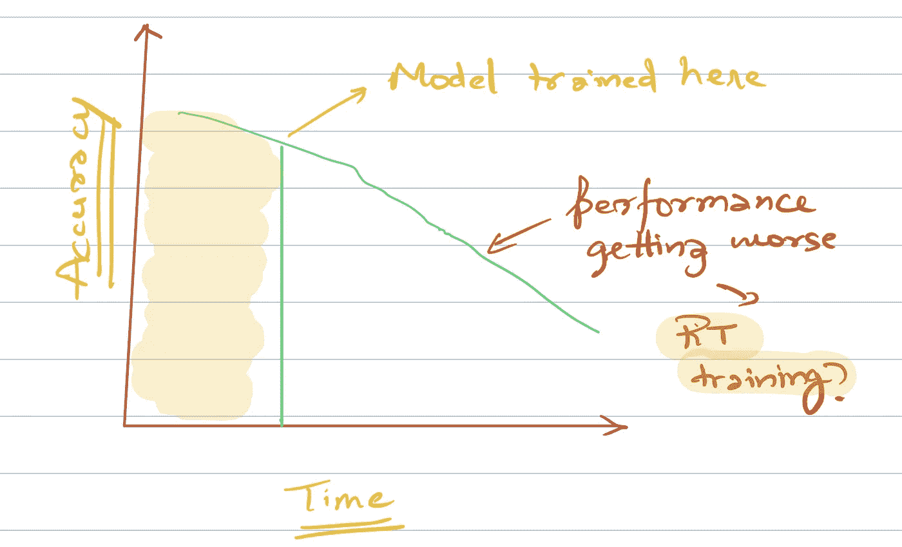
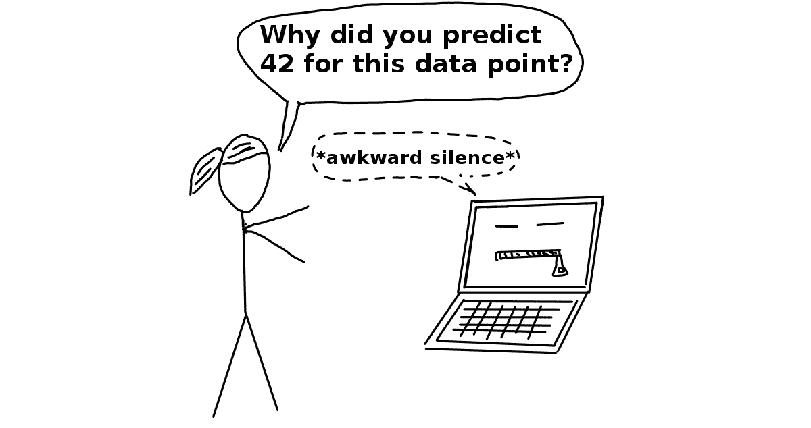

# 构建机器学习系统的六个重要步骤

> 原文：<https://towardsdatascience.com/6-important-steps-to-build-a-machine-learning-system-d75e3b83686?source=collection_archive---------7----------------------->

[Pixabay](https://pixabay.com/illustrations/psychology-face-dialogue-mute-tree-4420030/)

## 思考 ML 项目的现场指南

创建一个伟大的机器学习系统是一门艺术。

在构建一个伟大的机器学习系统时，有很多事情需要考虑。但是经常发生的是，我们作为数据科学家只担心项目的某些部分。

大多数时候，这只是建模，但在现实中，机器学习项目的成败取决于许多其他因素。

> 机器学习管道不仅仅是创建模型

必须了解在训练模型之前以及在训练模型并将其部署到生产中之后会发生什么。

这篇文章是关于解释端到端数据项目管道中所涉及的内容。这是我职业生涯中很晚才学到的东西。

# 1.问题定义

这一条很明显——***定义了一个问题。***

而且，这可能是整个练习中最关键的部分。

***那么，如何给机器学习定义一个问题呢？***

这取决于很多因素。在我们考虑的所有因素中，第一个应该是理解 ***它将如何给业务带来好处*** 。

这是任何数据科学项目的圣杯。如果您的项目对业务没有帮助，它就不会被部署。句号。

一旦你有了想法并确定了业务兼容性，你需要 ***定义一个成功的衡量标准*** 。

***现在，成功是什么样子的？***

是 90%的准确率还是 95%的准确率还是 99%的准确率。

嗯，我可能对 70%的预测准确率感到满意，因为普通人永远不会超过这个准确率，同时，你可以自动化这个过程。

当心， ***这不是制定远大目标的时候；现在是时候理性而明智地看待每 1%的精度变化对成功的影响了。***

例如:对于点击预测问题/欺诈应用程序，与评论情绪预测准确度提高 1%相比，准确度提高 1%将提高业务底线。

> 并非所有精度的提高都是同等的

# 2.数据

在为您的机器学习模型进行数据采集和数据创建时，您需要回答几个问题。

这里要回答的最重要的问题是: ***你的模型需要实时工作吗？***

如果是这样的话，你就不能使用像 Hive/Hadoop 这样的系统进行数据存储，因为这样的系统可能会引入大量的延迟，并且适合离线批处理。

你的模型需要实时训练吗？

如果您的 ML 模型的性能随着时间的推移而下降，如上图所示，您可能需要考虑实时训练。RT 训练可能对大多数点击预测系统有益，因为互联网趋势变化相当快。

***测试和训练数据是否存在不一致？***

或者简而言之— ***你怀疑生产数据来自与训练数据不同的分布？***

例如:在一个点击预测问题的实时训练中，你给用户看广告，他没有点击。是失败的例子吗？也许用户通常在 10 分钟后点击。但是您已经创建了数据，并在此基础上训练了您的模型。

在为模型准备数据时，有许多因素需要考虑。你需要提出问题，从头到尾思考这个过程，这样才能在这个阶段取得成功。

# 3.估价

我们将如何评估模型的性能？

***这里的黄金标准是训练-测试-验证的分割。***

我们经常通过抽样来建立一个训练验证测试集，却忘记了一个隐含的假设——数据很少是 IID 分布的(独立同分布)。

***简单来说，我们假设每个数据点都是相互独立的，并且来自同一个分布，这种假设即使不是完全错误，也是错误的。***

对于一个互联网公司来说，2007 年的一个数据点和 2019 年的一个数据点是非常不同的。它们不是来自同一个发行版，因为有很多因素——网络速度是最重要的。

如果你有一个猫对狗的预测问题，你很擅长随机抽样。但是，在大多数机器学习模型中，任务是预测未来。

您可以考虑使用时间变量分割数据，而不是从数据中随机取样。例如:对于点击预测问题，您可以将截至上个月的所有过去数据作为训练数据，将上个月的数据作为验证数据。

***接下来你需要考虑的是基线模型。***

假设我们使用 RMSE 作为时间序列模型的评估指标。我们在测试集上评估了该模型，结果 RMSE 为 4.8。

那是好的 RMSE 吗？我们怎么知道？我们需要一个基线 RMSE。这可能来自同一任务的当前采用的模型。或者通过使用一些简单的模型。对于时间序列模型，要克服的基线是最后一天的预测。即预测前一天的数字。

对于 NLP 分类模型，我通常在 Countvectorizer(词袋)上设置基线为 Logistic 回归模型的评估度量(准确率、F1、log loss)。

你还应该考虑如何在多个小组中打破评价，这样你的模型就不会产生不必要的偏见。

去年，亚马逊因一个秘密的人工智能招聘工具出现在[新闻](https://www.wellesley.edu/albright/about/blog/4766-ai-sexist)中，该工具显示出对女性的偏见。为了从这种不一致中拯救我们的机器学习模型，我们需要在不同的组上评估我们的模型。也许我们的模型对女性没有对男性那么准确，因为在训练数据中女性的数量要少得多。

或者，一个预测某个产品是否会被购买的模型对于某个特定的产品类别非常有效，而对于其他产品类别则无效。

事先将这些事情记在心里，并准确地思考特定评估方法可能会出什么问题，这肯定会帮助我们设计一个好的 ML 系统。

# 4.特征

好的特征是任何机器学习模型的支柱。而且通常是你花最多时间的部分。我已经看到，这是你可以调整最大模型性能的一部分。

> 好的特性创建通常需要领域知识、创造力和大量时间。

除此之外，不同型号的特征创建练习可能会有所不同。例如，神经网络和 XGboost 的特征创建非常不同。

理解创建特征的各种方法本身就是一个相当大的话题。我在这里写了一篇关于特性创建的文章。请务必看一看:

 [## 《搭车人特征提取指南》

### 对特征工程技术的详尽研究

towardsdatascience.com](/the-hitchhikers-guide-to-feature-extraction-b4c157e96631) 

一旦创建了大量的特征，下一步可能要做的就是移除多余的特征。这里有一些方法做到这一点

 [## 每个数据科学家都应该知道的 5 种特征选择算法

### 额外收获:是什么让一个优秀的足球运动员变得伟大？

towardsdatascience.com](/the-5-feature-selection-algorithms-every-data-scientist-need-to-know-3a6b566efd2) 

# 5.建模

[Interpretable ML Book](https://christophm.github.io/interpretable-ml-book/terminology.html)

现在到了我们最关心的部分。为什么不呢？这是我们在项目结束时交付的部分。这是我们花了那么多时间在数据获取和清理、功能创建等方面的部分。

那么我们在创建模型的时候需要思考什么呢？

你可能需要问我们自己的第一个问题是 ***你的模型是否需要可解释？***

有相当多的用例，业务可能需要一个可解释的模型。一个这样的用例是当我们想要做属性建模的时候。这里我们定义了各种广告流(电视、广播、报纸等)的效果。)在收益上。在这种情况下，理解来自每个广告流的响应变得至关重要。

***如果我们需要最大化准确性或任何其他指标，我们仍然希望使用像 NeuralNets 或 XGBoost 这样的黑盒模型。***

除了型号选择，您还应该考虑其他事情:

*   ***模型架构:***NNs 多少层，或者 GBT 多少树或者你需要如何为线性模型创建特征交互。
*   ***如何调超参数？:*** 你应该尝试自动化这个部分。市场上有很多这方面的工具。我倾向于使用远视。

# 6.实验

现在您已经创建了您的模型。

它比基线/您当前的模型表现得更好。我们应该如何前进？

我们有两个选择-

1.  不断改进我们的模型。
2.  在生产环境中测试我们的模型，获得更多关于可能出错的信息，然后通过 ***持续集成继续改进我们的模型。***

我支持第二种方法。在 Coursera [深度学习专业](https://coursera.pxf.io/7mKnnY)的第三门名为《构建机器学习项目》的课程中，吴恩达说

> “不要一开始就试图设计和构建完美的系统。相反，快速建立和训练一个基本系统——也许只需要几天。即使基本系统远非你所能构建的“最佳”系统，考察基本系统的运行方式也是有价值的:你会很快找到线索，向你展示最有希望投入时间的方向。

我还要强调的一点是 ***持续集成*** 。如果您当前的模型比现有的模型执行得更好，为什么不在生产中部署它，而不是在增量收益后运行？

为了测试您的模型优于现有模型的假设的有效性，您可以设置一个 A/B 测试。一些用户(测试组)看到您的模型，而一些用户(控制组)看到以前模型的预测。

您应该始终致力于最小化您的模型的首次在线实验的时间。这不仅产生了价值，而且通过实时反馈让你了解你的模型的缺点，然后你可以继续工作。

# 结论

> 机器学习没有什么是简单的。任何事情都不应该被假设。

在构建 ML 管道时，您应该始终对您所做的任何决定保持批判态度。

一个简单的决策可能决定你的机器学习项目的成败。

***所以聪明地想，想得很多。***

这篇文章是增加我对机器学习生态系统的理解的一部分，灵感来自脸书工程团队的一组很棒的视频。

如果你想了解更多关于如何构建机器学习项目和最佳实践的信息，我想调出他在 Coursera [深度学习专业化](https://coursera.pxf.io/NKERRq)中的第三门名为构建机器学习项目的课程[。一定要去看看。](https://coursera.pxf.io/NKERRq)

谢谢你的阅读。将来我也会写更多初学者友好的帖子。在 [**媒体**](https://medium.com/@rahul_agarwal?source=post_page---------------------------) 关注我，或者订阅我的 [**博客**](http://eepurl.com/dbQnuX?source=post_page---------------------------) 了解他们。一如既往，我欢迎反馈和建设性的批评，可以通过 Twitter [@mlwhiz](https://twitter.com/MLWhiz?source=post_page---------------------------) 联系到我。