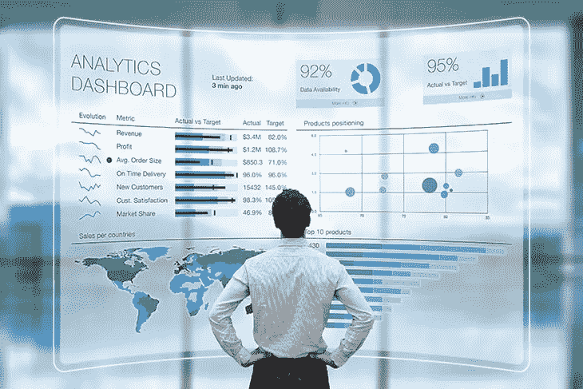
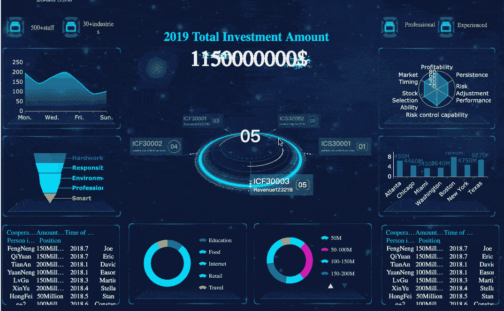
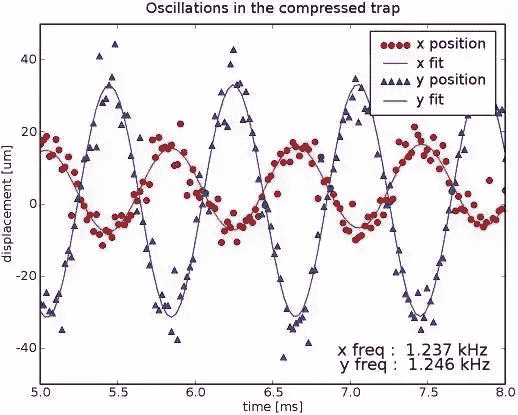
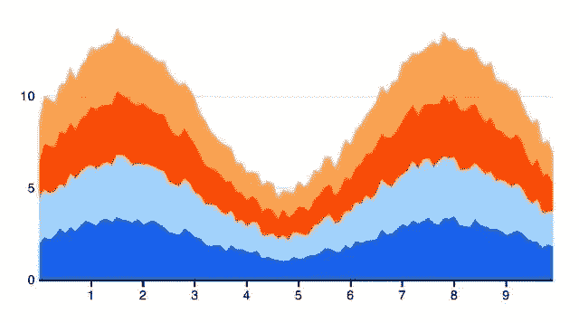
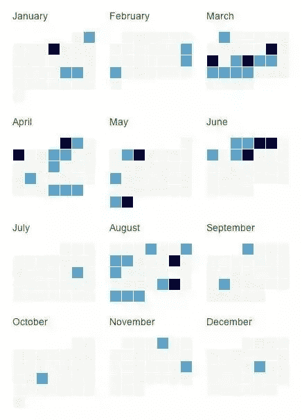
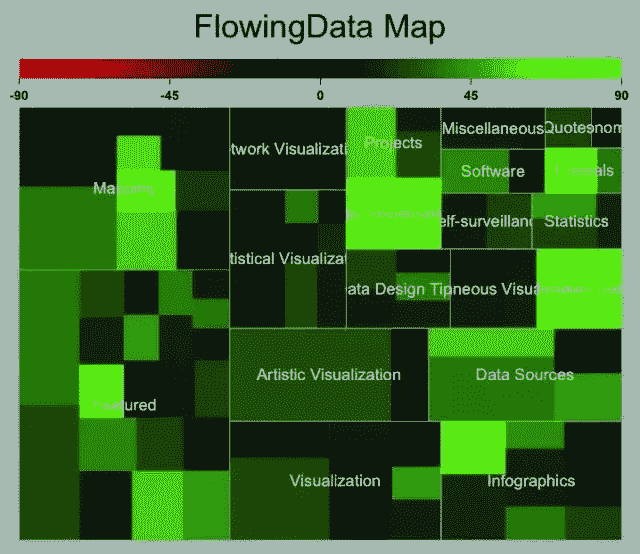
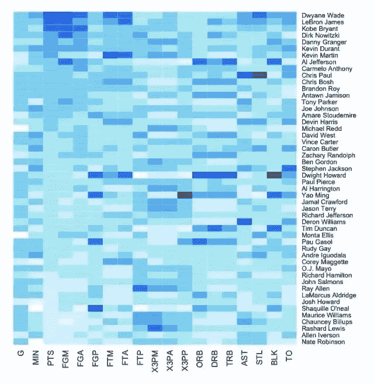

# 数据分析师需要掌握的 6 项关键技能

> 原文：<https://towardsdatascience.com/6-key-skills-that-data-analysts-need-to-master-df1d82257b9?source=collection_archive---------4----------------------->

在数据运营理念不断深入的今天，越来越多的公司意识到数据驱动的商业战略的价值，强调全员参与数据运营。发展分析数据的能力也是未来的趋势。那么你知道如何成为一名优秀的数据分析师，如何在就业市场上保持竞争力吗？以下是数据分析师需要掌握的 6 项关键技能。

From [Google](https://www.greenriver.edu/students/academics/continuing-community-education/certificates/certificate-programs/data-analyst-certificate/)

# 1.擅长

Excel 是日常工作中常见的**数据分析工具。而且这个工具很容易上手。它不仅可以做简单的二维表格、复杂的嵌套表格，还可以创建折线图、柱形图、条形图、面积图、饼图、雷达图、组合图、散点图等。**

**此外，Excel 还可以实现更多高级功能，包括数据透视表(类似于 BI 的多维分析模型立方体)和 Vlookup 等复杂函数。它可以轻松处理成千上万条数据。**

**学习 excel 是一个循序渐进的过程。**

*   ****基础**:简单的表格数据处理、打印、查询、过滤、排序**
*   ****函数和公式**:常用函数、高级数据计算、数组公式、多维引用**
*   **[**可视化**](http://www.finereport.com/en/features/data-visualization?utm_source=medium&utm_medium=media&utm_campaign=blog&utm_term=6%20Key%20Skills%20That%20Data%20Analysts%20Need%20to%C2%A0Master) :图形显示、高级图表、图表插件**
*   ****数据透视表，VBA 程序开发****

**做数据分析师，要掌握高级的 Excel 技能。**

# **2.结构化查询语言**

**数据分析师要熟悉 Oracle、SQL Server、DB2、MySQL、MongoDB 等常用数据库。此外，他们知道如何编写 SQL，包括各种统计函数，如 join、group by、order by、distinct、sum、count、average 等。**

**除了熟练使用 SQL 语句，数据分析师还应该了解数据库的存储和读取过程。在处理大数据量时，如何找到加快程序速度、减少网络流量、提高数据库安全性的方法是非常重要的。**

# ****3。数据可视化****

**[**数据分析**](http://www.finereport.com/en/data-analysis/data-analysis-practice-guide-how-to-begin.html?utm_source=medium&utm_medium=media&utm_campaign=blog&utm_term=6%20Key%20Skills%20That%20Data%20Analysts%20Need%20to%C2%A0Master) 的结果最终是呈现给别人的，可视化技能也是衡量数据分析师水平的一个指标。我们希望确保为数据选择正确的 [**图表类型**](http://www.finereport.com/en/data-visualization/top-16-types-of-chart-in-data-visualization.html?utm_source=medium&utm_medium=media&utm_campaign=blog&utm_term=6%20Key%20Skills%20That%20Data%20Analysts%20Need%20to%C2%A0Master) ，并快速清晰地显示结果。**

**像 D3.js、HighCharts、Tableau、PowerBI 这些数据可视化工具都有自己的优势。您必须精通至少一种可视化工具。想知道可以学习哪些工具，可以看看这篇文章[***2019***](/9-data-visualization-tools-that-you-cannot-miss-in-2019-3ff23222a927)你不能错过的 9 个数据可视化工具。**

**以我为例，我在工作中经常使用 [**FineReport**](http://www.finereport.com/en/?utm_source=medium&utm_medium=media&utm_campaign=blog&utm_term=6%20Key%20Skills%20That%20Data%20Analysts%20Need%20to%C2%A0Master) ，这是基于“无代码开发”理念设计的。FineReport 可以直接连接各类数据库，定制各种复杂报表，酷炫 [**仪表盘**](/how-can-beginners-design-cool-data-visualizations-d413ee288671) ，方便快捷。**

****

**From [FineReport](http://www.finereport.com/en/?utm_source=medium&utm_medium=media&utm_campaign=blog&utm_term=6%20Key%20Skills%20That%20Data%20Analysts%20Need%20to%C2%A0Master)**

**在这一点上，如果你掌握了以上技巧，你就可以算是一名合格的分析师了。这个阶段的数据分析师需要知道如何使用工具处理数据，了解业务场景，分析解决基本问题。之后，如果你想钻研技术，甚至向数据科学家方向发展，就要学习以下技巧。**

# **4.统计数字**

**首先你必须系统地学习统计学。纯机器学习强调算法的预测能力和实现，但统计学一直强调可解释性。你需要理解数据背后的原理。下面这些统计方法都是你可以学习的。**

*   ****数据挖掘相关的统计方法**:多元逻辑回归分析、非线性回归分析、判别分析等。**
*   ****定量方法**:时间轴分析、概率模型、优化**
*   ****决策分析**:多目标决策分析、决策树、影响图、敏感性分析**
*   ****竞争优势分析**:通过项目和成功案例学习基本的分析概念**
*   ****数据库原理**:数据模型，数据库设计**
*   ****预测分析**:时间轴分析、主成分分析、非参数回归、统计过程控制**
*   ****数据管理** : ETL(提取、转换、加载)、数据治理、管理职责、元数据**
*   ****优化和启发式**:整数规划、非线性规划、局部探索、超灵感(模拟退火、遗传算法)**
*   ****大数据分析**:学习非结构化数据概念、MapReduce 技术、大数据分析方法**
*   ****数据挖掘**:聚类(k-means 法、分割法)、关联规则、因子分析、生存时间分析**
*   ****风险分析和运营分析的计算机模拟****
*   ****软件级分析**:组织级分析主题、IT 和业务用户、变更管理、数据主题、演示和沟通**

# **5.程序设计语言**

**精通一些编程语言可以让数据分析工作更加灵活。编程语言适用于所有类型的数据。大多数新奇的仪表盘都可以用代码或绘图软件来实现。**

## **1) [Python](https://www.python.org)**

**Python 最大的优势是擅长处理大量数据，性能好，不停机。它特别适合于繁琐的计算和分析。而且，Python 的语法很容易读懂。它更受 It 人员的欢迎，因为它能够用许多模块创建数据图。**

****

**Chart made with Python**

## **2) HTML & JavaScript & CSS**

**很多[可视化软件](http://www.finereport.com/en/data-visualization/9-data-visualization-tools-that-you-cannot-miss-in-2019.html?utm_source=medium&utm_medium=media&utm_campaign=blog&utm_term=6%20Key%20Skills%20That%20Data%20Analysts%20Need%20to%C2%A0Master)都是基于 web 的，可视化开发离不开编程语言。随着人们越来越依赖浏览器工作，网络浏览器的功能也越来越好。使用 HTML、JavaScript 和 CSS，您可以直接运行可视化显示程序。**

********

**Interactive calendar**

## **3) [R](https://www.r-project.org/)**

**R 语言是统计学家最喜欢的分析软件。它是开源免费的，图形功能非常强大。**

**r 是为数据分析设计的。它最初是为统计学家和数据科学家设计的。然而，由于数据分析的日益普及，R 语言的使用并没有受到限制。**

**R 的使用流程非常清晰。有很多支持 R 的工具包，只要把数据加载到 R 中，写一两行代码就可以创建数据图了。例如，使用 Portfolio toolkit 快速创建下面的层次图。**

****

**FlowingData Map**

****

**Heat map made with R**

# **6.人工智能和机器学习**

**人工智能是当今最热门的话题之一，也就是把人的智能赋予机器。有大量应用人工智能的工具，包括搜索和数学优化，以及逻辑推理。基于仿生学和认知心理学的算法，基于概率和经济学的算法也在探索中。**

****

**而**机器学习是人工智能的一个分支**。机器学习算法是从数据中自动分析并获取规则，并利用规则预测未知数据的一类算法。它已被广泛应用于数据挖掘、计算机视觉、自然语言处理、搜索引擎、医疗诊断、证券市场分析等领域。**

**如果你想成为一名优秀的数据分析师，你必须站在数据科学的前沿，了解行业趋势。你必须了解人工智能和机器学习的概念。在未来，你也许可以将这些技术创新性地引入到你的工作中。**

**最后，请再问自己一次:你真的喜欢 [**数据分析**](http://www.finereport.com/en/data-analysis/data-analysis-practice-guide-how-to-begin.html?utm_source=medium&utm_medium=media&utm_campaign=blog&utm_term=6%20Key%20Skills%20That%20Data%20Analysts%20Need%20to%C2%A0Master) 吗？在处理大量数据时，你是觉得枯燥单调还是觉得有趣有挑战性？如果你决定长期从事数据分析师的工作，或者你想知道如何向数据分析职业过渡，你可以从提高上述技能开始。**

# **您可能也会对…感兴趣**

**[*KPI 仪表板的前 7 种图表类型*](/top-7-chart-types-for-kpi-dashboards-287fb84a8874)**

**[*制作销售仪表盘的逐步指南*](/a-step-by-step-guide-to-making-sales-dashboards-34c999cfc28b)**

**[*新手如何设计酷炫的数据可视化？*](/how-can-beginners-design-cool-data-visualizations-d413ee288671)**

**[*4 个参数查询功能让您的数据可视化互动*](/4-parameter-query-functions-to-make-your-data-visualization-interactive-bbd84dd6bafb)**

**[*数据可视化十大地图类型*](/top-10-map-types-in-data-visualization-b3a80898ea70)**