# 6 更多评估指标数据科学家应该熟悉——来自高级卡格勒新书的教训

> 原文：<https://towardsdatascience.com/6-more-evaluation-metrics-data-scientists-should-be-familiar-with-lessons-from-a-high-rank-d7756611efc4?source=collection_archive---------24----------------------->

## 《赢得 KAGGLE 的数据分析技术》一书

## 多类分类和推荐的评价指标

Photo by [Ales Krivec](https://unsplash.com/@aleskrivec?utm_source=medium&utm_medium=referral) on [Unsplash](https://unsplash.com?utm_source=medium&utm_medium=referral)

这是另一篇文章，介绍了新书*“赢得 Kaggle 的数据分析技术”，*中介绍的技巧，作者是三位高级 kaggler(不包括我自己，因此这不是个人提升！:) )

这是**第二篇关于 ML 评估指标**的帖子。[这里是第一个帖子](/11-evaluation-metrics-data-scientists-should-be-familiar-with-lessons-from-a-high-rank-kagglers-8596f75e58a7)。从第一篇文章开始，指标编号从#12 开始！

关于这本书的完整目录，请看我的[另一篇文章](https://medium.com/@daydreamersjp/a-new-book-data-analysis-techniques-to-win-kaggle-is-a-current-best-and-complete-for-table-data-4af66a88388)。

# 目录:

## [多类分类任务](/6-more-evaluation-metrics-data-scientists-should-be-familiar-with-lessons-from-a-high-rank-d7756611efc4#a650)

[单标签多类分类与多标签多类分类](/6-more-evaluation-metrics-data-scientists-should-be-familiar-with-lessons-from-a-high-rank-d7756611efc4#c858)

## [单标签多类分类的评价指标](/6-more-evaluation-metrics-data-scientists-should-be-familiar-with-lessons-from-a-high-rank-d7756611efc4#db92)

[#12 —多类精度](/6-more-evaluation-metrics-data-scientists-should-be-familiar-with-lessons-from-a-high-rank-d7756611efc4#17f2)

[#13 —多级分类的平衡精度](/6-more-evaluation-metrics-data-scientists-should-be-familiar-with-lessons-from-a-high-rank-d7756611efc4#7422)

[#14 —多类日志丢失](/6-more-evaluation-metrics-data-scientists-should-be-familiar-with-lessons-from-a-high-rank-d7756611efc4#e795)

## [多标签多类别分类的评估指标](/6-more-evaluation-metrics-data-scientists-should-be-familiar-with-lessons-from-a-high-rank-d7756611efc4#7087)

[#15 —平均 F1、宏观 F1、微观 F1](/6-more-evaluation-metrics-data-scientists-should-be-familiar-with-lessons-from-a-high-rank-d7756611efc4#63fc)

[#16 —二次加权κ](/6-more-evaluation-metrics-data-scientists-should-be-familiar-with-lessons-from-a-high-rank-d7756611efc4#c6b6)

## [推荐任务中的评估指标](/6-more-evaluation-metrics-data-scientists-should-be-familiar-with-lessons-from-a-high-rank-d7756611efc4#0dc3)

[#17 —地图@K](/6-more-evaluation-metrics-data-scientists-should-be-familiar-with-lessons-from-a-high-rank-d7756611efc4#840b)

## [结论](/6-more-evaluation-metrics-data-scientists-should-be-familiar-with-lessons-from-a-high-rank-d7756611efc4#9eb7)

# 多类分类任务

二元分类是一项任务，其中目标变量属于两类中的任何一类——正类或负类。**另一方面，多类分类是一项任务，其中目标变量可能属于两个以上的类**；更简单的例子是在图像识别，图像显示猫，狗，鸭…等。

## 单标签多类分类与多标签多类分类

**单标签多类分类**和**多标签多类分类**是多类分类的子集。在单标签多类分类中，目标变量只有一个类赋值，而在多标签多类分类中，目标变量可以有多个类赋值。

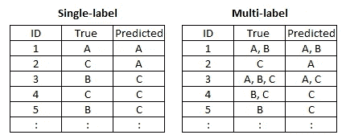

Single-label multiclass classification vs. multi-label multiclass classification

显然，单标签情况和多标签情况需要单独的建模策略和评估策略。我在这里不讨论建模策略，但是将讨论评估度量。

# 单标签多类分类的评价指标

## #12—多类精度

*(用于 Kaggle 比赛】* [*TensorFlow 语音识别挑战赛*](https://www.kaggle.com/c/tensorflow-speech-recognition-challenge/overview/evaluation)*)*

这是二进制分类任务中[精度的扩展版本。](/11-evaluation-metrics-data-scientists-should-be-familiar-with-lessons-from-a-high-rank-kagglers-8596f75e58a7#c637)

二元类分类的准确度是[混淆矩阵](/11-evaluation-metrics-data-scientists-should-be-familiar-with-lessons-from-a-high-rank-kagglers-8596f75e58a7#c637)中两个对角元素之和占总数据量的比例。多类版本在混淆矩阵中有两个以上的行和列，多类精度在对对角线元素求和并除以总计数的方式上是相似的。

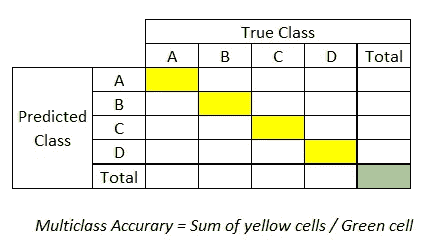

Illustration of multiclass accuracy (4 class-classification version)

*   精确度范围从 0 到 1，越高越好。
*   还是那句话，阶级分布不均衡的时候不合适。

## #13 —多级分类的平衡精度

这与[二元分类平衡精度](/11-evaluation-metrics-data-scientists-should-be-familiar-with-lessons-from-a-high-rank-kagglers-8596f75e58a7#96e3)的内容没有变化。

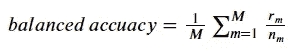

Formula for balanced accuracy in multiclass classification

其中， *M* :类别数， *n_m* :数据大小属于类别 M， *r_m* :准确预测属于类别 M 的数据数

这些属性就像我们在二进制类版本中看到的一样:

*   介于 0 和 1 之间的值，越高越好。
*   对较小类别的准确预测赋予较高的权重，因此**适用于不平衡数据**。

## #14—多类对数损失

*(用于 Kaggle 比赛中的* [*两个适马连接:租赁清单查询*](https://www.kaggle.com/c/two-sigma-connect-rental-listing-inquiries/overview/evaluation)*)*

这是我在[二进制分类案例](/11-evaluation-metrics-data-scientists-should-be-familiar-with-lessons-from-a-high-rank-kagglers-8596f75e58a7#e1bc)中包含的另一个多类版本。

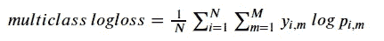

Formula of multiclass logloss

其中 *N* :数据个数， *M* :类个数， *y_i，m* :如果数据 *i* 属于类 *m* 则为 1，否则为 0， *p_i，m* :数据 *i* 属于类 *m* 的预测概率。

正如二进制对数损失:

*   这是*损失*，越高越糟糕。

Photo by [Franck V.](https://unsplash.com/@franckinjapan?utm_source=medium&utm_medium=referral) on [Unsplash](https://unsplash.com?utm_source=medium&utm_medium=referral)

# 多标签多类分类的评价指标

## #15 —平均值 F1、宏观 F1、微观 F1

*(平均值-F1 用于 Kaggle 比赛】* [*Instacart 购物篮分析*](https://www.kaggle.com/c/instacart-market-basket-analysis/overview/evaluation)*)*

*(Macro-F1 用于 Kaggle 竞赛】* [*人类蛋白质图谱图像分类*](https://www.kaggle.com/c/human-protein-atlas-image-classification/overview/evaluation)*)*

在多标签多类分类的情况下，标签应如下所示。

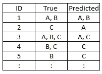

Illustration of multi-label classification with three classes

有三种 [F1 分数的变体](/11-evaluation-metrics-data-scientists-should-be-familiar-with-lessons-from-a-high-rank-kagglers-8596f75e58a7#0213)来评估这种预测:

*   **平均值-F1:** 计算每个 ID 的 F1 分数，并取所有 ID 的平均值。
*   **宏 F1:** 计算每个类别的 F1 分数(假设我们看到每个类别和其余类别之间有三个独立的二进制分类)，并取所有类别的平均值。
*   **Micro-F1:** 通过处理每个 ID 和每个类作为独立数据点的组合，立即计算总体 F1 分数。

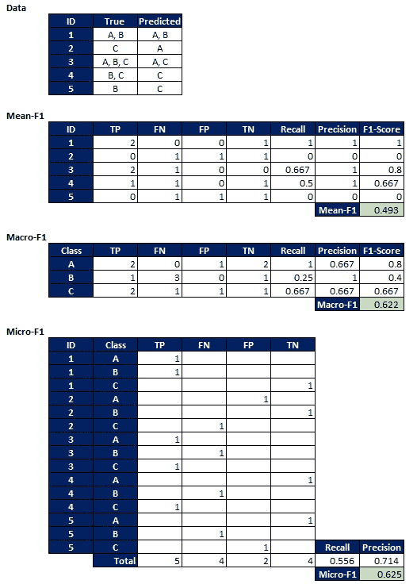

Illustration of Mean-F1, Macro-F1, Micro-F1

*   每个 F1 的范围从 0 到 1，越高越好。
*   在三个 F1 分数中的选择是基于我们的兴趣:平均 F1 平等地对待每个 ID，宏观 F1 平等地对待每个职业，微观 F1 平等地对待每个 ID 和职业的组合。

Photo by [Edgar Chaparro](https://unsplash.com/@echaparro?utm_source=medium&utm_medium=referral) on [Unsplash](https://unsplash.com?utm_source=medium&utm_medium=referral)

# 单标签有序多类分类的评价指标

这里又是单标签多类分类，但是**中的类也是有序的**，比如 A 比 B 好，B 比 C 好，等等。

我们可以在医学研究中更多地看到这一点，例如，模型预测患者“可能”>“未知”>“不太可能”感染某种疾病。

在这种情况下，很多比赛中都可以看到二次加权 Kappa。

## #16 —二次加权卡帕值

*(用于 Kaggle 竞赛中)* [*保诚人寿保险评估*](https://www.kaggle.com/c/prudential-life-insurance-assessment/overview/evaluation)*[*众筹搜索结果关联*](https://www.kaggle.com/c/crowdflower-search-relevance/overview/evaluation)*”**

*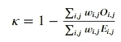*

*其中 *i，j* :真实类和预测类的指标， *w* :误预测的权重， *O* :实际观测计数， *E* :期望计数。*

*仅仅看公式可能看起来很复杂，所以这里有一个如何在 Excel 上计算的演练。*

*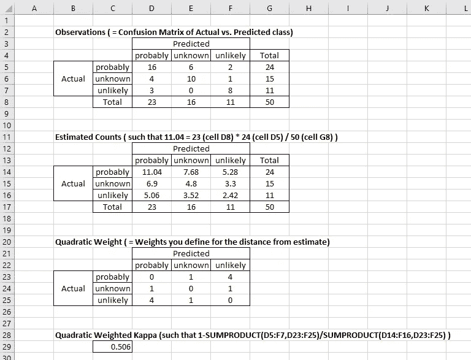*

*How to calculate quadratic weighted Kappa on Excel.*

*我们也可以说这是 [**加权的【科恩的】Kappa**](http://www.real-statistics.com/reliability/interrater-reliability/weighted-cohens-kappa/) 的‘二次加权版’，这里的权重通常是类间的绝对距离，而不是它的平方。*

*这表明**权重的定义取决于您**，不一定必须是二次的，这为您根据性能调整它们留下了一些空间。*

*   *二次加权 Kappa 范围在 0 和 1 之间。越高越好，0 表示预测是随机的。*
*   *灵活设置权重，允许权重矩阵中特定单元格的权重更高/更低。*

**

*Photo by [Micheile Henderson @micheile010 // Visual Stories [nl]](https://unsplash.com/@micheile?utm_source=medium&utm_medium=referral) on [Unsplash](https://unsplash.com?utm_source=medium&utm_medium=referral)*

# *推荐任务中的评估指标*

*推荐的特点是:*

*   *这是多标签多类分类任务。*
*   *预测的类别具有顺序，即推荐的顺序；第一个预测为客户最有可能购买，第二个预测为下一个，依此类推。有了这个订单，公司可以在一些物理或财务限制内保持他们的推广，例如在网络广告页面的空间内或在有限数量的直接邮件内等。*

*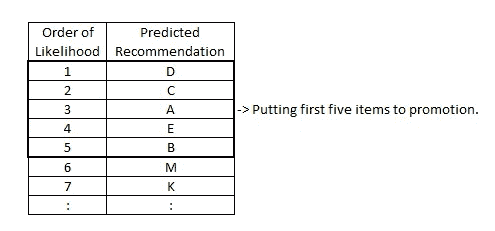*

*Order of class in recommendation task*

*在这种情况下，在很多比赛中都可以看到 **MAP@K** 。*

## *#17 —地图@K*

**(用于 Kaggle 比赛】* [*桑坦德产品推荐*](https://www.kaggle.com/c/santander-product-recommendation/overview/evaluation)*)**

*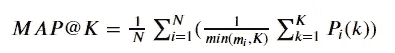*

*其中 *N* :数据数量， *K:* 作为预测提供并纳入评估的推荐数量， *m_i* :真实类数据数量 *i* 属于(在购买推荐上下文中，个人实际购买的数量 *i* )， *P_i(k)* :由数据*I*的推荐 1 至 *k* 精确*

*这并不像听起来那么复杂。下面举例说明。*

*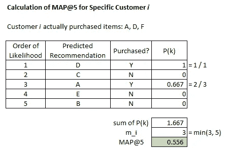*

*How to calculate MAP@K ?*

*对记录中的每个客户重复这一过程并取平均值。*

*   *MAP@K 的范围是 0 到 1，越高越好。*
*   *预测的顺序很重要，正如上面讨论的那样，这具有商业意义。*

**

*Photo by [Christian Wiediger](https://unsplash.com/@christianw?utm_source=medium&utm_medium=referral) on [Unsplash](https://unsplash.com?utm_source=medium&utm_medium=referral)*

# *结论*

*我们看到有一些度量可以专门处理多类分类(单标签、多标签)和推荐预测。*

*理解每个度量的属性，并在最佳情况下使用它，对于构建高性能模型非常重要。*