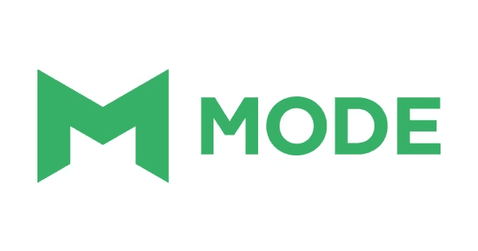
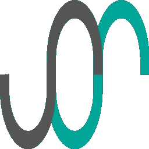
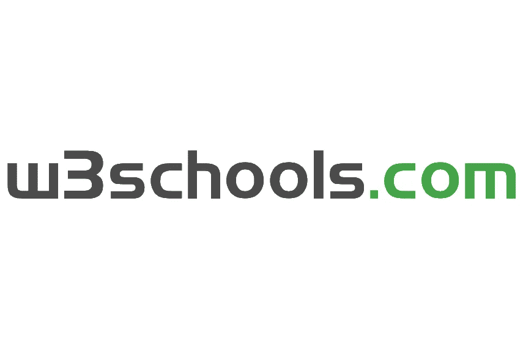
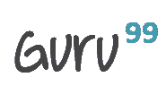

# 学习 SQL 和 Python 的 6 个最佳平台

> 原文：<https://towardsdatascience.com/6-of-the-best-niche-platforms-to-learn-sql-and-python-f6f13808d2f5?source=collection_archive---------5----------------------->

## 所以你想学习 SQL 和 Python，但是不知道从哪里开始

Photo by [Tim Gouw](https://unsplash.com/@punttim?utm_source=medium&utm_medium=referral) on [Unsplash](https://unsplash.com?utm_source=medium&utm_medium=referral)

所以你想学习 SQL 和 Python，但是不知道从哪里开始。或者，您可能已经对这些主题有所了解，并且希望提高自己的技能。有如此多的网上资源声称是学习的最佳场所，以至于很难知道该相信谁。

你可能听说过像 Udemy、CodeAcademy 和 Khan Academy 这样的大型在线学习中心。这些程序对某些主题来说可能很棒，但有时它们太大了，以至于很难知道它们最擅长什么。

本文的重点将放在 6 个更小、更适合学习或磨练 SQL 和 Python 技能的平台上。本文将对每一个进行简单的概述，以及是什么使它们不同和/或更好。

## 要选择最适合你的平台，最重要的事情是确定你的需求

你的技术水平如何？你需要这些技能做什么？你想学什么概念？通过确定您想要学习的技能和概念，您可以有效地将您的需求与本文中的一个平台相匹配，并选择适合您的平台。所以让我们开始吧。

Photo by [Safar Safarov](https://unsplash.com/@codestorm?utm_source=medium&utm_medium=referral) on [Unsplash](https://unsplash.com?utm_source=medium&utm_medium=referral)

# **6 个学习 SQL 和 Python 的小众平台**

# 1.模式分析

> **如果你没有 SQL 或 python 的经验，但对学习语法感兴趣，那就太好了**

[Mode Analytics](https://mode.com/sql-tutorial/) 提供了 SQL 和 Python 的教程，如果你是一个想要学习这些技能的初学者，这可能是一个很好的资源。Mode 为每个主题提供单独的培训课程。

每门课程都根据更基础的知识到更高级的知识来划分。初学者可以在每个领域从头开始，也可以在自己最舒服的领域开始。这些课程简单明了，旨在教你掌握与 SQL 和 Python 分析相关的技能。这些课程的基础是学习每一种语言的语法。

如果你正在寻找一个简单明了的方法来学习这些概念，Mode 是一个很有价值的资源。然而，在为用户提供成长和测试技能的地方方面，它有一定的局限性。

他们的 SQL 课程更加广泛，并在课程结束后提供额外的练习来提高技能。这些练习基于对分析经理的采访，旨在重现他们经常面临的一些问题。然而，Python 教程缺少这些练习，而是为您提供各种外部资源，您可以使用这些资源来测试和提高您的技能。

> **总的来说，Mode 提供了一个很好的学习和提高技能的基础平台，但缺乏足够的应用程序来测试你的技能**。

如果你只是想要一个学习语法和概念的基本资源，那么简单的布局可能会对你很有帮助。然而，如果你正在寻找一些更广泛的、需要更多动手测试和解决问题的东西，你可能想继续阅读这个列表。

# 2.地层划痕

> **非常适合测试和提升您的 SQL 和 Python 知识，以推进您的职业发展或准备技术面试**

虽然之前的资源非常缺乏测试你技能的方法和应用程序，但 [Strata Scratch](https://www.stratascratch.com) 却完全相反。他们标榜自己为增长您的 SQL 和 Python 知识提供了“构建模块”。**因此，Strata Scratch 最适合那些拥有基础知识并希望不断增长的人。**

> [Strata Scratch](https://www.stratascratch.com) 提供了 500 多个 SQL 和 Python 练习题，帮助您提高这些领域的分析技能

这些问题经过了大量研究，并基于真实的行业问题，以及来自各种科技公司的许多面试问题。这是准备面试或推进你职业发展的理想资源。

[地层划痕](https://www.stratascratch.com)也非常重视解释清楚答案。每个问题都提供了正确的技术解决方案的深入解释，以及清晰的方法和语法。他们关注正确的解决方案和方法，但也确保解决方案是干净的。

还有初学者资源可以教你 SQL 和 Python 的基础知识，以及你在这些行业中需要熟悉的主要程序。

## 总的来说，如果你的目标是成长和测试你的技能，Strata Scratch 是一个很好的资源

通常你会发现学习某样东西的最好方法是不断地测试它。Strata Scratch 提供了许多方法来测试你在模拟现实生活场景和面试问题的场景中的知识。如果你的目标是增长你的知识和促进你的职业发展，并且你已经有了 SQL 和 Python 的基础知识，那么 Strata Scratch 就是针对你的。

# 3.数据营

[DataCamp](https://www.datacamp.com/) 旨在成为一种从包括 SQL 和 Python 在内的许多主题中学习技能的简化方法。DataCamp 以非常简单的方式组织他们的课程，从基础到最高级。根据你的技能水平，你可以从任何地方学到一课，并加深你对各种概念的理解。

> **DataCamp 提供一口大小的课程**

这样做的目的是让你可以在短时间内学会一个新的话题，也许在你忙碌或忙于其他事情的时候也可以这样做。它旨在成为你在业余时间增长技能的一个工具，你想投入多少时间就投入多少时间。

这些课程非常有用，而且数量众多。我们发现，与 Mode 等平台相比，DataCamp 提供了更多的利基和重点主题领域。您还将更容易找到涵盖更多特定用例的主题，或者学习如何为特定问题或工作流编码。

DataCamp 还提供了许多测试和练习技能的方法。每个科目都有许多迷你练习挑战。此外，如果你正在寻找一个更广泛的方法来测试你的技能，有动手数据项目提供。这些是基于真实世界场景的更广泛的问题和项目。然而，我们发现问题和项目的数量仅限于某些主题。

> **总的来说，** [**DataCamp**](https://www.datacamp.com/) **是一个精简的、组织良好的平台，旨在教你技能，并通过各种问题和项目测试它们**

如果您正在寻找一个有条理、直观的平台，并且将每个主题领域组织成高度集中的小课程，那么这可能是您的平台。

# 4.w3 学校

> [**w3schools**](https://www.w3schools.com/)**是一个简单实用的学习 web 开发技能的工具，包括 SQL 和 Python**

根据你的喜好，你可能会喜欢或讨厌 w3school 的学习方法。w3schools 自称是世界上最大的 web 开发者网站，所以他们的方法显然对很多人都有效。

本质上，这里的教学方法是简单而基本的。本课程从最简单到最高级的概念进行概述，每一页都提供了对概念的描述，包括从语法到重要函数和关键字的所有内容。所以，如果你喜欢用简单的方式学习，简单明了地概括和解释主题，那么你可能真的会喜欢这种学习方法。

此外，w3schools 在整个课程中大量使用示例和互动。一旦一个概念被解释了，它通常会提供一个使用正确语法的直观例子。通常，它甚至包括一个可定制的字段，您可以在其中自己解决一个示例问题。

总的来说，w3schools 之所以如此受欢迎，可能是因为它简单、直接地教授 SQL、Python 和许多其他编程语言。明确标记的主题，结合简单明了的解释，以及一个测试你技能的地方构成了大部分的课程计划。然而，如果你正在寻找一个有更多练习或现实世界问题要解决的资源，你最好去别处看看。

也许对许多人来说最重要的是，整个课程都是免费的，甚至不需要注册！

# 5.黑客等级

> [**黑客等级**](https://www.hackerrank.com/) **是另一个教授技能和测试知识的宝贵平台，因为它与 SQL 和 Python 有关。**

他们服务中的教育部分显然是面向那些至少已经掌握了 SQL 和 Python 基础知识，并且希望磨练自己的技能以适应面试或现实应用的人。

在 [Hacker Rank 的](https://www.hackerrank.com/)“练习”服务中，提供了许多练习题和问题来测试您的技能。您可以从各种语言中进行选择，包括 SQL 和 Python。这些挑战按照容易、中等和困难进行分级，系统会跟踪你的进展，并为排名最高的问题解决者提供一个“排行榜”。您还可以根据主题领域和子领域组织挑战，以缩小特定语法问题或特定问题或工作流的范围。

## 总的来说，如果你想测试你在这些领域的技能，并为你可能在工作面试或工作中遇到的问题解决做准备，这些都是很有价值的工具

如果你是一个实践型的学习者，并且喜欢看概念是如何被应用的，而不是简单地被解释它们是如何工作的，那么这些是很棒的。

此外，还有论坛供你聊天、分享和帮助他人解决问题，并分享对面试过程的见解。

# [6。Guru99](https://www.guru99.com/)

Guru99 是一个免费资源，旨在教授各种技能，包括 SQL 和 Python 部分。

> **Guru99 提供 SQL 和 Python 课程，从基础到更高级的概念进行分类。课程要么是书面的，要么是视频形式的。**

与 w3schools 类似，这是一种简单、实用的教学方法，试图列出所有相关的概念，并以简单、直接的方式解释它们。Guru99 的主要优势之一是它涵盖了广泛的概念和函数，有助于构建您在 SQL 和 Python 许多领域的知识。

无论你是初学者还是想学习更高级的概念，主题领域都有明确的标记，这样你就可以选择符合你技能水平的课程。

## 虽然 Guru99 是一个简单易用的工具来积累你的知识，但它并不能测试你的知识

课程主要是非交互式的，没有你自己写代码或解决示例问题的地方。如果你想测试你的技能，你可能想用另一个服务来补充你在这里学到的概念，比如 Hacker Rank。

总的来说，如果你正在寻找一个组织良好的资源，可以按照自己的进度学习概念，这可能是一个很好的计划。当然，它是免费的，所以你可以尝试一下，看看它是否适合你。

Photo by [NESA by Makers](https://unsplash.com/@nesabymakers?utm_source=medium&utm_medium=referral) on [Unsplash](https://unsplash.com?utm_source=medium&utm_medium=referral)

# 结论

这就是 6 个鲜为人知的学习 SQL 和 Python 技能的资源。正如你所看到的，这些资源在它们的目标以及它们如何教授和测试各种主题方面有很大的不同。这些资源侧重于不同的技能水平，旨在服务于各种目的。无论是准备面试还是增强基本技能，每个在线资源通常都有一个主要的关注点。

> 与你最相关的一个关键区别是每种在线资源侧重于哪种学习方式。很多，比如 w3schools 和 Guru99，仅仅关注简单明了的学习和对概念的解释。然而，其他人，如黑客等级和地层划痕，旨在提供资源，通过实践和解决现实世界的问题和场景来建立您的理解。

最终，对你来说最好的资源取决于你想学什么以及你的学习风格。评估你对这些主题的了解，以及哪些资源提供的课程最符合你的技能水平。还有，考虑你喜欢怎么学。你更喜欢动手操作还是喜欢用简单的方式向你解释概念？

通过了解您的需求和目标，我们相信您会在上面列出的资源中找到丰富的资源来扩展您的 SQL 和 Python 知识。作为奖励，其中一些是免费的，你可以无风险地试用它们。学习新技能是一种有益的体验，如果你能找到符合你特定偏好的学习资源，那就更令人满意了。