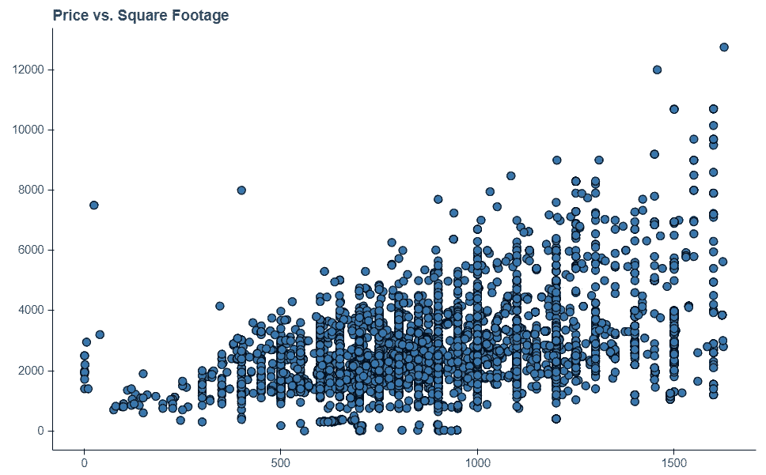
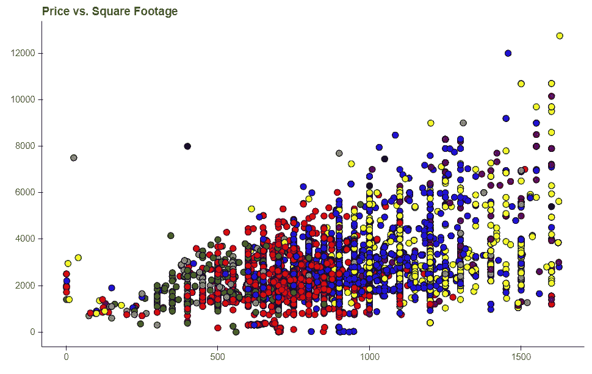
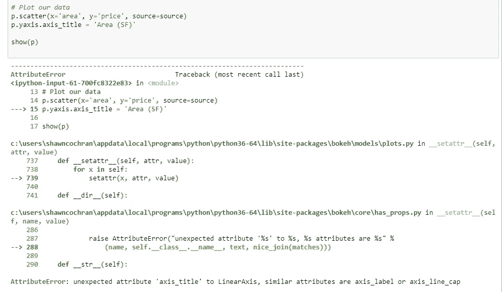
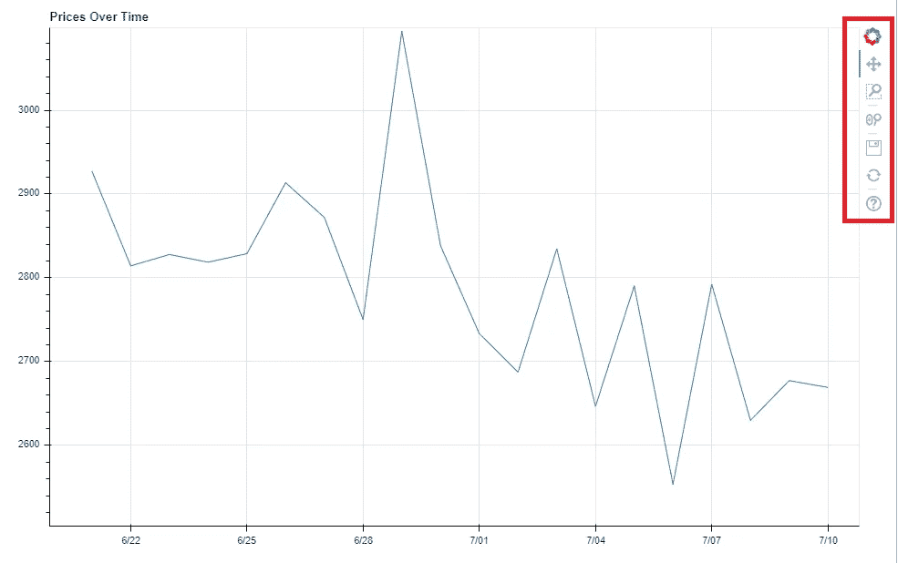
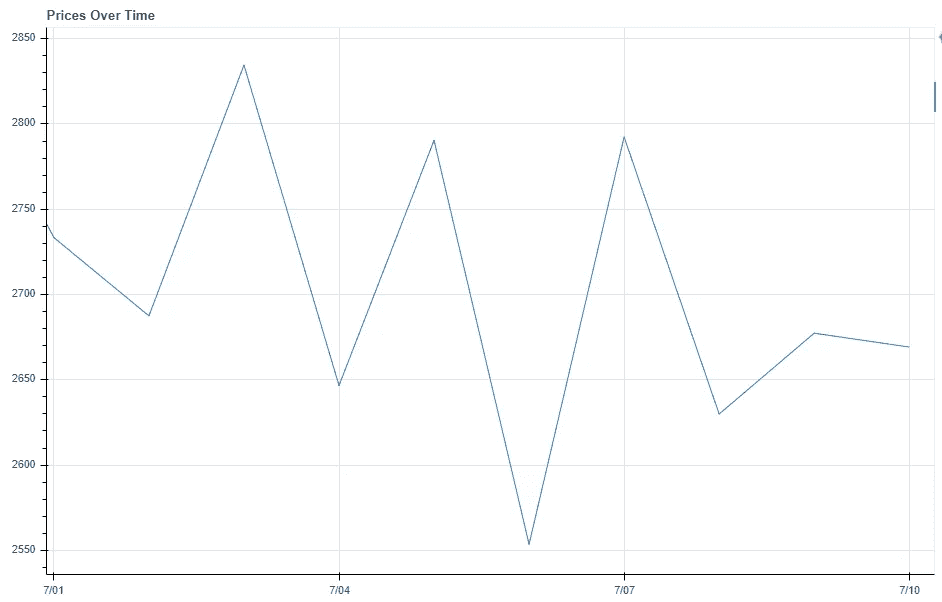
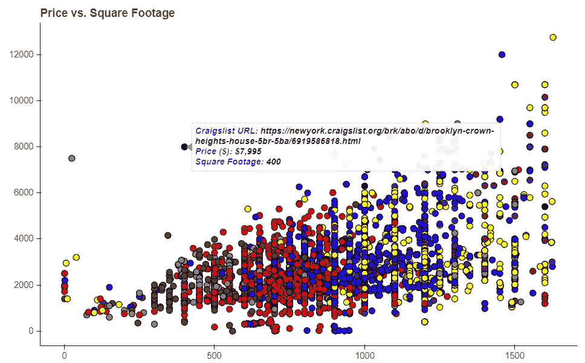

# 我喜欢用 Python 进行数据探索的 6 个理由

> 原文：<https://towardsdatascience.com/6-reasons-i-love-bokeh-for-data-exploration-with-python-a778a2086a95?source=collection_archive---------11----------------------->

## 散景已经存在很多年了，但我只是最近才真正发现它，它很快就成为我最喜欢的 Python 可视化库。以下是六个原因。


**Bokeh is a Browser Based Visualization Library**

# 什么是散景，是什么让它与众不同？

在进入主题之前，让我们先做一个强制性的介绍，我会向你介绍这个主题。还记得我们只有 Matplotlib 的黑暗时代吗？Bokeh 是另一个可视化库，真正与众不同的因素(至少对我来说)是它专注于 web 浏览器的视觉效果。虽然您仍然可以将数字保存为. png 或。jpeg，Bokeh 的真正强大之处在于，因为它在浏览器中渲染(用 Javascript)，所以你可以轻松地添加交互性，模仿像 D3 这样的超级强大的工具，而不必经历学习 D3 的痛苦过程。显然还有很多工作要做，以使散景与熊猫无缝配合，并提供直观的 API。总的来说，散景是一个易于使用的绘图库，适合熊猫，并使事情超级共享。听起来很酷？请继续阅读！

# 本文的数据和 Jupyter 笔记本

这个 [Github Repo](https://github.com/scochran3/BokehExplorationMedium) 有一个 Jupyter 笔记本和我们将在本文中使用的原始数据。这些数据来自纽约市过去几周的 Craigslist 公寓列表。具体来说，我们将使用散景来观察价格和公寓面积之间的关系。我们将从一个基本的散点图开始，用散景的特征来增强我们的基本图表，并提到其他有用的特征。让我们来看看散景令人敬畏的原因(前两步搭建舞台，然后我们实际上开始绘图)。

# 1 —散景在 Jupyter 笔记本中非常好用

```
from bokeh.io import output_notebook
output_notebook()
```

如果我和妈妈在一起的时间和我在 Jupyter 笔记本上的时间一样多，我就会成为年度最佳儿子。显然，如果你一直在阅读，我已经告诉过你，你可以在 Jupyter 的笔记本里，在我链接的回购协议里，跟着做。如果 Bokeh 和 Jupyter 没有很好地合作，那是一件很愚蠢的事情。幸运的是，与标准的 Matplotlib 图表相比，它在 Jupyter 中工作得非常好，并且确实使您的视觉效果非常突出(在我看来)。当您想要添加一些交互性(放大图表、添加过滤器、添加工具提示/悬停等)时，它特别好，我们将在后面讨论。这也相当简单，只需添加上面的代码，您的绘图就会在 Jupyter 中很好地呈现出来。我喜欢添加的另一件事是当你实例化图形时的缩放模式，因为它将填满整个笔记本窗口，所以你不再需要指定大小。

```
figure=(sizing_mode='stretch_width')
```

# 2 —主题

[主题](https://bokeh.pydata.org/en/latest/docs/reference/themes.html)基本上让你告诉 Bokeh“我总是希望我的剧情在标题中使用 14 号字体，隐藏难看的网格线，并且总是让我的轴标签使用 12 号字体和粗体”。如果你像我一样对你的情节懒惰和神经质，那么这是一个天赐之物，因为你不需要在每次制作情节时做太多的造型，它们默认情况下会很漂亮。这里有一个 Jupyter 笔记本主题的例子。

```
from bokeh.io import curdoc
from bokeh.themes import Themecurdoc().theme = Theme(json={'attrs': {# apply defaults to Figure properties
'Figure': {
    'toolbar_location': None,
    'outline_line_color': None,
    'min_border_right': 10,
    'sizing_mode': 'stretch_width'
},'Grid': {
    'grid_line_color': None,
},
'Title': {
    'text_font_size': '14pt'
},# apply defaults to Axis properties
'Axis': {
    'minor_tick_out': None,
    'minor_tick_in': None,
    'major_label_text_font_size': '11pt',
    'axis_label_text_font_size': '13pt',
    'axis_label_text_font': 'Work Sans'
},
# apply defaults to Legend properties
'Legend': {
    'background_fill_alpha': 0.8,
}}})
```

你可以查阅散景文档来查看所有不同的选项，但一般来说，它只是与你如何在散景中执行命令保持一致。你只需要给它一个值的字典，当你创建图表时，它会自动应用这些值。例如，在“标题”中，我们将字体大小设置为 14pt。这允许完全定制你的情节，你只需要做一次！一般来说，当我开始使用散景图的笔记本或脚本时，这是我指定的第一件事。主题可以节省您的时间——使用它们！

# 3-易于与熊猫融合

每天早上我都会煮一杯美味的咖啡，然后输入进口熊猫作为 pd，这是我早上的例行公事。如果你和我一样，和熊猫同生共死，那么 Bokeh 就是你新的最好的朋友。散景使用了一种叫做 [**列数据源**](https://bokeh.pydata.org/en/latest/docs/reference/models/sources.html) 的东西，虽然它不一定是熊猫数据帧，但它与它配合得非常好。如果你感兴趣，你可以阅读完整的文档，但基本上它把你的熊猫数据帧变成了大规模策划的武器。我遵循的基本步骤是:

*   把我的数据放入一个干净整洁的熊猫数据框
*   用该数据帧创建 ColumnDataSource
*   轻松策划！

这里有一个超级简单的例子让我们开始(可以在 Jupyter 笔记本和 Github Repo 中找到，链接到简介中),看看公寓价格和公寓面积。



**Our Basic Scatter Plot**

我个人觉得这比 Matplotlib 更容易和直观，而且在 Jupyter 笔记本中也更漂亮。基本上这样做是为了让散景知道你将使用这个熊猫数据帧作为你的绘图源。当你在你的图(散点图)中实际绘制一些东西，并说 x=“面积”和 y=“价格”时，你只是在说你的数据帧中的哪些列应该去查看以获得这些数据。因此，它看到“面积”和“价格”被指定，它将遍历数据框中的每一行，并绘制这些对点。这使得创建熊猫的情节既直观又快捷。

另一个很棒的方面是这让你可以利用熊猫的特性来增强你的剧情。也就是说，可以使用数据框架中的任何列！让我们创建一个“颜色”列，将卧室的数量映射到一种颜色。然后，我们可以使用这个新列作为选项来着色我们的散点图。具体来说，这里检查第 9 行和第 10 行，然后在第 22 行，我们说使用这一列来着色我们的图表。



**Our Scatter Plot Colored By Number of Bedrooms**

需要记住的一个关键点，也是我经常忘记的一点是，如果您向 Pandas 数据帧添加一列，您需要重新创建 ColumnDataSource。在本例中，我们现在创建了一个新的 color 列，因此之前创建的 ColumnDataSource 没有我们的 color 特性。一旦你这样做了，那么就像把 color='color '传递到散点方法中一样简单，Bokeh know's 去在恰当命名的' color '列中查找颜色。有很多其他方法可以利用这种类型的东西，比如通过出现的次数来确定大小，但是我将把这留给您在附加的练习中来做。关键是如果你能在熊猫身上创造它，那么你就能在散景图中利用它！

# 4-导出到 HTML 是轻而易举的事情

与同事或在 web 应用程序上共享散景图是一件轻而易举的事情，因为它可以很容易地导出为 HTML 代码可以使用的内容。如果你有兴趣在网站上使用这些图表或者在 HTML 文件中分享它们，那么你一定要仔细阅读这个[文档](https://bokeh.pydata.org/en/latest/docs/reference/embed.html)。如果你想看看现实生活中这是如何实现的，请查看我构建的一个小网络应用程序中的[权力的游戏数据](http://tvdatatron3000.com/view-show-data/game-of-thrones)，或者这个使用民主党原始数据的[静态 S3 网站](https://randomly-hosted-files.s3.amazonaws.com/Pete+Buttigieg.html)。所有这些图表都是使用下面的方法在散景中制作的。以下是如何做到这一点:

*   导入组件特征。这就是让您将该数字转换成 HTML 中的脚本和 div 的原因。

```
from bokeh.embed import components
```

*   像平常一样在散景中创建您的地块
*   最后添加以下代码，其中 p 是您的图形对象

```
script, div = components(p)
return script, div
```

第一行提供了一大块 Javascript 代码，其中包含绘图所需的所有内容(包括数据)和一个 div 元素，图表将放入其中。就是这样！同样，这段代码不再依赖于您的数据源！将脚本和 div 放入 HTML 文件中，现在就有了一个完全可导出的图表。如果您熟悉 Django，我经常将脚本和 div 从 views.py 文件传递到 HTML，然后可以在我的模板文件中使用它，但是有很多方法可以利用它。如果你经常在 HTML 中共享数据，那么在我看来 Bokeh 是 Python 所能提供的最好的东西。

# 5—关于错误的智能建议

如果我是能够为所有 Python 库创建法律的 Python 沙皇，这肯定是我会实现的。使用散景如果你试图编辑你的图，如改变轴标签，你输入了错误的命令，散景会告诉你它认为你的意思的建议。



**AttrbuteError’s that actually saving you from Googling!**

注意这里我说的是 p.yaxis.axis_title，但实际上是 p.yaxis.axis_label。如果你查看 AttributeError，它会给你最接近它认为你正在尝试做的事情的建议。一般来说，这非常有效，可以节省你问谷歌“在散景中改变轴标题”的大量时间。如果有人能在 Matplotlib 中实现这一点，我将永远欠你的，因为我甚至不想知道我花了多少时间做这件事。但是说真的，这是一个很棒的特性，尤其是如果你经常在不同的可视化库之间切换的话。

# 6—轻松互动

散景的一个非常好的特点是它很容易给我们的图表添加交互性。默认情况下，你会在图表的右边看到一些工具，可以让你开箱即用。



例如，如果您选择“缩放”按钮，您可以在图表中想要聚焦的任何区域周围画一个框。



注意它是如何更新 x 和 y 轴来聚焦我们指定的区域的，所有这些都不需要额外的代码。但这只是散景交互性的开始。让我们来看看你如何不费力地添加像 Tableau 一样的小工具提示。要创建这些(嗯，有多种方法)你需要使用 HoverTool。

```
from bokeh.models import HoverTool
```

现在我喜欢用我的 HoverTools 变得有点花哨，并添加一些自定义的 HTML 来给它一点活力。如果你觉得不够勇敢，那么你可以在散景文档中看到一些更简单的例子，但是如果你能处理一些基本的 HTML，那么继续和我在一起吧，我的朋友们。让我们在上次使用的散点图的基础上添加额外的颜色。



**Behold our glorious tooltips when we hover!**

我们真的想把重点放在第 24 行及以后，因为几个步骤前我讨论了前面的东西。事情是这样的:

*   Bokeh 允许你以字符串的形式传递 HTML，所以我们创造性地制作了一个叫做 tooltips 的变量
*   div 只是用来保存我们的工具提示数据，我为工具提示中的每一行做了一个 div，但是你不必这样做。
*   每个 div 有两个部分:一个标题和实际数据，每个都在

    ##### 标签中。所以第一个

    ##### 是每行中的“Craigslist URL”、“价格($)”或“平方英尺”标题。

*   第二个

    ##### 是实际的数据，同样，散景使得访问变得非常容易。因为我们使用的是 ColumnDataSource，所以我们只是将数据放入@columnname 中。例如，在第一个 div 中，我使用@url 让它获取数据中该点行的 url。请注意，我们可以获得甚至没有被绘制的数据点，因为它只是从与我们的数据在同一行的列中提取的。我们在价格和面积上也是如此。您甚至可以格式化您的输入数据，我用{0，0}显示，它在价格和平方英尺的千位上添加了逗号分隔符。有许多格式化程序，但常见的是日期、小数和百分比。

*   就是这样！短短几行的精彩互动工具提示！你可以用工具提示做一些非常棒的东西，但是这应该足够激发你的想象力了。这给了你与同事共享的笔记本额外的一点点活力，让他们玩你的数据。

如果你去[散景的画廊](https://bokeh.pydata.org/en/latest/docs/gallery.html)，有很多方法可以增加互动性，让仪表盘充满活力，所以这只是一个尝试。如果你对创造真正互动的情节感兴趣，散景是我现在市场上最喜欢的选择之一，尤其是如果你想避开 Javascript 黑暗、寒冷和邪恶的世界。

# **总结**

就是这样！如果你是第一次接触散景，希望这能让你体验一下它令人敬畏的力量。我仍然使用 Matplotlib 和 Seaborn 做一些事情(箱线图、分布图)，但现在大多数时候我是一个完全的散景倡导者。试一试吧，你可能很快也会成功！快乐学习！

[**随时在 LinkedIn 上联系我**](https://www.linkedin.com/in/shawn-cochran/)