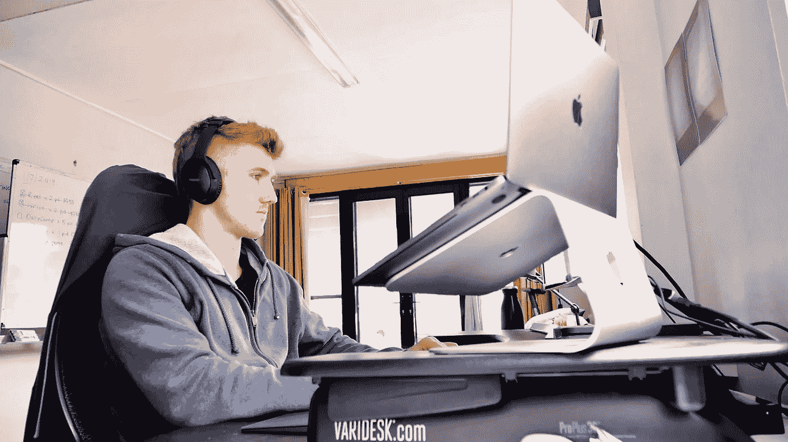

# 帮助我每周学习五天机器学习的 6 种技术

> 原文：<https://towardsdatascience.com/6-techniques-which-help-me-study-machine-learning-five-days-per-week-fb3e889fad80?source=collection_archive---------0----------------------->

## 我每天学习机器学习 9 个月，然后找到了一份工作。怎么会？像这样…

Man with a mohawk (me) studying and running a business in his bedroom. Picture is a still from one of my [YouTube](https://bit.ly/DanielBourkeOnYouTube) videos.

我退出了苹果。启动了一个 web startup，它失败了。我的心不在这里。

我想学习机器学习。这让我很兴奋。我会全部学会的。我不需要编写所有的规则，机器会为我学习。但是我没有工作。

兴奋不是用来买东西的。

为了支付学费，我开始在周末开优步。

我喜欢结识新朋友，但我讨厌一直开车。交通，停车，启动，燃料我有足够的燃料吗我想我有，空气，空调，换挡，你不应该走那条路你应该走这条路，所有的。

我学的是机器学习。一周五天，一整天。这很难。还是很难。

周末去优步。一周内的机器学习。那是我的例行公事。我必须学习。我必须学会这一点，我不能继续驾驶，我还不知道我的目标是什么，但我知道这不是驾驶。一个周六晚上，我赚了 280 美元，并被罚款 290 美元。-10 美元一晚。

在我自创的人工智能硕士学位、[9 个月后，我找到了一份工作。这是我做过的最好的工作。](https://youtu.be/PnuHj5bi-rg)

我每天是怎么学习的？

像这样。

# 1.缩小搜索空间

机器学习是广义的。有代码，有数学，有概率，有统计，有数据，有算法。

而且不缺学习资源。有太多选择和没有选择是一样的。

如果你真的想学习，那就给自己安排一个课程。与其花几周时间考虑是否应该学习 Python 或 R，不如去 Coursera 或 edX 上一门课程，从数学或代码开始，花一周时间制定一个粗略的计划，然后遵循它。

对我来说，这是在创造[我自己的人工智能硕士学位](http://dbourke.link/aimastersdegree)。我决定先学习代码，Python 将成为我的语言。我到处寻找不同的课程和书籍，把我最感兴趣的放在一起。我选择的道路对每个人都是最好的吗？大概不会。但它是我的，这就是它成功的原因。

一旦我有了课程，我就有了一条可以遵循的路，再也不用浪费时间去决定什么是最好的路了。我可以站起来，坐下来，学习我需要(想要)学习的东西。

也不严格。如果出现了我感兴趣的东西，我会跟着它走，并在走的过程中学习我需要的东西。

如果你是在网上学习，而不是通过大学，你应该走自己的路。

# 2.修复您的环境

你祖父的第一个橘子农场失败了。

土壤很好。种子在那里。所有的设备也是。

发生了什么事？

天气太冷了。橙子需要温暖的温度才能生长。你的祖父有种植橙子的技能，但他们不可能在寒冷的气候下生长。

当他搬到一个温暖的城市，他开始了另一个橘子农场。

12 个月后，你的祖父提供了镇上最好的橙汁。

学习就像种橘子。

你可以有一台笔记本电脑，一个互联网连接，最好的书，但仍然没有学习的动力。

为什么？

因为你的环境是关闭的。

你的房间充满了干扰。

你试着和朋友一起学习，但是他们不像你那样专注。

Whatsapp 每 7 分钟关闭一次。

你能做什么？

我把我的房间变成了学习的天堂。清理过了。把我的手机放在另一个房间的抽屉里，关掉了所有的通知。

我告诉了我的朋友。我的电话要到下午 4 点才会响，到时候再跟你聊。他说好吧。

说到朋友时间，朋友很重要，但是学习时间就是学习时间。一整天都离不开手机吗？试试一个小时。任何你看不到的抽屉都可以。“请勿打扰”应该是默认设置。

修复你的环境，让知识流动起来。

# 3.建立系统，让你永远赢

问题 13 把我难住了。我卡住了。

我昨天想把它做完，但没能做到。

现在是学习的时间了，但是我知道我昨天有多努力，但是毫无进展。

我正在推迟它。我知道我应该学习。但是我要推迟。

这是一个循环。

啊啊啊。我以前见过这种循环。我知道。但它还在。

那堆书盯着我。问题 13。我设置了一个计时器。25 分钟。我知道我可能解决不了这个问题，但是我可以坐下来试 25 分钟。

四分钟后，就是地狱。燃烧的地狱。我继续前进。已经 24 分钟了，我不想停下来。

计时器响了，我又设置了一个。然后又是一个。经过 3 个疗程，我解决了这个问题。我告诉自己，我是世界上最好的工程师。这是个谎言，但没关系。即使是一个小小的里程碑也是一个里程碑。

你不能总是控制自己是否在学习上取得进步。但是你可以控制在某件事情上花多少时间。

> **可以控制:**每天四个 25 分钟的时段。
> 
> **无法控制:**完成每天开始的每一项任务。

建立系统，让你永远赢。

# 4.有时什么都不做

我得出了结论。[学习是终极技能](http://bit.ly/LHTLarticle)。如果我能学会如何更好地学习，我就能做得更好。我可以学习机器学习，我可以成为更好的程序员，我可以更好地学习写作。我必须提高我的学习，我想。我立刻开始。

我参加了 [Coursera 学习如何学习课程](http://bit.ly/LHTLonCoursera)。其中一个主要话题是集中思维和分散思维。

当你在做一个单一的任务时，集中思考就会发生。

分散思维发生在你什么都不想的时候。

最好的学习发生在这两者的交叉点。这就是为什么你在洗澡时会有一些好的想法。因为没有别的事情发生。

当你让分散思维接管时，它会给你的大脑空间把它在集中思维时吸收的所有东西联系在一起。

问题是，要让它正常工作，你需要时间。

如果你已经设置好系统，这样你就可以进行四次 25 分钟的专注工作，之后去散步。小睡一会儿。坐下来想想你学到了什么。

一旦你开始更经常地什么都不做，你会发现很多东西因为空间而变得有价值。一个房间是四面墙围绕的空间，一个轮胎除了空气什么都没有，一艘船因为空间空而漂浮。

你的学习日程可以做更多的事情。

# 5.拥抱吮吸

学习糟透了。

你学了一件事，第二天就忘了。

然后再来一个，算了。

另一个。

忘记了。

你整个周末都在学习，周一去上班，没人知道。

有人问我如何深刻地记住书上的东西？我说我不知道。如果我幸运的话，我记得我读过的一本书的 1%。当这 1%和另外 1%的东西交叉时，奇迹就发生了。这让我觉得自己像一个专家点连接器。

学了一年之后，你会意识到还有多少东西要学。

什么时候会结束？

并没有。总是第一天。

拥抱吮吸。

# 6.三年前的原则

前几天我在公园。

有一个小男孩跑来跑去，过着他一生中最快乐的时光。上滑梯，下滑梯，在树上，从树上，在泥土里，从泥土里，上山，下山。

他笑着跳着，然后又笑了。

他妈妈过来接他。

“来吧，查理，我们得走了。”

当她抱着他离开时，他不停地笑，挥舞着他的蓝色塑料铲子。

是什么让他着迷？

他在玩。他玩得很开心。整个世界都是新的。我们的文化严格区分工作和娱乐。学习被视为工作。

你应该学习以获得更多的工作。你应该工作赚钱。这些钱可以让你有闲暇时间。一旦你有了闲暇时间，那么也只有那时，你才能像查理一样，笑着到处跑。

如果你把它记在脑子里，学习就是工作，那将是地狱。因为总有更多东西要学。你知道怎么回事，只工作不玩耍。

但是假设，你认为学习是经历一个话题然后进入下一个话题的过程。

像游戏一样连接不同的东西。

你开始有同样的感觉，就像你是查理滑下滑梯时的感觉一样。

你学了一件事，你用它来学另一件事，你卡住了，你克服了，你学了另一件事。你用它来跳舞。

我了解到，如果你有结构化数据，如表、列或数据框，像 CatBoost、XGBoost 和 LightGBM 这样的集成算法效果最好。对于图像、视频、自然语言和音频等非结构化数据，深度学习和/或迁移学习应该是您的首选模型。

我把这些点联系起来了。我告诉自己，我是一个专家点连接器。从一点跳到下一点。

这样做，你会以比开始时更多的精力完成一次学习。

这是 3 岁的原则。视一切为游戏。

现在够了。

我该睡觉了。

这是额外的奖励。

# 7.睡眠

睡眠不好意味着学习不好。

你可能没有得到足够的。

我没有。驾驶优步最好的时间是周五和周六晚上。人们出去吃饭，参加聚会，去夜总会，我没有，我在开车。我会一直工作到凌晨 2、3 点，回家睡觉，直到太阳在 7-8 点把我叫醒。两天来，我都像个火车残骸。周一会到来，我会在一个不同的时区。周二情况有所好转，周三我回到了我需要的地方。然后这个循环会在周五重复。

这种打破睡眠时间表是不可接受的。我的目标是学得更好。睡眠清洁大脑，并允许大脑中新的连接发生。我在晚上 10 点、11 点停止开车，回到家，睡了 7-9 个小时。钱少，学问多。

不要用睡眠来换取更多的学习时间。做相反的事。

机器学习是广义的。

要研究好它，要研究好任何东西，你都需要提醒自己。

*   缩小你的搜索空间
*   修复您的环境
*   建立系统，让你永远赢
*   拥抱吮吸
*   有时什么都不做
*   把学习当作游戏
*   通过睡眠获得更好的知识

晚安。

你可以在 YouTube 上观看这篇文章的视频版本。