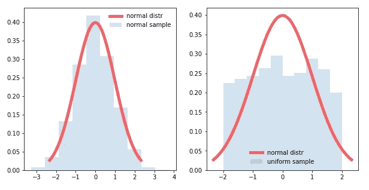
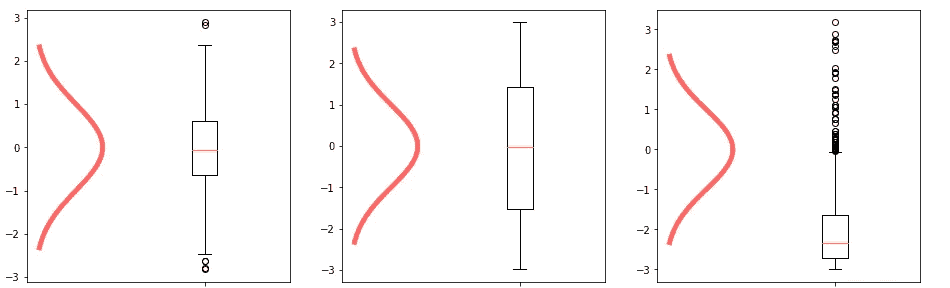
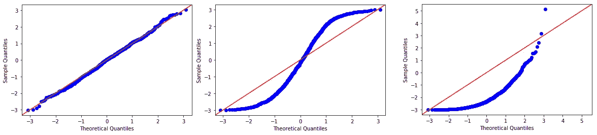

# 检验正态分布的 6 种方法——使用哪一种？

> 原文：<https://towardsdatascience.com/6-ways-to-test-for-a-normal-distribution-which-one-to-use-9dcf47d8fa93?source=collection_archive---------0----------------------->

## 有许多方法可以检验一个变量是否呈正态分布。在这篇文章中，你会发现使用哪一个！

# 1.柱状图

## 1.1.介绍

第一个几乎所有人都知道的方法是直方图。直方图是显示变量分布的数据可视化。它给出了数据集中每个值出现的频率，这就是分布的意义所在。

> 直方图是快速直观显示单个变量分布的好方法。

## 1.2.解释

在下图中，两个直方图显示了正态分布和非正态分布。

*   在左边，样本分布(灰色)与理论钟形曲线分布(红线)的偏差非常小。
*   在右边，我们看到直方图中完全不同的形状，直接告诉我们这不是正态分布。

Sometimes the deviation from a normal distribution is so obvious that it can be detected visually.

## 1.3.履行

使用 python 可以轻松创建直方图，如下所示:

Creating a histogram using pandas in python

## 1.4.结论

直方图是快速直观显示单个变量分布的好方法。

# 2.箱形图

## 2.1.介绍

箱线图是另一种可用于检测非正常样品的可视化技术。箱形图绘制了一个变量的 5 个数字汇总:最小值、第一个四分位数、中值、第三个四分位数和最大值。

> 箱线图是同时可视化多个变量分布的好方法。

## 2.2 解释

箱线图是一种很好的可视化技术，因为它允许绘制许多相邻的箱线图。对变量的快速概述让我们对分布有了一个概念，作为“额外收获”，我们得到了完整的 5 个数字的摘要，这将有助于我们进一步的分析。

你应该注意两件事:

*   分布是否对称(正态分布也是如此)？
*   宽度(尖度的反义词)对应正态分布的宽度吗？这在箱线图上很难看到。

Normal (left), Uniform (middle) and exponential (right) boxplots vs normal bell curve

## 2.3.履行

箱线图可以很容易地用 python 实现，如下所示:

Creating a boxplot using pandas in python

## 2.4.结论

箱线图是同时可视化多个变量分布的好方法，但是**使用箱线图**很难识别宽度/尖度的偏差。

# 3.QQ 情节

## 3.1.介绍

有了 QQ plots，我们开始进入更严肃的内容，因为这比前面描述的方法需要更多的理解。

QQ 图代表分位数与分位数图，这正是它所做的:绘制理论分位数与变量的实际分位数。

> QQ 图比柱状图或箱线图更能让我们看到正态分布的偏差。

## 3.2.解释

如果我们的变量遵循正态分布，我们的变量的分位数必须完全符合“理论”正态分位数:QQ 图上的直线告诉我们我们有一个正态分布。

Normal (left), uniform (middle) and exponential (right) QQ Plots

如图所示，正常 QQ 图上的点遵循一条直线，而其他分布严重偏离。

*   均匀分布在两端有太多的观察值(非常高和非常低的值)。
*   指数分布对较低的值有太多的观察，但对较高的值观察太少。

在实践中，我们经常看到一些不太明显但形状相似的东西。尾部的过多或过少都应该引起对正态性的怀疑，在这种情况下，你应该使用下面描述的假设检验之一。

## 3.3.履行

可以使用 python 中的 statsmodels api 实现 QQ 图，如下所示:

Creating a QQ Plot using statsmodels

## 3.4.结论

QQ 图比柱状图或箱线图更能让我们看到正态分布的偏差。

# 4.科尔莫戈罗夫斯米尔诺夫试验

## 4.1.介绍

如果 QQ 图和其他可视化技术不能得出结论，那么统计推断(假设检验)可以对我们的变量是否显著偏离正态分布给出更客观的答案。

如果你对如何以及何时使用假设检验有疑问，这里有一篇给 [**对假设检验**](/an-intuitive-explanation-of-hypothesis-testing-and-p-values-8391db2c90f) **的直观解释的文章。**

Kolmogorov Smirnov 检验计算经验分布和理论分布之间的距离，并将检验统计量定义为这些距离集合的上确界。

这样做的好处是，同样的方法可以用来比较任何分布，而不一定只是正态分布。

> KS 测试是众所周知的，但它没有太大的权力。它可以用于除正常分布之外的其他分布。

## 4.2.解释

KS 检验的检验统计量是 **Kolmogorov Smirnov 统计量**，如果零假设为真，则该统计量遵循 **Kolmogorov 分布**。

如果观察到的数据完全符合正态分布，KS 统计值将为 0。P 值用于决定差异是否大到足以拒绝零假设:

*   如果 KS 检验的 P 值大于 0.05，我们假设正态分布
*   如果 KS 检验的 P 值小于 0.05，我们不假设正态分布

## 4.3.履行

使用 Scipy 的 Python 中的 KS 测试可以如下实现。它返回 KS 统计数据及其 P 值。

Applying the KS Test in Python using Scipy

## 4.4.结论

KS 测试是众所周知的，但它没有太大的权力。这意味着需要大量的观察来拒绝零假设。它对异常值也很敏感。另一方面，它可以用于其他类型的分布。

# 5.利利佛斯试验

## 5.1.介绍

Lilliefors 测试在很大程度上基于 KS 测试。不同之处在于，在 Lilliefors 检验中，接受的是总体分布的均值和方差是估计的，而不是用户预先指定的。

因此，Lilliefors 测试使用 Lilliefors 分布，而不是 Kolmogorov 分布。

> 不幸的是，对于 Lilliefors 来说，它的能力仍然低于夏皮罗维尔克测试。

## 5.2.解释

*   如果 Lilliefors 检验的 P 值大于 0.05，我们假设正态分布
*   如果 Lilliefors 检验的 P 值小于 0.05，我们不假设正态分布

## 5.3.履行

statsmodels 中的 Lilliefors 测试实现将返回 Lilliefors 测试统计值和 P 值，如下所示。

注意:在 statsmodels 实现中，低于 0.001 的 P 值被报告为 0.001，高于 0.2 的 P 值被报告为 0.2。

Applying the Lilliefors test using statsmodels

## 5.4.结论

虽然 Lilliefors 是对 KS 测试的改进，但它的功效仍然低于夏皮罗维尔克测试。

# 6.夏皮罗维尔克试验

## 6.1.介绍

夏皮罗维尔克检验是检验正态分布时最有效的检验。它是专门为正态分布开发的，不能用于测试其他分布，例如 KS 测试。

> 夏皮罗维尔克检验是检验正态分布时最有效的检验。

## 6.2.解释

*   如果夏皮罗维尔克检验的 P 值大于 0.05，我们假设正态分布
*   如果夏皮罗维尔克检验的 P 值小于 0.05，我们不假设正态分布

## 6.3.履行

夏皮罗·维尔克测试可以如下实现。它将返回名为 *W* 的测试统计数据和 P 值。

注意:对于 N > 5000，W 检验统计是准确的，但 p 值可能不准确。

Applying the Shapiro Wilk test using statsmodels in Python

## 6.4.结论

夏皮罗维尔克检验是检验正态分布时最有效的检验。你一定要用这个测试。

# 7.结论—使用哪种方法！

对于正态分布的**快速和视觉识别**，如果你只有一个变量需要查看，使用 **QQ 图**，如果你有多个变量，使用方框图。如果您需要向非统计公众展示您的结果，请使用直方图。

作为一个统计测试来确认你的假设，使用夏皮罗维尔克测试。这是最有力的考验，应该是决定性的论点。

当测试其他分布时，你不能使用夏皮罗·维尔克，而应该使用安德森-达令测试或 KS 测试。