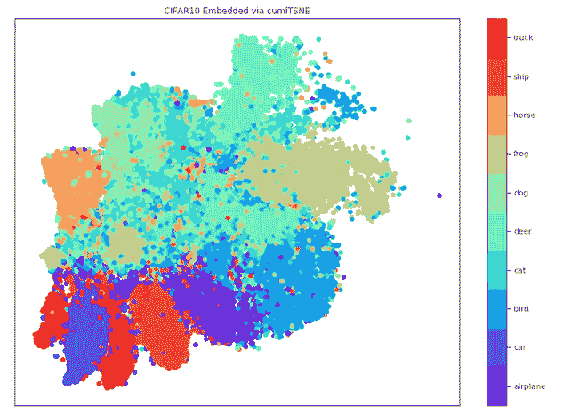
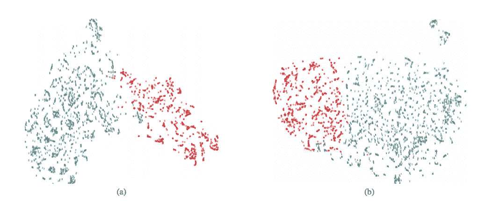
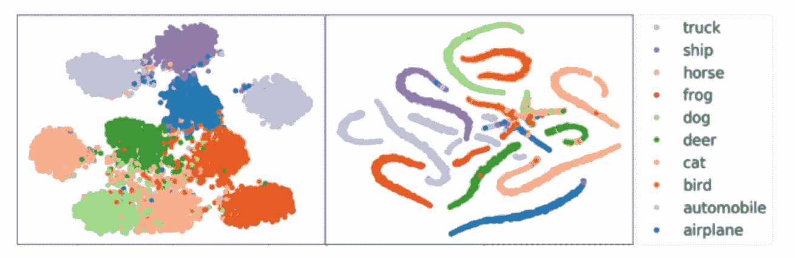
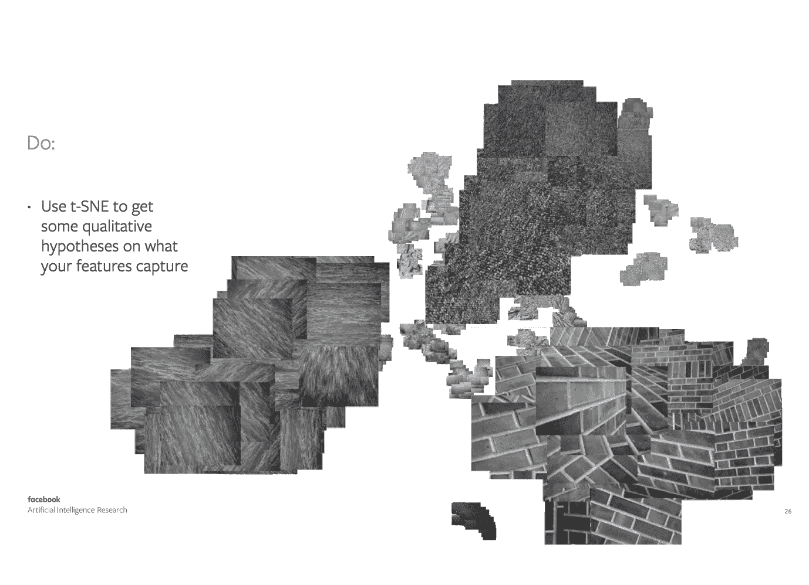

# 600 倍 t-SNE 加速与急流

> 原文：<https://towardsdatascience.com/600x-t-sne-speedup-with-rapids-5b4cf1f62059?source=collection_archive---------21----------------------->

**GPU 加速**通常与深度学习有关。用于计算机视觉的 GPUs power 卷积神经网络和用于自然语言处理的变压器。[它们通过并行计算](https://www.quora.com/Why-are-GPUs-more-powerful-than-CPUs)来实现这一点，与 CPU 相比，它们在某些任务上要快得多。

RAPIDS 正在通过将传统的机器学习和数据科学算法(如 t-SNE 或 XGBoost)引入 GPU 来扩大 GPU 的利用率。

# 本文将比较 RAPIDS-cuml (GPU)和 Sklearn (CPU)之间的 t-SNE 实现:结果分别是 3 秒和 30 分钟。

[*硬件:本实验由数字风暴*](https://www.digitalstorm.com/nvidia-data-science.asp) 在数据科学 PC 上运行



t-SNE visualization of intermediate CNN features

t-SNE 是一种用于可视化高维数据的算法。上面显示的是将 512 维向量从中间 CNN 激活转换为 2 维向量的示例。CIFAR-10 数据集中的每个图像都通过图像分类器。最终分类层之前的激活被添加到用于可视化的阵列中。这是通过以下代码行完成的:

```
from tensorflow.keras.models import Modelintermediate_layer_model = Model(inputs = model.input, 
           outputs = model.get_layer('VisualizationLayer').output)
```

*最终的密集图层被命名为“可视化图层”，以这种方式对其进行索引*

t-SNE 可视化对于获得关于决策空间的直觉非常有用。另一种方法可能是使用混淆矩阵。t-SNE 可视化显示了汽车和飞机之间的重叠等错误。虽然混淆矩阵会简单地告诉我们类似“8”的汽车被错误地归类为飞机，但 t-SNE 可视化给出了更多关于这里正在发生什么的信息。我们看到，至少错误分类的汽车位于飞机边界的边缘，我们可能能够通过一些标签平滑/数据增强来解决这个问题。

获得关于我们模型的直觉对于这种 EDA(探索性数据分析)非常有用。这有助于为数据级决策提供信息，如识别类别不平衡的影响、数据扩充或收集更多数据的效用。这也有助于比较损失函数。



在“**基于 GAN 的合成医学图像增强以提高 CNN 在肝脏病变分类中的性能**”中，Frid-adar 等人使用 t-SNE 可视化来展示添加 GAN 生成的数据如何改善医学图像分类的决策边界(请注意，与 a 相比，图 b 中蓝色类别的解缠结得到改善)。



在 Chen 等人的“**通过引导互补熵**提高对抗鲁棒性”中，他们展示了他们对交叉熵损失函数的改进如何产生更平滑的决策边界，重叠更少(比较右图和左图)。他们使用这种可视化来说明他们改进的决策边界如何提供对抗性攻击防御。



Another interesting application of t-SNE In the “Do’s and Dont’s of using t-SNE to Understand Vision Models” presented by Laurens van der Maaten at CVPR 2018

# 新与旧

*这个例子展示了在 t-SNE 上使用 RAPIDS vs. Sklearn 的 600 倍加速比>*

这个例子是在 50，000 个 CIFAR-10 图像上运行 Barnes-Hut (n log n)版本的 t-SNE，这些图像已经通过图像分类器(训练到 79%的准确度)处理成 512 维向量。**t-SNE 算法将这些 512-d 矢量转换成 2-d 以便可视化。**

**1918 秒(~30 分钟)(Sklearn)**

```
from sklearn.manifold import TSNE
sklearn_embedded = TSNE(n_components=2).fit_transform(embeddings)
```

**3 秒(急流累计)**

```
from cuml.manifold import TSNE as cumlTSNE
tsne = cumlTSNE(n_components=2, method='barnes_hut')
tsne_embedding = tsne.fit_transform(embeddings)
```

[*硬件:本实验由数字风暴*](https://www.digitalstorm.com/nvidia-data-science.asp) 在数据科学 PC 上运行

# 急流的冲击

由 RAPIDS 实现的 t-SNE 加速使得高维数据可视化更加实用。嵌入 50K CIFAR-10 向量在 CPU 实现上花费了 30 分钟，如果 t-SNE 算法具有 O(n)时间复杂度，则尝试嵌入 120 万 ImageNet 数据集将花费至少 12 小时(尽管 barnes-hut 算法的后一个 log n 在这个规模上可以忽略不计)。

在 RAPIDS 的支持下，t-SNE 可视化可以实现整个 ImageNet 数据集的可视化(Chan 等人在 t-SNE-CUDA 中探索的[)。](https://arxiv.org/abs/1807.11824)

GPU 对这类矢量表示的加速对图像相似性/检索应用也非常有用。从大型图像数据库中找到语义最相似的图像的最佳方法之一是比较图像分类器的中间激活。这导致比较来自分类器的 k 维向量嵌入的大集合。对于 K-Means 这样的聚类算法，RAPIDS 可以大大加快这种操作的速度。

t-SNE 是一种获得关于数据集和由神经网络构建的中间表示的洞察力的伟大技术。RAPIDS 正在通过 GPU 加速帮助 t-SNE 达到新的高度，使更多的数据能够通过这种算法可视化。

感谢阅读！如果你觉得这篇文章很有趣，你可能也会喜欢这个视频，它一步一步地从 NGC docker 容器到设置 RAPIDS 库再到最终的 t-SNE 可视化！