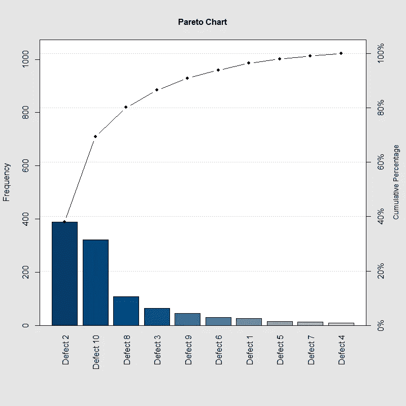
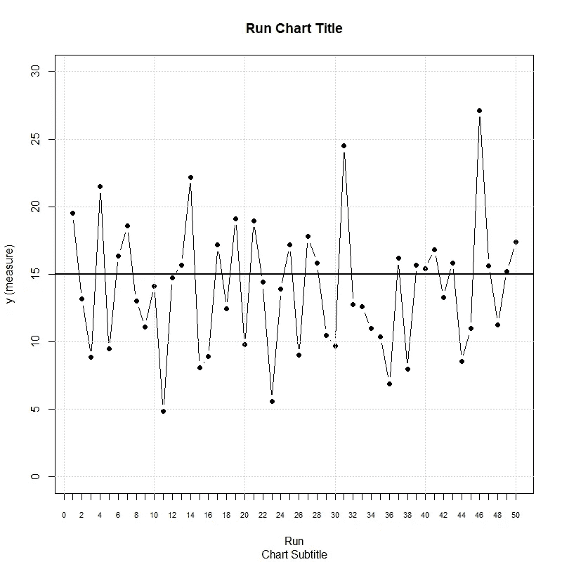
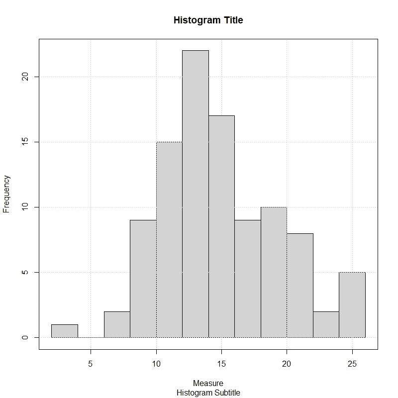
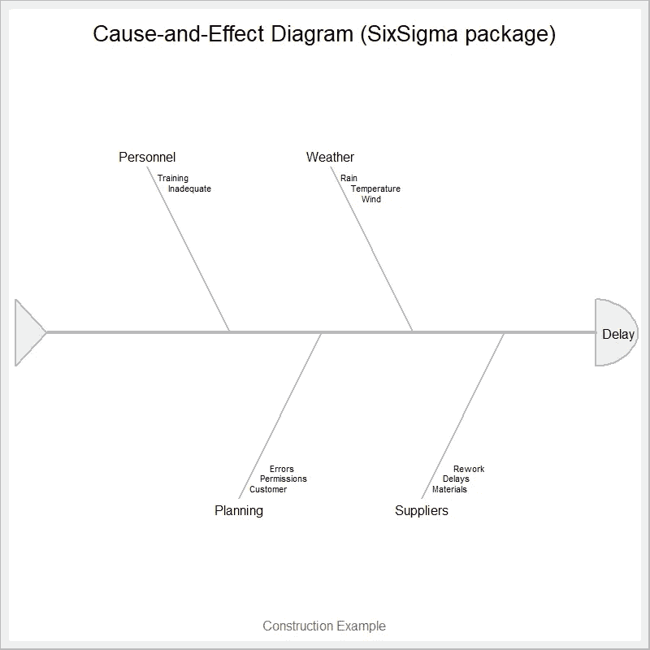
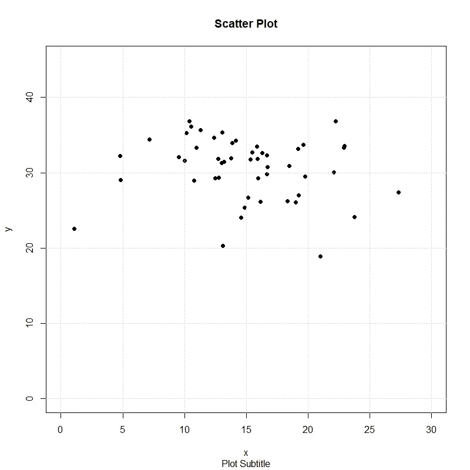
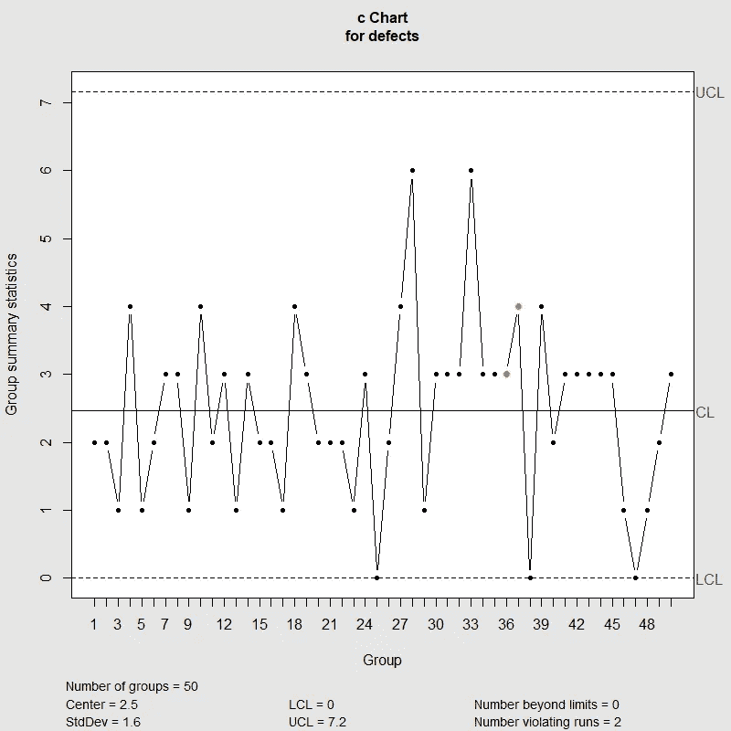
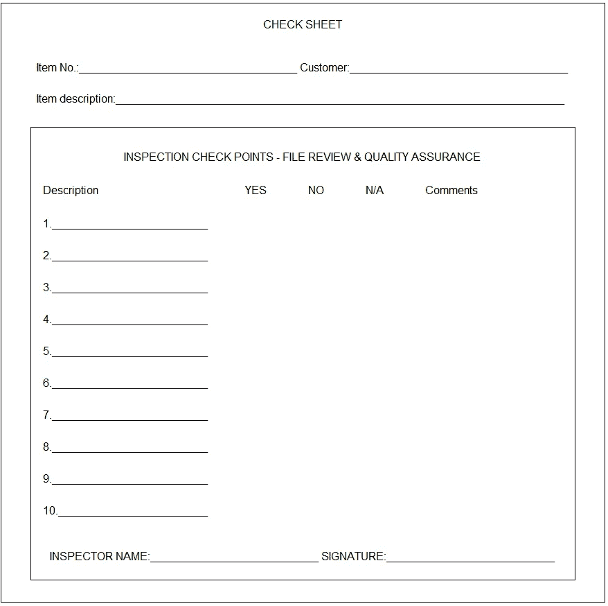

# 7 个基本质量工具

> 原文：<https://towardsdatascience.com/7-basic-tools-of-quality-using-r-49fef5481e07?source=collection_archive---------20----------------------->

## r 代表工业工程师

## 使用 R 包创建基本的质量工具

Image by [CCBOE](https://www.ccboe.com/cte/index.php/by-school/north-point-high-school-2/manufacturing-engineering-technologies)

# 质量的 7 个基本工具:介绍

历史上，质量推动公司和组织生产和提供更好的产品和服务。它与产品的品牌有着内在的联系，代表着一种竞争优势和与竞争对手的区别。为了在满足客户需求的同时从中获利，公司和组织开发了各种方法、框架和工具来解决试图影响其产品和服务质量的问题。然而，有一些常用的工具可以应用于任何行业，从产品开发阶段到交付，用于解决关键的质量相关问题。

也被称为 **7 QC 工具**，质量的七个基本工具最初由东京大学的工程学教授石川馨概念化，受到 W. Edwards Deming 在 20 世纪 50 年代的一系列演讲的影响。石川的质量的七个基本工具对应于一套**固定的图形和统计技术，有助于解决关键的质量相关问题**。作为整体质量保证工作的一部分，它们被广泛用于微调过程。同样，它们被认为是*基础*，因为任何受过非常基础的统计培训的人都可以轻松实现它们。

> “从我过去的经验来看，一个公司内多达 95%的问题都可以通过这些工具来解决，因为它们可以用来解决绝大多数与质量有关的问题”(Ishikawa，1985 年，摘自他的书《什么是全面质量控制？日本人的方式)。

# **帕累托图**

也称为**帕累托分布图**，帕累托图是一个垂直条形图，其中从左到右按相对频率的降序绘制数值。在分析问题的第一阶段，它是一个非常有用的工具，因为它有助于通过查看图表中最高的条形来直观显示哪些问题需要首先注意，这些条形代表对给定系统具有最大累积影响的变量。

由意大利工程师维尔弗雷多·帕累托开发的图表提供了帕累托原理的图形表示，该理论认为给定系统中 80%的输出是由 20%的输入(即缺陷、错误、差错)产生的。该图表旨在从**(~ 80%)*中识别出 ***至关重要的少数*** *(* ~20%)。*这是一个双轴图表，其中左轴对应于输入频率，而右轴对应于其累积百分比。我们来看看下面的 *R* 代码，生成一个帕累托图。**

*Pareto Chart R Code*

**

*Pareto Chart example using SixSgima R package*

# *运行图表*

*运行图也称为**运行顺序图**，是一种按时间顺序显示观察数据的图表。运行图有助于发现数据中的模式和异常，这些模式和异常表明一个过程随时间的变化或可能影响其可变性的特殊因素。在运行图上，x 轴通常代表时间或运行，而 y 轴代表被观察的属性。我们来看看下面的 *R* 代码生成运行图。*

*Run Chart R Code*

**

*Run Chart example using SixSigma R package*

# *柱状图*

*直方图是数据的图形表示。数据由图表上的柱形图表示，柱形图的高度取决于特定数据范围出现的频率。直方图以易于理解的图形方式显示数据；它们揭示了数据的中心、变化和形状；它们说明了数据的基本分布；它们能够预测未来的过程性能；并且它们允许理解过程是否能够满足客户需求。让我们看看下面的 *R* 代码来生成一个直方图。*

*Histogram R Code*

**

*Histogram example using SixSigma R package*

# *因果图*

*因果图也被称为**石川**或**鱼骨图**，它是一种工具，可以帮助识别影响、问题或不良结果的潜在根本原因，同时将它们分为六大类，通常称为六个 *M* s:测量、材料、机器、方法、人力和自然。所分析的结果被放置在鱼头上，而原因基于它们相应的类别被放置在鱼刺上。在头脑风暴会议期间，团队成员必须不断地问“*为什么会这样？*“生成潜在的原因；有多层原因是一种常见的做法，其中各层表明因果关系。我们来看看下面的 *R* 代码生成一个因果图。*

*Cause-and-Effect R Code*

**

*Cause-and-effect diagram example using SixSgima R package*

# ***散点图***

*散点图是一种数学图表，它在 X-Y 图上绘制成对的数据，以揭示数据集之间的关系。它们需要两组数据:第一组通常称为自变量( *x* )，第二组通常称为因变量( *y* )。散点图有助于确定数据集之间是否存在相关性。换句话说，如果变量之间存在某种关系，而这种关系往往会以一种不仅仅基于偶然性的方式一起出现。然而，即使散点图可能暗示数据集之间的相关性，也应该始终考虑到 ***相关性并不一定意味着因果关系*** 。我们来看看下面的 *R* 代码生成散点图。*

*Scatter Plot R code*

**

*Scatter Plot example using SixSgima R package*

# *控制图*

*控制图是描述产品或过程的样品是否符合其预期规格的图形表示，如果不符合，则描述它们与这些规格的差异程度。它们允许监控过程是否在统计控制之下；帮助可视化变化；发现并纠正出现的问题；预测结果的预期范围；并从特殊原因分析过程变化的模式。*

*控制图分为两大类:一类用于监控离散数据——根据样本大小进一步划分(如 X-MR 图、I-MR 图、X-条形图、R-图和 s-图)*—*；另一类用于监控连续数据——根据单位缺陷数再根据样本大小进一步划分(如 c-图、u-图、NP-图和 p-图)。对于下面的例子，我们来看看下面的 *R* 代码生成 c-chart。*

*c-chart R code*

**

*c-chart example using qcc R package*

*如果有兴趣了解更多关于何时使用每种类型的控制图，如何解释它们的结果以及构建它们的 *R* 代码，请参考我以前的文章[这里](https://medium.com/@rsalaza4)。*

# *板式挡帘*

*也被称为**缺陷集中图**，检查表是一种结构化的、准备好的表格，用于在数据生成的位置实时收集和分析数据。它通常是一种空白表格，旨在快速、简便、高效地记录所需的定量或定性信息。其主要特征之一是通过在其上做标记(即检查)来记录数据。使用检查表的一些优点包括:显示数据的有效方式；使用方便；能够识别问题的根本原因；可用于证实或反驳指控；并且代表了构建其他图形工具的第一步。让我们看看下面的 *R* 代码来生成一个基本的检查表。*

*Check Sheet R code*

**

*Check Sheet example using grid R package*

*如上面的代码所示，在 *R* 中编码可能不是开发检查表的最有效的方法。然而，我不想在没有解决和编码它们的情况下结束这篇文章。这是由工程师来决定最好的工具/程序/软件用于他们的开发，但是为了简单起见，我不推荐你使用 *R* 。*

# *总结想法*

*本文研究的七个基本质量工具代表了开发根本原因分析、实施精益六西格玛项目和管理质量改进计划的非常有用的工具。*

*工程师必须熟悉和熟悉这些工具，以便从他们的工程工具箱中拿出合适的工具来处理给定系统中的问题，并帮助保持所生产的产品和服务的一致性。*

*拥有他们的 *R* 码的主要优点之一是他们的 ***再现性*** 只需要修改他们的初始输入。本文并不打算说服读者在开发这些工具时严格使用 *R* for，而是介绍如何用几行代码在一个免费的开源软件中开发它们。*

**— —**

**如果你觉得这篇文章有用，欢迎在*[*GitHub*](https://github.com/rsalaza4/R-for-industrial-engineering/tree/master/Quality%20Tools)*上下载我的个人代码。你也可以直接在 rsalaza4@binghamton.edu 给我发邮件，在*[*LinkedIn*](https://www.linkedin.com/in/roberto-salazar-reyna/)*上找到我。有兴趣了解工程领域的数据分析、数据科学和机器学习应用的更多信息吗？通过访问我的介质* [*简介*](https://robertosalazarr.medium.com/) *来探索我以前的文章。感谢阅读。**

**-罗伯特**